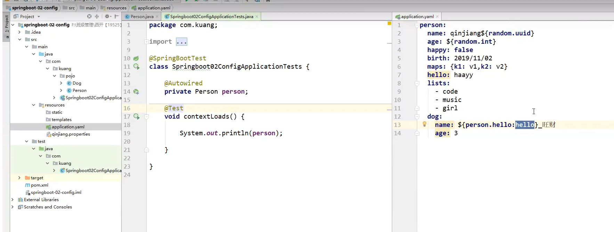
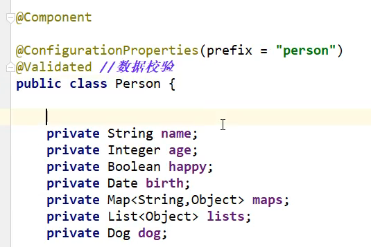
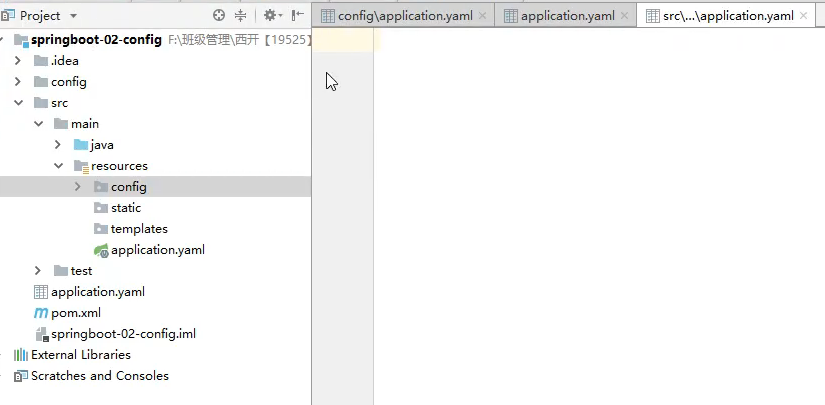
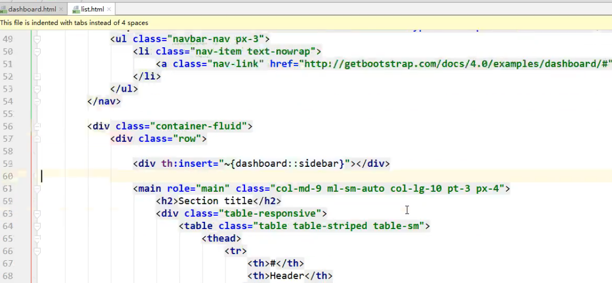
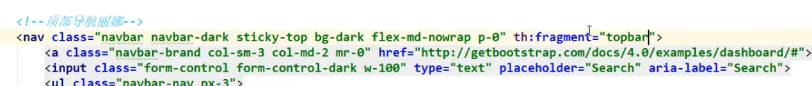
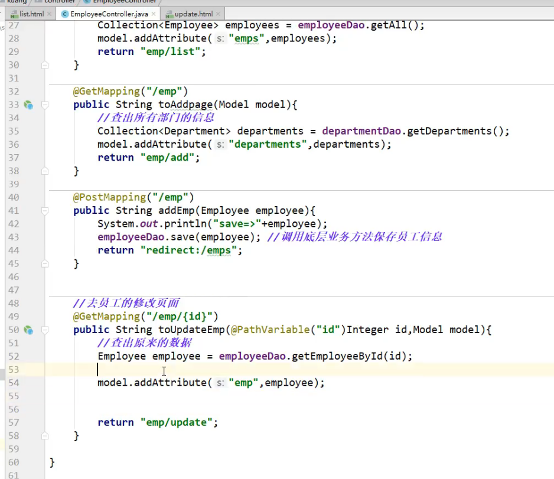
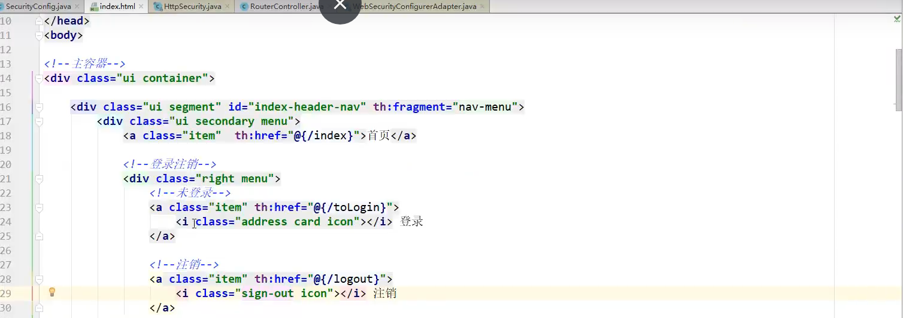
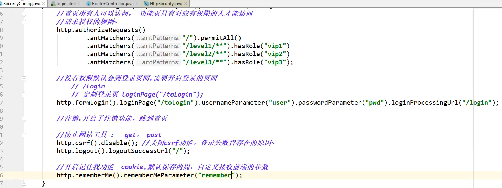
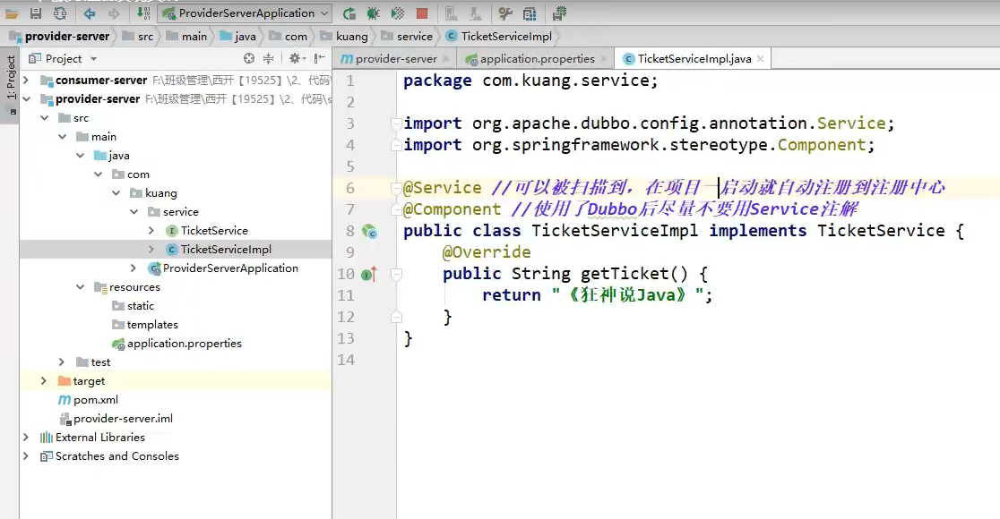
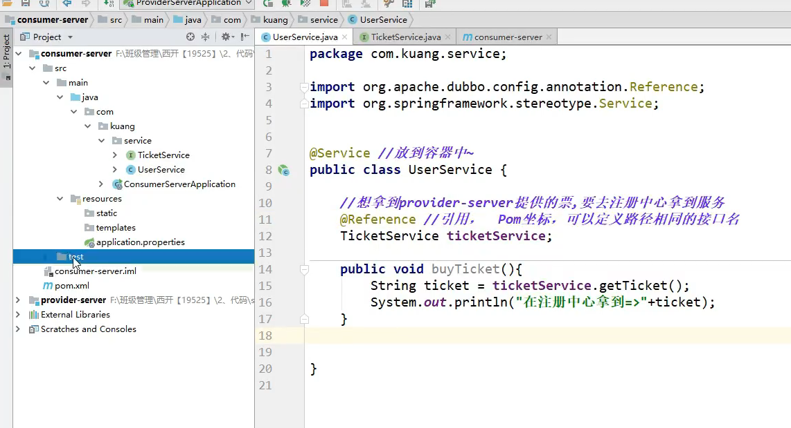

# SpringBoot

### 什么是Spring

​	Spring是一个开源框架，2003年兴起的一个轻量级的Java开发框架

​	Spring是为了解决企业级应用开发的复杂性而创建的，简化开发

### Spring是如何简化Java开发的

​	为了降低Java开发的复杂性，Spring采用了以下4种关键策略：

1. 基于POJO的轻量级和最小侵入性编程
2. 通过IOC，依赖注入（DI）和面向接口实现松耦合
3. 基于切面（AOP）和惯例进行声明式编程
4. 通过切面和模板减少样式代码

### 什么是SpringBoot

​	学过javaweb的都知道，开发一个web应用，从最初开始接触Servlet结合Tomcat,跑出一个Helloworld程序，是要经历特别多的步骤；后来就用了框架Struts,再后来是SpringMVC，到了现在的SpringBoot,过了一两年又会有其它web框架出现。SpringBoot,就是一个javaweb的开发框架，和SpringMVC类似，对比其他javaweb框架的好处，官方说就是简化开发，约定大于配置，能迅速地开发web应用，几行代码开发一个http接口

​	SpringBoot基于Spring开发，SpringBoot本身并不提供Spring框架的和新特性以及扩展和功能，只是用于快速、敏捷地开发新一代基于Spring框架的应用程序。也就是说，他并不是用来替代Spring地解决方案，而是和Spring框架紧密结合用于提升Spring开发者体验的工具。SpringBoot约定大于配置的核心思想，默认帮了我们进行了很多设置，多数SpringBoot应用只需要很少的Spring配置。同时它集成了大量常用的第三方库配置（例如Redis、MongoDB、Jpa、RabbitMQ、Quartz等等），SpringBoot应用中这些第三方库几乎可以零配置的开箱即用。

​	简单来说就是SpringBoot其实不是什么框架，它默认配置了很多框架的使用方式，就像maven整合了所有的jar包，SpringBoot整合了所有的框架。

​	**SpringBoot的主要优点**：

+ 为所有Spring开发者更快的入门
+ 开箱即用，提供各种默认配置来简化项目配置
+ 内嵌式容器简化Web项目
+ 没有冗余代码生成和XML配置的要求


# 微服务

### 什么是微服务？

​	微服务是一种架构风格，它要求我们在开发一个应用的时候，这个应用必须构建成一系列小服务的组合；可以通过http的方式进行互通。

### 单体应用架构

​	所谓单体应用架构（all in one）是指，我们将一个应用的中的所有应用服务都封装在一个应用中。

​	无论是ERP、CRM或是其他什么系统，你都把数据库访问，web访问，等等各个功能放到一个war包内。

+ 这样做的好处是，易于开发和测试；也十分方便部署；当需要扩展时，只需要将war复制多分，然后放到多个服务器上，再做个负载均衡就可以了
+ 单体应用架构的缺点是，哪怕我要修改一个非常小的地方，我都需要停掉整个服务，重新打包、部署这个应用war包。特别是对于一个大型应用，我们不可能把所有内容都放在一个应用里面，我们如何维护、如何分工合作都是问题。


### 微服务架构

​	all in one的架构方式，我们把所有功能单元放在一个应用里面。然后我们把整个应用部署到服务器上。如果负载能力不行，我们将整个应用进行水平复制，进行扩展，然后再负载均衡

​	所谓微服务架构，就是打破之前all in one的架构方式，把每个功能元素独立出来。把独立出来的功能元素动态组合，需要的功能元素才去拿来组合，需要多一些时可以整合多个功能元素，所以微服务架构是对功能元素进行复制，而没有对整个应用进行复制。

​	好处：

+ 节省了调用资源
+ 每个功能元素的服务都是一个可替换的、可独立升级的软件代码 


### 如何构建微服务

​	一个大型系统的微服务架构，就像以恶个复杂交织的神经网络，每一个神经元就是一个功能元素，它们各自完成自己的功能，然后通过Http相互请求调用，比如一个电商系统，查缓存、连数据库、浏览页面、结账、支付等服务都是一个个独立的功能服务，都被微化了，它们作为一个个微服务共同构建了一个庞大的系统。如果修改其中的一个功能，只需要更新升级其中一个功能服务单元即可。

​	但是这种庞大的系统架构给部署和运维带来了很大的难度。于是，Spring为我们带来了构建大型分布式微服务的全套、全程产品

+ 构建一个个功能独立的微服务应用单元，可以使用SpringBoot，可以帮我们快速构建一个应用；
+ 大型分布式网络服务的调用，这部分由Spring cloud来完成，实现分布式；
+ 在分布式中间，进行流式数据计算、批处理、我们有Spring cloud data flow.
+ Spring为我们想清楚了整个从开始构建应用到大型分布式应用全流程方案

略。。。。。。


# IDEA快速创建SpringBoot项目 

+ 新建项目


+ 填写信息


+ 不选择，直接finish

+ 添加依赖


+ 编写Controller,测试项目能否运行,重启项目


```
或者使用SpringBoot热部署，则不需重新启动
```

+ 修改项目的端口号，重启项目


# 原理初探

### **自动配置**


#### pom.xml

>父依赖

其中它主要是依赖一个父项目，主要是管理项目的资源过滤及插件

```xml
<parent>
    <groupId>org.springframework.boot</groupId>
    <artifactId>spring-boot-starter-parent</artifactId>
    <version>2.3.4.RELEASE</version>
    <relativePath/> <!-- lookup parent from repository -->
</parent>
```

点进去，发现还有一个父依赖

```XML
<parent>
  <groupId>org.springframework.boot</groupId>
  <artifactId>spring-boot-dependencies</artifactId>
  <version>2.3.4.RELEASE</version>
</parent>
```

这里才是真正管理SpringBoot应用里面所有依赖版本的地方，SpringBoot的版本控制中心；

**以后我们导入依赖默认是不需要写版本；但是如果导入的包没有在依赖中管理着就需要手动配置版本了；**


#### **启动器**

+ ```xml
  <dependency>
              <groupId>org.springframework.boot</groupId>
              <artifactId>spring-boot-starter-web</artifactId>
          </dependency>
  ```

+ 启动器：SpringBoot的场景启动器

+ 比如spring-boot-starter-web,他就会帮我们自动导入web环境所有的依赖！

+ springboot会将所有的功能场景，都变成一个个的启动器

+ 如果我们需要使用什么功能，就只需要找对应的启动器就可以了`starter`

```http
官方网站查询starter:https://docs.spring.io/spring-boot/docs/current/reference/html/using-spring-boot.html#using-boot-starter
```


#### 主程序

```java
//@SpringBootApplication：标注这个类是一个SpringBoot的应用
@SpringBootApplication
public class Springboot01HelloworldApplication {

    public static void main(String[] args) {
        //以为是启动了一个方法，没想到启动了一个服务
        SpringApplication.run(Springboot01HelloworldApplication.class, args);
    }

}
```

+ 注解

  > @SpringBootApplication

  作用：标注在某个类上说明这个类是SpringBoot的主配置类 ， SpringBoot就应该运行这个类的main方法来启动SpringBoot应用；

  进入这个注解：可以看到上面还有很多其他注解！

  ```java
  @SpringBootConfiguration
  @EnableAutoConfiguration
  @ComponentScan(    
      excludeFilters = {@Filter(    
      type = FilterType.CUSTOM,    
      classes = {TypeExcludeFilter.class}
  ), @Filter(    
      type = FilterType.CUSTOM,    
      classes = {AutoConfigurationExcludeFilter.class}
    )}
  )
  public @interface SpringBootApplication {    
      // ......
  }
  ```

  

  > @ComponentScan

  这个注解在Spring中很重要 ,它对应XML配置中的元素。

  作用：自动扫描并加载符合条件的组件或者bean ， 将这个bean定义加载到IOC容器中

  

  > @SpringBootConfiguration

  作用：SpringBoot的配置类 ，标注在某个类上 ， 表示这是一个SpringBoot的配置类；

  我们继续进去这个注解查看

  ```java
  // 点进去得到下面的 @Component
  @Configuration
  public @interface SpringBootConfiguration {}
  @Component
  public @interface Configuration {}
  ```

  这里的 @Configuration，说明这是一个配置类 ，配置类就是对应Spring的xml 配置文件；

  里面的 @Component 这就说明，启动类本身也是Spring中的一个组件而已，负责启动应用！

  我们回到 SpringBootApplication 注解中继续看。

  > > 题外话：
  > >
  > > java配置类的方式
  > >
  > > ```java
  > > @Configuration  //代表这是一个配置类
  > > @Import(MyConfig2.class)  //导入合并其他配置类，类似于配置文件中的 inculde 标签
  > > public class MyConfig {
  > > 
  > >     @Bean //通过方法注册一个bean，这里的返回值就Bean的类型，方法名就是bean的id！
  > >     public Dog dog(){
  > >         return new Dog();
  > >     }
  > > 
  > > }
  > > ```
  > >
  > > 使用java配置类
  > >
  > > ```java
  > > public void test2(){
  > >     ApplicationContext applicationContext =
  > >             new AnnotationConfigApplicationContext(MyConfig.class);
  > >     Dog dog = (Dog) applicationContext.getBean("dog");
  > >     System.out.println(dog.name);
  > > }
  > > ```

  

  > @EnableAutoConfiguration

  **@EnableAutoConfiguration ：开启自动配置功能**

  以前我们需要自己配置的东西，而现在SpringBoot可以自动帮我们配置 ；@EnableAutoConfiguration告诉SpringBoot开启自动配置功能，这样自动配置才能生效；

  点进注解接续查看：

  **@AutoConfigurationPackage ：自动配置包**

  ```
  @Import({Registrar.class})
  public @interface AutoConfigurationPackage {
  
  }
  ```

  **@import** ：Spring底层注解@import ， 给容器中导入一个组件

  Registrar.class 作用：将主启动类的所在包及包下面所有子包里面的所有组件扫描到Spring容器 ；

  ```http
@Import作用：
  @Import用来导入@Configuration注解的配置类、声明@Bean注解的bean方法、导入ImportSelector的实现类或导入ImportBeanDefinitionRegistrar的实现类。
@Import注解支持导入普通的java类,并将其声明成一个bean
  https://blog.csdn.net/qq_39213969/article/details/108351781?utm_medium=distribute.pc_relevant.none-task-blog-BlogCommendFromMachineLearnPai2-1.channel_param&depth_1-utm_source=distribute.pc_relevant.none-task-blog-BlogCommendFromMachineLearnPai2-1.channel_param

  https://blog.csdn.net/panchao888888/article/details/82882279

  https://www.cnblogs.com/dongguangming/p/12963060.html

  SpringBoot注解：
  https://blog.csdn.net/weixin_40753536/article/details/81285046?utm_medium=distribute.pc_relevant.none-task-blog-BlogCommendFromMachineLearnPai2-1.channel_param&depth_1-utm_source=distribute.pc_relevant.none-task-blog-BlogCommendFromMachineLearnPai2-1.channel_param
  ```
  
  
  
  
  

这个分析完了，退到上一步，继续看


  **@Import({AutoConfigurationImportSelector.class}) ：给容器导入组件 ；**

  AutoConfigurationImportSelector ：自动配置导入选择器，那么它会导入哪些组件的选择器呢？我们点击去这个类看源码：

  1. 这个类中有一个这样的方法

```java
  // 获得候选的配置
protected List<String> getCandidateConfigurations(AnnotationMetadata metadata, AnnotationAttributes attributes) {    
      //这里的getSpringFactoriesLoaderFactoryClass（）方法    
      //返回的就是我们最开始看的启动自动导入配置文件的注解类；EnableAutoConfiguration    
      List<String> configurations = SpringFactoriesLoader.loadFactoryNames(this.getSpringFactoriesLoaderFactoryClass(), this.getBeanClassLoader());    Assert.notEmpty(configurations, "No auto configuration classes found in META-INF/spring.factories. If you are using a custom packaging, make sure that file is correct.");    
      return configurations;}
```

  2. 这个方法调用了SpringFactoriesLoader类的静态方法！我们进入SpringFactoriesLoader类loadFactoryNames() 方法

  ```java
  public static List<String> loadFactoryNames(Class<?> factoryType, @Nullable ClassLoader classLoader) {
     String factoryTypeName = factoryType.getName();
     //这里它又调用了loadSpringFactories 方法
      return loadSpringFactories(classLoader).getOrDefault(factoryTypeName, Collections.emptyList());
  }
  ```

  3. 我们继续点击查看loadSpringFactories方法

  ```java
  private static Map<String, List<String>> loadSpringFactories(@Nullable ClassLoader classLoader) {
      //获得calssLoader，我们返回可以看到这里得到的就是EnableAutoConfiguration标注的类本身
     MultiValueMap<String, String> result = cache.get(classLoader);
     if (result != null) {
        return result;
     }
  
     try {
        Enumeration<URL> urls = (classLoader != null ?
                                 //去获取一个资源“META-INF/spring.factories”
              classLoader.getResources(FACTORIES_RESOURCE_LOCATION) :
              ClassLoader.getSystemResources(FACTORIES_RESOURCE_LOCATION));
        result = new LinkedMultiValueMap<>();
         //将读取到的资源遍历，封装成为一个Properties
        while (urls.hasMoreElements()) {
           URL url = urls.nextElement();
         UrlResource resource = new UrlResource(url);
           Properties properties = PropertiesLoaderUtils.loadProperties(resource);
         for (Map.Entry<?, ?> entry : properties.entrySet()) {
              String factoryTypeName = ((String) entry.getKey()).trim();
            for (String factoryImplementationName : StringUtils.commaDelimitedListToStringArray((String) entry.getValue())) {
                 result.add(factoryTypeName, factoryImplementationName.trim());
            }
           }
      }
        cache.put(classLoader, result);
        return result;
     }
     catch (IOException ex) {
        throw new IllegalArgumentException("Unable to load factories from location [" +
              FACTORIES_RESOURCE_LOCATION + "]", ex);
     }
  }
  ```


>spring.factories

  我们根据源头开始打开spring.factories,看到了很多的自动配置的文件，这就是自动配置根源所在！

  **文件位置：**org\springframework\boot\spring-boot-autoconfigure\2.3.4.RELEASE\spring-boot-autoconfigure-2.3.4.RELEASE.jar!\META-INF\spring.factories

  ```properties
  # Initializers
  org.springframework.context.ApplicationContextInitializer=\
  org.springframework.boot.autoconfigure.SharedMetadataReaderFactoryContextInitializer,\
  org.springframework.boot.autoconfigure.logging.ConditionEvaluationReportLoggingListener
  
  略.......
  ```

  **WebMvcAutoConfiguration**

  我们在上面的自动配置类随便找一个打开看看，比如 ：WebMvcAutoConfiguration

  ```java
  @Configuration(proxyBeanMethods = false)
  @ConditionalOnWebApplication(type = Type.SERVLET)
  @ConditionalOnClass({ Servlet.class, DispatcherServlet.class, WebMvcConfigurer.class })
  @ConditionalOnMissingBean(WebMvcConfigurationSupport.class)
  @AutoConfigureOrder(Ordered.HIGHEST_PRECEDENCE + 10)
@AutoConfigureAfter({ DispatcherServletAutoConfiguration.class, TaskExecutionAutoConfiguration.class,
        ValidationAutoConfiguration.class })
public class WebMvcAutoConfiguration {
  
   public static final String DEFAULT_PREFIX = "";
  
   public static final String DEFAULT_SUFFIX = "";
  
   private static final String[] SERVLET_LOCATIONS = { "/" };
      
     @Bean
  	@ConditionalOnMissingBean(HiddenHttpMethodFilter.class)
  	@ConditionalOnProperty(prefix = "spring.mvc.hiddenmethod.filter", name = "enabled", matchIfMissing = false)
  	public OrderedHiddenHttpMethodFilter hiddenHttpMethodFilter() {
		return new OrderedHiddenHttpMethodFilter();
  	}
  略.....
  ```

  可以看到这些一个个的都是JavaConfig配置类，而且都注入了一些Bean，可以找一些自己认识的类，看着熟悉一下！

  所以，自动配置真正实现是从classpath中搜寻所有的META-INF/spring.factories配置文件 ，并将其中对应的 org.springframework.boot.autoconfigure. 包下的配置项，通过反射实例化为对应标注了 @Configuration的JavaConfig形式的IOC容器配置类 ， 然后将这些都汇总成为一个实例并加载到IOC容器中。

  

  总结：

  1. SpringBoot在启动的时候从类路径下的META-INF/spring.factories中获取EnableAutoConfiguration指定的值
  2. 将这些值作为自动配置类导入容器 ， 自动配置类就生效 ， 帮我们进行自动配置工作；
3. 整个J2EE的整体解决方案和自动配置都在springboot-autoconfigure的jar包中；
  4. 它会给容器中导入非常多的自动配置类 （xxxAutoConfiguration）, 就是给容器中导入这个场景需要的所有组件 ， 并配置好这些组件 ；
5. 有了自动配置类 ， 免去了我们手动编写配置注入功能组件等的工作；

  ```java
  @SpringBootConfiguration:springboot的配置
      @Configuration:spring配置类
      	@Component:说明这也是一个Spring的组件
          
  @EnableAutoConfiguration:自动配置
      @AutoConfigurationPackage:自动配置包
      	@Import(AutoConfigurationPackages.Registrar.class):自动配置包.注册
      @Import(AutoConfigurationImportSelector.class):自动配置导入选择
      
  //AutoConfigurationImportSelector类下
  //获取所有的配置
  List<String> configurations = getCandidateConfigurations(annotationMetadata,attributes)
  ```

  >  获取候选的配置

```java
  /**
  	 * Return the auto-configuration class names that should be considered. By default
  	 * this method will load candidates using {@link SpringFactoriesLoader} with
  	 * {@link #getSpringFactoriesLoaderFactoryClass()}.
  	 * @param metadata the source metadata
  	 * @param attributes the {@link #getAttributes(AnnotationMetadata) annotation
  	 * attributes}
  	 * @return a list of candidate configurations
  	 */
  	protected List<String> getCandidateConfigurations(AnnotationMetadata metadata, AnnotationAttributes attributes) {
  		List<String> configurations = SpringFactoriesLoader.loadFactoryNames(getSpringFactoriesLoaderFactoryClass(),
  				getBeanClassLoader());
  		Assert.notEmpty(configurations, "No auto configuration classes found in META-INF/spring.factories. If you "
  				+ "are using a custom packaging, make sure that file is correct.");
  		return configurations;
  	}
```

  >  META-INF/spring.factories:自动配置的核心文件


>Properties properties = PropertiesLoaderUtils.loadProperties(resources);
>所有的资源加载到配置类中


> **分析**


>结论

​	SpringBoot所有自动配置都是在启动的时候扫描并加载：`spring.factories`所有的自动配置类都在这里面，但是不一定生效，要判断条件是否成立，只要导入了对应的starter，就有对应的启动器了，有了启动器，我们自动装配就会生效，然后就配置成功！

1. springboot在启动的时候，从类路径下/META-INF/`spring.factories`获取值

2. 将这些自动配置的类导入容器，自动配置就会生效，帮我们进行自动配置
3. 以前我们需要自动配置东西的时候在，现在springboot帮我们做了
4. 整合JavaEE,解决方案和自动配置的东西都在spring-boot-autoconfigure-xxx.jar这个包下
5. 它会把所有需要导入的组件，以类名的方式返回，这些组件就会被添加到容器中
6. 容器中也会存在非常多的xxxAutoConfiguration的文件（@Bean）,就是这些类给容器中导入了这个场景需要的所有组件，并自动配置，@Configuration,JavaConfig!
7. 有了自动配置类，免去了我们手动编写配置文件的工作


### SpringBoot底层自动配置的步骤

> 博客
>
> https://blog.csdn.net/weixin_48381232/article/details/106569925
>
> https://blog.csdn.net/zjcjava/article/details/84028222?utm_medium=distribute.pc_relevant.none-task-blog-BlogCommendFromMachineLearnPai2-3.channel_param&depth_1-utm_source=distribute.pc_relevant.none-task-blog-BlogCommendFromMachineLearnPai2-3.channel_param
>
> 
>
> https://www.cnblogs.com/niechen/p/9027804.html
>
> 
>
> https://blog.csdn.net/weixin_44359566/article/details/108250498
>
> 
>
> 最终解决方案
>
> https://cloud.tencent.com/developer/article/1674602


# 了解下主启动类怎么运行

### Run

​	我最初以为就是运行了一个main方法，没想到却开启了一个服务：


​	**SpringApplication.run分析**

​	分析该方法主要分两部分，一部分是SpringApplication的实例化。二是run方法的执行；


### SpringApplication

​	这个类主要做了以下四件事情

+ 推断应用的类型是普通的项目还是web项目
+ 查找并加载所有可用初始化器，设置到initializers属性中
+ 找出所有的应用程序监听器，设置到listeners属性中
+ 推断并设置main方法的定义类，找到运行的类

>  查看构造器

```java
public SpringApplication(ResourceLoader resourceLoader, Class<?>... primarySources) {
   this.resourceLoader = resourceLoader;
   Assert.notNull(primarySources, "PrimarySources must not be null");
   this.primarySources = new LinkedHashSet<>(Arrays.asList(primarySources));
   this.webApplicationType = WebApplicationType.deduceFromClasspath();
   setInitializers((Collection) getSpringFactoriesInstances(ApplicationContextInitializer.class));
   setListeners((Collection) getSpringFactoriesInstances(ApplicationListener.class));
   this.mainApplicationClass = deduceMainApplicationClass();
}
```


> run方法分析


# yaml语法讲解

+ 创建新的项目


勾选上web项目


### 配置文件

SpringBoot使用一个全局的配置文件，配置文件名称是固定的

+ application.properties
  + 语法结构：key=value
+ application.yml
  + 语法结构：key: 空格 value

配置文件的作用：修改SpringBoot自动配置的默认值，因为SpringBoot在底层都给我们自动配置好了。


### YAML

YAML是”YAML Ain't a Makeup Language“（YAML不是一种置标语言）的递归缩写。

在开发的这种语言时，YAML的意思其实是：“Yet Another Makeup Language”(仍是一种置标语言)


### YAML的基本语法


# 给属性赋值的几种方式

+ 创建一个实体类


+ 原生赋值(这个注解还可以写在set方法上)


+ 配置文件赋值


```java
@Component:注册bean
    
@ConfigurationProperties作用：
将配置文件中配置的每一个属性的值，映射到这个组件中；
告诉SpringBoot将本类中的所有属性和配置文件中相关的配置进行绑定
参数 prefix = "person"；将配置文件中的person下面所有属性一一对应

注意：只有这个组件是容器中的组件，才能使用容器提供的@ConfigurationProperties功能
```


+ 指定配置文件赋值


+ yaml的特殊应用




### 功能对比图


+ cp只需要写一次即可，value则需要每个字段都添加
+ 松散绑定：这个什么意思呢？比如我的yml中写的last-name,这个和lastName是一样的，-后面跟着的字母默认是大写的。这就是松散绑定
+ JSR303数据校验，这个就是我们可以在字段增加一层过滤器验证，可以保证数据的合法性
+ 复杂类型封装，yml中可以封装对象，使用@Value就不支持


### 结论

+ 配置yml和配置properties都可以获取到值，强烈推荐yml
+ 如果我们在某个业务中，只需要获取配置文件中的某个值，可以使用一下@Value
+ 如果说，我们编写了JavaBean来和配置文件进行映射，就直接使用@ConfigurationProperties


# JSR303校验

+ 添加注解



+ 添加邮箱格式限制


+ 还有很多注解，网上很多


+ 具体位置


# 多环境配置及配置文件位置

> 官方文档
>
> （优先级由高到低）


+ 位置方式一


+ 位置方式二


+ 位置方式三和四




### 相同优先级下，切换配置文件

+ 方式一


+ 方式二


激活dev


# 自动配置原理再理解

+ 解析一个自动配置类


>@Conditional
>
>自动配置类必须在一定的条件下才能生效；
>
>@Conditional派生注解（Spring注解版原生的@Conditional作用）
>
>作用：必须是@Conditional指定的条件成立，才给容器中天机骄傲组件，配置里面的所有内容才会生效
>
>
>
>那么多的自动配置类，必须在一定的条件下才能生效；也就是说，我们加载了这么多的配置类，但**不是所有的都生效了。**
>
>我们怎么知道哪些自动配置类生效？
>
>**我们可以通过启用 debug=true属性；来让控制台打印自动配置报告，这样我们就可以很方便的知道哪些自动配置类生效；**
>
>```yaml
>#开启springboot的调试类
>debug=true
>```
>
>**Positive matches:（自动配置类启用的：正匹配）**
>
>**Negative matches:（没有启动，没有匹配成功的自动配置类：负匹配）**
>
>**Unconditional classes: （没有条件的类）**


+ 分析总结

  **在我们配置文件中能配置的东西，都存在一个固有的规律**：

  **xxxAutoConfiguration:默认值  xxxProperties 和配置文件绑定，我们就可以使用自定义的配置了  **


### 我们再以`HttpEncodingAutoConfiguration`为例子解析

```java
//表示这是一个配置类，和以前编写的配置文件一样，也可以给容器中添加组件；
@Configuration(proxyBeanMethods = false)

//启动指定类的ConfigurationProperties功能
//进入这个ServerPorperties查看，将配置文件中对应的值和ServerProperties绑定起来
//并把ServerProperties加入到IOC容器中
@EnableConfigurationProperties(ServerProperties.class)

//Spring底层@Conditional注解
//根据不同的条件判断，如果满足指定的条件，整个配置类里面的配置就会生效
//这里的意思就是判断当前应用是否是web应用，如果是，当前配置类生效
@ConditionalOnWebApplication(type = ConditionalOnWebApplication.Type.SERVLET)

//判断当前项目有没有这个类CharacterEncodingFilter；SpringMVC中进行乱码解决的过滤器；
@ConditionalOnClass(CharacterEncodingFilter.class)

//判断配置文件中是否存在某个配置：spring.http.encoding.enabled；
  //如果不存在，判断也是成立的
  //即使我们配置文件中不配置pring.http.encoding.enabled=true，也是默认生效的；
@ConditionalOnProperty(prefix = "server.servlet.encoding", value = "enabled", matchIfMissing = true)
public class HttpEncodingAutoConfiguration {

    //他已经和SpringBoot的配置文件映射了
   private final Encoding properties;

    //只有一个有参构造器的情况下，参数的值就会从容器中拿
   public HttpEncodingAutoConfiguration(ServerProperties properties) {
      this.properties = properties.getServlet().getEncoding();
   }

    //给容器中添加一个组件，这个组建的某些值需要从propertie中获取
   @Bean
   @ConditionalOnMissingBean//判断容器没有这个组件
   public CharacterEncodingFilter characterEncodingFilter() {
      CharacterEncodingFilter filter = new OrderedCharacterEncodingFilter();
      filter.setEncoding(this.properties.getCharset().name());
      filter.setForceRequestEncoding(this.properties.shouldForce(Encoding.Type.REQUEST));
      filter.setForceResponseEncoding(this.properties.shouldForce(Encoding.Type.RESPONSE));
      return filter;
   }
```

**一句话总结 ：根据当前不同的条件判断，决定这个配置类是否生效！**

- 一但这个配置类生效；这个配置类就会给容器中添加各种组件；
- 这些组件的属性是从对应的properties类中获取的，这些类里面的每一个属性又是和配置文件绑定的；
- 所有在配置文件中能配置的属性都是在xxxxProperties类中封装着；
- 配置文件能配置什么就可以参照某个功能对应的这个属性类

```java
//从配置文件中获取指定的值和bean的属性进行绑定
@ConfigurationProperties(prefix = "spring.http") 
public class HttpProperties {    
	// .....
}
```

我们去配置文件里面试试前缀，看提示！

```yaml
server:
  servlet:
    encoding:
```

这就是自动装配的原理


### 自动装配原理

**精髓**：

+ SpringBoot启动会加载大量的自动装配类
+ 我们看我们需要的功能有没有再SpringBoot默认写好的自动配置类当中；
+ 我们再来看这个自动配置类中到底配置了哪些组件；（只要我们要用的组件存在其中，我们就不需要再手动配置了）
+ 给容器中自动配置类添加组件的时候，会从properties类中获取某些属性。我们只需要再配置文件中指定这些属性的值即可；

xxxAutoConfiguration:自动配置类；给容器中添加组件

xxxProperties:封装配置文件中相关属性；


# 静态资源导入探究

1. 新建项目，并且选中spring web
2. 测试项目能否运行
3. 存取静态资源的方式

+ 第一种方式：webjars


```http
需要导入依赖坐标到pom.xml文件中，依赖坐标在网站：
https://www.webjars.org/

访问资源的方式,只需要输入
localhost:8080/webjars/**(具体的文件全限定名字)
比如：localhost:8080/webjars/jquery/3.4.1/jquery.js
```


+ 第二种方式：访问/**


优先级：resource>static>public


**总结：**

1. 在SpringBoot中，我们可以使用以下处理方式处理静态资源
   + webjars `localhost:8080/webjars/`
   + public,staic,/**,resources  `localhost:8080/`
2. 优先级：resources>static（默认）>public


# 首页和图标定制

> 首页存放的位置和springboot读取首页的方法


```
根据方法可以读出首页页面可以放在以上绿色字符串导入位置
```

> templates文件夹


```
以上案例实现需要thymeleaf的支持，所以会报错
```


# 模板引擎

​	前端交给我们的页面，是html页面。如果是我们以前开发，我们需要把它们转成jsp页面，jsp好处就是当我们查出一些数据转发到JSP页面以后，我们可以用jsp轻松实现数据的显示，及交互等。JSP支持非常强大的功能，包括能写Java代码，但是呢，我们现在的这种情况，SpringBoot这个项目首先是以jar的方式，不是war，第二，我峨嵋你用的还是嵌入式的Tomcat，所以呢，他现在默认是不支持jsp的。

​	那不支持jsp，如果我们直接用纯静态页面的方式，拿给我们开发会带来很大的麻烦，那怎么办呢，SpringBoot推荐你可以使用模板引擎

​	那么模板引擎，我们其实大家听到很多，其实就是一个模板引擎，还有用的比较多的freemarker,包括SpringBoot给我们推荐的Thymeleaf,模板引擎有很多，但再多的模板引擎，他们的思想都是一样的


​	模板引擎的作用就是我们来写一个页面模板，比如有些值是动态的，我们写一些表达式。而这些值，从哪来呢，我们来组装一些数据，我们把这些数据找到。然后把这个模板和这个数据交给我们模板引擎，模板引擎按照我们这个数据帮你把这表达式解析、填充到我们指定的位置，然后把这个数据最终生成一个我们想要的内容给我们，写出去这就是我们的模板引擎，不管是jsp还是其他模板引擎，都是这个思想。只不过呢，就是说不同模板引擎之间，他们可能这个语法有点不一样。


### 使用模板引擎

+ 引入Thymeleaf,在项目中引入相关的starter，去spring的官网查找，点击pom


结论：只要需要使用thymeleaf,只需要导入对应的依赖就可以了！我们将html放在我们的templates目录下即可！


+ 代码演示


# Thymeleaf语法


# MVC配置原理

+ 自定义视图解析器


+ 断点调试


```
随行笔记：
ctrl+n:全局搜索
```


# 扩展SpringMVC

+ 在WebMvcAutoConfiguration.java文件中找到相应的功能方法，比如Format(信息转化) 


源码格式限制


编写配置文件：


### 修改SpringBoot的默认配置

**方式一**

​	这么多的自动配置，原理都是一样的，通过这个WebMVC的自动配置原理分析，我们要学会一种学习方式，通过源码探究得出结论：这个结论一定是属于自己的，而且一通百通。

​	SpringBoot的底层，大量用到了这些设计细节思想，所以，没事需要多阅读源码！得出结论；

​	SpringBoot在自动配置很多组件的时候，先看容器中有没有用户自己配制的（如果用户自己配置@Bean）,如果由就用用户配置的，如果没有就用自动配置的；如果有些组件可以存在多个，比如我们的视图解析器，就将用户配置的和自己默认的组合起来！


### 扩展使用SpringMVC

我们要做的就是编写一个@Configuration注解类，并且类型要为WebMvcConfigurer,还不能标注@EnableWebMvc注解，我们自己去写一个

我们新建一个包叫config,写一个类MyMvcConfig;


  


### 探究为什么不能添加@EnableWebMvc


**@EnableWebMvc的内容**

```java
@Retention(RetentionPolicy.RUNTIME)
@Target(ElementType.TYPE)
@Documented
@Import(DelegatingWebMvcConfiguration.class)//导入了一个类
public @interface EnableWebMvc {
}
```

**DelegatingWebMvcConfiguration.java**

```java
public class DelegatingWebMvcConfiguration extends WebMvcConfigurationSupport//继承了一个类
```

**SpringBoot自动配置文件类中的WebMvcAutoConfiguration类**

```java
@Configuration(proxyBeanMethods = false)
@ConditionalOnWebApplication(type = Type.SERVLET)
@ConditionalOnClass({ Servlet.class, DispatcherServlet.class, WebMvcConfigurer.class })
@ConditionalOnMissingBean(WebMvcConfigurationSupport.class)
@AutoConfigureOrder(Ordered.HIGHEST_PRECEDENCE + 10)
@AutoConfigureAfter({ DispatcherServletAutoConfiguration.class, TaskExecutionAutoConfiguration.class,
      ValidationAutoConfiguration.class })
public class WebMvcAutoConfiguration {
```

> 判断条件中存在不允许WebMvcConfigurationSupport类，否则无法使用
>
> 所以添加了该注解，该配置类就会全面接管SpringMVC中配置，不会再帮我们自动装配了！`WebMvcAutoConfiguration`这个自动装配类也就失效了


**小结：**

在SpringBoor中，有很多XXXAutoConfiguration帮助我们进行扩展，只要看见了这个东西，我们就要注意了


# 员工管理系统

### 准备工作

+ 编写实体类


+ 编写dao


### 首页实现

+ 首页控制

在自己扩展的SpringMVC编写


+ 将页面改给Thymeleaf支持的页面


并且还需要关闭模板引擎的缓存


> 其它的页面也需要这样做
>
> 所有页面的静态资源都需要使用thymeleaf接管；@{}


修改路径


地址为：`localhost:8080/kuang`

结论：

经过亲身实验，好像并不需要改，改了当然也可以运行


### 国际化

**国际化，其实就是在利用浏览器语言，或者页面中的中英文切换，将页面的文字在其他语言和中文进行切换**

+ 确保所有编码为UTF-8


+ 首先创建两个文件


+ 如果你想要再添加一种语言，右键文件夹


+ 绑定到配置文件中

  + 找到帮我们自动化国际转化的类

  

  + 找到它的文件

  


+ 配置国际化内容，点击Resource Bundle


+ 修改页面取出国际化配置的内容,`#{}`


+ 设置国际化选择，编写国际化配置文件

  + 首先观察默认的国际化配置文件

  

  

  + 再编写配置文件

  

  + 显示页面中编写国际化选择

  

  + 再在SpringMVC扩展文件中注入我们写的bean

  


### 登录功能实现

+ 编写页面，添加属性


+ 编写Controller


+ 增加提示信息


### 登录拦截器

+ 编写Controller


+ 编写拦截器


+ 配置到容器中


### 员工展示列表 

+ 修改页面代码


+ 编写Controller


+ 抽取页面公共部分
  + 抽取侧边栏

  

  + 到另一页面插入

  
  + 抽取顶部导航栏

  

  + 另一页面插入导航栏

  

+ 提取公布部分页面
  
  + 提取公共部分


+ 插入或者替换


+ 设置点击员工管理图标高亮

  + 传递参数

  

  

  + 三元表达式判断


+ 编写页面展示内容


### 增加员工实现

+ 编写页面


+  编写Controller


+ 编写添加页面，就是一个表单


稍微修改


+ 日期格式

SpringBoot的默认时间格式


自定义时间格式


### 修改员工信息

+ 编写Controller




+ 编写页面


update页面


增加隐藏域保存id


### 删除员工及404处理

编写页面


编写controller


+ 配置404页面只需要创建一个error文件夹并将404页面导入即可


+ 注销功能
  + 编写页面


+ + 编写Controller

  


# 整合JDBC使用

### 简介

​	对于数据访问层，无论是SQL（关系型数据库）还是NOSQL（非关系型数据库）,Spring Boot底层都是采用SpringData的方式进行统一处理。

​	Spring Boot底层都是采用SpringData的方式进行统一处理各种数据库，SpringData也是Spring中与SpringBoot、Spring Cloud等齐名的知名项目。


### 演示

+ 创建新的项目


+ 创建配置文件


+ 测试


+ 报时区错误


+ 编写Controller

  + 添加dependency

  


+ 实现增删改


# 整合Druid数据源

Druid是阿里巴巴开源平台上一个数据库连接池实现，结合了C3P0、DBCP、PROVOOL等DB池的优点，同时加入了日志监控

Druid可以很好的监控DB池连接和SQL的执行清空，天生就是针对监控而生的DB连接池。

SpringBoot2.0以上默认使用Hikari数据源，可以说Hikari与Druid都是当前JavaWeb上最优秀的数据源，

### 演示

+ 引入依赖


+ 配置文件编写


+ 编写配置文件类


+ 执行项目，输入URL`localhost:8080/druid/login.html`进入Druid监控页面，用户就是在java配置类配置的用户


+ 注册过滤器


# 整合MyBatis

+ 引入依赖


+ 编写配置文件


+ 编写实体类


+ 编写Mapper


+ 编写Mapper.xml文件


+ 注册Mapper配置文件


+ 编写Controller


# SpringSecurity(安全)

### SpringSecturity环境搭建

+ 导入依赖


+ 顺便关闭模板引擎缓存，不用每次都要重启


+ 编写Controller,页面没有


### 简介

Spring Security是针对Spring项目的安全框架，也是SpringBoot底层安全模块默认的技术选型，它可以实现强大的web安全控制，对于安全控制，我们仅需要引入`spring-boot-starter-security`模块，进行少量的配置，即可实现强大的安全管理！

记住几个类：

+ WebSecurityConfigurerAdapter:自定义Security策略
+ AuthenticationManagerBuilder:自定义认证策略
+ @EnableWebSecurity:开启WebSecurity模式，@Enablexxxxx开启某个功能

Spring Security的两个主要目标是“认证”和“授权”（访问控制）

“认证”（Authentication）

"授权"（Authorization）

这个概念是通用的，而不是只在SpringSecurity中存在的。


### 用户授权和认证

+ 引入依赖


+ 编写继承配置类


### 注销及权限控制

+ 页面编写



+ 配置文件编写


+ 引入thymeleaf和Spring Security整合包


+ 修改页面
  + 创建命名空间


+ 修改页面的内容


+ 如果没有效果

  

+ 防止网站攻击


+ 设置网页权限显示设置


### 记住我及首页定制

+ 开启记住我功能


+ 定制登录页



+ 修改页面代码


# Shiro

### 简介

#### 什么是shiro?

+ Apache Shiro是一个Java的安全（权限）框架。
+ Shiro可以非常容易地开发出足够好的应用，其不仅可以用在JavaSE环境，也可以用在JavaSE环境。
+ Shiro可以完成，认证，授权，加密，会话管理，Web集成，缓存等
+ 下载地址：https://shiro.apache.org/


#### 有哪些功能？


+ Authentication:身份认证、登录，验证用户是不是拥有相应的身份
+ Authorization:授权，即权限验证，验证某个已认证地用户是否拥有某个权限，即判断用户能否进行什么操作，如：验证某个用户是否拥有某个角色，或者细粒度的验证某个用户对某个资源是否具有某个权限。
+ Session Manager:会话管理，即用户登录后就是第一次会话，在没有退出之前，，它的所有信息都在会话中；会话可以是普通的JavaSE环境，也可以是Web环境
+ Cryptography:加密，保护数据的安全性，如密码加密存储到数据库中，而不是明文存储；
+ Web Support:Web支持，可以非常容易的集成到Web环境
+ Caching:缓存，比如用户登录后，其用户信息，拥有的角色、权限不必每次去查，这样可以提高效率
+ Concurrency：shiro支持多线程应用的并发验证，即，如在一个线程中开启另一个线程，能把权限自动的传播过去
+ Testing:提供测试支持
+ Run As:允许一个用户假装为另一个用户（如果他们允许）的身份进行访问
+ Remember Me:记住我，这个是非常常见的功能，即一次登录后，下次再来的话不用登录了


#### shiro架构(外部)

从外部来看shiro，即从应用程序角度来观察如何使用shiro完成工作：


+ subject:应用代码直接交互的对象是Subject，也就是说Shiro的对外API核心就是Subect,Subject代表了当前的用户，这个用户不一定是一个具体的人，与当前应用交互的任何东西都是Subject,如网络爬虫，机器人等，与Subject的所有交互都会委托给SecurityManager;Subject其实就是一个门面，SecurityManager才是实际的执行者
+ SecurityManager:安全管理器，即所有与安全有关的操作都会与SecurityManager交互，并且它管理着所有的Subjectm,可以看出它是shiro的核心，它负责与Shiro的其他组件进行交互，它相当于SpringMVC的DispatcherServlet的角色
+ Realm:Shiro从Realm获取安全数据（如用户，角色，权限），就是说SecurityManager要验证用户身份，那么它需要从Realm获取相应的用户进行比较，来确定用户的身份是否合法；也需要从Realm得到用户相应的角色、权限，进行验证用户的操作是否能够进行，可以把Realm看成DataSource


#### Shiro架构（内部）


+ Subject:任何可以与应用交互的`用户`
+ Security Manager:相当于SpringMVC中的DispatcherServlet;是Shiro的心脏，所有具体的交互都通过Security Manager进行控制，它管理者所有的Subject，其负责进行认证，授权，会话，及缓存的管理。
+ Authenticator：负责Subject认证，是一个扩展点，可以自定义实现；可以使用认证策略（Authentication Strategy）,即什么情况下其用户认证通过了
+ Authorizer:授权器，即访问控制器，用来决定主体是否有权限进行相应的操作，即控制着用户能访问应用中的那些功能；
+ Realm:可以有一个或多个的realm,可以认为是安全实体数据源，可以用JDBC实现，也可以是内存实现等等，由用户提供；所以一般在应用中都需要实现自己的realm
+ SessionManager:管理Session生命周期的组件，而Shiro并不仅仅可以用在Web环境，也可以用在普通的JavaSE环境中
+ CacheManager:缓存控制器，来管理如用户，角色，权限等缓存的；因为这些数据基本上很少改变，放到缓存中可以提高访问的性能；
+ Cryptography:密码模块，Shiro提高了一些常见的加密组件用于密码加密，解密等


### 代码演示

+ 创建普通的maven项目，删除src,并且再创建一个嵌套的maven项目


+ 引入依赖


+ 导入日志配置文件


+ 导入shiro配置文件


+ 到官网导入java文件


```
导入的包有可能需要重新导入
```


### shiro的subject分析

+ 核心代码分析=>QuickStart.java


### SpringBoot整合Shiro

+ 创建项目


+ 调试项目


+ 导入shiro和springboot整合包


+ 编写配置Realm类


+ 编写配置文件


  

+ 编写测试环境
  + 页面


+ 编写Controller

  

+ 首页编写


### shiro实现登录拦截

+ 配置文件编写


+ 编写登录页配置


### shiro实现用户认证

+ 编写Controller


+ 编写页面


+ 编写配置文件xxxrealm类


### shiro整合Mybatis

+ 导入依赖


+ 配置文件编写


+ 编写实体类


+ 编写Mapper接口


+ 编写Mapper.xml文件


+ 编写Service层


+ 建议进行测试


+ 编写配置类


+  对密码加密


### shiro请求授权实现

+ 编写配置文件类


+ 创建未授权的页面


+ 配置文件设置未授权页面


+ 编写配置文件，允许每个用户都有权限


+ 修改数据表，增加一列，修改实体类等等


+ 继续修改配置文件，从数据库拿到权限


### shiro整合thymeleaf

+ 导入依赖


+ 编写配置文件


+ 编写页面


+ 继续优化


# Swagger简介

### 前后端分离

Vue+Springboot

后端时代：前端只用管理静态页面：html==》后端。模板引擎JSP=>后端是主力


前后端分离时代：

+ 后端：后端控制层，服务层，数据访问层【后端团队】
+ 前端：前端控制层，视图层【前端团队】
  + 伪造后端数据，json.已经存在了，不需要后端，前端工程师依旧能够跑起来
+ 前后端如何交互？==》API
+ 前后端相对独立，松耦合
+ 前后端甚至可以部署在不同的服务器上

产生一个问题：

+ 前后端集成联调，前端人员和后端人员无法做到“即时协调，尽早解决”，最终导致问题集中爆发；

解决方案：

+ 首先指定schema[计划的提纲]，实时更新最新API,降低集成的‘风险；
+ 早些年：指定word计划文档；
+ 前后端分离：
  + 前端测试后端接口：postman
  + 后端提供接口，需要实时更新最新的消息及改动！


### Swagger

+ 号称世界上最流行的Api框架
+ RestFul Api文档在线自动生成工具=》==API文档与API定义同步更新==

+ 直接运行，可以在线测试API接口；
+ 支持多种语言


在项目中使用Swagger需要springbox;

+ swagger2
+ ui


### Springboo集成Swagger

+ 新建一个Springboot==web项目


+ 导入依赖

```XML
H
```

+ 编写hello工程

  + 编写Controller

  

+ 配置Swagger


+ 测试运行


### 配置Swagger

Swagger的bean实例Docket   


### Swagger配置扫描接口及开关

+ 编写docket实例

 

+ Swagger开关


+ 我只希望我的Swagger在生产环境中使用，在发布的时候不使用？

  + 判断是不是生产环境flag=false
  + 注入enable(flag)

  + 创建不同的配置文件

  

  

  

  + 编写配置类

  

  + 注意端口号已改

  


### 分组和接口注释及小结

配置API文档的分组


如何配置多个分组 

+ 编写配置类

 


实体类配置

+ 编写实体类


+ 编写Controller


+ 优化实体类


+ 页面显示


+ 优化Controller


+ 测试


### 总结

+ 我们可以通过Swagger给一些比较难理解的属性或者接口，增加注释信息
+ 接口文档实时更新
+ 可以在线测试

Swagger是一个优秀的工具！！！ 


# 异步任务

+ 编写服务类


+ 编写Controller


+ 优化线程


+ 开启异步注解功能


# 邮件任务

+ 导入依赖


+ 开启邮箱服务，设置-》常规


+ 编写配置文件


+ 编写测试类


# 定时任务

```
TaskScheduler 任务调度者
TaskExecutor 任务执行者

@EnableScheduling 开启定时功能的注解
@Scheduled 什么时候执行

Cron 表达式
```

+ 编写启动类


+ 编写服务类


# 分布式

### 分布式系统理论

#### 什么是分布式系统？

​	分布式系统是若干独立计算机的集合，这些计算机对于用户来说就像单个相关系统

​	分布式系统是由一组通过网络进行通信、为了完成共同的任务而协调工作的计算机节点组成的系统。分布式系统的出现是为了用廉价的、普通的机器完成单个计算机无法完成的计算、存储任务。其目的是利用更多的机器，处理更多的数据

​	分布式系统（distributed system）是建立在网络之上的软件系统。

​	首先需要明确的是，只有当单个节点的处理能力无法满足日益增长的计算、存储任务的时候，且硬件的提升（加内存、加磁盘、使用更好的CPU）高昂到得不偿失的时候，应用程序也不能进一步优化的时候，我们才需要考虑分布式系统。因为，分布式系统解决的问题本身就是和单机系统一样的，而由于分布式系统的多节点、通过网络通信的拓扑结构，会引入很多单机系统没有的问题，为了解决这些问题又会引入更多的机制、协议，带来更多的问题

#### Dubbo文档

​	随着互联网的发展，网站应用的规模不断矿大，常规的垂直应用架构已无法应对，分布式服务架构以及流动计算架构势在必行，急需一个治理系统确保架构有条有条不紊的演进。

在Dubbo的官网文档有这样的一张图


#### 单一应用架构

当网站流量很小时，只需一个应用，将所有功能都部署在一起，以减少部署节点和成本。此时，用于简化增删改查工作量的数据访问框架（ORM）是关键。


适用于小型网站，小型管理系统，将所有功能都部署到一个功能里，简单易用。

缺点：

1. 性能扩展比较难
2. 协同开发问题
3. 不利于升级维护


### 垂直应用架构

当访问量逐渐增大，单一应用增加机器带来的加速度越来越小，将应用拆成互不相干的几个应用，以提升效率。此时，用于加速前端页面开发的Web框架（MVC）是关键。


通过切分业务来实现各个模块独立部署，降低了维护和部署的难度，团队各司其职更易管理，性能扩展也更方便，更有针对性。

缺点：公用模块无法重复利用，开发性的浪费


#### 分布式服务架构

当垂直应用越来愈多，应用之间交互不可避免，将核心业务抽取出来，作为独立的服务，逐渐形成稳定的服务中心，使前端应用能更快速的相应多变的市场需求。此时，用于提高业务服用及整合的**分布式服务框架（RPC）**是关键。


#### 流动计算架构

当服务越来越多，容量的评估，小服务资源的浪费等问题逐渐显现，此时需增加一个调度中心基于访问压力实时管理集群容量，提高集群利用率。此时，用于**提高机器利用率的资源调度和治理中心（SOA）[Service Oriented Architecture]是关键。**


# RPC

### 什么是RPC?

RPC【Remote Procedure Call】是指远程过程调用，是一种进程间通信方式，它是一种技术的思想，而不是规范。它允许程序调用另一个地址空间（通常是共享网络的另一台机器上）的过程或函数，而不是用程序员显式编码这个远程调用的细节。及程序员无论是调用本地的还是远程的函数，本质上编写的调用代码基本相同。

也就是说两台服务器A,B,一个应用部署在A服务器上，想要调用B服务器上应用提供的函数/方法，由于不在一个内存空间，不能直接调用，需要通过网络来表达调用的语义和传达调用的数据。为什么要用RPC呢？就是无法在一个进程内，甚至一个计算机内通过本地调用的方式完成的需求，比如不同的系统间的通讯，甚至不同的组织间的通讯，由于计算能力需要横向扩展，需要在多台机器组成的集群上部署应用。RPC就是要像调用本地的函数一样去调远程函数；


### RPC基本原理


### 步骤解析


RPC两个核心模块：通讯，序列化


# Dubbo

**什么是dubbo?**

Apache Dubbo是一款高性能、轻量级的开源Java RPC框架，它提供了三大核心能力：面向接口的远程方法调用，智能容错和负载均衡，以及服务自动注册和发现

 

**服务提供者（Provider）**:暴露服务的服务提供方，服务提供者在启动时，想注册中心注册自己提供给的服务

**服务消费者（Consumer）**:调用远程服务的服务消费方，服务消费者在启动时，向注册中心订阅自己所需的服务，服务消费者，从提供者地址列表中，基于软负载均衡算法，选一台提供者进行调用，如果调用失败，再选另一台调用。

**注册中心（Registry）**:注册中心返回服务提供者地址列表，如果有变更，注册中心将基于长连接推送变更数据给消费者

**监控中心（Monitor）**:服务消费者和提供者，在内存中累计调用次数和调用时间，定时每分钟发送一次统计数据到监控中心


**调用关系说明**

+ 服务容器负责启动，加载，运行服务提供者
+ 服务提供者在启动时，向注册中心注册自己提供的服务
+ 服务消费者在启动时，向注册中心订阅自己所需的服务
+ 注册中心返回服务提供者地址列表给消费者，如果有变更，注册中心将基于长连接推送变更数据给消费者
+ 服务消费者，从提供者地址列表中，基于软负载均衡算法，选一台提供者进行调用，如果调用失败发，再选另一台调用
+ 服务消费者和提供者，在内存中累计调用次数和调用时间，定时每分钟发送一次统计数据到监控中心


### Dubbo环境搭建

点进dubbo官方文档，推荐我们使用[Zookeeper 注册中心](http://dubbo.apache.org/zh/docs/v2.7/user/configuration/config-center/)

什么是ZooKeeper呢？可以查看[官方文档](https://zookeeper.apache.org/doc/r3.6.2/index.html)


### window下安装Zookeeper


### window下安装dubbo-admin

dubbo本身并不是一个服务软件。它其实就是一个jar包，能够俺帮你的java程序连接到Zookeeper，并利用Zookeeper消费、提供服务。

但是为了让用户更好的管理监控众多的dubbo服务，官方提供了一个可视化的架空程序dubbo-admin,不过这个监控即使不装也不影响使用。

下载[dubbo-admin](https://github.com/apache/dubbo/tree/xds)


# Springboot+dubbo+Zookeeper

+ 先创建一个空项目


+ 创建一个模块


+ 创建一个服务


+ 再创建一个服务模块


+ 修改各个模块的配置文件


+ 在服务提供模块导入依赖


+ 修改配置文件


+ 服务方法添加注解



+ 开启Zookeeper


+ 在消费模块的pom文件中导入与提供模块相同的依赖


+ 修改消费模块的配置文件


+ 修改消费模块的服务



+ 修改测试类


### 小结

步骤：

前提：Zookeeper服务已开启

+ 提供者提供服务
  + 导入依赖
  + 配置注册中心的地址，以及发现服务发现名，和要扫描的包
  + 在想要被注册的服务上面，恩加一个注解@Service或者@Component
+ 消费者如何消费
  + 导入依赖
  + 配置注册中心的地址，配置自己的服务名
  + 从远程注入服务

+ 测试体会：
  + 提供者和消费者的提供服务和使用服务的类的包名一定要完全相同
  + 如果nettyserver端口号被占用，只需要修改提供者的端口号即可，不需要修改消费者的端口号

  ```properties
  dubbo.protocol.name=dubbo
  dubbo.protocol.port=30122
  ```

​			==每一次的修改都建议重新启动zookeeper==

==每次重新注册到zookeeper都有nettyserver端口号被上一次占用，所以需要重复修改端口号==

解决方案

```properties
dubbo.protocol.name=dubbo
dubbo.protocol.port=-1 
设置为随机获取端口号
```


 


 