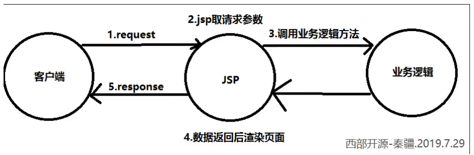

# 学习提示

ssm:mybatis+Spring+SpringMVC MVC三层架构


JavaSE:认真学习，老师带，入门快

JavaWeb：认真学习，老师带，入门快

SSM框架：研究官方文档，锻炼自学能力，锻炼笔记能力，锻炼项目能力

SSM = JavaWeb做项目；

Spring：IOC和AOP

SpringMVC:SpringMVC的执行流程

SpringMVC:SSM框架整合！


# 回顾MVC架构

### 什么是MVC

+ MVC是模型(Model)、视图（view）、控制器（Controller）的简写，是一种软件设计规范
+ 是将业务逻辑、数据、显示分离的方法来组织代码
+ MVC主要作用是降低了视图与业务逻辑间的双向耦合

+ MVC不是一种设计模式，MVC是一种架构模式，当然不同的MVC存在差异

**Model（模型）**:数据模型，提供要展示的数据，因此包含数据和行为，可以认为是领域模型或JavaBean组件（包含数据和行为），不过现在一般都分离开来：Value Object（数据Dao）和服务层（行为Service）。也就是模型提供了模型数据查询和模型数据的状态更新等功能，包括数据和业务。

**View（视图）：**负责进行模型的展示，一般就是我们见到的用户界面，客户想看到的东西

**Controller（控制器）：**接受用户请求，委托给模型进行处理（状态改变），处理完毕后把返回的模型数据返回给视图，由视图负责展示，。也就是说控制器做了个调度员的工作）

最典型的MVC就是JSP + Servlet + JavaBean的模式。


### Model时代

#### Model1时代

+ 在web早期的开发中，通常采用的都是Model1.
+ Model1中，主要分为两层，视图层和模型层



优点：架构简单，比较适合小型项目开发

缺点：JSP职责不惮以，职责过重，不便于维护


#### Model2时代

Model2把一个项目分成三部分，包括**视图**、**控制**、**模型**


1. 用户发请求
2. Servlet接收请求数据，并调用对应的业务逻辑方法
3. 业务处理完毕，返回更新后的数据给servlet
4. servlet转向到JSP，由JSP来渲染页面
5. 响应给前端更新后的页面

指责分析：

Controller:控制器

1. 取得表单数据
2. 调用业务逻辑
3. 转向指定的页面

Model:模型

1. 业务逻辑
2. 保存数据的状态

View:视图

1. 显示页面

Model2这样不仅提高的代码的复用率与项目的扩展性，且大大降低了醒目的维护成本。Model1模式的实现比较简单，适用于快速开发小规模项目，Model1中JSP页面身兼View和Controller两种角色，将控制逻辑和表现逻辑混杂在一起，从而导致代码的重用性非常低，增加了应用的扩展和维护的难度。Model2消除了Model1的缺点。


# 回顾Servlet

+ 导入依赖


+ 创建子项目，添加webapp的支持


+ 子项目导入servlet和JSP依赖


+ 编写一个servlet,用来处理用户的请求


+ 注册servlet


+ 编写hello.jsp页面


+ 再创建一个页面


MVC框架要做哪些事情

1. 将url映射到java类或java类的方法
2. 封装用户提交的数据
3. 处理请求-->调用相关的业务处理-->封装响应数据
4. 将响应的数据进行渲染.jsp/html等表示层数据


# 初始SpringMVC

## 什么是SpringMVC

SpringMVC是Spring Framework的一部分，是基于Java实现MVC的轻量级Web框架


**我们为什么要学习SpringMVC呢？**

SpringMVC的特点：

1. 轻量级，简单易学
2. 高效，基于请求响应的MVC框架
3. 与Spring兼容性好，无缝整合
4. 约定优于配置
5. 功能强大：RESful、数据验证，格式化、本地化、主题等
6. 简介灵活


Spring的web框架围绕DispatcherServlet【调度Servlet】设计

DispatcherServlet的作用是将请求分发到不同的处理器。从Spring 2.5开始，使用kava 5或者以上版本的用户可以采用基于注解形式进行开发，十分简洁

正因为SpringMVC好，简单，便捷，易学，天生和Spring无缝集成（使用SpringIOC和AOP）,使用约定优于配置，能够进行简单的Junit测试，支持Restful，异常处理，本地化，国际化，数据验证，类型转换，拦截器等等


>中心控制器

​	Spring的web框架围绕DispatcherServlet设计。DispatcherServlet的作用是将请求分发到不同的处理器。从Spring 2.5开始，使用Java 5或者以上版本的用户可以采用基于注解的controller声明方式。

​	Spring MVC框架像许多其他的MVC框架一样，**以请求为驱动，围绕一个中心Servlet分派请求及提供其他功能，DispatcherServlet是一个实际的Servlet（它继承自HttpServlet基类）**

SpringMVC的原理如下图所示：

当发起请求时被前置的控制器拦截到请求，根据请求参数生成代理请求，找到请求对应的实际控制器，控制器处理请求，创建数据模型，访问数据库，将模型响应给中心控制器，控制器使用模型与视图渲染视图结果，将结果返回给中心控制器，再将结果返回给请求者。


快速搭建

+ 新建一个Moudle，添加web的支持！
+ 确定导入了SpringMVC的依赖
+ 配置web.xml,注册DispatcherServlet


+ 配置SpringMVC的配置文件！名称：springmvc-servlet.xml:[servletname]-servlet.xml

说明，这里的名称要求是按照官方来的


+ 添加处理映射器


+ 添加处理器适配器


+ 添加视图解析器


+ 编写我们要操作业务Controller,要么实现Controller接口，要么增加注解；需要返回一个ModelAndView，装数据


+ 编写hello.jsp


+ 将自己的类交给SpringIOC容器，注册bean


可能遇到的问题:访问出现404，排查步骤：

1. 查看控制台输出，看一下是不是缺少了什么jar包

2. 如果jar包存在，显示无法输出，就在IDEA的项目发布中，添加lib依赖

   

3. 重启Tomcat即可解决


# SpringMVC执行原理


```
实线表示Springmvc框架提供的技术，不需要开发者实现，虚线需要开发者实现
```

简要分析执行流程

1. DispatcherServlete表示前置控制器，是整个SpringMVC的控制中心。用户发出请求，DispatcherServlet接收请求并拦截请求。

+ 我们假设亲球的URL为：http:.localhost:8080/SpringMVC/hello
+ 如上url拆分成三部分：
+ http://localhost:8080服务器域名
+ SpringMVC表示部署在服务器上的web站点
+ hello表示控制器
+ 通过分析，如上url表示为：请求位于服务器localhost:8080上的SpringMVC站点的hello控制器。

2. HandlerMapping为处理器映射。DispatcherServlet调用

   HandlerMapping,HandlerMapping根据请求url查找Handler。

3. HandlerExecution表示具体的Handler,其主要作用是根据url查找控制器，如上URL被查找控制器为：Hello。

4. HandlerExecution将解析后的信息传递给DispatcherServlet,如解析控制器映射等。

5. HandlerAdapter表示处理器适配器，其按照特定的规则去执行Handler.

6. Handler让具体的Controller执行。

7. Controller将具体的执行信息返回给HandlerAdapter,如ModelAndView

8. HandlerAdapter将视图逻辑明或模型传递给DispatcherServlet

9. DispatcherServlet根据视图解析器（viewResolver）解析的视图结果，调用具体的视图


10. 最终视图呈现给用户

小结：

用户发出请求-->前端控制器-->处理器映射器-->处理器执行器-->前端控制器-->处理器适配器-->具体的控制器-->处理器适配器-->前端控制器-->视图解析器-->前端控制器


# 深入SpringMVC学习

+ 配置DispatcherServlet

  ```hs
所有的请求都会送到名为springmvc的Servlet中
启动级别为1表示DispatcherServlet跟随服务器的启动而启动
  ```


+ 编写配置文件

```
实际上就是Spring的配置文件的格式
```


+ 编写Controller类


# 使用注解开发SpringMVC

1. 新建一个Moudle，添加web支持！健力宝结构com.wujingjun.controller
2. 由于maven可能存在资源过滤的问题，我们将配置完善

```xml
<build>
    <resources>
    	<resource>
        	<directory>src/main/java</directory>
            <includes>
            	<include>**/*.properties</include>
                <include>**/*.xml</include>
            </includes>
            <filtering>false</filtering>
        </resource>
        <resource>
        	<directory>src/main/resources</directory>
            <includes>
            	<include>**/*.properties</include>
                <include>**/*.xml</include>
            </includes>
            <filtering>false</filtering>
        </resource>
    </resources>
</build>
```

3. 在pom.xml文件引入相关的依赖：

主要有Spring框架核心库、Spring MVC、servlet,JSTL等。我们在父依赖中已经引入了！

4. 配置web.xml

注意点：

+ 注意web.xml版本问题，要最新版！

右键点击Module,然后选择


增加lib目录，添加jar包


+ 注册DispatcherServlet
+ 关联Spring MVC的配置文件
+ 启动级别为1
+ 映射路径为/【不要用/*，会404】
  + 


5. 添加Spring MVC配置文件

+ 让IOC的注解生效

+ 静态资源过滤：HTML，JS，CSS，图片，视频

+ MVC的注解驱动

+ 配置视图解析器

  在resource目录下添加springmvc-servlet.xml配置文件，配置的形式与Spring容器配置基本类似，为了支持基于注解的IOC,设置了自动扫描包的功能，具体配置信息如下：

  

  ​	在视图解析器中我们把所有的视图都存放在/WEB-INF/目录下，这样可以保证视图安全，因为这个目录下的文件，客户端不能直接访问。

  6. 创建Controller

  编写以java控制类：com.wujingjun.conroller.HelloController,注意编写规范

  

+ @Controller是为了让Spring IOC容器初始化时自动扫描到；

+ @RequestMapping是为了映射请求路径，这里因为类与方法上都有映射所以访问时应该是/HelloController/Hello;

+ 方法中声明Model类型的参数是为了把Action中的数据带到视图中；

+ 方法返回的结果是视图的名称hello，加上配置文件中的前后缀变成

  WEB-INF/jsp/hello.jsp

7. 创建视图层

在WEB-INF/jsp目录中创建hello.jsp,视图可以直接取出并展示从Controller待会的信息；

可以通过EL表示取出Model中存放的值，或者对象；


8. 配置Tomcat运行

配置Tomcat,开启服务器，访问对应的请求路径！


小结：

实现步骤其实非常的简单：

1. 新建一个web项目

2. 导入相关jar包

3. 编写web.xml，注册DispatcherServlet

4. 编写springmvc配置文件

5. 接下来就是去创建对应的控制类，controller

6. 最后完善前端视图和controller之间的对应

7. 测试运行调试

   使用Spring MVC必须配置的三大件：

   **处理器映射器**、**处理器适配器**、**视图解析器**

   通常，我们只需要**手动配置视图解析器**，**而处理器映射器**和**处理器适配器**只需要开启注解驱动即可，而省去了大段的xml的配置 


# Controller配置总结

### **控制器Controller**

+ 控制器复杂提供访问应用程序的行为，通常通过接口定义或注解定义两种方法实现
+ 控制器负责解析用户请求并将其转换为一个模型

+ 在Spring MVC中一个控制器类可以包含多个方法
+ 在Spring MVC中，对于Controller的配置方式有很多种

我们来看看有哪些方式可以实现：

### 实现Controller接口

Controller是一个接口，在org.springframework.web.servlet.mvc包下，接口中只有一个方法：

```java
//实现该接口的累哦获得控制器功能
public interface Controller{
    
    //处理请求且返回一个模型与视图对象
    ModelAndView handleRequest(HttpServlet var1,HttpServletResponse var2) throws Exception;
}
```

1. 新建一个module,添加web支持和Artifacts的jar包支持
2. 编写web.xml文件


3. 编写springmvc-servlet.xml文件相当于配置Spring文件（省略掉了处理其映射器和处理器适配器的配置）


4. 编写controller类


5. 编写完毕后，去Spring配置文件中注册请求的bean;name对应请求路径，class对应处理请求的类

```xml
<bean name="/t1" class="controller的全限定类名"/>
```

6. 编写前端test.jsp，注意在WEB-INF/jsp目录下编写，对应我们的视图解析器

实际上先创建一个.jsp文件，然后在其<body>标签下添加${msg}来获取信息

7. 配置Tomcat运行测试。


### 使用注解@Controller

+ @Controller注解类型用于声明Spring类的实例是一个控制器（在将IOC时还提大奥了另外3个注解,都代表是一个组件）；
  + @Component 组件
  + @Service         service
  + @Controller    controller
  + @Repository   dao
+ Spring可以使用扫描机制来找到应用程序中的所有基于注解的控制器类，为了保证Spring能找到你的控制器，需要在配置文件中声明组件扫描。

```xml
<!--自动扫描指定的包，下面所有注解类交给IOC容器管理-->
<context:component-scan base-package="controller所在的包名"/>
```

+ 增加一个ControllerTest2类，使用注解实现；

```java
//@Controller注解的类会自动添加到Spring上下文中,就是代表这个类会被Spring接管，被这个注解的类中的所有方法，如果返回值是String,并且有具体页面可以跳转，那么就会被视图解析器解析
@Controller
public cass ControllerTest2{
    
    //映射访问路zhongd径
    @RequestMapping("/t2")
    public String index(Model model){
        //Spring MVC会自动实例化一个Model对象用于向视图中传值
        model.addAttribute("msg","ControllerTest2");
        return "test";
    }
}
```

+ 运行Tomcat


**可以发现，我们的两个请求都可以指向一个视图，但是页面结果的结果是不一样的，从这里可以看出是被服用的，而控制器与视图之间是弱耦合关系**


# RequestMapping说明

**@RequestMapping**

+ @RequestMapping注解用于映射url到控制器或一个特定的处理程序方法。可用于类或方法上。用于类上，表示类中的所有响应请求的方法都是以该地址作为父路径
+ 为了测试结论更加准确，我们可以加上一个项目名测试myweb
+ 只注解在方法上

```java
@Controller
public class testController{
    
    @RequestMapping("/h1")
    public String test(){
        return "test";
    }
}
```

访问路径：http://localhost:8080/项目名/h1

+ 同时注解类和方法

```java
@Controller
@RequestMapping("/admin")
public class testController{

	@RequestMapping("/h1")
	public String test(){
		return "test";
	}
}
```


# RestFul风格讲解

+ 概念

Restful就是一个资源定位及资源操作的风格。不是标准也不是协议，只是一种风格。基于这个风格设计的软件可以更加简洁，更有层次，更易于实现缓存等机制

+ 功能

  + 资源：互联网所有的事情都可以被抽象为资源
  + 资源操作：使用POST、DELETE、PUT、GET，使用不同的方法对资源进行操作
  + 分别对应 添加、删除、修改、查询。

  传统方式操作资源：通过不同的参数来实现不同的效果！方法单一，post和get

+ http://127.0.01/item/query/queryItem?id = 1 查询，GET

+ http://127.0.01/item/saveitem.action 新增，POST

+ http://127.0.01/item/updateitem.action 更新，POST

+ http://127.0.01/item/deleteitem.action?id = 1 删除，GET或POST


​		使用RESTful操作资源：可以通过不同的请求方式来实现不同的效果！如下：请求地址一样，但是功能可以不同！

+ http://127.0.0.1/item/1 查询，GET
+ http://127.0.0.1/item    新增，POST
+ http://127.0.0.1/item    更新，PUT
+ http://127.0.0.1/item/1删除，DELETE 


学习测试

1. 在新建一个类RestFulController

```java
@Controller
public class RestFulController{
}
```

2. 在Spring MVC中可以使用@PathVariable注解，让方法参数的值对应绑定到一个URL模板变量上。

```java
@Controller
public class ResController{
    
    //映射访问路径
    @RequestMapping(”/add/{a}/{b}“)
    public String index(@PathVariable int p1 ,@PathVariable int p2,Model model){
        
        int result = p1+p2;
        //Spring MVC会自动实例化一个Model对象用于视图传值
        model.addAttribute("msg","结果："+result);
        //返回视图位置
        return "test";
    }
}
```

3.测试查看


使用路径变量的好处

+ 使路径变得更加简洁；
+ 获得参数更加方便，框架会自动进行类型转换。
+ 通过路径变量的类型可以约束范围参数，如果类型不一样，则访问不到对应的请求参数，如这里访问的是的路径是/commit/1/a,则路径与方法不匹配，而不会是参数转换失败。


4. 修改对应的参数类型，再次测试


使用method属性指定请求类型

用于约束请求的类型，可以收窄请求范围。指定请求谓词的类型如下GET、POST、HEAD、OPTIONS、PUT、PATCH、DELETE、TRACE等

+ 增加一个方法

  ```java
  //映射访问路径，方式是POST请求
  @RequestMapping(Value = "/hello",method ={RequestMethod.POST})
  public String index2(Model model){
  	model.addAttribute("msg","hello!");
  	return "test";
  }
  ```

+ 我们使用浏览器地址栏进行访问默认是Get请求，会报错405


+ 如果将POST修改为GET则正常了；

```java
//映射访问路径，必须是Get请求
@RequestMapping(value = "/hello" , method={RequestMethod.GET})
public String index2(Model model){
	model.addAttribute("msg","hello!");
	return "test";
}
```

**小结**

Spring MVC的@RequestMapping注解能够处理HTTP请求的方法，比如GET,PUT,POST,DELETE以及PASTCH

**所有的地址栏请求默认都会是HTTP GET类型的**

方法级别的注解变体有如下几个：组合注解

```
@GetMapping
@PostMapping
@PutMapping
@DeleteMapping
@PatchMapping
```

@GetMapping是一个组合注解

它所扮演的是@RequestMapping(method = RequestMethod.GET)的一个快捷方式


# 重定向和转发

### 结果跳转方式

#### **ModelAndView**

设置ModelAndView对象，根据view的名称，和试图机器跳到指定的页面

页面：{视图解析器前缀}+viewName+{视图解析器后缀}


对应得controller类

```java
public class ControllerTest1 implements Controller{
	
	public ModelAndView handleRequest(HttpServletRequest httpServletRequest,HttpServletResponse var2) throws Exception{
		ModelAndView mv = new ModelAndView();
		mv.addObject("msg","ControllerTest1");
		mv.setViewName("test");
		return mv
	}
}
```


#### ServletAPI

通过设置ServletAPI,不需要视图解析器

1. 通过HttpServletResponse进行输出
2. 通过HttpServletResponse实现重定向
3. 通过HttpServletResponse实现转发


#### SpringMVC-无需视图解析器

通过SpringMVC来实现转发和重定向-无需视图解析器

相当于用了原生态的Servlet

测试前，需要将视图解析器注释掉

```java
@Controller
public class ResultSpringMVC{
    @RequestMapping("/rsm/t1")
    public String test1(){
        //转发
        return "/index/jsp"
    }
    
    @RequestMapping("/rsm/t2")
    public String test2(){
        //装法而
        return "forward:/index.jsp";
    }
    
    @RequestMapping("/rsm/t3")
    public String test3(){
        //重定向
        return "redirect:/index.jsp";
    }
}
```


#### SpringMVC-需视图解析器

重定向，不需要视图解析器，本质就是重新请求一个新地方，所以注意路径问题。

可以重定向到另外一个请求实现

```java
@Controller
public class ResultSpringMVC2{
    @RequestMapping("/rsm/t1")
    public String test1(){
        //转发
        return "test";
    }
    
    @RequestMapping("/rsm/t2")
    public String test2(){
        //重定向
        return "redirect:/index.jsp";
        //return "redirect:hello.do;
        //hello.do为另一个请求
    }
}
```


# 接收请求参数及数据回显

### 数据处理

#### 处理提交数据

1. ##### **提交的域名称和处理方法的参数名一致**

提交数据：http://localhost:8080/hello?name=wujingjun

处理方法：

```java
@RequestMapping("/hello")
public String hello(String name){
    System.out.pringln(name);
    return "hello";
}
```

后台输出：wujingjun

2. ##### **提交的域名称和处理方法的参数名不一致**

提交数据：http://localhost:8080/hello?username=wujingjun

处理方法：

```
//@RequestParam("username")
@RequestMapping("/hello")
public String hello(@RequestParam("username") String name){
    System.out.pringln(name);
    return "hello";
}
```

后台输出：wujingjun

3. #### 提交的是一个对象

要求提交的表单域和对象的属性名一致，参数适用对象即可

1. 实体类

```java
public class User{
	private int id;
	private String name;
	private int age;
	//构造
	//get/set
	//toString()
}
```

2. 提交数据：http://localhost:8080/user?name=wujingjun&id=1&age=15

3. 处理方法：

```java
@RequestMapping("/user")
public String user(User user){
	System.out.pringln(user);
	return "hello";
}
```

后台输出：User{id=1,name='wujingjun',age=15}

说明：如果使用对象的话，前端传递的参数名和对象名必须一致，否则就是null.

学习测试：

+ 先建一个实体类


+ 编写cotroller类


#### 数据显示到前端

1. 通过ModelAndView


2. 通过ModelMap


3. 通过Model


**对比**

```
Model 只有寥寥几个方法知识和用于储存数据，简化了新手对于Model对象的操作和理解；
ModelMap 继承了LinkedMap,除了实现了自身的一些方法，同样的集成LinkedMap的方法和特性；
ModelAndView可以在储存数据的同时，可以进行设置返回的逻辑视图，京控制展示层的跳转。
```


# 乱码问题

测试乱码:

1. 我们可以在首页编写一个提交的表单


2. 后台编写对应的处理类


3. 输入中文测试，发现乱码


解决方案：

SpringMVC给我们提供了一个过滤器，可以在Web.xml配置

修改了xml文件需要重启服务器


在有些极端情况下，这个过滤器堆get的支持不好

处理方法：

修改tomcat配置文件：设置编码！

