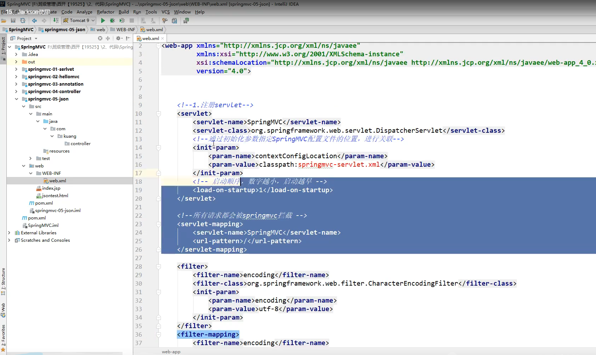
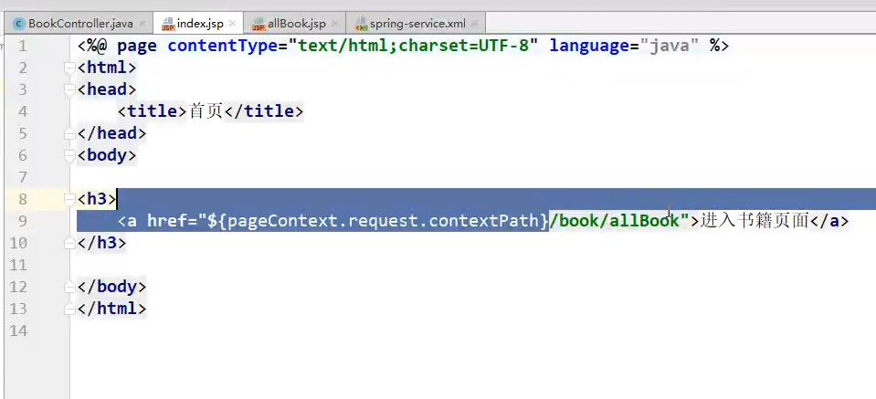
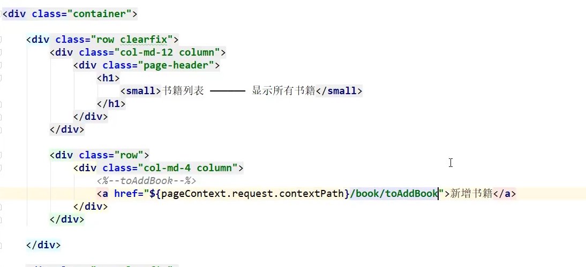
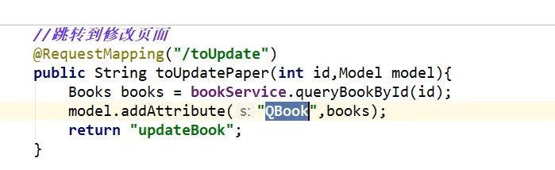
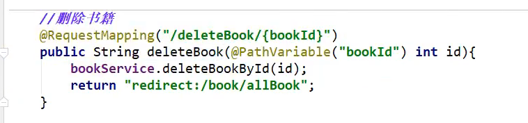

# 学习提示

ssm:mybatis+Spring+SpringMVC MVC三层架构


JavaSE:认真学习，老师带，入门快

JavaWeb：认真学习，老师带，入门快

SSM框架：研究官方文档，锻炼自学能力，锻炼笔记能力，锻炼项目能力

SSM = JavaWeb做项目；

Spring：IOC和AOP

SpringMVC:SpringMVC的执行流程

SpringMVC:SSM框架整合！


# 回顾MVC架构

### 什么是MVC

+ MVC是模型(Model)、视图（view）、控制器（Controller）的简写，是一种软件设计规范
+ 是将业务逻辑、数据、显示分离的方法来组织代码
+ MVC主要作用是降低了视图与业务逻辑间的双向耦合

+ MVC不是一种设计模式，MVC是一种架构模式，当然不同的MVC存在差异

**Model（模型）**:数据模型，提供要展示的数据，因此包含数据和行为，可以认为是领域模型或JavaBean组件（包含数据和行为），不过现在一般都分离开来：Value Object（数据Dao）和服务层（行为Service）。也就是模型提供了模型数据查询和模型数据的状态更新等功能，包括数据和业务。

**View（视图）：**负责进行模型的展示，一般就是我们见到的用户界面，客户想看到的东西

**Controller（控制器）：**接受用户请求，委托给模型进行处理（状态改变），处理完毕后把返回的模型数据返回给视图，由视图负责展示，。也就是说控制器做了个调度员的工作）

最典型的MVC就是JSP + Servlet + JavaBean的模式。


### Model时代

#### Model1时代

+ 在web早期的开发中，通常采用的都是Model1.
+ Model1中，主要分为两层，视图层和模型层


优点：架构简单，比较适合小型项目开发

缺点：JSP职责不惮以，职责过重，不便于维护


#### Model2时代

Model2把一个项目分成三部分，包括**视图**、**控制**、**模型**


1. 用户发请求
2. Servlet接收请求数据，并调用对应的业务逻辑方法
3. 业务处理完毕，返回更新后的数据给servlet
4. servlet转向到JSP，由JSP来渲染页面
5. 响应给前端更新后的页面

指责分析：

Controller:控制器

1. 取得表单数据
2. 调用业务逻辑
3. 转向指定的页面

Model:模型

1. 业务逻辑
2. 保存数据的状态

View:视图

1. 显示页面

Model2这样不仅提高的代码的复用率与项目的扩展性，且大大降低了醒目的维护成本。Model1模式的实现比较简单，适用于快速开发小规模项目，Model1中JSP页面身兼View和Controller两种角色，将控制逻辑和表现逻辑混杂在一起，从而导致代码的重用性非常低，增加了应用的扩展和维护的难度。Model2消除了Model1的缺点。


# 回顾Servlet

+ 导入依赖


+ 创建子项目，添加webapp的支持


+ 子项目导入servlet和JSP依赖


+ 编写一个servlet,用来处理用户的请求


+ 注册servlet


+ 编写hello.jsp页面


+ 再创建一个页面


MVC框架要做哪些事情

1. 将url映射到java类或java类的方法
2. 封装用户提交的数据
3. 处理请求-->调用相关的业务处理-->封装响应数据
4. 将响应的数据进行渲染.jsp/html等表示层数据


# 初始SpringMVC

## 什么是SpringMVC

SpringMVC是Spring Framework的一部分，是基于Java实现MVC的轻量级Web框架


**我们为什么要学习SpringMVC呢？**

SpringMVC的特点：

1. 轻量级，简单易学
2. 高效，基于请求响应的MVC框架
3. 与Spring兼容性好，无缝整合
4. 约定优于配置
5. 功能强大：RESful、数据验证，格式化、本地化、主题等
6. 简介灵活


Spring的web框架围绕DispatcherServlet【调度Servlet】设计

DispatcherServlet的作用是将请求分发到不同的处理器。从Spring 2.5开始，使用kava 5或者以上版本的用户可以采用基于注解形式进行开发，十分简洁

正因为SpringMVC好，简单，便捷，易学，天生和Spring无缝集成（使用SpringIOC和AOP）,使用约定优于配置，能够进行简单的Junit测试，支持Restful，异常处理，本地化，国际化，数据验证，类型转换，拦截器等等


>中心控制器

​	Spring的web框架围绕DispatcherServlet设计。DispatcherServlet的作用是将请求分发到不同的处理器。从Spring 2.5开始，使用Java 5或者以上版本的用户可以采用基于注解的controller声明方式。

​	Spring MVC框架像许多其他的MVC框架一样，**以请求为驱动，围绕一个中心Servlet分派请求及提供其他功能，DispatcherServlet是一个实际的Servlet（它继承自HttpServlet基类）**

SpringMVC的原理如下图所示：

当发起请求时被前置的控制器拦截到请求，根据请求参数生成代理请求，找到请求对应的实际控制器，控制器处理请求，创建数据模型，访问数据库，将模型响应给中心控制器，控制器使用模型与视图渲染视图结果，将结果返回给中心控制器，再将结果返回给请求者。


快速搭建

+ 新建一个Moudle，添加web的支持！
+ 确定导入了SpringMVC的依赖
+ 配置web.xml,注册DispatcherServlet


+ 配置SpringMVC的配置文件！名称：springmvc-servlet.xml:[servletname]-servlet.xml

说明，这里的名称要求是按照官方来的


+ 添加处理映射器


+ 添加处理器适配器


+ 添加视图解析器


+ 编写我们要操作业务Controller,要么实现Controller接口，要么增加注解；需要返回一个ModelAndView，装数据


+ 编写hello.jsp


+ 将自己的类交给SpringIOC容器，注册bean


可能遇到的问题:访问出现404，排查步骤：

1. 查看控制台输出，看一下是不是缺少了什么jar包

2. 如果jar包存在，显示无法输出，就在IDEA的项目发布中，添加lib依赖

   

3. 重启Tomcat即可解决


# SpringMVC执行原理


```
实线表示Springmvc框架提供的技术，不需要开发者实现，虚线需要开发者实现
```

简要分析执行流程

1. DispatcherServlete表示前端控制器，是整个SpringMVC的控制中心。用户发出请求，DispatcherServlet接收请求并拦截请求。

+ 我们假设请求的URL为：http:.localhost:8080/SpringMVC/hello
+ 如上url拆分成三部分：
+ http://localhost:8080服务器域名
+ SpringMVC表示部署在服务器上的web站点
+ hello表示控制器
+ 通过分析，如上url表示为：请求位于服务器localhost:8080上的SpringMVC站点的hello控制器。

2. HandlerMapping为处理器映射。DispatcherServlet调用

   HandlerMapping,HandlerMapping根据请求url查找Handler。

3. HandlerExecution表示具体的Handler,其主要作用是根据url查找控制器，如上URL被查找控制器为：Hello。

4. HandlerExecution将解析后的信息传递给DispatcherServlet,如解析控制器映射等。

5. HandlerAdapter表示处理器适配器，其按照特定的规则去执行Handler.

6. Handler让具体的Controller执行。

7. Controller将具体的执行信息返回给HandlerAdapter,如ModelAndView

8. HandlerAdapter将视图逻辑明或模型传递给DispatcherServlet

9. DispatcherServlet根据视图解析器（viewResolver）解析的视图结果，调用具体的视图


10. 最终视图呈现给用户

小结：

用户发出请求-->前端控制器-->处理器映射器-->处理器执行器-->前端控制器-->处理器适配器-->具体的控制器-->处理器适配器-->前端控制器-->视图解析器-->前端控制器

```
网上参考
1、 用户向服务端发送一次请求，这个请求会先到前端控制器DispatcherServlet(也叫中央控制器)。
2、DispatcherServlet接收到请求后会调用HandlerMapping处理器映射器。由此得知，该请求该由哪个Controller来处理（并未调用Controller，只是得知）
3、DispatcherServlet调用HandlerAdapter处理器适配器，告诉处理器适配器应该要去执行哪个Controller
4、HandlerAdapter处理器适配器去执行Controller并得到ModelAndView(数据和视图)，并层层返回给DispatcherServlet
5、DispatcherServlet将ModelAndView交给ViewReslover视图解析器解析，然后返回真正的视图。
6、DispatcherServlet将模型数据填充到视图中
7、DispatcherServlet将结果响应给用户
```


# 深入SpringMVC学习

+ 配置DispatcherServlet

  ```hs
所有的请求都会送到名为springmvc的Servlet中
启动级别为1表示DispatcherServlet跟随服务器的启动而启动
  ```


+ 编写配置文件

```
实际上就是Spring的配置文件的格式
```


+ 编写Controller类


# 使用注解开发SpringMVC

1. 新建一个Moudle，添加web支持！建立结构com.wujingjun.controller
2. 由于maven可能存在资源过滤的问题，我们将配置完善

```xml
<build>
    <resources>
    	<resource>
        	<directory>src/main/java</directory>
            <includes>
            	<include>**/*.properties</include>
                <include>**/*.xml</include>
            </includes>
            <filtering>false</filtering>
        </resource>
        <resource>
        	<directory>src/main/resources</directory>
            <includes>
            	<include>**/*.properties</include>
                <include>**/*.xml</include>
            </includes>
            <filtering>false</filtering>
        </resource>
    </resources>
</build>
```

3. 在pom.xml文件引入相关的依赖：

主要有Spring框架核心库、Spring MVC、servlet,JSTL等。我们在父依赖中已经引入了！

4. 配置web.xml

注意点：

+ 注意web.xml版本问题，要最新版！

右键点击Module,然后选择


增加lib目录，添加jar包


+ 注册DispatcherServlet
+ 关联Spring MVC的配置文件
+ 启动级别为1
+ 映射路径为/【不要用/*，会404】

```
<url-pattern>/</url-pattern>： 
会匹配到/springmvc这样的路径型url，不会匹配到模式为*.jsp这样的后缀型url。

<url-pattern>/*</url-pattern>： 
会匹配所有的url：路径型的和后缀型的url(包括/springmvc，.jsp，.js和*.html等)。 
```


+ 


5. 添加Spring MVC配置文件

+ 让IOC的注解生效

+ 静态资源过滤：HTML，JS，CSS，图片，视频

+ MVC的注解驱动

+ 配置视图解析器

  在resource目录下添加springmvc-servlet.xml配置文件，配置的形式与Spring容器配置基本类似，为了支持基于注解的IOC,设置了自动扫描包的功能，具体配置信息如下：

  

  ​	在视图解析器中我们把所有的视图都存放在/WEB-INF/目录下，这样可以保证视图安全，因为这个目录下的文件，客户端不能直接访问。

  6. 创建Controller

  编写以java控制类：com.wujingjun.conroller.HelloController,注意编写规范

  

+ @Controller是为了让Spring IOC容器初始化时自动扫描到；

+ @RequestMapping是为了映射请求路径，这里因为类与方法上都有映射所以访问时应该是/HelloController/Hello;

+ 方法中声明Model类型的参数是为了把Action中的数据带到视图中；

+ 方法返回的结果是视图的名称hello，加上配置文件中的前后缀变成

  WEB-INF/jsp/hello.jsp

```java
//使用ModelAndView
@RequestMapping("/fuck")
    public ModelAndView fuck(ModelAndView modelAndView){
        modelAndView.addObject("msg","real fuck");
        modelAndView.setViewName("hello");
        return modelAndView;
    }
```


7. 创建视图层

在WEB-INF/jsp目录中创建hello.jsp,视图可以直接取出并展示从Controller待会的信息；

可以通过EL表示取出Model中存放的值，或者对象；


8. 配置Tomcat运行

配置Tomcat,开启服务器，访问对应的请求路径！


小结：

实现步骤其实非常的简单：

1. 新建一个web项目

2. 导入相关jar包

3. 编写web.xml，注册DispatcherServlet

4. 编写springmvc配置文件

5. 接下来就是去创建对应的控制类，controller

6. 最后完善前端视图和controller之间的对应

7. 测试运行调试

   使用Spring MVC必须配置的三大件：

   **处理器映射器**、**处理器适配器**、**视图解析器**

   通常，我们只需要**手动配置视图解析器**，**而处理器映射器**和**处理器适配器**只需要开启注解驱动即可，而省去了大段的xml的配置 


# Controller配置总结

### **控制器Controller**

+ 控制器复杂提供访问应用程序的行为，通常通过接口定义或注解定义两种方法实现
+ 控制器负责解析用户请求并将其转换为一个模型

+ 在Spring MVC中一个控制器类可以包含多个方法
+ 在Spring MVC中，对于Controller的配置方式有很多种

我们来看看有哪些方式可以实现：

### 实现Controller接口

Controller是一个接口，在org.springframework.web.servlet.mvc包下，接口中只有一个方法：

```java
//实现该接口的累哦获得控制器功能
public interface Controller{
    
    //处理请求且返回一个模型与视图对象
    ModelAndView handleRequest(HttpServlet var1,HttpServletResponse var2) throws Exception;
}
```

1. 新建一个module,添加web支持和Artifacts的jar包支持
2. 编写web.xml文件


3. 编写springmvc-servlet.xml文件相当于配置Spring文件（省略掉了处理其映射器和处理器适配器的配置）


4. 编写controller类


5. 编写完毕后，去Spring配置文件中注册请求的bean;name对应请求路径，class对应处理请求的类

```xml
<bean name="/t1" class="controller的全限定类名"/>
```

6. 编写前端test.jsp，注意在WEB-INF/jsp目录下编写，对应我们的视图解析器

实际上先创建一个.jsp文件，然后在其<body>标签下添加${msg}来获取信息

7. 配置Tomcat运行测试。


### 使用注解@Controller

+ @Controller注解类型用于声明Spring类的实例是一个控制器（在将IOC时还提到了另外3个注解,都代表是一个组件）；
  + @Component 组件
  + @Service         service
  + @Controller    controller
  + @Repository   dao
+ Spring可以使用扫描机制来找到应用程序中的所有基于注解的控制器类，为了保证Spring能找到你的控制器，需要在配置文件中声明组件扫描。

```xml
<!--自动扫描指定的包，下面所有注解类交给IOC容器管理-->
<context:component-scan base-package="controller所在的包名"/>
```

+ 增加一个ControllerTest2类，使用注解实现；

```java
//@Controller注解的类会自动添加到Spring上下文中,就是代表这个类会被Spring接管，被这个注解的类中的所有方法，如果返回值是String,并且有具体页面可以跳转，那么就会被视图解析器解析
@Controller
public cass ControllerTest2{
    
    //映射访问路zhongd径
    @RequestMapping("/t2")
    public String index(Model model){
        //Spring MVC会自动实例化一个Model对象用于向视图中传值
        model.addAttribute("msg","ControllerTest2");
        return "test";
    }
}
```

+ 运行Tomcat


**可以发现，我们的两个请求都可以指向一个视图，但是页面结果的结果是不一样的，从这里可以看出是被服用的，而控制器与视图之间是弱耦合关系**


# RequestMapping说明

**@RequestMapping**

+ @RequestMapping注解用于映射url到控制器或一个特定的处理程序方法。可用于类或方法上。用于类上，表示类中的所有响应请求的方法都是以该地址作为父路径
+ 为了测试结论更加准确，我们可以加上一个项目名测试myweb
+ 只注解在方法上

```java
@Controller
public class testController{
    
    @RequestMapping("/h1")
    public String test(){
        return "test";
    }
}
```

访问路径：http://localhost:8080/项目名/h1

+ 同时注解类和方法

```java
@Controller
@RequestMapping("/admin")
public class testController{

	@RequestMapping("/h1")
	public String test(){
		return "test";
	}
}
```


# RestFul风格讲解

+ 概念

Restful就是一个资源定位及资源操作的风格。不是标准也不是协议，只是一种风格。基于这个风格设计的软件可以更加简洁，更有层次，更易于实现缓存等机制

+ 功能

  + 资源：互联网所有的事情都可以被抽象为资源
  + 资源操作：使用POST、DELETE、PUT、GET，使用不同的方法对资源进行操作
  + 分别对应 添加、删除、修改、查询。

  传统方式操作资源：通过不同的参数来实现不同的效果！方法单一，post和get

+ http://127.0.01/item/query/queryItem?id = 1 查询，GET

+ http://127.0.01/item/saveitem.action 新增，POST

+ http://127.0.01/item/updateitem.action 更新，POST

+ http://127.0.01/item/deleteitem.action?id = 1 删除，GET或POST


​		使用RESTful操作资源：可以通过不同的请求方式来实现不同的效果！如下：请求地址一样，但是功能可以不同！

+ http://127.0.0.1/item/1 查询，GET
+ http://127.0.0.1/item    新增，POST
+ http://127.0.0.1/item    更新，PUT
+ http://127.0.0.1/item/1删除，DELETE 


学习测试

1. 在新建一个类RestFulController

```java
@Controller
public class RestFulController{
}
```

2. 在Spring MVC中可以使用@PathVariable注解，让方法参数的值对应绑定到一个URL模板变量上。

```java
@Controller
public class ResController{
    
    //映射访问路径
    @RequestMapping(”/add/{a}/{b}“)
    public String index(@PathVariable int p1 ,@PathVariable int p2,Model model){
        
        int result = p1+p2;
        //Spring MVC会自动实例化一个Model对象用于视图传值
        model.addAttribute("msg","结果："+result);
        //返回视图位置
        return "test";
    }
}
```

3.测试查看


使用路径变量的好处

+ 使路径变得更加简洁；
+ 获得参数更加方便，框架会自动进行类型转换。
+ 通过路径变量的类型可以约束范围参数，如果类型不一样，则访问不到对应的请求参数，如这里访问的是的路径是/commit/1/a,则路径与方法不匹配，而不会是参数转换失败。


4. 修改对应的参数类型，再次测试


使用method属性指定请求类型

用于约束请求的类型，可以收窄请求范围。指定请求谓词的类型如下GET、POST、HEAD、OPTIONS、PUT、PATCH、DELETE、TRACE等

+ 增加一个方法

  ```java
  //映射访问路径，方式是POST请求
  @RequestMapping(Value = "/hello",method ={RequestMethod.POST})
  public String index2(Model model){
  	model.addAttribute("msg","hello!");
  	return "test";
  }
  ```

+ 我们使用浏览器地址栏进行访问默认是Get请求，会报错405


+ 如果将POST修改为GET则正常了；

```java
//映射访问路径，必须是Get请求
@RequestMapping(value = "/hello" , method={RequestMethod.GET})
public String index2(Model model){
	model.addAttribute("msg","hello!");
	return "test";
}
```

**小结**

Spring MVC的@RequestMapping注解能够处理HTTP请求的方法，比如GET,PUT,POST,DELETE以及PASTCH

**所有的地址栏请求默认都会是HTTP GET类型的**

方法级别的注解变体有如下几个：组合注解

```
@GetMapping
@PostMapping
@PutMapping
@DeleteMapping
@PatchMapping
只需要把@RequestMapping改为上面的任一个就是使用了特定的请求方式
```

@GetMapping是一个组合注解

它所扮演的是@RequestMapping(method = RequestMethod.GET)的一个快捷方式


# 重定向和转发

### 结果跳转方式

#### **ModelAndView**

设置ModelAndView对象，根据view的名称，和试图机器跳到指定的页面

页面：{视图解析器前缀}+viewName+{视图解析器后缀}


对应得controller类

```java
public class ControllerTest1 implements Controller{
	
	public ModelAndView handleRequest(HttpServletRequest httpServletRequest,HttpServletResponse var2) throws Exception{
		ModelAndView mv = new ModelAndView();
		mv.addObject("msg","ControllerTest1");
		mv.setViewName("test");
		return mv
	}
}
```


#### ServletAPI

通过设置ServletAPI,不需要视图解析器

1. 通过HttpServletResponse进行输出
2. 通过HttpServletResponse实现重定向
3. 通过HttpServletResponse实现转发


#### SpringMVC-无需视图解析器

通过SpringMVC来实现转发和重定向-无需视图解析器

相当于用了原生态的Servlet

测试前，需要将视图解析器注释掉

```java
@Controller
public class ResultSpringMVC{
    @RequestMapping("/rsm/t1")
    public String test1(){
        //转发
        return "/index/jsp"
    }
    
    @RequestMapping("/rsm/t2")
    public String test2(){
        //装发
        return "forward:/index.jsp";
    }
    
    @RequestMapping("/rsm/t3")
    public String test3(){
        //重定向
        return "redirect:/index.jsp";
    }
}
```


#### SpringMVC-需视图解析器

重定向，不需要视图解析器，本质就是重新请求一个新地方，所以注意路径问题。

可以重定向到另外一个请求实现

```java
@Controller
public class ResultSpringMVC2{
    @RequestMapping("/rsm/t1")
    public String test1(){
        //转发
        return "test";
    }
    
    @RequestMapping("/rsm/t2")
    public String test2(){
        //重定向
        return "redirect:/index.jsp";
        //return "redirect:hello.do;
        //hello.do为另一个请求
    }
}
```


# 接收请求参数及数据回显

### 数据处理

#### 处理提交数据

1. ##### **提交的域名称和处理方法的参数名一致**

提交数据：http://localhost:8080/hello?name=wujingjun

处理方法：

```java
@RequestMapping("/hello")
public String hello(String name){
    System.out.pringln(name);
    return "hello";
}
```

后台输出：wujingjun

2. ##### **提交的域名称和处理方法的参数名不一致**

提交数据：http://localhost:8080/hello?username=wujingjun

处理方法：

```
//@RequestParam("username")
@RequestMapping("/hello")
public String hello(@RequestParam("username") String name){
    System.out.pringln(name);
    return "hello";
}
```

后台输出：wujingjun

3. #### 提交的是一个对象

要求提交的表单域和对象的属性名一致，参数适用对象即可

1. 实体类

```java
public class User{
	private int id;
	private String name;
	private int age;
	//构造
	//get/set
	//toString()
}
```

2. 提交数据：http://localhost:8080/user?name=wujingjun&id=1&age=15

3. 处理方法：

```java
@RequestMapping("/user")
public String user(User user){
	System.out.pringln(user);
	return "hello";
}
```

后台输出：User{id=1,name='wujingjun',age=15}

说明：如果使用对象的话，前端传递的参数名和对象名必须一致，否则就是null.

学习测试：

+ 先建一个实体类


+ 编写cotroller类


#### 数据显示到前端

1. 通过ModelAndView


2. 通过ModelMap


3. 通过Model


**对比**

```
Model 只有寥寥几个方法知识和用于储存数据，简化了新手对于Model对象的操作和理解；
ModelMap 继承了LinkedMap,除了实现了自身的一些方法，同样的集成LinkedMap的方法和特性；
ModelAndView可以在储存数据的同时，可以进行设置返回的逻辑视图，京控制展示层的跳转。
```


# 乱码问题

测试乱码:

1. 我们可以在首页编写一个提交的表单


2. 后台编写对应的处理类


3. 输入中文测试，发现乱码


解决方案：

SpringMVC给我们提供了一个过滤器，可以在Web.xml配置

修改了xml文件需要重启服务器

```xml
<filter>
    <filter-name>encoding</filter-name>
    <filter-class>org.springframework.web.filter.CharacterEncodingFilter</filter-clasclass>
    <init-param>
        <param-name>encoding</param-name>
        <param-value>utf-8</param-value>
    </init-param>
</filter>
<filter-mapping>
    <filter-name>encoding</filter-name>
    <url-pattern>/*</url-pattern>
</filter-mapping>
```

在有些极端情况下，这个过滤器堆get的支持不好

处理方法：

修改tomcat配置文件：设置编码！


# JSON

### 引言

前后端分离时代：

后端部署后端，提供接口，提供数据：

​					json

前端独立部署，负责渲染后端的数据；


### 什么是JSON

+ JSON(JavaScript Object Notation,JS对象标记)是一种轻量级的数据交换格式，目前使用特别广泛。
+ 采用完全独立于编程语言的**文本格式**来存储和表示数据
+ 见解和清晰的层次结构使得JSON成为理想的数据交换语言
+ 易于人阅读和编写，同时也易于机器解析和生成，并有效地提升网络传输效率

​	在JavaScript语言中，一切都是对象。因此，任何JavaScript支持的类型都可以通过JSON来表示，例如字符串、数字、对象、数据等。看看他的要求和语法格式：

+ 对象表示为键值对，数据由逗号分隔

+ 花括号保存对象

+ 方括号保存数组

  **JSON键值对**是用来保存JavaCript对象 的一种方式，和JavaScript对象的写法也大同小异，键/值对组合中的简明卸载前面并用双引号 "" 包裹，使用冒号：分隔，然后紧接着值：


很多人搞不清楚JSON和Java Script对象的关系，甚至连谁是谁都不清楚。其实，可以这么理解：

+ JSON是JavaScript对象的字符串表示法，他是用文本表示一个JS对象的信息，本质是一个字符串。


JSON和JavaScript对象互转

+ 要实现从JSON字符串转换为JavaScript对象，使用JSON.parse()方法：


+ 要实现从JavaScript对象转换为JSON字符串，使用JSON.stringif()方法：


代码测试：


### Controller返回JSON数据

+ Jackson应该是目前比较好的json解析工具了
+ 当然工具不止这一个，比如还有阿里巴巴的fastjson等等
+ 我们这里使用Jackson,使用它需要导入它的包


+ 配置SpringMVC需要的配置

  web.xml(就是SpringMVC的运行环境)



+ 实体类


+ controller类

```java
@Controller
public class UserController{
	
	@RequestMapping("/json1")
	@ResponseBody
	public String json1() throws JsonProcessingException{
		//创建一个jackson的对象映射器，用来解析数据
		ObjectMapper mapper = new ObjectMapper();
		//创建一个对象
		User user = new User("俊哥1号",3,"男");
		//将我们的对象解析成为json格式
		String str = mapper.writeValueAsString(user);
		//由于@ResponseBody注解，这里会将str转成json格式返回；十分方便
		return str; 
	}
}
```

+ 配置Tomcat，启动测试
+ 发现出现了乱码问题，我们需要设置一下它的编码格式为utf-8,以及它返回的类型；
+ 通过@RequestMapping的produces属性来实现，修改下代码

```java
//produces:指定响应体返回类型和编码
@RequestMapping(value = "/json1",produces = "application/json;charset=utf-8")
```

+ 再次测试


### 代码优化

**乱码统一解决**

上一种方法比较麻烦，如果项目中有许多请求则每一个都要添加，可以通过Spring配置统一指定，这样就不用每次都去处理了

我们可以在springmvc的配置文件上添加一段消息StringHttpMessageConverter转换配置！

 

 

### 测试JSON所有类型

+ 集合类型


+ 时间类型


优化代码

 

或者


#### 编写JSON工具类

+ 编写工具类，这是源码的一种的写法，利用方法重载来复用代码


+ controller类


### Fastjson使用

​	fastjson.jar是阿里开发的一款专门用于java开发的包，可以方便的实现json独享与javaBean对象的转换，实现javabean对象与json字符串的转换，实现json对象与json字符串的转换。实现json转换方法很多，最后的实现结果都是一样的。

​	fastjson的pom依赖

```xml
<dependency>
    <groupId>com.alibaba</groupId>
    <artifactId>fastjson</artifactId>
    <verson>1.2.60</verson>
</dependency>
```

fastjson三个主要的类：

+ 【JSONObject代表json对象】
  + JSONObject实现了Map接口，猜想JSONObject底层操作是由Map实现的。
  + JSONObject对应json对象，通过各种形式的get()方法可以获取json对象中的数据，也可利用诸如size(),isEmpty()等方法获取”键:值“对的个数和判断是否为空。其本质是通过实现Map接口并调用接口中的方法完成的。
+ 【JSONArray代表json对象数组】
  + 内部是由List接口中的方法来完成操作
+ 【JSON代表JSONObject和JSONArray的转化】
  + JSON类源码分析与使用
  + 仔细观察这些方法，主要是实现json对象，json对象数组，javabean对象，json字符串之间的相互转化


# 整合SSM

> 环境要求：

+ IDEA

+ MySQL 5.7.19

+ Tomcat 9

+ Maven 3.6

  要求:

+ 需要熟练掌握MySQL数据库，Spring，JavaWeb及MyBatis知识，简单的前端知识


> 数据库环境

创建一个存放书籍数据的数据库表


>基本环境搭建

+ 新建一个Maven项目！并且添加web的支持
+ 导入相关的pom依赖


+ 建立基本结构和配置框架

  + dao

  + pojo

  + service

  + controller

  + mybatis-config.xml

    

  + applicationContext.xml

    


# 整合mybatis

>  Mybatis层编写

+ 数据库配置文件 databaes.properties


+ IDEA关联数据库
+ 编写Mybatis核心配置文件


+ 编写实体类


+ 编写dao层


+ 编写Mapper.xml文件


+ 注册Mapper.xml


+ 编写service层


# 整合Spring层

+ 配置Spring整合MyBatis,我们这里数据源使用c3p0连接池；
+ 我们去编写Spring整合Mybatis的相关配置：spring-dao.xml


+ 编写spring-service.xml 

 


# 整合SpringMVC层

+ 编写web.xml文件


+ 编写spring-mvcxml配置文件


# 添加查询书籍功能

+ 编写controller类


+ 编写JSP页面



+ 报错查源


+ 修改：


+ 修改首页的样式


# 添加添加书籍功能

+ 编写页面




+ 编写controller类


+ 编写增加书籍页面

 


```html
在<input>标签中添加required就能够使填写为空不能提交表单
```


# 修改删除书籍

+ 编写jsp页面


+ 编写controller类




+ 增加 update页面


+ 添加事务管理 


+ 修改代码


+ 删除controller类（RESTful风格）



+ 删除页面（Restful风格）


# 新增搜索功能

+ 页面修改 


+ dao层编写


+ mapper.xml配置文件编写


+ controller类编写


+ 修改代码


# Ajax

### 简介

+ AJAX = Asynchronnous JavaScript and XML(异步的JavaScript和XML).
+ AJAX是一种在无需重新加载整个页面的情况下，能够更新部分网页的技术
+ Ajax不是一种新的编程语言，而是用于创建更好更快以及交互性更强的Web应用程序的技术。
+ 在2005年，Google通过Google Suggest使AJAX变得流行起来。Google Suggest能够自动帮你完成搜索单词
+ Google Suggest 使用AJAX创造出动态性极强的web界面：当你在谷歌的搜索框输入关键字，JavaScript会把这些字符发送到服务器，，然后服务器会返回一个搜索建议的列表

+ 传统的网页（即不适用ajax的网页），想要更新内容或者提交一个表单，都需要重新加载整个网页
+ 使用ajax技术的网页，通过在后台服务器进行少量的数据交换，就可以实现异步局部更新。
+ 使用Ajax，用户可以创建接近本地桌面应用的注解、高可用、更丰富、更动态的wb用户界面


### 伪造Ajax

我们可以使用前端的一个标签来伪造一个ajax的样子。iframe标签

1. 新建一个module：springmvc-06-ajax,导入web支持
2. 编写一个ajax-frame.html使用iframe测试，感受下效果


3. 使用IDEA打开浏览器测试一下

   利用AJAX可以做：

   + 注册时，输入用户名自动检测用户是否已经存在。
   + 登陆时，提示用户名密码错误
   + 删除数据行时，将行ID发送到后台，后台在数据库中删除，数据库删除成功后，在页面DOM中将数据行也删除。
   + .....等等


### jQuery.ajax

+ 纯JS原生实现Ajax我们不去讲解这里，实际使用jqery提供的，方便学习和使用，避免重复造轮子，有兴趣的同学可以去了解下JS原生XMLHttpRequest!
+ Ajax的核心时XMLHttpRequest对象（XHR)。XHR为向服务器发送请求和鸡西服务器响应提供了接口。能够以异步方式从服务器获取新数据。
+ jQuery提供多个与AJAX有关的方法
+ 通过jQuery AJAX方法，你能够使用HTTP Get和HTTP POST从远程服务器上请求文本、HTML、XML或JSON-同时您能够把这些外部数据直接载入网页的被选元素中。
+ jQuery不是生产者，而是大自然搬运工，是一个库,就是大量的JS函数
+ jQuery Ajax本质就是XMLHttpRequest，对他进行了封装，方便调用！

```
jQuery.ajax(....)
	部分参数：	
		url:请求地址
		type:;请求方式，GET,POST(1.9.0之后使用nethod)
		headers:请求头
		data:要发送的数据
		contentType:即将发送信息至服务器的内容编码类型(默认：“application/x-www-form-urlencode”)
		async:是否异步
		timeout:设置请求超时时间(毫秒)
		beforeSend:发送请求前执行的函数（全局）
		complete：完成之后执行的回调函数（全局）
		success:成功之后执行的回调函数（全局）
		error:失败之后执行的回调函数（全局）
		accepts:通过请求头发送给服务器，告诉服务器当前客户端可接受的数据类型
		dataType:将服务器端返回的数据转换成xml格式
		“xml”:将服务器端返回的内容转换成xml格式
		“text”:将服务器端返回的内容转换成普通文本格式
		"html":将服务器端返回的内容转换成普通文本格式
		“script":尝试将返回值当作JavaScript去执行，然后再将服务器段返回的内容转换成普通文本格式
		”json“:将服务器端返回的内容转换成相应的JavaScript对象
		”jsonp“:JSONP格式使用JSONP形式调用函数，如：myurl?callback=?,JQuery将自动.......
```

+ 下载JQuery


+ 项目导入JQuery


**我们来做个简单的测试，使用最原始的HttpServletResponse处理，最简单，最通用**

+ 运行逻辑


+ 配置web.xml和springmvc的配置文件，复制上面的案例即可【记得静态资源过滤和注解驱动配置上】


+ 编写页面


+ 编写Controller类


### Ajax异步加载数据

+ 创建实体类
+ 编写Controller类


+ 编写页面

 


### Ajax验证用户名体验

+ 页面编写


+ Controller类编写

### 

+ 乱码问题解决


# 拦截器

### 概述

​	SpringMVC的处理器拦截器类似于Servlet开发中的过滤器Filter,用于对处理器进行预处理和后处理。开发者可以自己定义一些拦截器起来实现特定的功能。

​	**过滤器与拦截器的区别：**拦截器是AOP思想的具体应用。不影响原来的功能

​	**过滤器**

+ servlet规范中的一部分，任何java web工程都可以使用
+ 在url-pattern中配置了/*之后，可以对所有要访问的资源进行拦截

​	**拦截器**

+ 拦截器是SpringMVC框架自己的，只有使用了SpringMVC框架的工程才能使用
+ 拦截器置只会拦截访问的控制器方法，如果访问的是jsp/html/css/image/js是不会进行拦截的


### 自定义拦截器

​	那如何实现拦截器呢？

​	想要自定义拦截器，必须实现HandlerInterceptor接口

1. 新建一个Module，springmvc-07-Interceptor,添加web支持
2. 配置web.xml和springmvc-servlet.xml文件
3. 编写一个拦截器

 

4. 配置拦截器


### 登录判断验证

+ 编写首页和登陆页面


+ 编写Controller类


```
session在页面跳转后也能够保存信息
```

+ 编写拦截器
+ 


+ 注册拦截器


# 文件上传和下载

### 准备工作

​	文件上传是项目开发中最常见的功能之一，springmvc可以很好的支持文件上传，但是SpringMVC上下文中默认没有装配MultipartResolver,因此默认情况下其不能处理文件上传工作。如果想使用Spring的文件上传功能，则需要在上下文中配置MultipartResolver.

​	前端表单要求：为了能上传文件，必须将表单的method设置为POST,并将enctype设置为multipart/form-data.只有在这样的情况下，浏览器才会把用户选择的文件以二进制数据发送给服务器；

​	对表单中的enctype属性做个详细的说明：

+ application/x-www=form-urlencoded:默认方式，只处理表单域中的value属性值，采用这种编码方式的表单会将表单域中的值处理成URL编码方式。
+ multipart/form-data:这种编码方式会以二进制流的方式来处理表单数据，这种编码方式会把文件域指定文件的内容也封装到请求参数中，不会对字符编码。
+ text/plain:除了把空格转换为“+”号外，其他字符都不做编码处理，这种方式使用直接通过表单发送邮件

```html
<from action="" enctype="multipart/form-data" method="post">
    <input type="file" name="file"/>
    <input type="submit"/>
</from>
```

​		一旦设置了enctype为multipart/form-data,浏览器即会采用二进制流的方式来处理表单数据，而对于文件上传的处理则涉及在服务器端解析原始的HTTP响应。在2003年，Apache Software Foundation发布了开源的Commons FileUpload组件，其很快成为Servlet/JSP程序员上传文件的最佳选择。

+ Servlet3.0规范已经提供方法来处理文件上传，但这种上传须在Servlet中完成。
+ 而Spring MVC则提供了更简单的封装。
+ Spring MVC为文件上传提供了直接的支持，这种支持使用即插即用的MultipartResolver实现的
+ Spring MVC使用Apache Commons FileUpload技术实现了一个MultipartResolver实现类：CommonsMultipartResolver.因此，SpringMVC的文件上传还需要依赖Apache Commons FileUpload的组件。


### 文件上传

+ 导入文件上传的jar包，commons-fileupload,Maven会自动帮我们导入它的依赖包commons-io包


+ 编写上传页面


+ 配置bean:multipartResolver

【注意：这个bean的id必须为：multipartResolver,否则上传文件会400的错误！】


```
maxUploadSize和maxInMemorySize可以不配
```

​	CommonsMultipartFile的常用方法：

1. String getOriginalFilename():获取上传文件的原名

2. InputStream getInputStream():获取文件流

3. void transferTo(File dest):将上传文件保存到一个目录文件中

+ 编写Controller类


+ 测试文件上传                                                           

### 第二种文件上传方式

1. 编写Controller


2. 前端表单提交地址修改
3. 访问提交测试


### 文件下载

​	文件上传步骤：

1. 设置response响应头
2. 读取文件 - -InputStream
3. 写出文件 --OutputStream
4. 执行操作
5. 关闭流（先开后关）

代码实现：


 