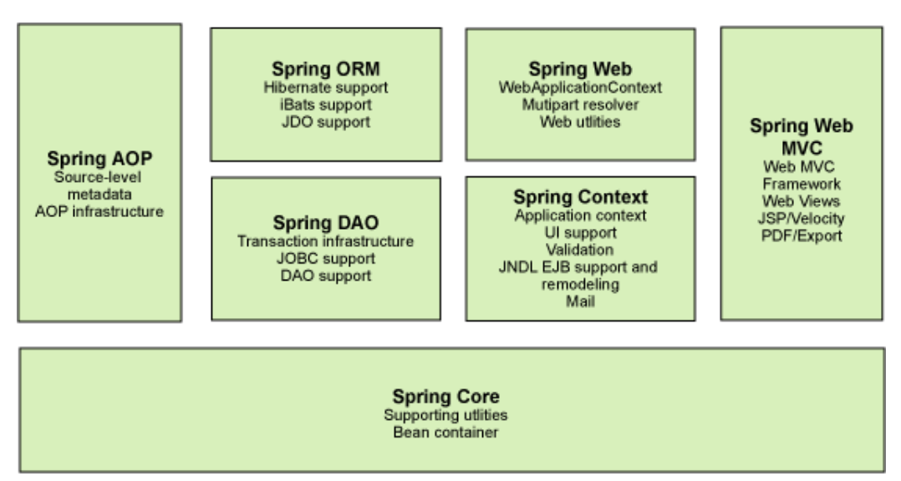
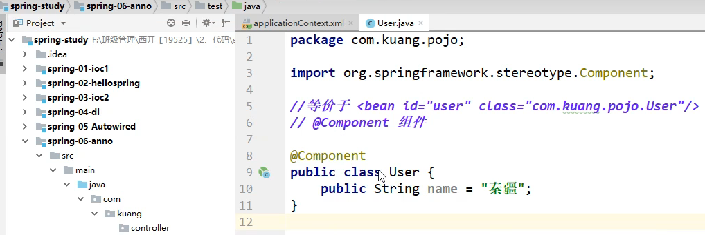
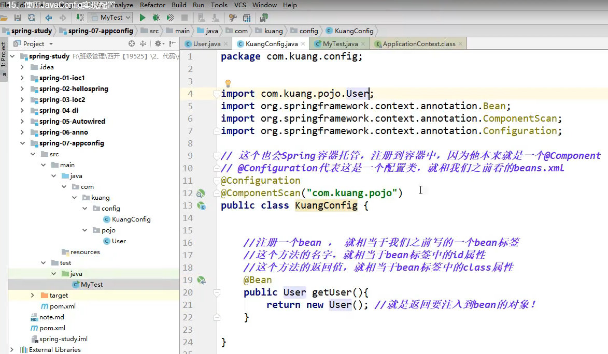
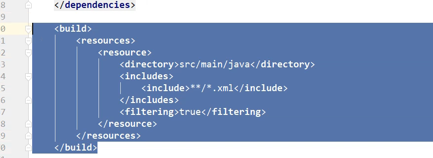
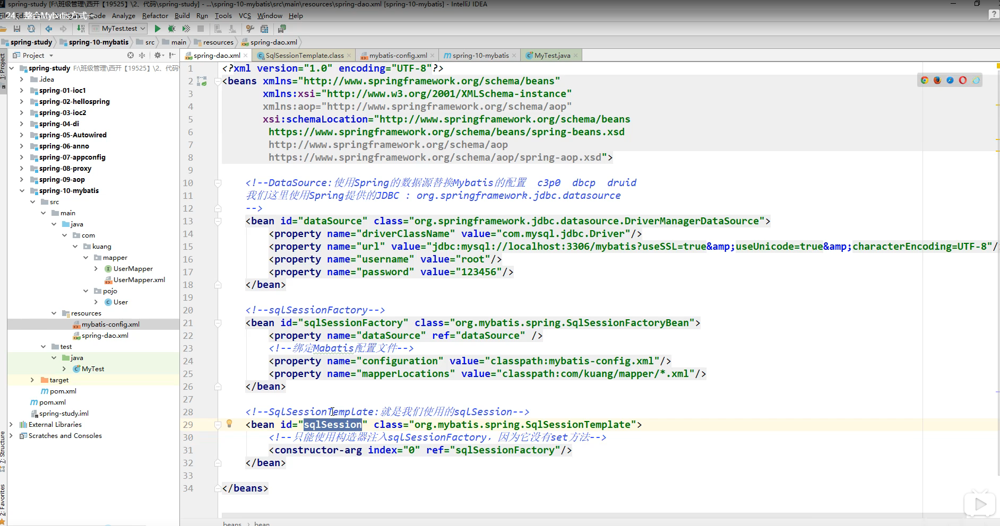

# Spring学习笔记


## spring

### 1.简介

+ Spring:春天----->给软件行业带来了春天
+ 2002.首次推出了Spring框架的雏形：interface21框架
+ spring理念：是现有的技术更加容易使用，本身是一个大杂烩，整合了现有的技术框架！

 maven依赖：


### 2.优点

+ Spring是一个开源的免费的框架（容器）
+ Spring是一个轻量级的、非入侵式的框架
+ 控制反转（IOC）,面向切面编程（AOP）
+ 支持事物的处理，对框架整合的支持


总结：**Spring就是一个轻量级的控制反转（IOC）和面向切面编程的框架!**


### 3.组成




### 4.拓展

在Spring的官网：现代化的java开发，说白就是基于Spring的开发


+ SpringBoot
  + 一个快速开发的脚手架
  + 基于SpringBoot可以快速的开发翻个微服务
  + 约定大于配置
+ SpringCloud
  + SpringCloud是基于SpringBoot实现的。


因为现在大多数公司都在使用SpringBoot进行快速开发，学习SpringBoot的前提，需要掌握Spring及SpringMVC!承上启下的作用!


**弊端：发展了太久，违背原来的理念！配置十分繁琐！**


## IOC理论推导

### 原来代码结构

1. userDao接口
2. UserDaoImpl实现类
3. UserService业务接口
4. UserServiceImpl业务实现类

**分析**：在我们之前的业务中，用户的需求可能会影响我们原来的代码，我们需要根据用户的需求去修改源代码！如果程序代码量十分大，修改一次的成本代价十分昂贵！


我们使用一个Set接口实现，已经发生了革命性的变化！

```java
	private UserDao userDao;

//利用set惊醒动态实现值得注入
public void setUserDao(UserDao userDao){
    this.userDao = userDao;
}
```


+ 之前，程序是主动创建对象！控制权在程序猿手上！
+ 使用了set注入后，程序不再具有主动性，而是变成了被动的接受对象！


这种思想，从本质上解决了问题，我们程序员不用再去管理对象的创建。系统的耦合性大大降低，可以更加专住的在业务的实现上！这是IOC的原型（控制反转）！ 


 

### IOC本质

**控制反转IOC(Inversion of Control),是一种设计思想，DI(依赖注入)是实现IOC的一种方法**，也有人认为DI只是IOC的另一种方法。没有IOC的程序中，我们使用面向对象编程，对象的创建于对象间的依赖关系完全硬编码在程序中，对象的创建由程序自己控制，控制反转后将对象的创建转移给第三方，个人认为所谓控制反转就是：获得依赖对象的方式反转了 。 


采用XML方式配置Bean的时候，Bean的定义信息是和实现分离 ，而采用注解的方式可以把两者合为一体，Bean的定义信息直接以注解的形式定义在实现类中，从而达到了零配置的目的。

**控制反转是一种通过描述（XML或注解）并通过第三方去生产或获取特定对象的方式。在Spring中实现控制反转的是IOC容器，其实现方法是依赖注入（Dependency Injection,DI）** 


## Hello Spring 

1. 实体类


2. 配置文件编写

   ***官方文档***

   ****

   

```http
连接：https://docs.spring.io/spring-framework/docs/current/spring-framework-reference/core.html#spring-core
```


****

+ 测试类编写


分析：


### 改造三层架构代码

+ 配置文件编写

  

+ 测试类编写

  


## IOC创建对象方式

新建一个项目

+ 实体类


+ 配置文件编写


+ 测试类编写


**总结**

+ 默认使用无参构造实例

+ 假设我们要使用有参构造创建对象

  1. 下标赋值

     ```xml
     <bean id="..." class"..">
     	<constructor-arg index="0" value="..."
     </bean>
     ```

  

  	2. 通过类型创建（不建议使用）

  

  

  3. 通过参数名创建


**总结**：在配置文件加载的时候，容器中管理的对象就已经初始化了。


## Spring配置

### 1.别名

```xml
<!--别名，如果添加了别名，我们也可以使用别名来获取到这个对象，就是在测试类中getBean(alias的值)-->
<alias name="user" alias="userNew">
```

### 2.Bean的配置

```xml
<!--
	id:bean的唯一标识符，也就是相当于我们学的对象名
	class:bean对象所对应的全限定类名：包名+类型
	name:也就是别名，而且name可以同时取多个别名
-->
<bean id="user" class="com.wujingjun.pojo.user" name="user u2,u3;u4">
    <property name="..." value="..."/>
</bean>
```

### 3.import

这个import,一般用于团队开发使用，它可以将多个配置文件，导入合并为一个

假设，现在项目中有多个人开发，这三个人父子不同的类开发，不同的类需要注册在不同的bean中，我们可以利用import将所有人的beans.xml合并为一个总的！

+ 张三
+ 李四
+ 王五
+ applicationContext.xml

```xml
<import resource="bean.xml"/>
<import resource="bean2.xml"/>
<import resource="bean3.xml"/>
```

使用的时候，直接使用总的配置就可以了


## 依赖注入

1. **构造器注入**

   前面已经说过

   类似：

   


2. **Set方式注入**【**重点**】

+ 依赖注入：Set注入
  + 依赖：bean对象的创建依赖于容器
  + 注入：bean对象中的所有属性，由容器laizhuru


【环境搭建】

1. 复杂类型

   

2. 真实测试对象


3. 配置文件编写


4.测试类


+ Set注入编写


+ 测试


## 拓展方式注入

**P命名空间注入**

+ 实体类编写


+ 配置文件编写


**C命名空间注入**

+ 实体类


+ 配置文件注入


测试：


注意点：p命名和c命名空间不能直接使用，需要导入xml约束

```xml
xmlns:p="http://www.springframework.org/schema/p"
xmlns:c="http://www.springframework.org/schema/c"
```


## Bean的作用域


### 1.单例模式

```xml
<bean id="..." class="..." scope="singleton"/>
```


### 2.原型模式

每次从容器中get的时候，都会产生一个新的对象

```xml
<bean id="..." class="..." scope="prototype"/>
```


### 3.其余的request、session、application，这些只能在web开发中使用


## Bean的自动装配

+ 自动装配是spring满足bean依赖一种方式 !
+ Spring会在上下文中自动寻找，并自动给bean装配属性！


在Spring中有三种装配的方式

1. 在xml中显示的配置
2. 在java中显示配置
3. 隐式的自动装配bean【重要】


### 1.测试

新建一个项目

+ 创建实体类


+ 编写配置文件


+ 测试类编写


+ 实现自动装配

  + ByName自动装配

  

  + ByType自动装配

  

小结：

+ byName的时候，需要保证所有Bean的id唯一，并且这个Bean需要和自动注入的属性的set方法的值一致
+ byType的时候，需要保证所有Bean的class唯一，并且这个Bean需要和自动注入的属性的类型一致！


### 实现注解自动装配

jdk1.5支持的注解，spring2.5就支持注解了！

要使用注解须知：

1. 导入约束。context约束
2. 配置注解的支持:==<context:annotation-config/>==

```xml
<?xml version="1.0" encoding="UTF-8"?>
<beans xmlns="http://www.springframework.org/schema/beans"
    xmlns:xsi="http://www.w3.org/2001/XMLSchema-instance"
    xmlns:context="http://www.springframework.org/schema/context"
    xsi:schemaLocation="http://www.springframework.org/schema/beans
        https://www.springframework.org/schema/beans/spring-beans.xsd
        http://www.springframework.org/schema/context
        https://www.springframework.org/schema/context/spring-context.xsd">

    <!--开启注解的支持-->
    <context:annotation-config/>

</beans>
```


### @Autowired

直接在属性上使用即可！也可以在set方式上使用！

使用Autowired我们可以不用编写Set方法了，前提是你这个自动装配的属性在IOC(Spring)容器中存在，且符合名字byname!

科普：

```java
@Nullable 字段标记了这个注解，说明这个字段可以为null
```

```java
public @interface Autowired{
	boolean required() default true;
}
```

测试代码

```java
public class People{
	
	//如果显式定义了Autowired的required属性为false,说明这个对象可以为null,否则不允许为空
	@Autowired(required = false)
	private Cat cat;
	@Autowired
	private Dog dog;
	private String name;
}
```


 如果@Autowired自动装配的环境比较复杂，自动装配无法通过一个注解【@Autowired】完成的时候，

我们可以使用**@Qualifier(value="IOC容器中的bean的id名")**去配置@Autowired的使用，指定一个唯一的bean对象注入！

```java
public class people{
    
    @Autowired
    @Qualifier(value="cat111")
    private Cat cat;
    
    @Autowired
    @Qualifier(value="dog222")
    private Dog dog;
    private String name;
}
```


### **@Resource注解**

```java
public class people{
	
	@Resouce(name = "cat2")
	private Cat cat ;
	
	@Resource
	private Dog dog;
}
```


小结：

@Resource和@Autowired的区别：

+ 都是用来自动装配的，都可以放在属性字段上
+ @Autowired通过byType的方式实现的，而且必须要求这个对象存在【常用】
+ @Resourc默认通过byname的方式实现的，如果找不到名字，则通过byType实现！如果两个都找不到的情况下，就报错！【常用】
+ 执行顺序不同：@Autoeired通过byType的方式实现。@Resource默认通过byname的方式实现


## 使用注解开发


在Spring4之后，要使用注解开发，必须要保证aop的包导入了


使用注解需要导入context约束，增加注解的支持

```xml
<?xml version="1.0" encoding="UTF-8"?>
<beans xmlns="http://www.springframework.org/schema/beans"
    xmlns:xsi="http://www.w3.org/2001/XMLSchema-instance"
    xmlns:context="http://www.springframework.org/schema/context"
    xsi:schemaLocation="http://www.springframework.org/schema/beans
        https://www.springframework.org/schema/beans/spring-beans.xsd
        http://www.springframework.org/schema/context
        https://www.springframework.org/schema/context/spring-context.xsd">

    <!--指定要扫描的包，这个包下的注解就会生效-->
    <context:component-scan base-package="包名"
    <context:annotation-config/>

</beans>
```


实现代码

+ 新建一个项目


### @Component

```
组件，放在类上，说明这个类被Spring管理了，就是bean
```




### @Value

给属性注入值，或者属性的set方法的值注入


### 衍生的注解

@Component有几个衍生注解，我们在web开发中，会按照mvc三层架构分层

+ dao【@Repository】
+ service【@Service】
+ controller【@Controller】

这四个注解功能都是一样的，都是代表将某个类注册到Spring中。装配Bean


### 自动装配配置

```
@Autowired:自动装配通过类型。名字
	如果Autowired不能唯一自动装配上属性，则需要通过@Qualifier(value="xxx")
@Nullable:字段标记了注解，说明这个字段可以为null
@Resource:自动装配通过名字，类型
```


### 作用域

```java
@Scope("singleton")//单例模型，prototype:原型模型
public class User{
    
    public String name;
    
    ....
}
```


### 小结

xml与注解

+ xml更加万能，适用于任何场合，维护简单方便！
+ 注解不是自己的类是用不了，维护相对复杂！

xml与注解最佳实践：

+ xml用来管理bean;
+ 注解只负责完成属性的注入

+ 我们在使用的过程中，只需要注意一个问题：必须让注解生效，就需要开启注解的支持

```xml
<!--指定要扫描的包，这个包下的注解就会生效-->
    <context:component-scan base-package="包名"
    <context:annotation-config/>
```


## 使用java的方式配置Spring

我们现在要完全不使用Spring的xml配置，全权交给java来做！

javaConfig是Spring的子项目，在Spring4之后，它成为核心功能

+ 新建一个项目


+ 创建配置类 



如果再创建一个配置类，就需要使用**Import(以前的配置类的名字.class)**


+ 测试类编写

 


## 代理模式

为什么要学习代理模式？因为这就是SpringAOP的底层！【SpringAOP和SpringMVC】

代理模式的分类：

+ 静态代理
+ 动态代理


### 静态代理

角色分析：

+ 抽象角色：一般会使用接口或者抽象类来解决
+ 真实角色：被代理的角色
+ 代理角色：代理真实角色，代理真实角色后，我们一般会做一些附属操作
+ 客户：访问代理对象的人

```
抽象角色：通过接口或抽象类声明真实角色实现的业务方法。如图中Subject。
代理角色：实现抽象角色，是真实角色的代理，通过真实角色的业务逻辑方法来实现抽象方法，并可以附加自己的操作。
真实角色：实现抽象角色，定义真实角色所要实现的业务逻辑，供代理角色调用。
```


> 实现

新建一个项目：

+ 抽象角色类


+ 真实角色


+ 代理角色


+ 客户


+ 修改代理角色


代理模式的好处：

+ 可以使真实角色的操作更加纯粹，不用去关注一些公共的业务
+ 公共也就交给代理角色，实现了业务的分工
+ 公共业务发生扩展的时候，方便集中管理

缺点：

+ 一个真实角色就会产生一个代理角色；代码量会翻倍，开发效率会变低

  

### 加深理解

+ 真实角色


+ 真实角色


+ 代理角色


+ 测试类


### 聊聊AOP


### 动态代理

+ 动态代理和静态代理角色一样
+ 动态代理的代理类是动态生成的，不是我们直接写好的
+ 动态代理分为两类：基于接口的动态代理，基于类的动态代理
  + 基于接口---JDK动态代理
  + 基于类：cglib
  + java字节码实现：javasist


需要了解两个类：**Proxy：代理，InvocationHandler:调用处理程序**


+ 代理角色


+ 测试类编写


### demo2的动态代理实现

+ 万能代理类

 

+ 测试类编写


动态代理的好处：

+ 可以使真实角色的操作更加纯粹，不用去关注一些公共的业务
+ 公共也就交给代理角色，实现了业务的分工
+ 公共业务发生扩展的时候，方便集中管理
+ 一个动态代理类代理的是一个接口，一般就是对应的一类业务
+ 一个动态代理类可以代理多个类，只要是实现了同一个接口即可


## AOP

### 什么是AOP

**AOP**(Aspect Oriented Programming)意为：面向切面编程，通过预编译方式和运行期动态代理实现程序功能的统一维护的一种技术。AOP是OOP的延续，是软件开发中的一个热点，也是Spring框架中的一个重要内容，是函数式编程的一种衍生泛型。利用AOP可以对业务逻辑的各个部分进行隔离，从而使得业务逻辑各部分之间的耦合度降低，提高程序的可重用性，同时提高了开发的效率。


### AOP在Spring中的作用

**提供声明式事务，允许用户自定义切面**

+ 横切关注点：跨越应用程序多个模块的方法或功能。即是，与我们业务逻辑无关的，但是我们需要关注的部分，就是横切关注点。如日志，安全，缓存，事务等等..（重复的代码）
+ 切面（ASPECT）:横切关注点被模块化的特殊对象。即，它是一个类。
+ 通知（ADVICE）:切面必须要完成的工作。即，它是类中的一个方法
+ 目标（Target）:被通知对象。
+ 代理（Proxy）:向目标对象应用通知之后创建的对象
+ 切入点（PointCut）:切面通知执行的“地点”的定义。
+ 连接点（JointPoint）:与切入点匹配的执行点

 

SpringAOP中，通过Advice定义横切逻辑，Spring中支持5种类型的Advice:


即AOP在不改变原有代码的情况下，去增加新的功能            


### 使用Spring实现AOP

【重点】使用AOP,需要导入一个依赖包

```xml
<dependency>
	<groupId>org.aspectj</groupId>
    <artifactId>aspectjweaver</artifactId>
    <version>1.9.4</version>
</dependency>
```


#### 方式一：使用spring的接口

+ 新建一个项目，并编写抽象角色和真实角色


+ 编写代理对象
  + 前置


后置


+ 配置文件编写


+ 测试类编写


#### 方式二：自定义类来实现AOP

+ 自定义一个方法增强类


+ 配置文件编写


 

#### 方式三：使用注解实现

+ 编写切面类


+ 编写配置文件


+ 继续修改切面类


## 整合Mybatis

步骤：

1. 导入相关jar包
   + junit
   + mybatis
   + mysql数据库
   + spring相关的
   + aop植入
   + mybatis-spring【new】


2. 编写配置文件

3. 测试 


### 回忆mybatis

+ 编写实体类


+ 编写配置文件


+ 编写接口


+ 编写Mapper.xml


+  测试


+ 可能会存在的问题




### 整合Mybatis方式一

+ 配置文件编写 

  + mybatis配置文件修改

   



```xml
configuration修改为configLocation

自己优化后
<!-- 获取配置文件   -->
    <context:property-placeholder ignore-unresolvable="true" location="classpath:db.properties"/>

    <bean id="dataSource" class="org.springframework.jdbc.datasource.DriverManagerDataSource">
        <property name="driverClassName" value="${jdbc.driver}"/>
        <property name="url" value="${jdbc.url}"/>
        <property name="username" value="${jdbc.username}"/>
        <property name="password" value="${jdbc.password}"/>
    </bean>

注意:db.properties改为
jdbc.driver=com.mysql.jdbc.Driver
jdbc.url=jdbc:mysql://localhost:3306/wjj?useSSL=false&amp;useUnicode=true&amp;characterEncoding=UTF-8&amp;autoReconnect=true&amp;failOverReadOnly=false&amp;serverTimezone=UTC
jdbc.username=root
jdbc.password=1817646108
```

+ mapper类修改

增加实现类（因为需要springIOC容器管理注入SqlSessionTemplate类）


相应的在配置文件中修改

+ 测试类文件编写


+ 优化

配置文件分数据源和mapper分类


小结：

1. 编写数据源配置
2. sqlSessionFactory
3. sqlSessionTemplate
4. 需要给接口加实现类
5. 将自己写的实现类，注入到Spring中
6. 测试使用即可

### 整合Mybatis方式二

+ 修改实现类


+ 修改配置文件

删除SqlSessionTemplate


+ 测试类编写


## 声明式事务

1. 回顾事务

+ 把一组业务当成一个业务来做；要么成功，要么都失败！
+ 事务在项目开发中，十分的重要，涉及到数据的一致性问题，不能马虎！
+ 确保完整性和一致性；


事务ACID原则：

+ 原子性
+ 一致性
+ 隔离性
  + 多个业务可能操作同一个资源，防止数据损坏
+ 持久性
  + 事务一旦提交，无论系统发生什么问题，结果都不会再被影响，被持久化的写到存储器中！


新建项目：

+ Mapper接口编写


+ UserMapper.xml文件编写


+ 实现类编写


### spring中的事务管理

+ 声明式事务:AOP
+ 编程式事务:需要在代码中，进行实物的管理

#### 声明式事务：

+ 编写配置文件


为什么需要事务？

+ 如果不配置事务，可能存在数据提交不一致的情况下；
+ 如果我们不在Spring中去配置声明式事务，我们就需要在代码中手动配置事务
+ 事务在项目中的开发十分重要，涉及到数据的一致性和完整性的问题，不容马虎！


