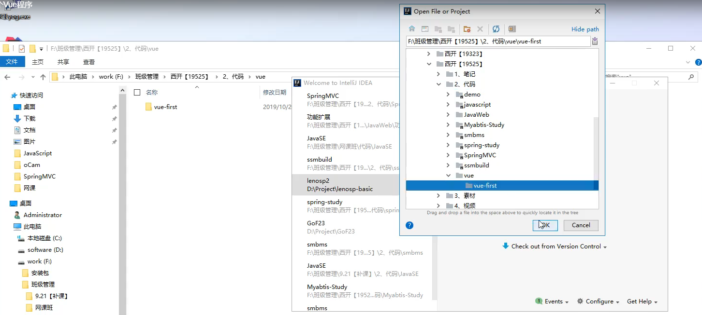
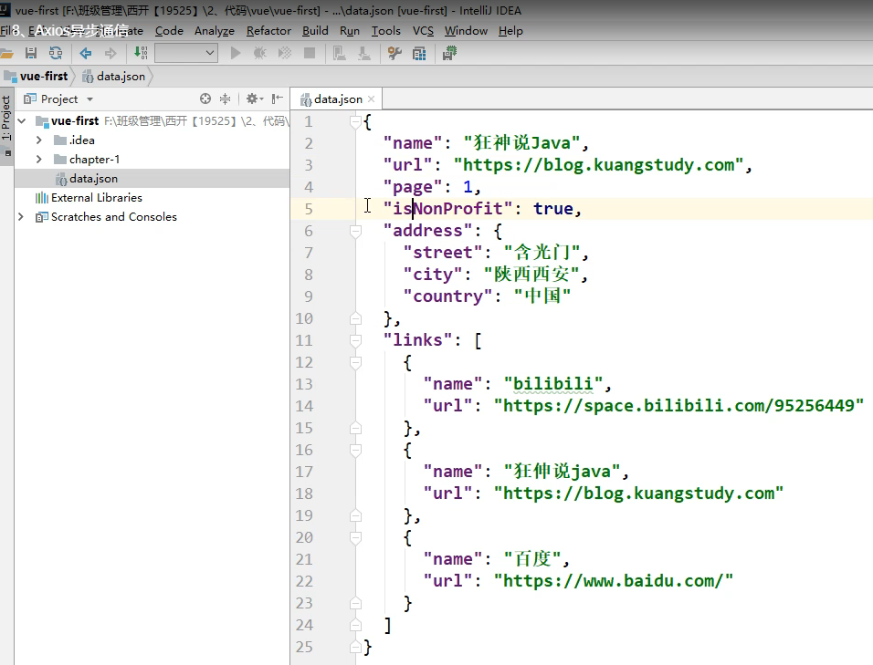
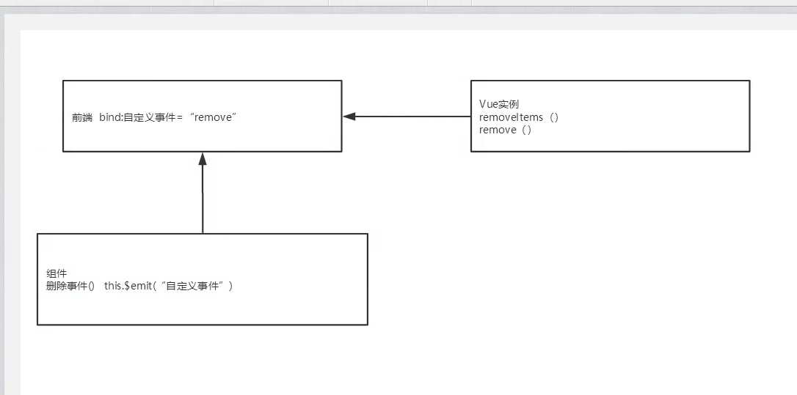
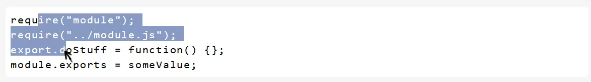
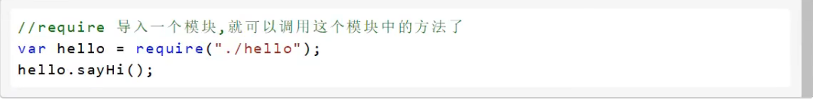
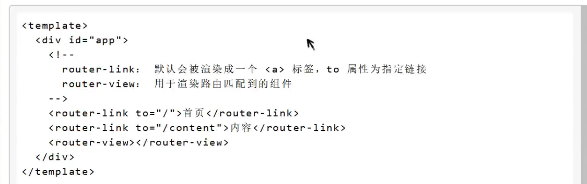
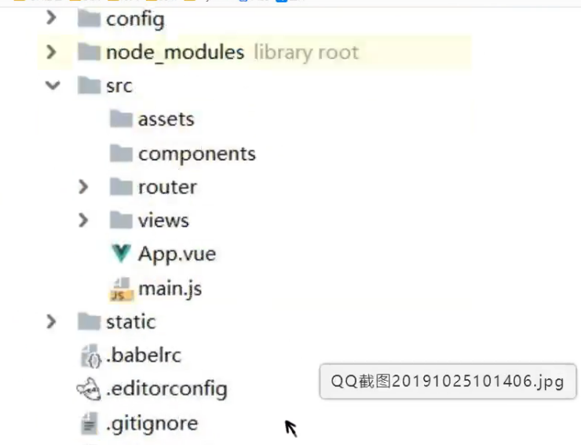

# 前端体系·前后端分离

### 概述

​	Vue(读音类似于view)是一套用于构建用户界面的**渐进式框架**，发布于2014年2月。与其他大型框架不同的是，Vue被设计为可以自底向上逐层应用。Vue的核心库只关注视图层，不仅易于上手，还便与第三方库（如：vue-router:跳转，vue-resources:通信，vue：管理）或既有项目整合。


### 前端知识体系

​	想要成为真正的“互联网Java全栈工程师”还有很撑的一段路要走，其中“前端”是绕不开的一门必修课。本阶段课程的主要母的就是带领Java后台程序猿认识前端，了解前端，掌握前端，为实现成为“互联网Java全栈工程师”再向前迈进一步。


### 前端三要素 

+ HTML(结构)：超文本标记语言（Hyper Text Markup Language）,决定网页的结构和内容
+ CSS（表现）：层叠样式表（Cascading Style Sheets）,设定网页的表现样式
+ JavaScript (行为)：是一种弱类型脚本语言，其源代码不需要经过编译，而是由浏览器解释运行，用于控制网页的行为。


### HTML(结构层)

太简单，略


### CSS(表现层)

​	CSS层叠样式表是一门标记语言，并不是编程语言，因此不可以自定义变量，不可以引用等，换句话说就是不具备任何语法支持，它主要缺陷如下：

+ 语法不够强大，比如无法嵌套书写，导致模块化开发中需要很多重复的选择器；
+ 没有变量和合理的样式复用机制，使得逻辑上相关的属性值必须以字面量的形式重复输出，导致难以维护；

​	这就导致了我们在工作中无端增加了工作量。为了解决这个问题，前端开发人员会使用一种称之为【**CSS预处理器**】的工具，提供CSS缺失的样式层复用机制、减少冗余代码，提高样式代码的可维护性。大大提高了前端在样式上的开发效率


#### 什么是CSS预处理器

​	CSS预处理器定义了一种新的语言，其基本思想是，用一种专门的编程语言，为CSS增加了一些编程的特性，将CSS作为目标生成文件，然后开发者就只要使用这种语言进行CSS的编码工作。转化成通俗移动话来说就是“**用一种专门的编程语言，进行web页面样式设计，再通过编译器转化为正常的CSS文件，以供项目使用**”。

​	常用的CSS预处理器有哪些：

+ SASS:基于Ruby,通过服务端处理，功能强大。解析效率高。需要学习Ruby语言，上手难度高于LESS
+ LESS:基于NodeJS,通过客户端处理，使用简单。功能比SASS简单,解析效率也低于SASS,但在实际开发中足够了，所以我们后台人员如果需要的话，建议使用LESS.


### JavaScript(行为层)

​	JavaScript是一门弱类型脚本语言，其源代码在发往客户端运行前不需经过编译，而是将文本格式的字符代码发送给浏览器由浏览器解释运行

​	**Native原生JS开发**

​	原生JS开发，也就是让我们按照【ECMAScript】标准的开发方式，简称是ES，特点是所有浏览器都支持，截止到当前博客发布时间。ES标准已发布如下版本：

+ ES3

+ ES4(内部，未正式发布)

+ ES5(全浏览器支持)

+ ES6(常用，当前主流版本：webpack打包成为ES5支持)

+ ES7

+ ES8

+ ES9(草案阶段)

  区别就是逐渐增加新特性。

  **TypeScript微软的标准**

  TypeScript是一种由微软开发的自由和开源的编程语言。它是JavaScript的一个超集，而且本质上向这个语言添加了可选的静态类型和基于类的面向对象编程

  该语言的特点就是除了具备ES的特性之外还纳入了许多不在范围之内的新特性，所以会导致很多浏览器不能直接支持TypeScrpit,需要编译后（编译成JS）才能被浏览器正确执行


### JavaScript框架

+ JQuery:大家熟知的JavaScript框架，优点是简化了DOM操作，缺点是DOM操作太频繁，影响前端性能；在前端眼里使用它仅仅是为了兼容IE6、7、8；

+ Angular:Google收购的前端框架，由一群Java程序员开发，其特点是将后台的MVC模式搬到了前端并增加了模块化开发的理念，与微软合作，采用TypeScript语法开发，对后台程序员友好，对前端程序员不太友好，；最大的缺点就是版本迭代不合理（如：1代--》2代，除了名字，基本就是不同的东西）

+ React:Facebook出品，一款高性能的前端框架，特点是提出了新概念【虚拟DOM】用于减少真实DOM操作，

  在内存中模拟DOM操作，有效的提升了前端渲染效率；缺点就是使用复杂，因为需要额外学习一门【JSX】语言

+ **Vue**:一款渐进式的JavaScript框架，所谓渐进式就是逐步实现新特性的意思，如实现模块化开发、路由、状态管理等新特性。其特点就是综合了Angular(模块化)和React(虚拟DOM)的优点

+ Axios:前端通信框架：因为Vue的边界很明确，就是为了处理DOM,所以并不具备通信能力，此时就需要额外使用一个通信框架与服务器交互；当然也可以直接选择使用JQuery提供的AJAX通信能力


### UI框架

+ Ant-Design:阿里巴巴出品，基于React的UI框架
+ ElementUI、iview、ice:饿了么出品，基于Vue的UI框架

+ Bootstrap:Twitter推出的一个用于前端开发的开源工具包
+ AmazeUI:又叫“妹子UI”，一款HTML5跨屏前端框架


### JavaScript构建工具

+ Babel：JS构建工具，主要用于浏览器不支持的ES新特性，比如用于编译TypeScript
+ WebPack:模块打包器，主要作用是打包、压缩、合并及按序加载

  


# MVVM模式

### 什么是MVVM


​	MVVM(Model-View-ViewModel)是一种软件架构设计模式，由微软WPF(用于替代WinForm,以前就是用这个技术开发桌面应用程序的)和Silverlight(类似于Java Applet,简单点说就是在浏览器上运行的WPF)的架构师Ken Cooper和Ted Peters开发，是一种简化用户界面的事件驱动编程方式。由John Gossman(同样也是WPF和Sliverlight的架构师)于2005年在他的博客发表。

​	MVVM源自经典的MVC（Model-View-Controller）模式。MVVM的核心是ViewModel层，负责转换Model中的数据对象来让数据变得更容易管理和使用，其作用如下：

+ 该层向上与视图层进行双向数据绑定
+ 向下与Model层通过接口请求进行数据交互


​	MVVM已经相当成熟了，主要运用但不仅仅在网络应用程序开发中。当下流行的MVVM框架由Vue.js,AngularJS等


### 为什么要使用MVVM

MVVM模式和MVC模式一样，主要母的是分离视图（View）和模型（Model）,有几大好处

+ 低耦合：视图（View）可以独立于Model变化和修改，一个ViewModel可以绑定到不同的View上，当View变化的时候Model可以不变，当Model变化的时候View也可以不变。
+ 可复用：你可以把一视图逻辑放在一个ViewModel里面，让很多View重用这段视图逻辑
+ 独立开发：开发人员可以专注于业务逻辑和数据的开发（ViewModel),设计人员可以专注于页面设计。
+ 可测试：界面素来是比较难于测试的，而现在测试可以针对ViewModel来写


### MVVM的组成部分


### View

​	View是视图层，也就是用户界面。前端主要由HTML和CSS来构建，为了更方便地展现ViewModel或者Model层的数据，已经产生了各种各样的前后端模板语言，比如FreeMaker、Thymeleaf等等，各大MVVM框架如Vue.js,AngularJS,EJS等也都有自己用来构建用户界面的内置模板语言。


### Model

​	Model是指数据模型，泛指后端进行的各种业务逻辑处理和数据操控，主要围绕数据库系统展开。这里的难点主要在于需要和前端约定统一的`接口规则`


### ViewModel

​	ViewModel是由前端开人员组织生成和维护的试图数据层。在这一层，前端开发者对从后端获取的Model数据进行转换处理，做二次封装，以生成符合View层使用预期地视图数据模型。

​	需要注意的是ViewModel所封装出来的数据模型包括视图的状态和行为两部分，而Model层的数据模型是只包含状态的

+ 比如页面的这一块展示什么，那一块展示什么这些都属于视图状态（展示）
+ 页面加载进来时发生什么，点击这一块发生什么，这一块滚动发生什么这些都属于视图行为（交互）

​	视图状态和行为都封装在ViewModel里。这样的封装使得ViewModel可以完整地去描述View层。由于实现了双向绑定，ViewModel的内容会实时展现在View层，这是激动人心的，因为前端开发者再也不必低效又麻烦地通过操作DOM去更新视图

​	MVVM框架已经把最脏最累的一块做好了，我们开发者只需要处理和维护ViewModel，更新数据视图就会自动得到相应的更新，真正实现`事件驱动编程`

​	View层展现的不是Model层的数据，而是ViewModel的数据，由ViewModel负责与Model层交互，这就**完全解耦了View层和Model层，这个解耦是至关重要的，它是前后端分离方案实施的重要一环**


#### 双向绑定

vue的数据双向绑定主要通过Object.defineProperty()方法来进行数据劫持以及发布者-订阅模式来实现的，

vue是怎么实现数据劫持的呢？vue实例话的时候会去遍历所有的属性，给这些属性添加get和set方法进行数据劫持；


以上就是mvvm实现双向绑定的思路了，那么具体怎么实现呢？

我们开头的时候说到了，要想实现数据的双向绑定首先就要通过数据拦截来进行监听数据的改变，这个时候就要设置一个监听器Observer来进行监听，如果属性发生改变的话就告诉订阅者Watcher看看是否需要改变，同时的话订阅者可以有好多个，我们就用一个订阅者管理器(Dep)来管理这些订阅者。紧接着我们还要有个指令解析器来对每个节点进行扫描和解析（解析节点的指令如v-on）,把他们初始化成一个订阅器Watcher,并且绑定相应的函数，Watcher会对比前后两个的数值是否发生变化，然后确定是否通知视图进行重新渲染；


以上的图片可以具，体归纳为：

1.实现一个监听器Observer，用来劫持并监听所有属性，如果有变动的，就通知订阅者。

2.实现一个订阅者Watcher，可以收到属性的变化通知并执行相应的函数，从而更新视图。

3.实现一个解析器Compile，可以扫描和解析每个节点的相关指令，并根据初始化模板数据以及初始化相应的订阅器。


# Vue

 	 Vue(读音类似于view)是一套用于构建用户界面的渐进式框架，发布于2014年2月，与其他大型框架不同的是，Vue被设计为可以自底向上逐层应用。Vue的核心库只关注视图层，不仅易于上手，还便于第三方库（如：vue-router,vue-resource,vuex）或既有项目整合


### MVVM模式的实现者

+ Model:模型层，在这里表示JavaScript对象
+ view:视图层，在这里表示DOM(HTML操作的元素)
+ ViewModel:连接视图和数据的中间件，Vue.js就是MVVM中的ViewModel层的实现者

在MVVM架构中，是不允许数据和视图直接通信的，只能通过ViewModel来通信，而ViewModel就是定了一个Observer观察者

+ ViewModel能够观察到数据的变化

+ ViewModel能够监听到使徒的变化，并能够通知数据发生改变

  至此，我们就明白了，Vue.js就是一个MVVM的实现者，它的核心就是实现了DOM监听与数据绑定


### 为什么要使用Vue.js

+ 轻量级，体积小是一个重要指标。Vue.js压缩后只有20多kb
+ 移动有限。更适合移动端，比如移动端的Touch事件
+ 易上手，学习曲线平稳，文档齐全
+ 吸取了Angular(模块化)和React(虚拟DOM)的长处，并拥有自己独特的功能，如：计算属性
+ 开源，社区活跃度高
+ ......


# 第一个Vue程序

【说明】IDEA可以安装Vue的插件！

注意：Vue不支持IE8及以下版本，因为Vue使用了IE8无法模拟的ECMAScript5特性。但它支持所有兼容ECMAScript 5 的浏览器

### 开发准备

1. 新建一个文件夹


2. 用IDEA open 文件夹



3. 获取vue.js


4. 创建HTML5.file


5. 编写代码


6. 测试

为了能够更直观的体验Vue带来的数据绑定功能，我们需要在浏览器测试一番，操作流程如下：

1. 在浏览器上运行第一个Vue应用程序，进入开发者模式
2. 在控制台输入vm.message = 'Hello World',然后回车，你会发现浏览器中显示的内容会直接变成Hello World

​	此时就可以在控制台直接输入vm.message来修改值，中间是可以省略data的，在这个操作中，我并没有主动操作DOM,就让页面的内容发生了变化，这就是借助了Vue的数据绑定功能实现的；MVVM模式中要求ViewModel层就是使用观察者模式来实现数据的监听与绑定，以做到数据与视图的快速响应。


# Vue基本语法

### v-bind

​	我们已经成功创建了第一个Vue应用！看起来跟渲染一个字符串模板非常类似，但是Vue在背后做了大量的工作。现在数据和DOM已经被建立了关联，所有东西都是响应式的。我们在控制台操作对象属性，界面可以实时更新！

​	我们还可以使用`v-bind`来绑定元素特性的！

代码演示：


​	你看到的v-bind等被称为指令。指令带有前缀v-，以表示它们是Vue提供的特殊特性，可能你已经猜到，它们会在渲染的DOM上应用特殊的响应式行为。在这里，该指令的意思是：“将这个元素节点的title特性和Vue实例的message属性保持一致”

​	如果你再次打开浏览器的JavaScript控制台，输入app.message = '新消息'，就会再一次看到这个绑定了title特性的HTML再次更新.


### v-if、v-else、v-for

代码演示：


# Vue事件绑定


# 双向绑定

### 什么是双向绑定

​	Vue.js是一个MVVM框架，即数据双向绑定，即当数据发生变化的时候，视图也就发生变化，当视图发生变化的时候，数据也会跟着同步变化。这也算是Vue.js的精髓之处了

​	值得注意的是，我们所说的数据双向绑定，一定是对于UI控件来说的，非UI控件不会涉及到数据双向绑定。单向数据绑定是使用状态管理工具的前提。如果我们使用`vuex`，那么数据流也是单向的，这是就会和双向数据绑定有冲突

### 为什么要实现数据的双向绑定

​	在`vue.js`，如果使用`vuex`，实际上数据还是单向的，之所以说是数据双向绑定，这是对使用的UI空间来说，对于我们处理表单，Vue.js的双向数据绑定用起来就特别舒服了。即两者并不互斥，在全局性数据流使用单向，方便追踪；局部性数据流使用双向，简单易操作。


### 在表单中使用双向数据绑定

​	你可以用`v-model`指令在表单`<input>`、`<textarea>`、`<select>`元素上创建双向数据绑定。它会根据控件类型自动选取正确的方法来更新元素。尽管有些神奇，但`v-model`本质上不过是语法糖，它负责监听用户的输入事件以更新数据，并对一些极端场景进行一些特殊处理。

> 注意：v- model会忽略所有表单元素的value,checked,selected特性的初始值而总是将Vue实例的数据作为数据来源。你应该通过JavaScript在组件的data选项中声明初始值

 

代码演示：

 


​	**注意：**如果`v-model`表达式的初始值未能匹配任何选项，<select>元素系那个被渲染为“未选中”状态。在ISO中，这会使用户无法选择第一个选项。因为这样的情况下，ios不会触发change事件。因此，更推荐像上面这样提供一个值为空的禁用选项


# Vue组件讲解

### 什么是组件

​	组件是可复用的`vue`实例，说白了就是一组可以重复使用的模板，跟JSTL的自定义标签、Thymeleaf的`th.fragment`等框架有着异曲同工之妙。通常一个应用会以一颗嵌套的组件树的形式来组织：


### 第一个Vue组件

​	注意：在实际开发中，我们并不会用以下方式开发组件，而是采用vue-cli创建.vue模板文件的方式开发，以下方法只是为了让大家理解什么是组件。

​	**使用Vue.component()方法注册组件，格式如下**


代码演示：


说明：

+ Vue.component():注册组件
+ my-component-li:自定义组件的名字
+ template:组件的模板


### 使用props属性传递参数

​	像上面那样用组件没有任何意义，所以我们是需要传递参数到组建的，测试就需要使用props属性了

​	**注意：默认规则下props属性里的值不能为大写：**


​	说明：

+ `v-for="item in items"`:遍历`Vue`实例中定义的名为`items`的数组，并创建同等数量的组件
+ `v-bind:item="item"`：将遍历的`item`项绑定到组件中`props`定义的名为`item`属性上；=号左边的item为props定义的属性名，右边的为`item in items`中遍历的item项的值


# Axios异步通信

### 什么是Axios

​	Axios是一个开源的可以用在浏览器端和`NodeJs`的异步通信框架，他主要作用就是实现AJAX异步通信，其功能特点如下：

+ 从浏览器中创建`XMLHttpRequests`
+ 从node.js创建http请求
+ 支持Promise API【JS中链式编程】
+ 拦截请求和响应
+ 转换请求数据和响应数据
+ 取消请求
+ 自动转换JSON数据
+ 客户端支持防御XSRF(跨站请求伪造)


### 为什么要使用Axios

​	由于`Vue.js`是一个视图层框架并且作者严格遵守SOC（关注度分离原则），所以`Vue.js`并不包含AJAX的通信功能，为了解决通信问题，作者单独开发了一个名为`vue-resource`的插件，不过在进入2.0版本以后停止了对该插件的维护并推荐了Axios框架。少用jQuery，因为它操作Dom太频繁


### 第一个Axios应用程序

​	咱们开发的接口大部分都是JSON格式，可以先在项目里模拟一段JSON数据，数据内容如下：创建一个名为data.json的文件并填入上面的内容，放在项目的根目录下

代码演示：




说明：

+ 在这里使用了v-bind将a:href的属性值与Vue实例中的数据进行绑定
+ 使用axios框架的get方法请求AJAX并自动将数据封装进了Vue实力的数据对象中
+ 我们在data中的数据结构必须要和AJAX响应回来的数据格式匹配


### Vue的生命周期

​	Vue实例有一个完整的生命周期，也就是从开始创建、初始化数据、编译模板、挂载DOM、渲染→更新→渲染、卸载等一系列过程，我们称这是Vue的生命周期。通俗说就是Vue实例从创建到销毁的过程，就是生命周期。

​	在Vue的整个生命周期中，它提供了一系列的事件，可以让我们在事件触发时注册JS方法，可以让我们用自己注册的JS方法控制整个大局，在这些事件响应方法中的this直接指向的是Vue的实例。


代码演示：


# 计算属性

### 什么是计算属性

​	计算属性的重点突出在`属性`两个字上（属性是名词），首先它是个`属性`其次这个属性有`计算`的能力（计算是动词），这里的`计算`就是个函数；简单点说，它就是一个能够将计算结果缓存起来的属性（将行为转化成了静态的属性），仅此而已；可以想象为缓存

代码演示：


​	说明：

+ methods:定义方法，调用方法使用currentTime1(),需要带括号
+ computed:定义计算属性，调用属性使用currentTime2,不需要带括号；this,message是为了能够让currentTime2观察到数据变化而变化
+ 如何在方法中的值发生了变化，则缓存就会刷新！可以在控制台使用`vm.message="xxx"`,改变下数据的值，再次测试观察效果！


​	结论：

​	调用方法时，每次都需要进行计算，既然有计算过程则必定产生系统开销，那如果这个结果是不经常变化的呢？此时就可以考虑将这个结果缓存起来，采用计算属性可以很方便的做到这一点，**计算属性的主要特征就是为了将不经常变化的计算结果进行缓存，以节约我们的系统开销**


# 插槽slot

### 内容分发

​	在`Vue.js`中我们使用<slot>元素作为承载分发内容的出口，作者称其为插槽，可以应用在组合组件的场景中

### 测试

​	比如准备制作一个待办事项组件（todo），该组件由待办标题（todo-title）和待办内容（todo-items）组成，但这三个组件又是相互独立的，该如何操作呢？

​	**第一步：定义一个待办事项的组件**


**第二步：我们需要让待办事项的标题和值实现动态绑定，需要留出一个插槽**

+ 将上面的代码留出一个擦超，即slot


+ 定义一个名为todo-title的待办标题组件和 todo-items的待办内容组件


+ 实例化Vue并初始化数据


+ 将这些值，通过插槽插入


说明：我们的todo-title和todo-items组件分别被分发到了todo则间的todo-title和todo-items插槽中

**代码演示**：


# 自定义事件

​	通过以上代码不难发现，数据项在Vue的实例中，但删除操作要在组件中完成，那么组件如何才可能删除Vue实例中的数据？此时就涉及到参数传递与事件分发了，Vue为我们提供过了自定义事件的功能很好的帮助我们解决了这个问题；使用this.$emit('自定义事件名'，参数)，操作过程如下：

+ 在Vue的实例中，增加了methods对象并定义了一个名为removeTodoItems的方法


+ 修改todo-items待办内容组件的代码，增加一个删除按钮，并且绑定事件


+ 修改todo-items待办内容组件的HTML代码，增加一个自定义事件，比如叫remove，可以和组件的方法绑定，然后绑定到vue的方法中


### 代码演示：


### 逻辑理解




# Vue小结

​	核心：数据驱动，组件化

​	优点：借鉴了AngulaJS的模块化开发和React的虚拟Dom,虚拟Dom就是把Dom操作放到内存中执行；

​	常用的属性：


​	组件化：


​	遵循SOC关注度分离原则，Vue是纯粹的视图框架，并不包含，比如Ajax之类的通信功能，为了解决通信问题，我们需要使用Axios框架做异步通信

### 说明

​	Vue的开发都是要基于NodeJS,实际开发采用vue-cli脚手架，vue-router路由，vuex做状态管理；Vue UI，界面我们一般使用ElementUI(饿了么出品)，或者ICE(阿里巴巴出品)来快速搭建前端项目


# 第一个vue-cli项目

### 什么是vue-cli

​	vue-cli官方提供的一个脚手架，用于快速生成一个vue的项目模板；

​	预先定义好的目录结构及基础代码，就好比咱们在创建Maven项目是可以选择创建一个骨架项目，这个骨架项目就是脚手架，我们的项目更加的快速

​	主要的功能：


### 需要的环境 


### 第一个vue-cli应用程序

1. 创建一个Vue项目，我们随便建立一个空的文件夹在电脑
2. 创建一个基于webpack模板的vue应用程序

```linux
#这里的myvue是项目名称，可以根据自己的需求起名
vue init webpack myvue
```

一路都选择no即可

​	**说明：**

+ Project name:项目名称，默认 回车 即可

+ Project description: 项目描述，默认 回车 即可
+ Author:项目作者，默认 回车 即可
+ Install vue-router:是否安装vue-router,选择n不安装（后期需要才手动添加）
+ Use ESLint to lint your code:是否应用ESLint做代码检查，选择n不安装（后期需要再手动添加）
+ Set up unit test:单元测试相关，选择n不安装（后期需要再手动添加）
+ Setup e2etests with Nightwatch:单元测试相关，选择n不安装（后期需要再手动添加）
+ Should we run npm install for you after the project has been created:创建完成后直接初始化，选择n，我们手动执行来运行结果


### 初始化并运行

```
cd myvue
npm install
npm run dev
```


**演示：**


然后执行进入myvue工程，并且执行以下命令

```
cd myvue
npm install
npm run dev
```


# Webpack学习

### 什么是Webpack

​	本质啥ngwebpack是一个现代JavaScript应用程序的静态模块打包器（module bundler）。当webpack处理应用程序时，它会递归地构建一个依赖关系图（dependency graph）,其中包含应用程序需要的每个模块，然后将所有这些模块打包成一个或多个bundle。

​	Webpack是当下最热门的前端资源模块化管理和打包工具，它可以将许多松散耦合的模块按照依赖和规则打包成符合生产环境部署的前端资源。还可以将按需加载的模块进行代码分离，等到实际需要时再异步加载。通过loader转换，任何形式的资源都可以当作模块，比如CommonsJS、AMD、ES6、CSS、JSON、CoffeeScript、LESS等

​	伴随着移动互联网的大潮，当今越来越多的网站已经从网页模式进化到了WebApp模式。他们运行在现代浏览器里，使用HTML5、CSS3、ES5等新的技术来开发丰富的功能网页已经不仅是完成浏览器的基本需求；WebApp通常是一个SPA（单页面应用），每一个视图通过异步的方式加载，这导致页面初始化和使用过程中加载越来越多的JS代码，这给前端的开发挑战和资源组织带来了巨大的挑战。

​	前端开发和其他开发工作的主要区别，首先是前端基于多语言、多层次的编码和组织工作，其次前端产品的交付是基于浏览器的，这些资源是通过增量加载的方式运行到浏览器端，如何在开发环境组织好这些碎片化的代码和资源，并且保证他们在浏览器端快速、优雅的加载和更新，就需要一个模块化系统，这个理想中的模块化系统是前端工程师多年来一直探索的难题


### 模块化的演进

#### **Script标签**

****


​	这是最原始的JavaScript文件加载方式，如果把每一个文件看作是一个模块，那么他们的接口通常是暴露再全局作用域下，也就是定义在window对象中，不同模块的调用都是一个作用域。

​	这种原始的加载方式暴露了一些显而易见的弊端

+ 全局作用域下容易造成变量冲突
+ 文件只能按照<script>的书写顺序进行加载
+ 开发人员必须主观解决模块和代码库的依赖关系
+ 在大型项目中各种资源难以管理，长期积累的问题导致代码库混乱不堪


#### CommonsJS

​	服务器端的NodeJS遵循CommonsJS规范，该规范核心思想是允许模块通过require方法来同步加载所需依赖的其它模块，然后通过exports或module.exports来导出需要暴露的接口。



优点：

+ 服务器端模块便于重用
+ NPM中已经有超过45万个可以使用的模块包
+ 简单易用

缺点：

+ 同步的模块加载方式不适合在浏览器环境中，同步意味着阻塞加载，浏览器资源是异步加载的
+ 不能非阻塞的并行加载多个模块

实现：

+ 服务端的NodeJS
+ Browserify,浏览器端的CommonsJS实现，可以使用NPM的模块，但是编译打包后的文件体积较大
+ modules-webmake,类似Browserify,但不如Browserify灵活
+ wreq,Browserify的前身


#### AMD

​	Asynchronous Module Definition规范其实主要一个主要接口define(id?,dependencies?,factory);它要在声明模块的时候指定所有的依赖dependencies,并且还要当做形参传到factory中，对于依赖的模块提前执行。


优点

+ 适合在浏览器环境中异步加载模块
+ 可以并行加载多个模块

缺点

+ 提高了开发成本，代码的阅读和书写比较困难，模块定义方式的语义不畅

+ 不符合通用的模块化思维方式，是一种妥协的实现

实现

+ RequireJS
+ curl

#### 还有很多，自己上网搜


### 安装Webpack

Webpack是一款模块加载器兼打包工具，它能把各种资源，如JS、JSX、ES6、SASS、LESS、图片等都作为模块来处理和使用

​	**安装：**


​	**测试安装成功：**

+ `webpack -v`
+ `webpack-cli -v`


### 配置

创建`webpack.cofig.js`配置文件

+ entry:入口文件，指定WebPack用哪个文件作为项目的入口
+ output:输出，指定WebPack把处理完成的文件放置到指定路径
+ module：模块，用于处理各种类型的文件
+ plugins:插件，如：热更新、代码重用等
+ resolve:设置路径指向
+ watch:监听，用于设置文件改动后直接打包


​	直接运行`webpack`命令打包


### 使用webpack

1. 创建项目，用IDEA打开


2.  创建一个名为modules的目录，用于放置JS模块等资源文件


3. 在modules下创建模块文件，如hello.js,用于编写JS模块相关代码


4. 在modules下创建一个名为main.js的入口文件，用于打包时配置entry属性



5. 在项目目录下创建webpack.config.js配置文件，使用webpack命令打包


6. 引用


# vue-router路由

### 说明

​	学习的时候，尽量的打开官方的文档

​	Vue Router是Vue.js官方的路由管理器。它和Vue.js的核心深度集成。，让构建单页面应用变得易如反掌。包含的功能有：

+ 嵌套的路由/视图表
+ 模块化的、基于组件的路由配置
+ 路由参数、查询、通配符
+ 基于Vue.js过渡系统的视图过渡效果
+ 细粒度的导航控制
+ 带有自动激活的CSS class的链接
+ HTML5历史模式或hash模式，在IE9自动降级
+ 自定义的滚动条行为

### 安装

​	基于第一个`vue-cli`进行测试学习；先查看node_modules中是存在vue-router

​	vue-router是一个插件包，所以我们还是需要用npm/cnpm来进行安装的。打开命令行工具，进入你的项目目录，输入下面的命令

```docs
npm install vue-router --save-dev
```

​	如果在一个模块化工程中使用它，必须要通过Vue.use()明确地安装路由功能：

```
import vue from 'vue'
import VueRouter from 'vue-router'

Vue.use(VueRouter);
```


### 测试

1. 先删除没有用的东西


2. `components`目录下存放我们自己编写的组件

3. 定义一个`Content.vue`的组件


4. 安装路由，在src目录下，新建一个文件夹：`router`,专门存放路由


5. 在`main.js`中配置路由


6. 在`App.vue`中使用路由





# Vue+elementUI

### 实战快速上手

​	我们采用实战教学模式并结合ElementUI组件库，将所需知识点应用到实际中，以最快速度带领大家掌握Vue的使用；


### 创建工程

​	注意：命令行都要使用管理员模式运行

1. 创建一个名为hello-vue的工程 

```linux
vue init sebpack hello-vue
```

2. 安装依赖，我们需要安装vue-outer、element-ui、sass-loader和node-sass四个插件


3. Npm命令解释

+ `npm install moduleName`:安装模块到项目目录下
+ `npm install -g moduleName`:-g的意思是将模块安装到全局，具体安装到磁盘哪个位置，要看npm config prefix的位置
+ `npm install -save moduleName`:--save的意思是将模块安装到项目目录下，并在package文件的dependencies节点写入依赖，-s为该命令的缩写
+ `npm install -save-dev moduleName`:--save-decv的意思是将模块安装到项目目录下，并在package文件的devDependencies节点写入依赖，-D为该命令的缩写


### 创建登陆页面

​	把没有用的初始化东西删掉

​	在源码目录中创建如下结构：

+ assets:用于存放资源文件
+ components:用于存放Vue功能组件
+ views:用于存放Vue视图组件
+ router:用于存放vue-router配置



**创建首页视图，在views目录下创建一个名为Main.vue的视图组件；**


创建登录页视图在views目录下创建一个名为Login.vue的视图组件，其中el-*的元素为ElementUI组件（从ElementUI拿取）；


编写router


编写main.js


编写App.vue


修改SASS版本


然后执行npm install


# 路由嵌套

​	嵌套路由又称子路由，在实际应用中，通常由多层嵌套的组件组合而成的。同样地，URL中各段动态路径也按某种结构对应嵌套的各层组件，例如


# 参数传递及重定向

看官方文档学习


