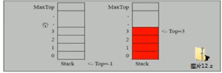
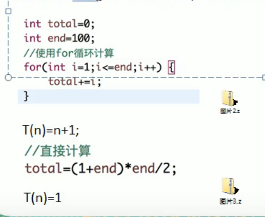
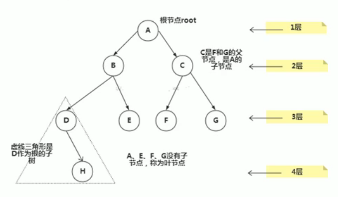
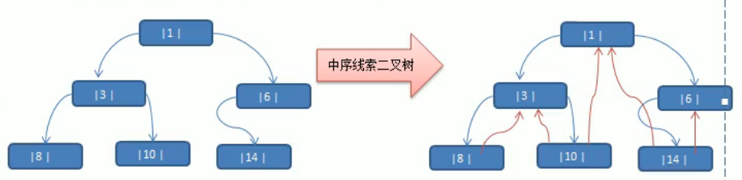
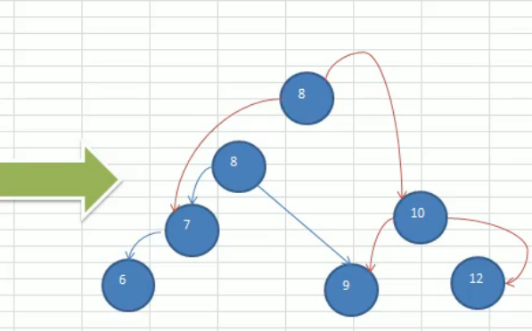

# 数据结构和算法

### 数据结构和算法的关系

1. 数据结构（data structure）是一门**研究组织数据方式**的学科,有了编程语言也就有了数据结构，学好数据结构可以编写出更加漂亮，更加有效率的代码
2. 要学习好数据结构就要多多考虑如何将生活中遇到的问题，用程序去实现解决
3. 程序 = 数据结构 + 算法
4. **数据结构是算法的基础**，简言之，想要学好算法，需要把数据结构学到位


### 编程中几个实际遇到的问题

#### 字符串替换问题


小结：需要使用到单链表的数据结构


#### 一个五子棋程序


如何判断游戏的输赢，并可以完成存盘退出和继续上局的功能

1. 棋盘	二维数组	=》（稀疏数组）=》	写入文件【存档功能】
2. 读取文件   =》  稀疏数组    =》二维数组    =》   棋盘  【接上局】


#### 约瑟夫(Josephu)问题(丢手帕问题)


小结：完成约瑟夫问题，需要使用到单项环形链表


#### 修改问题

最小生成树（加权值）【数据结构】+普利姆算法

#### 最短路径问题

图	+	弗洛伊德算法

#### 汉诺塔

分支算法

#### 八皇后问题

回溯法


### 线性结构和非线性结构

#### 线性结构

1. 线性结构作为最常用的数据结构，其特点是数据元素之间存在一对一的线性关系
2. 线性结构有两种不同的存储结构，即顺序存储机构和链式存储结构。顺序结构的线性表称为顺序表，顺序表中的存储元素是连续的
3. 链式存储的线性表称为链表，链表中存储元素不一定是连续的，元素节点中存放数据元素以及相邻元素的地址信息
4. 线性结构常见的有：数组、队列、链表、和栈


#### 非线性结构

非线性结构包括：二维数组，多维数组，广义表，树结构，图结构


### 稀疏数组的应用场景


**分析问题**

因为该二维数组的很多值是默认值0，因此记录了很多没有意义的数据-》稀疏数组


### 稀疏数组

当一个数组中大部分元素为0，或者为同一个值的数组时，可以使用稀疏数组来保证该数组。

稀疏数组的处理方法是：

1. 记录数组一共有几行几列了，有多少个不同的值
2. 把具有不同值得元素得行列及值记录在一个小规模的数组中，从而缩小程序的规模


#### 案例


#### 稀疏数组转换的思路分析


二维数组转稀疏数组的思路

1. 遍历原始的二维数组，得到有效数据的个数sum
2. 根据sum就可以创建稀疏数组sparseArr int[sum+1] [3]
3. 将二维数组的有效数组数据存入到稀疏数组

稀疏数组转原始的二维数组的思路

1. 先读取稀疏数组的第一行，根据第一行的数据，创建原始的二维数组，比如上面的chessArr2 = int [11] [11]
2. 在读取稀疏数组后几行的数据，并赋给原始的二维数组即可


#### 代码实现

sparsearray(稀疏数组)

```java
package com.wujingjun.sparsearray;

import java.io.*;

public class sparsearraysolution {

    public static void main(String[] args) throws IOException {
        //二维数组
        System.out.println("=================================");

        int[][] twodimensionalarray = new int[10][10];
        twodimensionalarray[4][6] = 2;
        twodimensionalarray[7][8] = 1;
        twodimensionalarray[2][9] = 1;
        
        for (int[] ints : twodimensionalarray) {
            for (int data : ints) {
                System.out.printf("%d\t",data);
            }
            System.out.println();
        }


        //稀疏数组
        System.out.println("=================================");

        //获取一共有多少个有效数字
        int sum = 0;
        for (int[] ints : twodimensionalarray) {
            for (int data : ints) {
                if (data!=0){
                    sum++;
                }
            }
        }
//        System.out.println(sum);
        int row = twodimensionalarray.length;
        int col = twodimensionalarray[twodimensionalarray.length-1].length;
        int[][] sparsearray = new int[sum+1][3];
        sparsearray[0][0] = row;
        sparsearray[0][1] = col;
        sparsearray[0][2] = sum;

        int count = 0;
        for (int i = 0;i<twodimensionalarray.length;i++){
            for (int j = 0;j<twodimensionalarray[i].length;j++){
                if (twodimensionalarray[i][j]!=0){
                    count++;
                    sparsearray[count][0]=i;
                    sparsearray[count][1]=j;
                    sparsearray[count][2]=twodimensionalarray[i][j];
                }
            }
        }

        for (int[] ints : sparsearray) {
            for (int data : ints) {
                System.out.printf("%d\t",data);
            }
            System.out.println();
        }


        //稀疏数组保存到文件
        System.out.println("=================================");
        File file = new File("D:\\dubbozookeeper\\dubbo-admin-master\\datasructureandalgorithm\\map.data");
        FileWriter writer = new FileWriter(file);

        for (int i = 0;i<sparsearray.length;i++){
            for (int j = 0;j<sparsearray[i].length;j++){
                writer.write(sparsearray[i][j]+"\t");
            }
            writer.write("\r\n");
        }
        writer.close();

        
        //读取文件获取稀疏数组
        System.out.println("=================================");
        BufferedReader reader = new BufferedReader(new FileReader(file));
        String line;//一行数据；
        row = 0;
        int[][] newsparsearray = new int[4][3];
        //逐行读取，并将每个数据组放入到数组中
        while ((line = reader.readLine())!=null){
            String[] temp = line.split("\t");
            for (int j = 0 ; j<temp.length;j++){
                newsparsearray[row][j] = Integer.parseInt(temp[j]);
            }
            row++;
        }
        reader.close();

        for (int[] ints : newsparsearray) {
            for (int data : ints) {
                System.out.printf("%d\t",data);
            }
            System.out.println();
        }
        
        
        //重新组成二维数组
        System.out.println("=================================");

        row = sparsearray[0][0];
        col = sparsearray[0][1];
        int[][] newtwodimensionalarray = new int[row][col];
        for (int i = 1; i < newsparsearray.length; i++) {
            for (int j = 0; j < newsparsearray[i].length; j++) {
                newtwodimensionalarray[newsparsearray[i][0]][newsparsearray[i][1]]=newsparsearray[i][j];
            }
        }

        for (int[] ints : newtwodimensionalarray) {
            for (int data : ints) {
                System.out.printf("%d\t",data);
            }
            System.out.println();
        }

    }
}
```


### 队列的应用场景和介绍

#### 应用场景

银行排队的案例


#### 介绍

+ 队列是一个有序列表，可以用**数组**或是**链表**来实现

+ 遵循先入先出的原则。及：先存入队列的数据，要先取出。后存入的要后取出

+ 加数据在后面加，取数据在前面加

+ 示意图：（使用数组模拟队列示意图）

  


### 数组模拟队列

+ 队列本身是有序列表，若使用数组的结构来存储队列的数据，则队列数组的声明如下图，其中maxSize是该队列的最大容量。
+ 因为队列的输出、输入是分别从前后端来处理，因此需要两个变量front及rear分别记录队列前后端的下表，front会随着数据的输出而改变，而rear则是随着数据输入而改变


+ 当我们将数据存入队列时成为“addQueue”,addQueue的处理需要有两个步骤：思路分析
  1. 将尾指针往后移：rear+1,当front == rear【空】
  2. 若尾指针rear小于队列的最大下标maxSize-1,则将数据存入rear所指的数组元素中，否则无法存入数据。rear == maxSize - 1【队列满】
+ 代码实现

+ 问题分析并优化


### 数组模拟队列代码实现

```java
package com.wujingjun.queue;

import java.util.Scanner;

public class ArrayQueue {

    public static void main(String[] args) {
        //测试
        ArrayQueueimpl arrayQueue = new ArrayQueueimpl(3);
        char key = ' ';//接收用户输入
        Scanner scanner = new Scanner(System.in);
        boolean loop = true;
        while (loop){
            System.out.println("s:显示队列");
            System.out.println("e:退出程序");
            System.out.println("a:添加数据");
            System.out.println("g:取出数据");
            System.out.println("p:查看头部");
            key = scanner.next().charAt(0);//接收一个字符
            switch (key){
                case 's':
                    arrayQueue.listData();
                    break;
                case 'a':
                    System.out.println("输入一个数");
                    int value = scanner.nextInt();
                    arrayQueue.addData(value);
                    break;
                case 'g':
                    try{
                        int res = arrayQueue.getData();
                        System.out.println("取出的数据是："+res);
                    }catch (Exception e){
                        System.out.println(e.getMessage());
                    }
                    break;
                case 'p':
                    try {
                        int res = arrayQueue.peakHead();
                        System.out.println("头部数据为"+res);
                    }catch (Exception e){
                        System.out.println(e.getMessage());
                    }
                    break;
                case 'e':
                    scanner.close();
                    loop=false;
                    break;
                default:
                    break;

            }
        }

        System.out.println("程序退出");

    }

}

//使用数组模拟队列-编写一个ArrayQueue类
class ArrayQueueimpl{

    private int maxSize;//表示数组的最大容量
    private int front;//队列头
    private int rear;//队列尾
    private int[] queue;//该数据用于存放数据，模拟队列

    //创建队列的构造器
    public ArrayQueueimpl(int num){
        this.maxSize = num;
        queue = new int[maxSize];
        front = -1;//指向队列头部，分析出front是指向队列头的前一个位置
        rear = -1;//指向队列尾，指向队列尾的数据（即就是队列最后一个数据）
    }

    public boolean isFull(){
        return rear == maxSize-1;
    }

    public boolean isEmpty(){
        return rear == front;
    }

    public void addData(int data){
        if (isFull()){
            System.out.println("队列已满");
            return;
        }
        rear++;
        queue[rear] = data;
    }

    public int getData(){
        if (isEmpty()){
            throw new RuntimeException("队列为空，没有数据");
        }
        front++;
        return queue[front];
    }

    public void listData(){
        if (isEmpty()){
            System.out.println("队列为空，没有数据");
        }
        for (int i = 0; i < queue.length; i++) {
            System.out.printf("queue[%d]=%d\n",i,queue[i]);
        }
    }

    public int peakHead(){
        if (isEmpty()){
            throw new RuntimeException("队列为空，没有数据");
        }
        //是查看数据，不是取出数据
        return queue[front+1];
    }

}
```

**问题**

1. 目前数组使用一次就不能使用，没有达到复用的效果
2. 将这个数组使用算法，改进成一个**环形的队列** 取模：%


### 数组模拟环形队列

​	对前面的数组模拟队列的优化，充分利用数组。因此将数组看作是一个环形的。（通过取模的方式来实现即可）


#### 图解


思路如下：

1. front变量的含义做一个调整：front就指向队列的第一个元素，也就是说arr[front]就是队列的第一个元素，front的初始值=0
2. rear变量的含义做一个调整：rear指向队列的最后一个元素的后一个位置，因为希望空出一个空间作为约定，rear的初始值=0（rear%maxsize）
3. 当队列满时，条件是（rear+1）%maxSize==front【满】
4. 队列为空的条件，rear == front空
5. 当我们这样分析，队列中有效的数据的个数[rear + maxSize - front]%maxSize
6. 我们就可以在原来的队列上修改得到，一个环形队列 


#### 分析说明

1. 尾索引的下一个为头索引时表示队列满，即将**队列容量空出一个作为约定**，这个在做判断队列满的时候需要注意（rear+1）%maxSize == front(满)
2. rear == front[空]


#### 代码演示

```java
package com.wujingjun.queue;

import java.util.Scanner;

public class CircleQueue {

    public static void main(String[] args) {
        //测试
        CircleQueueImpl arrayQueue = new CircleQueueImpl(4);
        char key = ' ';//接收用户输入
        Scanner scanner = new Scanner(System.in);
        boolean loop = true;
        while (loop){
            System.out.println("s:显示队列");
            System.out.println("e:退出程序");
            System.out.println("a:添加数据");
            System.out.println("g:取出数据");
            System.out.println("p:查看头部");
            key = scanner.next().charAt(0);//接收一个字符
            switch (key){
                case 's':
                    arrayQueue.listData();
                    break;
                case 'a':
                    System.out.println("输入一个数");
                    int value = scanner.nextInt();
                    arrayQueue.addData(value);
                    break;
                case 'g':
                    try{
                        int res = arrayQueue.getData();
                        System.out.println("取出的数据是："+res);
                    }catch (Exception e){
                        System.out.println(e.getMessage());
                    }
                    break;
                case 'p':
                    try {
                        int res = arrayQueue.peakHead();
                        System.out.println("头部数据为"+res);
                    }catch (Exception e){
                        System.out.println(e.getMessage());
                    }
                    break;
                case 'e':
                    scanner.close();
                    loop=false;
                    break;
                default:
                    break;

            }
        }

        System.out.println("程序退出");

    }
}

class CircleQueueImpl{

    private int maxSize;
    // front 变量的含义做一个调整： front 就指向队列的第一个元素, 也就是说 arr[front] 就是队列的第一个元素
    // front 的初始值 = 0
    private int front;
    // rear 变量的含义做一个调整：rear 指向队列的最后一个元素的后一个位置. 因为希望空出一个空间做为约定.
    // rear 的初始值 = 0
    private int rear;
    private int[] queue;

    public CircleQueueImpl(int arrMaxSize){
        maxSize = arrMaxSize;
        queue = new int[maxSize];
    }

    public boolean isFull(){
        return (rear+1) % maxSize == front;
    }

    public boolean isEmpty(){
        return rear == front;
    }

    public void addData(int data){
        if (isFull()){
            System.out.println("队列已满！！！");
            return;
        }
        queue[rear] = data;
        // 将 rear 后移, 这里必须考虑取模
        rear = (rear+1) % maxSize;
    }

    public int getData(){
        if (isEmpty()){
            throw new RuntimeException("队列为空！！！");
        }
        // 这里需要分析出 front是指向队列的第一个元素
        // 1. 先把 front 对应的值保留到一个临时变量
        // 2. 将 front 后移, 考虑取模
        // 3. 将临时保存的变量返回
        int value = queue[front];
        front = (front+1) % maxSize;
        return value;
    }

    public void listData(){
        if (isEmpty()){
            System.out.println("队列为空！！！");
        }
        for (int i = front; i < front+size(); i++) {
            //因为是循环队列，防止front超出数组长度
            System.out.printf("queue[%d]=%d\n",i % maxSize,queue[i%maxSize]);
        }
    }

    // 求出当前队列有效数据的个数
    public int size(){
        // rear = 2
        // front = 1
        // maxSize = 3
        return ( rear + maxSize - front ) % maxSize;
    }

    public int peakHead(){
        if (isEmpty()){
            throw new RuntimeException("队列为空，没有数据");
        }
        //是查看数据，不是取出数据
        return queue[front];
    }
}
```


### 单链表介绍和内存布局

链表是有序的链表，但是他在内存中是存储如下（实际结构）


小结

1. 链表是以节点的方式来存储，是链式存储的
2. 每个节点包含data域，next域：指向下一个节点
3. 如图：发现链表的各个节点不一定是连续存放的
4. 链表分带头节点的链表和没有头结点的链表，根据实际的需求来确定


**单链表（带头结点）逻辑结构示意图如下**


###  单链表的创建和遍历的分析实现

#### 单链表的应用实例

使用带head头的**单向链表**实现-水浒英雄排行榜管理

1. 完成对英雄人物的增删改查操作
2. 第一种方法在添加英雄时，直接添加到链表的尾部
3. 第二种方式在添加英雄时，根据排名将英雄插入到指定位置（如果有这个排名，则添加失败，并给出提示）


添加（创建）

1. 先创建一个head头节点，作用就是表示单链表的头
2. 后面我们每添加一个节点，就直接加入到链表的最后


#### 第一种方式代码实现

```java
package com.wujingjun.list;

public class SingleList {

    public static void main(String[] args) {
        SingleListImpl singleList = new SingleListImpl();
        Node node1 = new Node(1,"俊哥");
        Node node2 = new Node(2,"吴哥");
        Node node3 = new Node(3,"景哥");

        singleList.addNode(node1);
        singleList.addNode(node2);
        singleList.addNode(node3);

        singleList.listNode();
    }
}


class SingleListImpl{

    // 先初始化一个头节点, 头节点不要动, 不存放具体的数据
    private Node head = new Node(0,"");

    // 添加节点到单向链表
    // 思路，当不考虑编号顺序时
    // 1. 找到当前链表的最后节点
    // 2. 将最后这个节点的next 指向 新的节点
    public void addNode(Node next){
        Node temp = head;
        while (true){
            if (temp.next == null){
                break;
            }
            temp = temp.next;
        }
        temp.next = next;
    }

    public void listNode(){
        // 判断链表是否为空
        if (head.next == null){
            System.out.println("链表为空");
            return;
        }
        // 因为头节点，不能动，因此我们需要一个辅助变量来遍历
        Node temp = head.next;
        // 判断是否到链表最后
        while (true){
            if (temp == null){
                break;
            }
            System.out.println(temp);
            temp = temp.next;
        }
    }
}

class Node{

    public int id;
    public String name;
    public Node next;

    public Node(int id,String name){
        this.id = id;
        this.name = name;
    }

    @Override
    public String toString() {
        return "Node{" +
                "id=" + id +
                ", name='" + name + '\'' +
                '}';
    }
}
```


### 单链表按顺序插入节点1

#### 第二种方式添加节点方式

1. 首先找到新添加的节点的位置，是通过辅助变量（指针），通过遍历来搞定
2. 新的节点.next = temp.next
3. 将temp.next = 新的节点

代码演示：

```java
public void addNode(newNode nextNode){
    newNode node = head;
    boolean flag = false;
    while (true){
        // 说明temp已经在链表的最后
        if (node.next == null){
            break;
        }
        // 说明希望添加的heroNode的编号已然 存在
        if (node.next.id == nextNode.id){
            flag = true;
            break;
        }
        // 位置找到，就在temp的后面插入
        if (node.next.id > nextNode.id){
            break;
        }
        node = node.next;
    }
    // 不能添加，说明编号存在
    if (flag){
        System.out.printf("该编号 %d 已经存在，不能加入\n",nextNode.id);
    }else {
        //插入到链表中，temp的后面
        nextNode.next = node.next;
        node.next = nextNode;
    }
}
```


### 单链表按顺序插入节点2

#### 思路分析

1. 首先找到新添加的节点的位置，是通过辅助变量（指针），通过遍历来搞定
2. 新的节点.next = temp.next
3. 将temp.next = 新的节点

```java
public void addNodeByOrder(newNode node){
    //因为头节点不能动，因此我们仍然通过一个辅助指针（变量）来帮助找到添加的位置
    //因为单链表，因为我们找的temp是位于添加位置的前一个节点，否则插入不了
    newNode temp = head;
    boolean flag = false;//flag标志添加的编号是否存在，默认为false
    while(true){
        if (temp.next == null){//说明temp已经在链表的最后
            break;
        }
        if (temp.next.id > node.id){//位置找到，就在temp的后面插入
            break;
        }
        if (temp.next.id == node.id){//说明希望添加的heroNode的编号已然存在
            flag = true;//说明编号存在
            break;
        }
        temp = temp.next;//后移，遍历当前
    }
    if (flag){
        System.out.printf("该编号 %d 已经存在，不能加入\n",node.id);
    }else {
        node.next = temp.next;
        temp.next = node;
    }
}
```


### 单链表修改节点信息

代码演示：

```
public void updateNode(newNode node){
    if (head.next == null){
        System.out.println("列表为空！！！");
    }
    newNode temp = head.next;
    boolean flag = false;
    while(true){
        if (temp.id == node.id){
            break;
        }
        if (temp.id>node.id){
            flag = true;
            break;
        }
        temp = temp.next;
    }
    if (flag){
        System.out.printf("该编号 %d 在该队列无法查询\n",node.id);
    }else {
        temp.id = node.id;
        temp.name = node.name;
    }
}
```


### 单链表删除节点及小结

思路思考：

1. 我们先找到需要删除的这个节点的前一个节点temp
2. temp.next = temp.next.next
3. 被删除的节点，将不会有其它引用节点，会被垃圾回收机制回收

```java
public void delNode(int id){
    newNode temp = head;
    boolean flag = false;
    while(true){
        if (temp.next == null){
            break;
        }
        if (temp.next.id == id){
            flag = true;
            break;
        }
        temp = temp.next;
    }
    if (flag){
        temp.next = temp.next.next;
    }else {
        System.out.printf("该编号 %d 在该队列无法删除\n",id);
    }

}
```

#### 小结

+ 链表是以节点的方式来存储，是**链式存储**
+ 每个节点包含data域，next域：指向下一个节点
+ 如图：发现**链表的各个节点不一定是连续存储的**
+ 链表分**带头节点的链表和没有头节点的链表**，根据实际的需求来确定

 

### 单链表的面试题

常见的面试题有如下

1. 求单链表中有效节点的个数
2. 查找单链表中倒数第k个节点
3. 单链表的反转
4. 从尾到头打印单链表
5. 合并两个有序的单链表，合并后的链表依然有序

```java
//查找单链表中的倒数第k个节点
//1. 编写一个方法,接收head节点，同时接收一个index
//2. index表示是倒数第index个节点
//3. 先把链表从头到尾遍历，得到链表的个数
//4. 得到size后，我们从链表得第一个开始遍历（size-index）个，就可以得到
//5. 如果找到了，则返回节点，否则返回null
public static newNode getLastIndexNode(newNode head,int index){
    //判断如果链表为空，返回null
    if (head.next == null){
        return null;//没有找到
    }
    //第一个遍历得到链表的长度（节点个数）
    int size = getLength(head);
    //第二次遍历 size-index 位置，就是我们倒数得第k个节点
    //先做一个index的校验
    newNode node = head.next;
    if (index <= 0 || index>size){
        return null;
    }
    for (int i = 0;i<size-index;i++){
        node = node.next;
    }
    return node;
}
```


### 单链表链表反转

**思路：**

1. 先定义一个节点reverseHead = new HeroNode();
2. 从头到尾的遍历原来的链表，每遍历一个节点，就将其取出，并放在新的链表reverseHead的最前端
3. 原来的链表的head.next = reverseHead.next

```java
public static newNode reverseList(newNode head){
    newNode cur = head.next;
    newNode reverseHead = new newNode(0,"");
    newNode next = null;
    while (cur != null){
        next = cur.next;
        //将cur的下一个节点指向列表的最前端
        //该代码的作用就是将待插入的节点的next节点保证在反转链表中最前端
        //目的是将反转列表未插入时的最前端的节点保存在紧跟它的后面
        //第一次创建反转列表的时候什么节点都没有，事实上确实null;
        cur.next = reverseHead.next;
        reverseHead.next = cur;
        cur = next;
    }
    head.next = reverseHead.next;
    return head;
}
```


### 单链表从尾到头打印链表

**思路**

1. 上面的题的要求就是逆序打印单链表
2. 方式一：先将单链表进行反转操作，然后再遍历即可，这样做的问题是会破环原来的单链表的结构，**不建议**
3. 方式二：可以利用栈这个数据结构，将各个节点压入到栈中，然后利用展的先进后出的特点，就实现了逆序打印的效果d


**代码演示**

```java
public static void reversePrint(newNode head){
    if (head.next == null){
        System.out.println("列表为空");
        return;
    }
    newNode cur = head.next;
    Stack<newNode> stack = new Stack<>();
    while (cur != null){
        stack.add(cur);
        cur = cur.next;
    }
    while (stack.size()>0){
        System.out.println(stack.pop());
    }
}
```


### 合并两个有序的单链表，合并之后的链表依然有序

思路

1. 比较节点时，小的节点被劫取后，对应的链表需要后移，另一链表的节点不需要后移，新的头节点需要后移到新添加的节点。
2. 判断时，当遍历全部节点后，肯定会并且只有有一个节或链表剩下来，所以后面需要判断谁不为空，在新的头节点的最后一个节点补上即可。
3. 一定需要先判断两条链表是否为空，再判断单个链表是否为空。


**代码：**

```java
public static newNode twoHeadSort(newNode head1,newNode head2){
    if (head1.next == null&&head2.next == null){
        return null;
    }
    if (head1.next == null){
        return head2;
    }
    if (head2.next == null){
        return head1;
    }
    newNode cur1 = head1.next;
    newNode cur2 = head2.next;
    newNode newhead = new newNode(0,"");
    newNode temp = newhead;
    while (cur1 != null && cur2 != null){
        if (cur1.id >= cur2.id){
            temp.next = cur2;
            cur2 = cur2.next;
        }else{
            temp.next = cur1;
            cur1 = cur1.next;
        }
        temp = temp.next;
    }
    if (cur1 == null){
        temp.next = cur2;
    }
    if (cur2 == null){
        temp.next = cur1;
    }
    return newhead;
}
```


### 双向链表增删改查

单向链表的缺点分析：

1. 单向链表，擦护照的方向只能是一个方向，而双向链表可以向前或者向后查找。
2. 单向链表不能自我删除，需要靠辅助节点，而双向链表，则可以自我删除，所以前面我们单链表删除时节点，总是找到temp，temp是待删除节点的前一个节点来删除的（认真体会）
3. 示意图帮助理解删除


**分析双向链表的遍历，添加，修改，删除的操作思路**

1. 遍历和单链表一样，只是可以向前，也可以向后查找
2. 添加（默认添加到双向链表的最后）
   1. 先找到双向链表的最后这个节点
   2. temp.next = newNode
   3. newNode.pre = temp
3. 修改思路和原理的单向链表一样
4. 删除
   1. 因为是双向链表，因此，我们可以实现自我删除某个节点
   2. 直接找到要删除的这个节点，比如temp
   3. temp.pre.next = temp.next
   4. temp.next.pre = temp.pre


**代码实现** 

```java
class DoubleListImpl{

    private DoubleNode head = new DoubleNode(0,"");

    public DoubleNode getHead() {
        return head;
    }

    public void setHead(DoubleNode head) {
        this.head = head;
    }

    public void listNode(){
        if (head.after == null){
            System.out.println("队列为空！！！");
            return;
        }
        DoubleNode temp = head.after;
        while (true){
            if (temp == null){
                break;
            }
            System.out.println(temp);
            temp = temp.after;
        }
    }

    public void addNode(DoubleNode newNode){
        DoubleNode temp = head;
        boolean flag = false;
        while (true){
            if (temp.after == null){
                break;
            }
            if (temp.id == newNode.id){
                flag = true;
                break;
            }
            temp = temp.after;
        }
        if (flag){
            System.out.printf("该节点编号%d在链表已有，无法添加",newNode.id);
        }else {
            temp.after = newNode;
            newNode.before = temp;
        }
    }

    public void update(DoubleNode newNode){
        if (head.after == null){
            System.out.println("队列为空！！！");
        }
        DoubleNode temp = head.after;
        boolean flag = false;
        while (true){
            if (temp.id > newNode.id){
                flag = true;
                break;
            }
            if (temp.id == newNode.id){
                break;
            }
            temp = temp.after;
        }
        if (flag){
            System.out.printf("该编号%d在链表中无法找到，更新失败\n",newNode.id);
        }else {
            temp.name = newNode.name;
        }
    }

    public void deleteNode(int id){
        if (head.after == null){
            System.out.println("队列为空！！！");
        }
        DoubleNode temp = head.after;
        boolean flag = false;
        while (true){
            if (temp.id > id){
                flag = true;
                break;
            }
            if (temp.id == id){
                break;
            }
            temp = temp.after;
        }
        if (flag){
            System.out.printf("该编号%d在链表中无法找到，删除失败\n",id);
        }else {
            temp.before.after = temp.after;
            if (temp.after != null ){
                temp.after.before = temp.before;
            }
        }
    }
```


### 环形链表介绍和约瑟夫问题

**Josephu(约瑟夫、约瑟夫环)问题**

Josephu问题为：设编号为1，2，……  ，n的n个人围坐一圈，约定编号为k(1<=k<=n)的人从1开始报数，数到m的那个人出列，它的下一位又从1开始报数，数到m的那个人又出列，以此类推，直到所有人出列位置，由此产生一个出列编号的序列。

**提示**：用一个不带头节点的循环链表来处理Josephu问题：先构成一个有n个节点的单循环链表，然后由k节点器从1开始技术，计到m时，对应节点从链表删除，然后再从被删除节点的下一个节点又从1开始计数，直到最后一个节点从链表中删除算法结束。


#### 单向环形链表介绍


#### 示意图说明


#### 思路

构建一个单向的环形链表思路

1. 先创建第一个节点，让frist指向该节点，并形成环形
2. 后面当我们每创建一个新的节点，，就把该节点，加入到已有的环形链表中即可

遍历环形链表

1. 先让一个辅助指针（变量），指向first节点
2. 然后通过一个while循环遍历该环形链表即可 curBoy.next == first 结束


**代码演示:**

```java
package com.wujingjun.list;

public class CircleSingleList {

    public static void main(String[] args) {
        CircleSingleListImpl list = new CircleSingleListImpl();
        list.addChild(5);
        list.showChild(list.getFirst());
    }
}

class CircleSingleListImpl{

    private Child first = null;

    public Child getFirst() {
        return first;
    }

    public void setFirst(Child first) {
        this.first = first;
    }

    public void addChild(int nums){
        if (nums < 1){
            System.out.println("没有小孩！！！");
            return;
        }
        Child curChild = null;
        for (int i = 1 ;i <= nums; i++){
            if (i == 1){
                first = new Child(i);
                first.setNextChild(first);
                curChild = first;
            }else {
                Child child = new Child(i);
                curChild.setNextChild(child);
                child.setNextChild(first);
                curChild = child;
            }
        }
    }

    public void showChild(Child first){
        if (first.getNextChild() == null){
            System.out.println("链表为空");
        }
        Child curChild = first;
        while (true){
            System.out.printf("小孩的编号：%d",curChild.getId());
            if (curChild.getNextChild() == first){
                break;
            }
            curChild = curChild.getNextChild();
        }
    }
}

class Child{

    private int Id;
    private Child NextChild;

    public Child(int Id){
        this.Id = Id;
    }

    public int getId() {
        return Id;
    }

    public void setId(int id) {
        Id = id;
    }

    public Child getNextChild() {
        return NextChild;
    }

    public void setNextChild(Child nextChild) {
        NextChild = nextChild;
    }
}
```


**思路分析**

1. 需求创建一个辅助指针（变量）helper,事先应该指向环形链表的最后这个节点。

2. 小孩报数前，先让first和helper移动k-1次

3. 当这个小孩报数时，让first和helper指针同时的移动m-1次

4. 这时就可以将first指向的小孩节点出圈

   first = first.next

   helper.next = first

   原来first指向的节点就没有任何引用，就会被回收


代码演示：

```java
// 根据用户的输入，计算出小孩出圈的顺序
/**
 *
 * @param startId 从第几个小孩开始数数
 * @param countNum 数几下
 * @param nums  表示最初有多少小孩在圈中
 */
public void countChild(int startId,int countNum,int nums){
    // 先对数据进行校验
    if (first.getNextChild() == null || startId > nums || startId<1){
        System.out.println("请求数据不符合规定");
        return;
    }
    // 创建要给辅助指针,帮助完成小孩出圈
    Child helper = first;
    // 需求创建一个辅助指针(变量) helper , 事先应该指向环形链表的最后这个节点
    while (true){
        if (helper.getNextChild() == first){// 说明helper指向最后小孩节点
            break;
        }
        helper = helper.getNextChild();
    }
    // 小孩报数前，先让 first 和 helper 移动 k - 1次
    for (int i = 1;i < startId;i++){
        first = first.getNextChild();
        helper = helper.getNextChild();
    }
    // 当小孩报数时，让first 和 helper 指针同时 的移动 m - 1 次, 然后出圈
    // 这里是一个循环操作，知道圈中只有一个节点
    while (true){
        if (helper == first){
            break;
        }
        // 让 first 和 helper 指针同时 的移动 countNum - 1
        for (int i = 1;i < countNum ; i++){
            first = first.getNextChild();
            helper = helper.getNextChild();
        }
        // 这时first指向的节点，就是要出圈的小孩节点
        System.out.printf("编号%d的小孩出列\n",first.getId());
        // 这时将first指向的小孩节点出圈
        first = first.getNextChild();
        helper.setNextChild(first);
    }
    System.out.printf("最后留在圈中编号%d的小孩出列",first.getId());
}
```


### 栈的应用场景和介绍

#### 栈的一个实际需求

请输入一个表达式

计算式：[7 * 2 * 2-5+1-5*3-3]点击计算


请问：计算机底层是如何运算得到结果的？注意不是简单的把算是列出运算，因为我们看这个算式 7 * 2 * 2-5但是计算机怎么理解这个算式的【对计算机而言，它接收到的就是一个**字符串**】，我们讨论的是这个问题 ->栈


#### 栈的介绍

1. 栈的英文为（stack）
2. 栈是一个先入后出（FIFO-First in First out）的有序列表
3. 栈（stack）是限制线性表中元素的插入和删除只能在线性表的同一端进行的一种特殊线性表。允许插入和删除的一端，为变化的一端，称为栈顶（Top），另一端为固定的一端，称为栈底（Bottom）
4. 根据展的定义可知，最先放入栈中元素在栈底，最后放入的元素在栈顶，而删除元素刚好相反，最后放入的元素最先删除，最先放入的元素最后删除。

5. 出战（pop）和入栈（push）的概念


#### 栈的应用场景

1. 子程序的调用：在跳往子程序前，会先将写个指令的地址存到堆栈中，直到子程序执行完后再将地址取出，以回到原来的程序中。
2. 处理递归调用：和子程序的调用类似，只是除了存储洗一个指令的地址外，也将参数、区域变量等数据存入堆栈中。
3. 表达式的转换【中缀表达式转后缀表达式】与求值（实际解决）
4. 二叉树的遍历
5. 图形的深度优先（depth-first）搜索法


### 栈的思路分析和代码实现

**栈的快速入门**

1. 用数组模拟栈的使用，由于栈是一种有序列表，当然可以使用数组的结构来储存栈的数据内容，下面我们就用数组模拟栈的出栈，入栈等操作。
2. 实现思路分析，并画出示意图



​	（1）使用数组模拟栈

​	（2）定义一个top来表示栈顶，初始化为-1

​	（3）入栈的操作，当有数据加入到栈时，top++；stack[top] = data;

​	（4）出栈的操作，int valu = stack[top];top--,return value;


**代码实现**

```java
package com.wujingjun.stack;

import java.util.Scanner;

public class ArrayStack {

    public static void main(String[] args) {
        // 测试一下ArrayStack 是否正确
        // 先创建一个ArrayStack对象->表示栈
        ArrayStackImpl stack = new ArrayStackImpl(4);
        String key = "";
        boolean loop = true; // 控制是否退出菜单
        Scanner scanner = new Scanner(System.in);

        while (loop) {
            System.out.println("show: 表示显示栈");
            System.out.println("exit: 退出程序");
            System.out.println("push: 表示添加数据到栈(入栈)");
            System.out.println("pop: 表示从栈取出数据(出栈)");
            System.out.println();
            System.out.println("请输入你的选择");
            key = scanner.next();
            switch (key) {
                case "show":
                    stack.listStack();
                    break;
                case "push":
                    System.out.println("请输入一个数");
                    int value = scanner.nextInt();
                    stack.push(value);
                    break;
                case "pop":
                    try {
                        int res = stack.pop();
                        System.out.printf("出栈的数据是 %d\n", res);
                    } catch (Exception e) {
                        // TODO: handle exception
                        System.out.println(e.getMessage());
                    }
                    break;
                case "exit":
                    scanner.close();
                    loop = false;
                    break;
                default:
                    break;
            }
        }

        System.out.println("程序退出~~~");
    }

}

class ArrayStackImpl{

    private int maxSize;// 栈的大小
    private int[] stack;// 数组，数组模拟栈，数据就放在该数组
    private int top;// top表示栈顶，初始化为-1

    public ArrayStackImpl(int maxSize){
        this.maxSize = maxSize;
        stack = new int[this.maxSize];
        top = -1;
    }

    // 栈满
    public boolean isFull(){
        return top == maxSize - 1;
    }

    // 栈空
    public boolean isEmpty(){
        return top == -1;
    }

    // 入栈-push
    public void push(int data){
        if (isFull()){
            System.out.println("栈已经满了");
            return;
        }
        top++;
        stack[top] = data;
    }

    // 出栈-pop, 将栈顶的数据返回
    public int pop(){
        if (isEmpty()){
            throw new RuntimeException("栈为空");
        }
        int value = stack[top];
        top--;
        return value;
    }

    // 显示栈的情况[遍历栈]， 遍历时，需要从栈顶开始显示数据
    public void listStack(){
        if (isEmpty()){
            System.out.println("栈为空");
            return;
        }
        for (int i = top ; i >= 0;i--){
            System.out.printf("stack[%d] = %d\n",i,stack[i]);
        }
    }
}
```


### 栈实现综合计算器

**思路分析**

1. 通过一个index值（索引），来遍历我们的表达式
2. 如果我们发现index是一个数字，就直接入数栈
3. 如果发现扫描到一个符号，就分如下情况
   1. 如果发现当前的符号栈为空，就直接入栈
   2. 如符号栈有操作符，就进行比较，如果当前的操作符的优先级小于或者等于栈中的操作符，就需要从数栈中pop两个数，再从符号栈中一个符号，进行运算，将得到的结果，入数栈，然后 将当前的操作符的优先级大于栈中的操作符，就直接入符号栈
4. 当表达式扫描完毕，就顺序的从数栈和符号栈中pop出相应的数和符号，并运行。
5. 最后在数栈只有一个数字，就是表达式的结果


**代码实现**

```java
package com.wujingjun.stack;

public class Calculator {

    public static void main(String[] args) {
        String expression = "3+780*6-2";
        // 创建两个栈，一个数栈，一个符号栈
        ArrayStackImpl numStack = new ArrayStackImpl(10);
        ArrayStackImpl operStack = new ArrayStackImpl(10);
        // 定义需要的相关变量
        int index = 0;// 用于扫描
        int num1 = 0;
        int num2 = 0;
        int oper = 0;
        int res = 0;
        char ch = ' ';//将每次扫描得到的char保存到ch
        String keepnum = "";// 用于拼接 多位数
        // 开始while循环的扫描expression
        while (true){
            //依次得到expression的每一个字符
            ch = expression.substring(index,index+1).charAt(0);
            // 判断ch是什么，然后做相应的处理
            if (operStack.isOper(ch)){
                // 判断当前的符号栈是否为空
                if (!operStack.isEmpty()){
                    // 如果符号栈有操作符，就进行比较,如果当前的操作符的优先级小于或者等于栈中的操作符,就需要从数栈中pop出两个数,
                    // 在从符号栈中pop出一个符号，进行运算，将得到结果，入数栈，然后将当前的操作符入符号栈
                    if (operStack.priority(ch) <= operStack.priority(operStack.peek())){
                        num1 = numStack.pop();
                        num2 = numStack.pop();
                        oper = operStack.pop();
                        res = numStack.cal(num1,num2,oper);
                        // 把运算的结果如数栈
                        numStack.push(res);
                        // 然后将当前的操作符入符号栈
                        operStack.push(ch);
                    }else {
                        // 如果当前的操作符的优先级大于栈中的操作符， 就直接入符号栈.
                        operStack.push(ch);
                    }
                }else {
                    // 如果为空直接入符号栈..
                    operStack.push(ch);
                }
            }else {
                // numStack.push(ch - 48); //? "1+3" '1' => 1
                // 分析思路
                // 1. 当处理多位数时，不能发现是一个数就立即入栈，因为他可能是多位数
                // 2. 在处理数，需要向expression的表达式的index 后再看一位,如果是数就进行扫描，如果是符号才入栈
                // 3. 因此我们需要定义一个变量 字符串，用于拼接
                // 处理多位数
                keepnum += ch;
                if (index == expression.length()-1){
                    numStack.push(Integer.parseInt(keepnum));
                }else {
                    // 判断下一个字符是不是数字，如果是数字，就继续扫描，如果是运算符，则入栈
                    // 注意是看后一位，不是index++
                    if (operStack.isOper(expression.substring(index+1,index+2).charAt(0))){
                        // 如果后一位是运算符，则入栈 keepNum = "1" 或者 "123"
                        numStack.push(Integer.parseInt(keepnum));
                        // 重要的!!!!!!, keepNum清空
                        keepnum = "";
                    }
                }
            }
            // 让index + 1, 并判断是否扫描到expression最后.
            index++;
            if (index >= expression.length()){
                break;
            }
        }
        // 当表达式扫描完毕，就顺序的从 数栈和符号栈中pop出相应的数和符号，并运行.
        while (true){
            // 如果符号栈为空，则计算到最后的结果, 数栈中只有一个数字【结果】
            if (operStack.isEmpty()){
                break;
            }
            num1 = numStack.pop();
            num2 = numStack.pop();
            oper = operStack.pop();
            res = numStack.cal(num1,num2,oper);
            numStack.push(res);
        }
        // 将数栈的最后数，pop出，就是结果
        System.out.println("结果为："+numStack.pop());
    }
}

class ArrayStackImpl{

    private int maxSize;// 栈的大小
    private int[] stack;// 数组，数组模拟栈，数据就放在该数组
    private int top;// top表示栈顶，初始化为-1

    public ArrayStackImpl(int maxSize){
        this.maxSize = maxSize;
        stack = new int[this.maxSize];
        top = -1;
    }

    // 栈满
    public boolean isFull(){
        return top == maxSize - 1;
    }

    // 栈空
    public boolean isEmpty(){
        return top == -1;
    }

    // 入栈-push
    public void push(int data){
        if (isFull()){
            System.out.println("栈已经满了");
            return;
        }
        top++;
        stack[top] = data;
    }

    // 出栈-pop, 将栈顶的数据返回
    public int pop(){
        if (isEmpty()){
            throw new RuntimeException("栈为空");
        }
        int value = stack[top];
        top--;
        return value;
    }

    public int peek(){
        if (isEmpty()){
            throw new RuntimeException("栈为空");
        }
        return stack[top];
    }

    // 显示栈的情况[遍历栈]， 遍历时，需要从栈顶开始显示数据
    public void listStack(){
        if (isEmpty()){
            System.out.println("栈为空");
            return;
        }
        for (int i = top ; i >= 0;i--){
            System.out.printf("stack[%d] = %d\n",i,stack[i]);
        }
    }

    //返回运算服务的优先级，优先级是程序员来确定的，优先级使用数字来表示
    //数字越大，则优先级就越高
    public int priority(int oper){
        if (oper == '*' || oper == '/'){
            return 1;
        } else if (oper == '+'||oper == '-'){
            return 0;
        } else {
            return -1;// 假定目前的表达式只有+，-，*，/
        }
    }

    public boolean isOper(char val){
        return val == '+'||val == '-'||val == '*'||val == '/';
    }

    public int cal(int num1,int num2,int oper){
        int res = 0;
        switch (oper){
            case '+':
                res = num2 + num1;
                break;
            case '-':
                res = num2 - num1;
                break;
            case '*':
                res = num2 * num1;
                break;
            case '/':
                res = num2 / num1;
                break;
            default:
                break;
        }
        return res;
    }
```


### 前缀、中缀、后缀表达式（逆波兰表达式）

#### 前缀表达式（波兰表达式）

1. 前缀表达式又称波兰表达式，前缀表达式地运算符位于操作数之前
2. 举例说明：（3+4）X5-6对应的前缀表达式就是-x+3 4 5 6

**前缀表达式的计算机求值**

从左到右扫描表达式，遇到数字时，将数字压入堆栈，遇到运算符时，弹出栈顶的两个数，用运算符对它们做相应的运算（栈顶元素 和 次顶元素），并将结果入栈；重复上述过程直到表达式最左端，最后运算得出的值即为表达式的结果

例如：（3+4）x5-6对应的前缀表达式就是 - X + 3 4 5 6,针对前缀表达式求值步骤如下：

1. 从右至左扫描，将6、5、4、3压入堆栈
2. 遇到+运算符，因此弹出3和4（3为栈顶元素，4为次顶元素），计算出3+4的值，得7，再将7入栈
3. 接下来是X运算符，因此弹出7和5，计算出7x5=35,将35入栈
4. 最后是-运算符，就hi算出35-6的值，即29由此得出最终结果。

#### 中缀表达式

中缀表达式就是常见的运算表达式，如（3+4）x 5 - 6

中缀表达式的求值是我们人最熟悉的，但是对计算机来说却不好操作（前面我们讲的案例就能看的这个问题），因此，在计算结果时，往往会将中缀表达式转成其它表达式来操作（一般转成后缀表达式）

#### 后缀表达式

后缀表达式又称逆波兰表达式，与前缀表达式相似，只是运算符位于操作数之后

举例说明：（3+4）X5-6对应的后缀表达式就i是34+5X6-

再比如


**后缀表达式的计算机求值**

从左到右扫描表达式，遇到数字时，将数字压入堆栈，遇到运算符时，弹出栈顶的两个数，用运算符对它们做相应的计算（次顶元素和栈顶元素），并将结果入栈；重复上述过程直到表达式最右端，最后运算得出的值即为表达式的结果

例如：（3+4）x5-6对应的后缀表达式就是34+5X6-，针对后缀表达式求值步骤如下：

1. 从左到右扫描，将3和4压入堆栈
2. 遇到+运算符，因此弹出4和3（4为栈顶元素，3为次顶元素），计算出3+4的值，得7，再将7入栈
3. 将5入栈
4. 接下来是x运算符，因此弹出5和7，计算出7X5=35，将35入栈
5. 将6入栈
6. 最后是-运算符，计算出35-6的值，即29，由此得出最终结果。


**代码实现**

```java
package com.wujingjun.stack;

import java.util.ArrayList;
import java.util.List;
import java.util.Stack;

public class PolandNotation {

    public static void main(String[] args) {
        //先定义给逆波兰表达式
        //（3+4）X5-6
        //说明为了方便，逆波兰表达式的数字和符号使用空格隔开
        String suffixexpression = "3 4 + 5 * 6 -";
        List<String> rpnList = getListString(suffixexpression);
        System.out.println("rpnList="+rpnList);
        System.out.println("answer="+calculate(rpnList));
    }

    //将一个逆波兰表达式，依次将数据和运算符放入到ArrayList中
    public static List<String> getListString(String suffixexpression){
        //将suffixExpression
        String[] split = suffixexpression.split(" ");
        List<String> list = new ArrayList<>();
        for (String ele : split) {
            list.add(ele);
        }
        return list;
    }

    public static int calculate(List<String> ls){
        Stack<String> stack = new Stack<>();
        for (String ele : ls) {
            if (ele.matches("\\d+")){//匹配的是多位数
                stack.push(ele);
            }else {
                //pop出两个数，并运算，再入栈
                int num2 = Integer.parseInt(stack.pop());
                int num1 = Integer.parseInt(stack.pop());
                int res = 0;
                if (ele.equals("+")){
                    res = num1 + num2;
                }else if (ele.equals("-")){
                    res = num1 - num2;
                }else if (ele.equals("*")){
                    res = num1 * num2;
                }else if (ele.equals("/")){
                    res = num1 / num2;
                }else{
                    throw new RuntimeException("目前没有该符号的运算");
                }
                //把res入栈
                stack.push("" + res);
            }
        }
        //最后留在stack中的数据是运算结果
        return Integer.parseInt(stack.pop());
    }

}
```


### 中缀表达式转换为后缀表达式

大家看到，后缀表达式适合计算式进行运算，但是人却不太容易写出来，尤其是表达式很长的情况下，因此在开发中，我们需要将中缀表达式转成后缀表达式。

**具体步骤如下**

1. 初始化两个栈：运算符栈s1和存储中间结果的栈s2
2. 从左至右扫描中缀表达式
3. 遇到操作数时，将其压s2
4. 遇到运算符时，比较其与s1栈顶运算符的优先级
   1. 如果s1为空，或栈顶运算符为左括号“（”,则直接将此运算符入栈；
   2. 否则，若优先级比栈顶运算符的高，也将运算符压入s1
   3. 否则，将s1栈顶的运算符弹出并压入到s2中，再次转到（4-1）与s1中新的栈顶运算符相比较
5. 遇到括号时：
   1. 如果是左括号“（”，则直接压入s1
   2. 如果是右括号“）”，则依次弹出s1栈顶的运算符，并压入s2,直到遇到左括号为止，此时将这一对括号丢弃
6. 重复步骤2至5，直到表达式的最右边
7. 将s1中剩余的运算符依次弹出并压入s2
8. 依次弹出s2中的元素并输出，**结果的逆序即为中缀表达式对应的后缀表达式**


**代码演示**

```java
package com.wujingjun.stack;

import java.sql.Statement;
import java.util.ArrayList;
import java.util.List;
import java.util.Stack;

public class PolandNotation {

    public static void main(String[] args) {
        //先定义给逆波兰表达式
        //（3+4）X5-6
        //说明为了方便，逆波兰表达式的数字和符号使用空格隔开
        String suffixexpression = "3 4 + 5 * 6 -";
        List<String> rpnList = getListString(suffixexpression);
        System.out.println("rpnList="+rpnList);
        System.out.println("answer="+calculate(rpnList));

        String s = "1+((2+3)*4)-5";
        List<String> list = toInfixExpressionList(s);
        System.out.println(list);

        System.out.println("=======================================");
        System.out.println(parseSuffixExpressionList(list));


        System.out.println("=======================================");
        System.out.println(calculate(parseSuffixExpressionList(list)));
    }

    //将一个逆波兰表达式，依次将数据和运算符放入到ArrayList中
    public static List<String> getListString(String suffixexpression){
        //将suffixExpression
        String[] split = suffixexpression.split(" ");
        List<String> list = new ArrayList<>();
        for (String ele : split) {
            list.add(ele);
        }
        return list;
    }

    public static int calculate(List<String> ls){
        Stack<String> stack = new Stack<>();
        for (String ele : ls) {
            if (ele.matches("\\d+")){//匹配的是多位数
                stack.push(ele);
            }else {
                //pop出两个数，并运算，再入栈
                int num2 = Integer.parseInt(stack.pop());
                int num1 = Integer.parseInt(stack.pop());
                int res = 0;
                if (ele.equals("+")){
                    res = num1 + num2;
                }else if (ele.equals("-")){
                    res = num1 - num2;
                }else if (ele.equals("*")){
                    res = num1 * num2;
                }else if (ele.equals("/")){
                    res = num1 / num2;
                }else{
                    throw new RuntimeException("目前没有该符号的运算");
                }
                //把res入栈
                stack.push("" + res);
            }
        }
        //最后留在stack中的数据是运算结果
        return Integer.parseInt(stack.pop());
    }

    //将中缀表达式转成对应的list
    // s = "1+((2+3)x4)-5"
    public static List<String> toInfixExpressionList(String s){
        //定义一个List,存放中缀表达式对应的内容
        ArrayList<String> list = new ArrayList<>();
        //这是一个指针，用于遍历中缀表达式字符串
        int index = 0;
        String str;//对多位数进行拼接
        char c;
        do {
            //如果c是一个非数字，需要加入到list
            if ((c = s.charAt(index)) < 48 || (c = s.charAt(index)) > 57){
                list.add(""+c);
                index++;
            }else {
                //如果是一个数，需要考虑多位数
                str = "";
                while (index < s.length() && (c = s.charAt(index))>48 && ((c = s.charAt(index))<57)){
                    str = str + c;//拼接
                    index++;
                }
                list.add(str);
            }
        }while (index<s.length());
        return list;
    }

    //将得到的中缀表达式转化成后缀表达式
    public static List<String> parseSuffixExpressionList(List<String> list){
        Stack<String> stack = new Stack<>();
        // 说明：因为tempList 这个栈，在整个转换过程中，没有pop操作，而且后面我们还需要逆序输出
        // 因此比较麻烦，这里我们就不用 Stack<String> 直接使用 List<String> tempList
        // Stack<String> tempStack = new Stack<String>(); // 储存中间结果的栈tempStack
        ArrayList<String> list1 = new ArrayList<>();// 储存中间结果的tempList
        for (String ele : list) {
            // 如果是一个数，加入tempList
            if (ele.matches("\\d+")){
                list1.add(ele);
            } else if (ele.equals("(")){// 如果是 ( ，则直接入operStack
                stack.push(ele);
            } else if (ele.equals(")")){// 如果是 ) ，则将括号内的值算出，并压入 tempList）
                // 如果是右括号“)”，则依次弹出operStack栈顶的运算符，并压入tempList，直到遇到左括号为止，此时将这一对括号丢弃
                while (!stack.peek().equals("(")){
                    list1.add(stack.pop());
                }
                stack.pop();// !!! 将 ( 弹出 s1栈， 消除小括号
            } else {
                // 当item的优先级小于等于operStack栈顶运算符,
                // 将operStack栈顶的运算符弹出并加入到tempList中，再次转到(4.1)与operStack中新的栈顶运算符相比较
                // 问题：我们缺少一个比较优先级高低的方法
                while (stack.size() != 0 && Operation.getValue(stack.peek()) >= Operation.getValue(ele) ){
                    list1.add(stack.pop());
                }
                // 还需要将item压入栈
                stack.push(ele);
            }
        }

        // 将operStack中剩余的运算符依次弹出并加入tempList
        while (stack.size()!=0){
            list1.add(stack.pop());
        }

        // 注意因为是存放到List, 因此按顺序输出就是对应的后缀表达式对应的List
        return list1;
    }

}

class Operation{

    private static int ADD = 1;
    private static int DEL = 1;
    private static int MUL = 2;
    private static int DIV = 2;

    public static int getValue(String operation){
        int res = 0;
        switch (operation){
            case "+":
                res = ADD;
                break;
            case "-":
                res = DEL;
                break;
            case "*":
                res = MUL;
                break;
            case "/":
                res = DIV;
                break;
            default:
//                System.out.println("不存在该符号");
                break;
        }
        return res;
    }
}
```


### 递归的概念

简单的说：递归就是方法自己调用自己，每次调用时传入不同的变量，递归有助于编程者解决复杂的问题，同时也可以让代码变得简洁

**递归调用机制**

1. 打印问题
2. 阶乘问题


递归调用规则

1. 当程序执行到一个方法时，就会开辟一个独立的空间（栈）
2. 每个空间的数据（局部变量），是独立的。


**代码演示**

```java
package com.wujingjun.recursion;

public class RecursionTest {

    public static void main(String[] args) {
        //通过打印问题，回顾递归调用机制
//        test(6);
        int res = factorial(4);
        System.out.println(res);
    }

    //打印问题
    public static void test(int n){
        if (n >2){
            test(n-1);
        }
        System.out.println("n="+n);
    }

    //阶乘问题
    public static int factorial(int n){
        if (n==1){
            return 1;
        }else {
            //factorial(3)*4 => factorial(2)*3*4=> factorial(1)*2*3*4 => 1*2*3*4
            return factorial(n-1)*n;
        }
    }
}
```


### 递归能解决的问题和规则

**递归能解决什么样的问题**

1. 各种数学问题如：8皇后问题，汉诺塔，阶乘问题，迷宫问题，球和篮子的问题（google编程大赛）
2. 各种算法中也会使用到递归，比如快排，归并排序，二分查找，分治算法等
3. 将用栈解决的问题-》递归代码比较简洁

**递归需要遵守的重要规则**

1. 执行一个方法时，就创建一个新的受保护的独立空间（栈空间）
2. 方法的局部变量是独立的，不会相互影响，比如n变量
3. 如果方法中使用的是引用类型的变量（比如数组），就会共享该引用类型的数据
4. 递归必须向退出递归的条件逼近，否则就是无限递归
5. 当一个方法执行完毕，或者遇到return，就会返回，遵守谁调用，就将结果返回给谁，同时当方法执行完毕或者返回时，该方法也就执行完毕。


### 递归-迷宫问题


迷宫问题说明：

1. 小球得到的路径，和程序员设置的招录策略有关即：找路的**上下左右**的顺序相关

2. 再得到小球路径时，可以先使用（下右上左），再改成（上右下左），看看路径是不是有变化
3. 测试回溯现象
4. 思考：如何求出最短路径？


**代码演示**：

```java
package com.wujingjun.recursion;

public class MiGong {

    public static void main(String[] args) {
        int[][] gong = new int[8][7];
        for (int i = 0; i < 8;i++){
            gong[i][0] = 1;
            gong[i][6] = 1;
        }
        for (int j = 0; j < 7;j++){
            gong[0][j] = 1;
            gong[7][j] = 1;
        }
        gong[3][1] = 1;
        gong[3][2] = 1;
//        gong[1][2] = 1;
//        gong[2][2] = 1;
        for (int i = 0;i < 8;i++){
            for (int j = 0;j < 7;j++){
                System.out.print(gong[i][j]+" ");
            }
            System.out.println();
        }

        setWay(gong,1,1);
        System.out.println("==========================");
        for (int i = 0;i < 8;i++){
            for (int j = 0;j < 7;j++){
                System.out.print(gong[i][j]+" ");
            }
            System.out.println();
        }

    }

    // 使用递归回溯来给小球找路
    // 说明
    // 1. map 表示地图
    // 2. i,j 表示从地图的哪个位置开始出发 (1,1)
    // 3. 如果小球能到 map[6][5] 位置，则说明通路找到.
    // 4. 约定： 当map[i][j] 为 0 表示该点没有走过 当为 1 表示墙 ； 2 表示通路可以走 ； 3 表示该点已经走过，但是走不通
    // 5. 在走迷宫时，需要确定一个策略(方法) 下->右->上->左 , 如果该点走不通，再回溯
    /**
     * 使用递归回溯来给小球找路
     * @param gong 表示地图
     * @param i 表示从地图的哪个位置开始出发gong(i,j)
     * @param j
     * @return  如果找到通路，就返回true,否则返回false
     */
    public static boolean setWay(int[][] gong,int i, int j){
        if (gong[6][5] == 2){//通路已经找到OK
            return true;
        }else {
            if (gong[i][j] == 0) {//如果当前这个点还没有走过
                //按照策略 右->下->左->上
                gong[i][j] = 2;
                if (setWay(gong, i, j + 1)) {//向右走
                    return true;
                } else if (setWay(gong, i + 1, j)) {//向下走
                    return true;
                } else if (setWay(gong, i, j - 1)) {//向左走
                    return true;
                } else if (setWay(gong, i - 1, j)) {//向上走
                    return true;
                } else {
                    //说明这个点走不通，是死路
                    gong[i][j] = 3;
                    return false;
                }
            } else {//如果gong[i][j]！=0，可能是1，2，3
                return false;
            }
        }
    }
}
```


### 递归-八皇后问题（回溯算法）

八皇后问题介绍


八皇后问题，是一个古老而著名的问题，是回溯算法的典型案例。该问题是国际西洋棋手马克斯.贝瑟尔于1848年提出：在8x8格的国际象棋摆放八个皇后，使其不能互相攻击，即：任意两个皇后都不能处于同一行、同一列或同意斜线上，问有多少种摆法。

**八皇后问题算法思路分析**

1. 第一个皇后先放第一行第一列
2. 第二个皇后放在第二行第一列、然后判断是否OK【即判断是否冲突】，如果不OK，继续放在第二列、第三列、一次把所有列都放完，找到一个合适
3. 继续第三个皇后，还是第一列、第二列......直到第8个皇后也能放在一个不冲突的位置，算是找到了一个正确解
4. 当得到一个正确解时，在栈回退到上一个栈时，就会开始回溯，即将第一个皇后，放到第一列的所有正确解，全部得到
5. 然后回头继续第一个皇后放第二列，后面继续循环执行1，2，3，4的步骤

说明：理论上一概创建一个二维数组来表示棋盘，但是实际上可以通过算法，用一个一维数组即可解决问题。arr[8]={1,4,7,5,2,6,1,3}//对应arr下表表示第几行，即第几个皇后，arr[i]=val,val表示第i+1个皇后，放在第i+1行的第val+1列。


**代码演示**

```java
package com.wujingjun.recursion;

public class Queen8 {

    //定义一个max表示共有多少个皇后
    private int max = 8;

    //定义数组array，保存皇后放置位置的结果
    private int[] arr = new int[max];

    static int count = 0;
    static int judgeCount = 0;

    public static void main(String[] args) {
        Queen8 queen8 = new Queen8();
        queen8.operation(0);
        System.out.printf("一共有%d种解法",count);
        System.out.println();
        System.out.printf("一共判断%d次",judgeCount);
    }

    //编写一个方式，放置第n个皇后
    //特别注意：operation是每一次递归时，进入到operation种都有for(i = 0;i < max;i++),因此有回溯
    private void operation(int n){
        if (n == max){//n=8，其实8个皇后就已经放好，因为索引从0开始
            print();
            return;
        }
        //依次放入皇后，并判断是否冲突
        for (int i = 0;i < max ; i++){
            //先把当前这个皇后 n，放到该行的第1列
            arr[n] = i;
            //判断当放置第n个皇后到i列时，是否冲突
            if (judge(n)){//不冲突
                //接着放n+1个皇后，即开始递归
                //每进行依次方法，就是在栈中的再创建新的栈帧，并且优先于以前的栈帧
                operation(n+1);
            }
            //如果冲突，就继续执行array[n] = i;即将第n个皇后，放置在本行的后移的一个位置
        }
    }

    //查看当我们放置第n皇后后，就去检测该皇后的位置是否和已经摆的皇后冲突
    /**
     *
     * @param n 表示第n个皇后
     * @return
     */
    private boolean judge(int n){
        judgeCount++;
        for (int i = 0;i < n; i++){
            // 说明
            // 1. array[i] == array[n] 表示判断 第n个皇后是否和前面的n-1个皇后在同一列
            // 2. Math.abs(n-i) == Math.abs(array[n] - array[i]) 表示判断第n个皇后是否和第i皇后是否在同一斜线
            // n = 1 放置第 2列 1 n = 1 array[1] = 1
            // Math.abs(1-0) == 1 Math.abs(array[n] - array[i]) = Math.abs(1-0) = 1
            // 3. 判断是否在同一行, 没有必要，n 每次都在递增
            if (arr[n] == arr[i] || Math.abs(n-i) == Math.abs(arr[n]-arr[i])){
                return false;
            }
        }
        return true;
    }


    // 写一个方法，可以将皇后摆放的位置输出
    private void print(){
        count++;
        for (int i = 0;i < max ;i++){
            System.out.print(arr[i]+" ");
        }
        System.out.println();
    }
}
```


#### 总结

- **还是和走迷宫一样，当前摆法行不行，需要摆完第八个皇后我才能知道**
- 上面的解法其实是枚举
  - 第一个皇后摆在第一行第一列，然后开始试探，第二个皇后摆在哪里，才不会和第一个皇后冲突，第三个皇后摆在哪里，才不会和前面的皇后冲突。
  - 如果遇到冲突，则把当前正在放置的皇后往后挪一格，如果 8 列都不行，那么就回溯至上一级皇后，让它试着挪一挪
  - 这种情况想象以下树图的形式便很清晰。


### 排序算法的介绍

排序也称排序算法（sort Algorithm），排序是将一组数据，依指定的顺序进行排列的过程。

排序的分类

1. 内部排序：指将需要处理的所有数据都加载到内部存储器中进行排序。
2. 外部排序法：数据量过大，无法全部加载内存中，需要借助外部存储进行排序。
3. 常见的排序算法分类


#### 度量一个程序执行时间的两种方法

1. 事后统计的方法

   这种方法可行，但是有两个问题：一是要想对设计的算法的运行性能进行评测，需要实际运行该程序；二是所得时间的统计量依赖于计算机的硬件、软件等环境因素，这种方式，要在同一台计算机的相同状态下运行，才能比较哪个算法速度更快。

2. 事前估算的方法

   通过分析摸一个算法的时间复杂度来判断哪个算法更优。


### 时间频度介绍及其特点

#### **时间频度**

基本介绍：

**时间频度**：一个算法花费的时间与算法中语句的执行次数成正比例，哪个算法中语句执行次数多，它花费时间就多。一个算法中的语句执行次数称为语句频度或时间频度。记为T(n)

**举例说明-基本案例**

比如计算1-100所有数字之和，我们设计两种算法



**举例说明-忽略常数项**


**举例说明-忽略系数**


### 时间复杂度计算和举例说明

**时间复杂度**

1. 一般情况下，算法中的基本操作语句的重复执行次数是问题规模n的某个函数，用T(n)表示，若有某个辅助函数f(n)，使得当n趋近于无穷大时，T(n)/f(n）的极限值为不等于零的常数，则称f(n)是T(n)的同数量级函数)。记作T(n)=O(f(n))，称O(f(n))为算法的渐进时间复杂度，简称时间复杂度。
2. T(n)不同，但时间复杂度可能相同。如T(n)=n^2^+7n+6与T(n)=3n^2^+2n+2它们的T(n)不同，但时间复杂度相同，都为O(n^2^)。
3. 计算时间复杂度的方法：
   + 用常数1代替运行时间中的所有加法常数=>T(n)=3n^2^+2n+1
   + 修改后的运行次数函数中，只保留最高阶项=>T(n)=3n^2^
   + 去除最高阶项的系数=>T(n)=n^2^=>O(n^2^)


**常见的时间复杂度**


1. 常数阶O(1)
2. 对数阶O(log~2~n)
3. 线性阶O(n)
4. 线性对数阶O(nlog~2~n)
5. 平方阶O(n^2^)
6. 立方阶O(n^3^)
7. K次方阶O(n^K^)
8. 指数阶O(2^n^)

**说明：**

+ 常见的算法时间复杂度由小到大依次为：O(1) < O(log~2~n) < O(n) < O(nlog~2~n) < O(n^2^) < O(n^3^) < O(n^K^) < O(2^n^),随着问题规模n的不断增大，上述时间复杂度不断增大，算法的执行效率越低
+ 从图中可见，我们应该尽可能避免使用指数阶的算法。


1. 常数阶O(1)

   无论代码执行了多少多少行，只要是没有循环等复杂结构，那这个代码的时间复杂度就都是O(1)


​		上述代码在执行的时候，它消耗的时间并不随着某个变量的增长而增长，那么无论这类代码有多长，即使有

几万几十万行，都可以用O(1)来表示它的时间复杂度。


2. 对数阶O(log~2~n)

   

说明：在while循环里面，每次都将i乘以2，乘完之后，i距离n就越来越近了。假设循环x次之后，i就大于2了，此时这个循环就退出了，也就是说2的次方等于n，那么x = log~2~n也就是说当循环log~2~n次以后，这个代码就结束了。因此这个代码的时间复杂度为：O(log~2~n)。O(log~2~n)的这个2时间上是根据代码变化的，i = i * 3,则是O(log~3~n)。


3. 线性阶O(n)


**说明：**这段代码，for循环里面的代码会执行n遍，因此它消耗的时间是随着n的变化而变化的，因此这类代码都可以用O(n)来表示它的时间复杂度


4. 线性对数阶O(nlog~2~n)


**说明**：线性对数阶其实非常容易理解，将时间复杂度O(log~2~n)的代码循环N遍地话，那么它的时间复杂度就是n*O(log~2~n),也就是O(nlog~2~n)


5. 平方阶O(n^2^)

   

   **说明：**平方阶O(n^2^)就更容易理解了，如果把O(n)的代码再嵌套循环一遍，它的时间复杂度就是O(n^2^)，这段代码其实就是嵌套了2层n循环，它的时间复杂度就是O(n*n)，即O(n^2^)如果将其中一层循环的n改成m，那它的时间复杂度就变成了O(n * m)


6. 立方阶O(n^3^)、K次方阶O(n^k^)

   **说明：**参考上面的O(n^2^)去理解就好了，O(n^3^)就相当于三层n循环，其它的类似


7. 指数阶O(2^n^)

```cpp
int aFunc(int n) {
        if (n <= 1) 
            return 1;
        else 
        	return aFunc(n - 1) + aFunc(n - 2);
}
```

显然运行次数，T(0) = T(1) = 1，同时 T(n) = T(n - 1) + T(n - 2) + 1，这里的 1 是其中的加法算一次执行。显然 T(n) = T(n - 1) + T(n - 2) 是一个斐波那契数列，通过归纳证明法可以证明，当 n >= 1 时 T(n) < (5/3)^n，同时当 n > 4 时 T(n) >= (3/2)^n。所以该方法的时间复杂度可以表示为 O((5/3)^n)，简化后为 O(2^n)。


### 平均和最坏时间复杂度介绍

平均时间复杂是指所有可能的输入实例均已等概率出现的情况下，该算法的运行时间。

最坏情况下的时间复杂度称最坏时间复杂度，一般讨论的时间复杂度均是最坏情况下时间复杂度。这样做的原因是：最坏情况下的时间复杂度是算法在任何输入实例上运行时间的界限，这就保证了算法的运行时间不会比最坏情况更长。

平均时间复杂度和最坏时间复杂度是否一致，和算法有关。


#### 算法的空间复杂度简介

基本介绍

1. 类似于时间复杂度的讨论，一个算法的空间复杂度（Space Complexity）定义为该算法所耗费的存储空间，它也是问题规模n的函数
2. 空间复杂度（Space Complexity）是对一个算法在运行过程中临时占用存储空间大小的量度。有的算法需要占用的临时工作单元数于解决问题的规模n有关，它随着n的增大而增大，当n较大时，将占用较多的存储单元，例如快速排序和归并排序算法就属于这种情况
3. 在做算法分析时，**主要讨论的是时间复杂度**。从用户使用体验上看，更看中的程序执行的速度。一些缓存产品（redis,memcache）和算法（基数排序）本质就是用空间换时间。


### 冒泡排序

冒泡排序（Bubble Sorting）的基本思想是：通过对待排序序列从前往后（从下标较小的元素开始），依次比较相邻元素的值，若发现逆序列则交换，使值较大的元素逐渐从前移向后部，就像水底下的气泡逐渐向上冒。

**因为排序的过程中，各元素不断接近自己的位置，如果一趟比较下来没有进行过交换，就说明序列有序，因此要在排序过程中设置一个标志flag判断元素是否进行过交换。从而减少不必要的比较。）**

图解


冒泡排序算法的过程


小结冒泡排序规则

1. 一共进行数组的大小-1次的大循环
2. 每一趟排序的次数在逐渐的减少
3. 如果我们发现在某趟排序中，没有发生一次交换，可以提前结束冒泡排序。


**代码实现**

```java
package com.wujingjun.sort;

import java.util.Arrays;

public class BubbleSort {

    public static void main(String[] args) {
        int[] arr = {3 , 9 , -1 , 10 , 20};
        BubbleSortImpl(arr);
    }

    public static void BubbleSortImpl(int[] arr){
        int temp;
        boolean flag = false;
        for (int i = 0;i<arr.length-1;i++){
            for (int j = 0;j<arr.length-1-i;j++){
                if (arr[j]>arr[j+1]){
                    flag = true;
                    temp = arr[j];
                    arr[j] = arr[j+1];
                    arr[j+1] = temp;
                }
            }
            if (!flag){
                break;
            } else{
                flag = false;
            }
            System.out.println("第"+i+"次排序");
            System.out.println(Arrays.toString(arr));
        }
    }
}
```


### 选择排序

**基本介绍**

选择式排序也属于内部排序法，是从欲排序的数据中，按指定的规则选出某一种元素，再依规定交换位置后达到排序的目的。

**选择排序思想**

选择排序（select sorting）也是一种简单的排序方法。它的基本思想是：第一次从arr[0]~arr[n-1]中选取最小值，与arr[0]交换，第二次从arr[1] ~ arr[n-1]中选取最小值，与arr[1]交换，第三次从arr[2] ~ arr[n-1]中选取最小值，与arr[2]交换，……，第i次从arr[i-1] ~ arr[n-1]中选取最小值，与arr[i-1]交换,……，第n-1次从arr[n-2] ~ arr[n-1]中选取最小值，与arr[n-2]交换,总共通过n-1次，得到一个按排序码从小到大排列的有序序列。

**选择排序的思路图解**


**说明**

1. 选择排序一共有数组大小-1轮排序
2. 每1轮排序，又是一个循环，循环的规则（代码）
   1. 先指定当前这个数是最小数
   2. 然后和后面的每个数进行比较，如果发现有比当前数更小的数，就重新确定最小的数，并得到下标
   3. 当遍历到数组的最后时，就得到本轮最小数和下标
   4. 交换（代码）


**选择排序应用实例**

对10，34，19，100，80使用选择排序**从低到高**进行排序

**代码实现**

```java
package com.wujingjun.sort;

import java.util.Arrays;

public class SelectSort {

    public static void main(String[] args) {
        int[] arr = {101,34,119,1};
        SelectSort(arr);
    }

    public static void SelectSort(int[] arr){
        int minIndex = 0;
        int minNum = 0;
        for (int i = 0 ; i < arr.length-1 ; i++){
            minIndex = i;
            minNum = arr[i];
            for (int j = i+1; j< arr.length ; j++){
                if (minNum > arr[j]){
                    minNum = arr[j];
                    minIndex = j;
                }
            }
            if (minIndex != i){
                arr[minIndex] = arr[i];
                arr[i] = minNum;
            }

            System.out.println("第"+(i+1)+"轮排序");
            System.out.println(Arrays.toString(arr));
        }
    }
}
```

### 插入排序

**插入排序介绍**

插入式排序属于内部排序法，是对于欲排序的元素以插入的方式找寻该元素的适当位置，以达到排序的目的。

**插入排序法思想**

**插入排序（Injection Sorting）**的**基本思想**是：把n个待排序的元素看成为一个有序表和一个无序表，开始时有序表中只包含一个元素，无序表中包含有n-1个元素，排序过程中每次从无序表中取出第一个元素，把它的排序码依次与有序表元素的排序码进行比较，将它插入到有序表中的适当位置，使之成为新的有序表。

**插入排序思路图**


**代码实现**

```java
package com.wujingjun.sort;

import java.util.Arrays;

public class InsertSort {

    public static void main(String[] args) {
        int[] arr = {101,56,4,28};
        insertSortImpl(arr);
    }

    // 插入排序
    public static void insertSortImpl(int[] arr){
        //使用for循环来把代码简化
        for (int i = 1;i<arr.length;i++){
            //定义待插入的数
            int insertValue = arr[i];
            // 即arr[1]的前面这个数的下标
            int insertBefore = i-1;
            // 给insertVal 找到插入的位置
            // 说明
            // 1. insertIndex >= 0 保证在给insertVal 找插入位置，不越界
            // 2. insertVal < arr[insertIndex] 待插入的数，还没有找到插入位置
            // 3. 就需要将 arr[insertIndex] 后移
            while (insertBefore >= 0 && insertValue < arr[insertBefore]){
                arr[insertBefore+1] = arr[insertBefore];
                insertBefore--;
            }
            // 当退出while循环时，说明插入的位置找到, insertIndex + 1
            // 因为我们找到的元素，即下标为 insertIndex 的元素值比 insertVal 小
            // 所以我们要将 insertVal 插入到 insertIndex + 1 的位置
            arr[insertBefore+1] = insertValue;
        }
        System.out.println(Arrays.toString(arr));
    }
}
```


### 希尔排序

**希尔排序法介绍**

希尔排序是希尔（Donald Shell）于1959年提出的一种排序算法。希尔排序也是一种插入排序，它是简单插入排序经过改进之后的一个更高效的版本，也称为缩小增量排序。

**希尔排序法基本思想**

希尔排序是把记录按下标的一定增量分组，对每组使用直接插入排序算法排序；随着增量逐渐减少，每组包含的关键词越来越多，当增量减至1时，整个文件恰被分成一组，算法便终止。

**希尔排序法的示意图**


**代码实现**

```java
package com.wujingjun.sort;

import java.util.Arrays;

public class ShellSort {

    public static void main(String[] args) {
        int[] arr = {100,104,102,46,17,56};
        System.out.println(7/2);
//        shellSortImpl(arr);
        shellSortImpl1(arr);
    }

    //交换法
    public static void shellSortImpl(int[] arr){
        int count = 0;
        int temp = 0;
        //根据前面的逐步分析，使用循环处理
        for (int gap = arr.length/2;gap>0;gap = gap / 2){
            for (int i = gap;i < arr.length;i++){
                //遍历各组中所有的元素（共gap组，每组有？个元素），步长gap
                for (int j = i-gap;j>=0;j = j - gap){  
                    //插入排序
                    if (arr[j+gap]<arr[j]){
                        temp = arr[j];
                        arr[j] = arr[j+gap];
                        arr[j+gap] = temp;
                    }
                    count++;
                    System.out.println("第"+count+"次排序，数组为"+ Arrays.toString(arr));
                }
            }
        }
    }

    //移位法
    public static void shellSortImpl1(int[] arr){
        int count = 0;
        int temp = 0;
        int j ;
        //增量gap,并逐步的缩小增量
        for (int gap = arr.length/2 ; gap > 0 ; gap /= 2 ){
            //从第gap个元素，逐个对其所在的组进行直接插入排序
            for (int i = gap ; i < arr.length ; i++){
               j = i;
               temp = arr[i];
               if (arr[j] < arr[j-gap]){
                   while ( j-gap >= 0 && temp < arr[j-gap]){
                       arr[j] = arr[j-gap];
                       j -= gap;
                   }
                   arr[j] = temp;
               }
               count++;
               System.out.println("第"+count+"次排序，数组为"+ Arrays.toString(arr));
            }
        }
    }
}

```


### 快速排序

**快速排序法介绍：**

快速排序（QuickSort）是对冒泡排序的一种改进。基本思想是：通过一趟排序将要排序的数据分割成独立的两部分，其中一部分的所有数据都比另外一部分的所有数据都要小，然后再按此方法对这两部分数据分别进行快速排序，整个排序过程可以递归进行，以此达到整个数据变成有序序列。

**快速排序法示意图：**


**代码实现：**

```java
package com.wujingjun.sort;

import java.util.Arrays;

public class QuickSort {

    public static void main(String[] args) {
        int[] arr = {3 , 9 , -1 , 10 , 20};
        System.out.println(1/2);
        qucikSortImpl(arr,0,arr.length-1);
        System.out.println(Arrays.toString(arr));
    }

    public static void qucikSortImpl(int[] arr,int left,int right){
        int l = left;//左下标
        int r = right;//右下标
        int pivot = arr[(left+right)/2];//中轴值
        int temp = 0;//临时变量
        //while循环的目的是让比pivot之小放到左边
        //比pivot值大放到右边
        while ( l < r){
            //在pivot的左边一直找，找到大于等于pivot值，才退出
            while (arr[l] < pivot ){
                l += 1;
            }
            //在pivot的右边一直找，找到小于等于pivot值，才退出
            while (arr[r] > pivot){
                r -= 1;
            }
            //如果l >= r说明pivot的左右两的值，已经按照左边全部是
            //小于等于pivot的值，右边全部是大于等于pivot值
            if (l >= r){
                break;
            }
            //交换
            temp = arr[l];
            arr[l] = arr[r];
            arr[r] = temp;

            //防止两个一样的数无限交换，下标卡死不动了
            //图1解释，为了防止这种情况，所以要前进一步或者后退一步来打破僵局
            //如果交换完，发现这个arr[l] = pivot值 相等r--，前移
            if ( arr[l] == pivot){
                r -= 1;
            }
            //如果交换完后，发现这个arr[r] = pivot值 相等l++,后移
            if (arr[r] == pivot){
                l += 1;
            }
        }
        //如果 l==r，必须l++,r--,否则出现栈溢出，实际上是限制下面递归的条件
        //意思就是让基准值不再参与递归
        //r--后，辅助左边分组，不再让基准值参与左边排序
        //l--后，辅助右边分组，不再让基准值参与右边排序
        //如果不实现这步会出现两个数分组时，出现无限递归，有可能是左分组无限递归还有可能是右分组无限递归
        //图2
        if (l == r){
            l += 1;
            r -= 1;
        }
        //向左递归
        if (left < r){
            qucikSortImpl(arr,left,r);
        }
        //向右递归
        if (l < right) {
            qucikSortImpl(arr,l,right);
        }
    }
}
```

**更新代码演示**

```java
package com.wujingjun.sort;

import java.util.Arrays;

//快速排序就是把基准值pivot放到合适的位置中
public class newquicksort {

    public static void main(String[] args) {
        int[] arr = {25, 84, 21, 47, 15, 27, 68, 35, 20};
        quickSortImpl(arr, 0, arr.length - 1);
        System.out.println(Arrays.toString(arr));
    }

    public static void quickSortImpl(int[] arr,int left,int right){
        if (left < right){
            int index = findMin(arr,left,right);
            quickSortImpl(arr,left,index-1);
            quickSortImpl(arr,index+1,right);
        }
    }

    public static int findMin(int[] arr,int left,int right){
        //这里的操作的目的是将基准值缓存起来
        int pivot = arr[left];
        //终止while循环以后left和right一定相等的
        while (left < right){
            //只找小于基准值的值
            while (left < right && arr[right] >= pivot){
                right--;
            }
            //这里先把基准值给替换也没关系，因为基准值已经缓存起来了
            //右下标所指向的值并没有发生改变
            //而是进行到下一步的时候才进行调整
            arr[left] = arr[right];
            //只找大于基准值的值
            while (left < right && arr[left] <= pivot){
                left++;
            }
            //这里左下标的值并没有发生改变，而是到下一次循环才改变
            arr[right] = arr[left];
        }
        //终止while循环以后left和right一定相等的
        arr[left] = pivot;
        return left;
    }
}
```

**图1**


**图2**


### 归并排序

**归并排序介绍**

归并排序（MERGE-SORT）是利用归并的思想实现的排序算法，该算法采用经典的分治（divide-and-conquer）策略（分治法将问题分（divide）成一些小的分题然后递归解决，而治（conquer）的阶段则将分的阶段得到的各答案“修补”在一起，即分而治之）

**归并排序思想示意图-基本思想**


说明：

可以看到这种结构很像一棵完全二叉树，本文的归并排序我们采用递归去实现（也可采用迭代的方式去实现）。分阶段可以理解为就是递归拆分子序列的过程。

**归并排序思想示意图-合并相邻有序子序列**

再来看看治阶段，我们需要将两个已经有序的子序列合并成一个有序序列，比如上图中最后一次合并，要将[4,5,7,8]和[1,2,3,6]两个已经有序的子序列，合并为最终序列[1,2,3,4,5,6,7,8],来看下实现步骤


**代码实现**

```java
package com.wujingjun.sort;

import java.util.Arrays;

public class MergetSort {

    public static void main(String[] args) {
        int[] arr = {8,4,5,7,1,3,6,2};
        int[] temp = new int[arr.length]; // 归并排序需要一个额外空间
        mergetSortImpl(arr,0,arr.length-1,temp);
        System.out.println(Arrays.toString(arr));
    }

    // 分+合方法
    public static void mergetSortImpl(int[] arr,int left,int right,int[] temp){
        if (left < right){
            // 中间索引
            int mid = (left+right)/2;
            // 向左递归进行分解
            mergetSortImpl(arr,left,mid,temp);
            // 向右递归进行分解
            mergetSortImpl(arr, mid+1, right, temp);
            // 合并
            merget(arr,left,mid,right,temp);
        }
    }

    // 合并的方法
    /**
     *
     * @param arr   排序的原始数组
     * @param left  左边有序序列的初始索引
     * @param mid   中间索引
     * @param right 右边索引
     * @param temp  做中转的数组
     */
    public static void merget(int[] arr,int left,int mid,int right,int[] temp){
        int i = left;//初始化i，左边有序序列的初始索引
        int j = mid+1;//初始化j，右边有序序列的初始索引
        int t = 0;//指向temp数组的当前索引

        // (一)
        // 先把左右两边(有序)的数据按照规则填充到temp数组
        // 直到左右两边的有序序列，有一边处理完毕为止
        while(i <= mid && j<=right){
            // 继续
            // 如果左边的有序序列的当前元素，小于等于右边有序序列的当前元素
            // 即将左边的当前元素，填充到 temp数组
            if (arr[i]<arr[j]){
                temp[t] = arr[i];
                t++;
                i++;
            }else {// 反之,将右边有序序列的当前元素，填充到temp数组
                temp[t] = arr[j];
                t++;
                j++;
            }
        }

        // (二)
        // 把有剩余数据的一边的数据依次全部填充到temp
        while (i<=mid){// 左边的有序序列还有剩余的元素，就全部填充到temp
            temp[t] = arr[i];
            t++;
            i++;
        }

        while (j<=right){// 右边的有序序列还有剩余的元素，就全部填充到temp
            temp[t] = arr[j];
            t++;
            j++;
        }

        // (三)
        // 将temp数组的元素拷贝到arr
        // 注意，并不是每次都拷贝所有
        t = 0;
        int templeft = left;
        // 第一次合并 tempLeft = 0 , right = 1 //第二次： tempLeft = 2 right = 3 //第三次： tL=0 ri=3
        // 最后一次 tempLeft = 0 right = 7
        while(templeft <= right){
            arr[templeft] = temp[t];
            templeft++;
            t++;
        }
    }
}
```


### 基数排序

**基数排序（桶排序）介绍**

1. 基数排序（radix sort）属于“分配式排序”（distribution sort），又称“桶子法”（bucket sort）或bin sort，顾名思义，它是通过键值的各个位的值，将要排序的元素分配至某些“桶”中，达到排序的作用
2. 基数排序法是属于稳定性的排序，基数排序法的是效率高的稳定性排序法
3. 基数排序（Radix Sort）是桶排序的扩展。
4. 基数排序是1887年赫尔曼.何乐礼发明的。它是这样实现的，将整数按位数切割成不同的数字，然后按每个位数分别比较。

**基数排序基本思想**

1. 将所有待比较数值统一为同样的数为长度，数位较短的数前面补零。然后，从最低位开始，依次进行一次排序。这样从最低位排序一直到最高位排序完成以后，数列就变成一个有序序列。
2. 这样说明，比较难理解，下面我们看一个图文解释，理解基数排序的步骤

**基数排序图文说明**

将数组{53，3，542，748，14，214}使用基数排序，进行升序降序

 


**代码实现**

```java
package com.wujingjun.sort;

import java.util.Arrays;

public class RadixSort {

    public static void main(String[] args) {
        int[] arr = {53,3,542,748,14,214};
//        int[] arr1 = {14,214};
//        radixSortImpl(arr);
        radixsortImpl(arr);
        System.out.println(Arrays.toString(arr));
    }

    public static void radixSortImpl(int[] arr){
        //根据前面的推导过程，我们可以得到最终的基数排序代码
        //1. 得到数组中最大的数的位数
        int max = arr[0];//假设第一数就是最大数
        for (int i = 1 ; i < arr.length ; i++){
            if (arr[i]>max){
                max = arr[i];
            }
        }
        //得到最大数是几位数
        int time = (max+"").length();

        //定义一个二维数组，表示10个桶, 每个桶就是一个一维数组
        //说明
        //1. 二维数组包含10个一维数组
        //2. 为了防止在放入数的时候，数据溢出，则每个一维数组(桶)，大小定为arr.length
        //3. 名明确，基数排序是使用空间换时间的经典算法
        int[][] buckets = new int[10][arr.length];//桶

        //为了记录每个桶中，实际存放了多少个数据,我们定义一个一维数组来记录各个桶的每次放入的数据个数
        //可以这里理解
        //比如：bucketElementCounts[0] , 记录的就是  bucket[0] 桶的放入数据个数
        int[] note = new int[10];//辅助记录各个桶的数量
        int num = 0;

        // n=1 表示处理个位，n=10表示处理十位，n=100表示处理百位 ......
        for (int l = 0, n = 1; l<time ; l++,n *= 10){
            //(针对每个元素的对应位进行排序处理)， 第一次是个位，第二次是十位，第三次是百位..
            for (int i = 0;i < arr.length;i++){
                //取出每个元素的对应位的值
                num = arr[i] / n %10;
                //放入到对应的桶中
                buckets[num][note[num]] = arr[i];
                note[num]++;
            }
            //按照这个桶的顺序(一维数组的下标依次取出数据，放入原来数组)
            int count = 0;
            //遍历每一桶，并将桶中的数据，放入到原数组
            for (int i = 0 ; i < note.length ; i++){
                //如果桶中，有数据，我们才放入到原数组
                // 遍历第i个桶(即第i个一维数组), 将桶中的数据放回原数组中
                if (note[i]!=0){
                    // 取出元素放入到arr
                    for (int j = 0 ; j < note[i];j++){
                        arr[count] = buckets[i][j];
                        count++;
                    }
                }
                //第i+1轮处理后，需要将每个 bucketElementCounts[k] = 0 ！！！！
                note[i] = 0;
            }
        }
    }

}
```


### 排序算法时间复杂度比较


1. 稳定：如果a原本在b前面，而a=b,排序之后a仍然在b前面；
2. 不稳定：如果a原本在b前面，而a=b，排序之后a可能会出现在b的后面；
3. 内排序：所有排序操作都在内存中完成；
4. 外排序：由于数据过大，因此把数据放在磁盘中，而排序通过磁盘和内存的数据传输才能进行。
5. 时间复杂度：一个算法执行所耗费的时间
6. 空间复杂度：运行完一个程序所需内存的大小
7. n：数据规模
8. k：“桶”的个数
9. In-place：不占用额外内存
10. Out-place：占用额外内存


### 线性查找分析和实现

**思路**

就是简单的逐一比对

**代码演示**

```java
package com.wujingjun.search;

public class OrderSearch {

    public static void main(String[] args) {
        int arr[] = { 1 , 9 , 11 , -1 , 34 , 89};
        System.out.println(ordersearch(arr, 11));
    }

    /**
     * 这里我们实现的线性检查是找到一个满足条件的值，就返回
     * @param arr
     * @param value
     * @return
     */
    public static int ordersearch(int[] arr,int value){
        for (int i = 0;i<arr.length;i++){
            if (arr[i]==value){
                return i;
            }
        }
        return -1;
    }

}
```


### 二分查找算法

**思路分析**

1. 首先确定该数组的中间的下标，mid = (left+right)/2
2. 然后让需要查找的数findVal和arr[mid]比较
   1. finalVal > arr[mid]，说明你要查找的数在mid的右边，因此需要递归的向右查找
   2. finalVal < arr[mid]，说明你要查找的数在mid的左边，因此需要递归的向左查找
   3. finalVal == arr[mid]，说明找到，就返回。

3. 什么时候我们需要结束递归
   1. 找到就结束递归
   2. 递归完整个数组，仍然没有找到finalVal，也需要结束递归 当left > right就需要退出

**代码演示**

```java
package com.wujingjun.search;

public class BinarySearch {

    public static void main(String[] args) {
        int[] arr = {1,8,10,89,100,1000,1234};
        System.out.println(binarySearchImpl(arr, 0, 5, 89));
    }

    public static int binarySearchImpl(int[] arr,int left,int right,int value){
        //假设找2
        //1.mid = 2 , left = 0 , right = 5, 2<10
        //2.mid = 0 , left = 0 , right = 上一个mid-1=1 , 2>1
        //3.mid = 1 , left = 上一个mid+1 = 1 , right = 1 , 2<8
        //4.mid = 0 , left = 1 , right = 上一个mid - 1 = 0,此时left>right,找不到
        if (left>right){
            return -1;
        }
        int mid = (left+right)/2;
        if (value>arr[mid]){
            return binarySearchImpl(arr,mid+1,right,value);
        }else if (value<arr[mid]){
            return binarySearchImpl(arr,left,mid-1,value);
        }else {
            return mid;
        }
    }
}
```


### 二分查找算法功能完善

**思考题**

{1，8，10，89，1000，1000，1234}当一个有序数组中，有多个相同的数值，如何将所有的数值都查找到，比如这里的1000

**思路分析**

1. 在找到mid索引值，不要马上返回
2. 向mid索引值的左边扫描，将所有满足1000的元素下标，加入到集合ArrayList
3. 向mid索引值的右边扫描，将所有满足1000的元素下标，加入到集合ArrayList
4. 将ArrayList返回

**代码演示**

```java
package com.wujingjun.search;

import java.util.ArrayList;

public class BinarySearch {

    public static void main(String[] args) {
        int[] arr = {1,8,10,89,100,1000,1000,1234};
        System.out.println(binarySearchImpl2(arr, 0, 7, 1000));
    }

    public static int binarySearchImpl(int[] arr,int left,int right,int value){
        //假设找2
        //1.mid = 2 , left = 0 , right = 5, 2<10
        //2.mid = 0 , left = 0 , right = 上一个mid-1=1 , 2>1
        //3.mid = 1 , left = 上一个mid+1 = 1 , right = 1 , 2<8
        //4.mid = 0 , left = 1 , right = 上一个mid - 1 = 0,此时left>right,找不到
        if (left>right){
            return -1;
        }
        int mid = (left+right)/2;
        if (value>arr[mid]){
            return binarySearchImpl(arr,mid+1,right,value);
        }else if (value<arr[mid]){
            return binarySearchImpl(arr,left,mid-1,value);
        }else {
            return mid;
        }
    }

    public static ArrayList<Integer> binarySearchImpl2(int[] arr,int left,int right,int value){
        //假设找2
        //1.mid = 2 , left = 0 , right = 5, 2<10
        //2.mid = 0 , left = 0 , right = 上一个mid-1=1 , 2>1
        //3.mid = 1 , left = 上一个mid+1 = 1 , right = 1 , 2<8
        //4.mid = 0 , left = 1 , right = 上一个mid - 1 = 0,此时left>right,找不到
        if (left>right){
            return new ArrayList<Integer>();
        }
        int mid = (left+right)/2;
        if (value>arr[mid]){
            return binarySearchImpl2(arr,mid+1,right,value);
        }else if (value<arr[mid]){
            return binarySearchImpl2(arr,left,mid-1,value);
        }else {
            ArrayList<Integer> list = new ArrayList<Integer>();
            // 向mid 索引值的左边扫描，将所有满足 1000， 的元素的下标，加入到集合ArrayList
            int index = mid - 1 ;
            while (true){
                if (index<0 || arr[index] != value) {
                    break;
                }
                // 否则，就index 放入到 resIndexlist
                list.add(index);
                index -= 1;// index左移
            }
            list.add(mid);
            // 向mid 索引值的右边扫描，将所有满足 1000， 的元素的下标，加入到集合ArrayList
            index = mid + 1 ;
            while (true){
                if (index > arr.length-1 || arr[index]!=value){
                    break;
                }
                // 否则，就temp 放入到 resIndexlist
                list.add(index);
                //index右移
                index += 1;
            }
            return list;
        }
    }
}
```


### 插值查找算法

**原理介绍：**

1. 插值查找算法类似于二分查找，不同的是插值查找每次从自适应mid处开始查找
2. 将折半查找中的求mid索引的公式，low表示左边索引，high表示右边索引


3. 
4. 举例说明插值查找算法  1 - 100 的数组


**代码演示**

```java
package com.wujingjun.search;

public class InsertValueSearch {

    public static void main(String[] args) {
        int[] arr = new int[100];
        for (int i = 0 ; i < 100 ; i++ ){
            arr[i] = i+1;
        }
        System.out.println(insertValueSearch(arr, 0, arr.length-1, 88));
    }

    /**编写插值查找算法
     *说明：插值查找算法，也要求数组是有序的
     * @param arr   数组
     * @param left  左边索引
     * @param right 右边索引
     * @param findVal   查找值
     * @return  如果找到，就返回对应的下标，如果没有找到，就返回-1
     */
    public static int insertValueSearch(int[] arr , int left ,int right,int findVal){
        System.out.println("查找次数+1");
        //注意：findVal>arr[arr.length-1] || findVal<arr[0]必须需要
        //否则我们得到的mid可能越界
        if (left>right || findVal>arr[arr.length-1] || findVal<arr[0]){
            return -1;
        }
        int mid = formula(arr,left,right,findVal);
        if (findVal > arr[mid]){//向右递归
            insertValueSearch(arr,mid+1,right,findVal);
        }else if (findVal < arr[mid]){//向左递归
            insertValueSearch(arr,left,mid-1,findVal);
        }else {
            return mid;
        }
        return -1;
    }

    //求出mid,自适应
    public static int formula(int[] arr,int left,int right,int findVal){
        int mid = left + (right - left)*(findVal - arr[left])/(arr[right] - arr[left]);
        return mid;
    }
}
```


**插值查找注意事项**

1. 对于数据量较大，关键字分布比较均匀的查找表来说，采用插值查找，速度较快
2. 关键字分布不均匀的情况下（跳跃性很大），该方法不一定比折半（二分）查找要好。


### 斐波那契（黄金分割法）查找算法

**基本介绍**

1. 黄金分割点是指把一条线段分割为两部分，使其中一部分与全长之比等于另一部分与这部分之比。取其三位数字的近似值是0.618。由于按此比例设计造型十分美丽，因此被称为黄金分割，也称为中外比。这是一个神奇的数字，会带来意想不到的效果。
2. 斐波那契数列{1，1，2，3，5，8，13，21，34，55}发现斐波那契数列的两个相邻数的比例，无限接近黄金分割0.618

**原理**

斐波那契查找原理和前两种相似，仅仅改变了中间结点（mid）的位置，mid不再是中间或插值得到，而是位于黄金分割点附近，即**mid=low+F(k-1)-1**(F代表斐波那契数列)，如下图所示


**对F(k-1)-1的理解**

1. 由斐波那契数列F(k) =F(k-1)+F(k-2)的性质，可以得到（F[k]-1）= (F[k-1]-1) + (F[k-2]-1) + 1。该式说明，只要顺序表的长度为F[k]-1,则可以将该表分成长度为F[k-1]-1和F[k-2]-1的两段，即如上图所示，从而中间位置为mid=low+F[k-1]-1

2. 类似的，每一子段也可以用相同的方式分割

3. 但顺序表长度n不一定刚好等于F[k]-1，所以需要将原来的顺序表长度n增加至F[k]-1。这里的k值只要能使得F[k]-1恰好大于或等于n即可，由以下代码得到顺序表长度增加后，新增的位置（从n+1到F[k]-1位置），都赋为n位置的值即可。

   ```java
   while(n<fib(k)-1){
   	k++;
   }
   ```


**另一个版本的解说**

**斐波那契查找原理**

斐波那契查找是一种在有序表中高效查找指定元素的算法，比折半查找要复杂一些，主要复杂在要多做不少准备工作。下面看它的工作流程：

1. 计算并保存一个斐波那契序列的数组 F[ ] = {1, 2, 3, 5, 8, 13, 21}，方便以后取值。
2. 把有序数组的长度扩充到 nums. length = F[k] - 1，k 是满足条件的最小值，比如数组长度为15，那么就把它长度扩充到 F[6] - 1 = 20，所有在末尾添加的扩充元素都是原数组最后一个元素的复制。
3. 找到 mid 元素，不断进行二分比较，直到找到目标元素为止，这一步的做法与折半查找很相似，仅仅是计算 mid 的公式从 (low + high) / 2改为 low + ( F[k-1] - 1)。

斐波那契查找的理解难点就一个：为什么需要把数组长度扩充到 F[k] - 1 而不是 F[k] 或者 F[k+1]？
其实这是为了能正确递归计算mid值，看下图可发现 F[k]-1 = (F[k-1] + F[k-2]) - 1 = (F[k-1]-1) + 1 + (F[k-2]-1)，中间的1就是我们二分的锚点mid，如果目标在左区，数组长度就缩到(F[k-1]-1)，如果在右区，数组长度就缩到(F[k-2]-1)，否则就等于mid完成查找。而(F[k-1]-1)又能拆成(F[k-2]-1)+1+(F[k-3]-1)，这样递归分割下去就能不断的缩小区间直至找到目标。


**代码实现**

```java
package com.wujingjun.search;

import java.util.Arrays;

public class FibonacciSearch {

    private static int maxsize = 20;

    public static void main(String[] args) {
        int[] arr = {1,8,10,89,100,1000,1234};
        System.out.println(fibonacciSearchImpl(arr, 100));
    }

    // 因为后面我们mid=low+F(k-1)-1，需要使用到斐波那契数列，因此我们需要先获取到一个斐波那契数列
    // 非递归方法得到一个斐波那契数列
    public static int[] fib(){
        int[] fib = new int[20];
        fib[0] = 1;
        fib[1] = 1;
        for (int i = 2;i<fib.length;i++){
            fib[i] = fib[i-1] + fib[i-2];
        }
        return fib;
    }

    // 编写斐波那契查找算法
    // 使用非递归的方式编写算法
    /**
     *
     * @param arr   数组
     * @param findVal   我们需要查找的关键码
     * @return  返回对应的下标，如果没有返回-1
     */
    public static int fibonacciSearchImpl(int[] arr,int findVal){
        int left = 0;
        int right = arr.length-1;
        int k = 0;  // 表示斐波那契分割数值的下标
        int middle = 0; // 存放黄金分割值
        int[] fib = fib();  // 获取到斐波那契数列
        // 获取到斐波那契分割数值的下标
        while ( right > fib[k]-1){
            k++;
        }
        // 因为 f[k] 值 可能大于 a 的 长度，因此我们需要使用Arrays类，构造一个新的数组，并指向temp[]
        // 不足的部分会使用0填充
        int[] temp = Arrays.copyOf(arr,fib[k]);
        // 实际上需求使用a数组最后的数填充 temp
        // 举例:
        // temp = {1,8, 10, 89, 1000, 1234, 0, 0} => {1,8, 10, 89, 1000, 1234, 1234,
        // 1234,}
        for (int i = right+1;i<temp.length;i++){
            temp[i] = arr[right];
        }
        // 使用while来循环处理，找到我们的数 key
        while (left<=right){    // 只要这个条件满足，就可以找
            middle = left + fib[k]-1;
            if (findVal < temp[middle]){    // 我们应该继续向数组的前面查找(左边)
                right = middle - 1;
                // 为甚是 k--
                // 说明
                // 1. 全部元素 = 前面的元素 + 后边元素
                // 2. f[k] = f[k-1] + f[k-2]
                // 因为 前面有 f[k-1]个元素,所以可以继续拆分 f[k-1] = f[k-2] + f[k-3]
                // 即 在 f[k-1] 的前面继续查找 k--
                // 即下次循环 mid = f[k-1-1]-1
                k--;
            }else if (findVal > temp[middle]){  // 我们应该继续向数组的后面查找(右边)
                left = middle + 1;
                // 为什么是k -=2
                // 说明
                // 1. 全部元素 = 前面的元素 + 后边元素
                // 2. f[k] = f[k-1] + f[k-2]
                // 3. 因为后面我们有f[k-2] 所以可以继续拆分 f[k-1] = f[k-3] + f[k-4]
                // 4. 即在f[k-2] 的前面进行查找 k -=2
                // 5. 即下次循环 mid = f[k - 1 - 2] - 1
                k -= 2;
            }else { //找到
                //  需要确定，返回的是哪个下标
                if (middle < right){
                    return middle;
                }else {
                    return right;
                }
            }
        }
        return -1;
    }
}
```


### 哈希表的介绍和内存布局

**散列表（Hash table,也叫哈希表）**，是根据关键码值（Key Value）而直接进行访问的数据结构。也就是说，它通过把关键码值映射到表中一个位置来访问记录，以加快查找的数据。这个映射函数叫作散列函数，存放记录的数组叫做散列表


哈希表的内存布局图 


**哈希表实现思路图解**

Google公司的一个上机题：

有一个公司，当有新的员工来报道时，要求将该员工的信息加入（id,性别，年龄，名字，住址..）,当输入该员工的id时，要求查找到该员工的所有信息。

要求：

不适用数据库，速度越快越好=》哈希表（散列）

添加时，保证按照id从低到高插入

1. 使用链表来实现哈希表，该链表不带表头

   【即：链表的第一个节点就存放雇员信息】

2. 思路分析并画出示意图

3. 代码实现【增删改查（显示所有员工，按id查询）】

**图解分析**


**代码实现**

```java
package com.wujingjun.Hash;

import java.util.Scanner;

public class HashTable {

    public static void main(String[] args) {
        // 创建哈希表
        HashTableImpl hashTab = new HashTableImpl(7);

        // 写一个简单的菜单
        String key = "";
        Scanner scanner = new Scanner(System.in);
        while (true) {
            System.out.println("add:  添加雇员");
            System.out.println("list: 显示雇员");
            System.out.println("find: 查找雇员");
            System.out.println("dele: 删除雇员");
            System.out.println("exit: 退出系统");
            System.out.println();
            key = scanner.next();
            switch (key) {
                case "add":
                    System.out.println("输入id");
                    int id = scanner.nextInt();
                    System.out.println("输入名字");
                    String name = scanner.next();
                    // 创建 雇员
                    Employer employer= new Employer(id, name);
                    hashTab.add(employer);
                    break;
                case "list":
                    hashTab.list();
                    break;
                case "find":
                    System.out.println("请输入要查找的id");
                    id = scanner.nextInt();
                    hashTab.find(id);
                    break;
                case "dele":
                    System.out.println("请输入要删除的id");
                    id = scanner.nextInt();
                    hashTab.del(id);
                    break;
                case "exit":
                    scanner.close();
                    System.exit(0);
                default:
                    break;
            }
        }
    }

    static class HashTableImpl{
        public EmployerList[] EmployerListArray;
        public int size;

        public HashTableImpl(int size){
            EmployerListArray = new EmployerList[size];
            this.size = size;
            for (int i = 0 ; i<size;i++){
                EmployerListArray[i] = new EmployerList();
            }
        }

        public int HashFun(int id){
            return id % size;
        }

        public void add(Employer employer){
            int index = HashFun(employer.id);
            EmployerListArray[index].add(employer);
        }

        public void list(){
            for (int i = 0 ; i<size ; i++){
                EmployerListArray[i].list(i);
            }
        }

        public void find(int id){
            int index = HashFun(id);
            Employer employer = EmployerListArray[index].findEmployer(id);
            if (employer != null){
                System.out.printf("在第%d条链表中找到 雇员 id = %d\n", (index + 1), id);
            }else {
                System.out.println("在哈希表中，没有找到该雇员~");
            }
        }

        public void del(int id){
            int index = HashFun(id);
            EmployerListArray[index].delEmployer(id);
        }
    }

    static class Employer{
        public int id;
        public String name;
        public Employer next;
        public Employer(int id,String name){
            this.id = id;
            this.name = name;
        }
    }

    static class EmployerList{
        public Employer head;

        public void add(Employer employer){
            if (head == null){
                head = employer;
                return;
            };
            Employer temp = head;
            while (true){
                if (temp.next == null){
                    break;
                }
                temp = temp.next;
            }
            temp.next = employer;
        }

        public void list(int index){
            if (head == null){
                System.out.println("第"+(index+1)+"列表为空");
                return;
            }
            System.out.println("第"+(index+1)+"列表为");
            Employer temp = head;
            while(true){
                System.out.print("id = " + temp.id + ",name = "+temp.name);
                System.out.println();
                if (temp.next == null){
                    break;
                }
                temp = temp.next;
            }
        }

        public Employer findEmployer(int id){
            if (head == null){
                System.out.println("列表为空");
                return null;
            }
            Employer temp = head;
            while (true){
                if (temp.id == id){
                    break;
                }
                temp = temp.next;
                if (temp == null){
                    break;
                }
            }
            return temp;
        }

        public void delEmployer(int id){
            if (head == null){
                System.out.println("列表为空");
                return;
            }
            Employer temp = head;
            while (true){
                if (temp.id == id){
                    temp = null;
                    System.out.println("删除成功");
                }
                if (temp.next == null){
                    System.out.println("无法删除，没有该ID的雇员");
                    return;
                }
                if (temp.next.id == id){
                    if (temp.next.next == null){
                        temp = null;
                    }else if (temp.next.next != null){
                        temp.next = temp.next.next;
                    }
                }
                temp = temp.next;
            }
        }
    }
}
```


### 二叉树

**为什么需要树这种数据结构**

1. 数组存储方式分析

   优点：通过下标方式访问元素，速度快，对于有序数组，还可使用二分查找提高提高检索速度

   缺点：如果要检索具体某个值，或者插入值（按一定的顺序）会整体移动，效率较低

   

   

2. 链式存储方式的分析

   优点：在一定程度上对数组存储方式有优化（比如：插入一个数值节点，只需要将插入节点，连接到链表即可，删除效率也很好）。

   缺点：在进行检索时，效率仍然很低，比如（检索某个值，需要从头节点开始遍历）

3. 树存储方式的分析

   能提高数据存储，读取的效率。比如，利用二叉排序树（Binary Sort Tree）,既可以保证数据的检索速度，同时也可以保证数据的插入，删除，修改的速度 

   


### 二叉树的概念和常用术语 

**树示意图**



**树的常用术语**

1. 节点
2. 根节点
3. 父节点
4. 子节点
5. 叶子节点（没有子节点的节点）
6. 节点的权（节点值）
7. 路径（从root节点找到该节点的路线）
8. 层
9. 子树
10. 数的高度（最大层数）
11. 森林：多棵子树构成森林

**二叉树的概念**

1. 树有很多种，每个节点最多只能有两个节点的一种形式称为二叉树。

2. 二叉树的子节点分为左节点和右节点


3. 如果该二叉树的所有叶子节点都在最后一层，并且节点总数=2^n-1，n为层数，则我们称为满二叉树。
4. 如果该二叉树的所有叶子节点都在最后一层或者倒数第二层，而且最后一层的叶子节点在左边连续，倒数第二层节点在右边连续，我们称为完全二叉树。


### 前序中序后序遍历图解说明

**二叉树遍历的说明**

使用前序，中序和后序对下面的二叉树进行遍历


前序遍历：先输出父节点，再遍历左子树和右子树

中序遍历：先遍历左子树，再输出父节点，再遍历右子树

后序遍历：先遍历左子树，再遍历右子树，最后输出父节点

小结：看输出父节点的顺序，就确定是前序、中序还是后序

**分析二叉树的前序、中序、后序的遍历步骤**

1. 创建一颗二叉树
2. 前序遍历
   1. 先输出当前节点（初始的时候是root节点）
   2. 如果左子节点不为空，则递归继续前序遍历
3. 中序遍历
   1. 如果当前节点的左子节点不为空，则递归中序遍历
   2. 输出当前节点
   3. 如果当前节点的右子节点不为空，则递归中序遍历
4. 后序遍历
   1. 如果当前节点的左子节点不为空，则递归后序遍历
   2. 如果当前节点的右子节点不为空，则递归后序遍历
   3. 输出当前节点

**代码演示**

```java
package com.wujingjun.tree;

public class BinaryTree {

    public static void main(String[] args) {
        BinaryTreeImpl binaryTree = new BinaryTreeImpl();
        // 创建需要的结点
        Node root = new Node(1, "宋江");
        Node node2 = new Node(2, "吴用");
        Node node3 = new Node(3, "卢俊义");
        Node node4 = new Node(4, "林冲");
        Node node5 = new Node(5, "关胜");

        // 说明，我们先手动创建该二叉树，后面我们学习递归的方式创建二叉树
        root.setLeft(node2);
        root.setRight(node3);
        node3.setRight(node4);
        node3.setLeft(node5);
        binaryTree.setRoot(root);

        // 测试
        System.out.println("前序遍历"); // 1,2,3,5,4
        binaryTree.preOrder();

        // 测试
        System.out.println("中序遍历");
        binaryTree.midOrder(); // 2,1,5,3,4

        System.out.println("后序遍历");
        binaryTree.postOrder(); // 2,5,4,3,1
    }
}

class BinaryTreeImpl{
    private Node root;

    public Node getRoot() {
        return root;
    }

    public void setRoot(Node root) {
        this.root = root;
    }

    public void preOrder(){
        if (root != null){
            this.root.preOrder();
        }else {
            System.out.println("根节点为空，无法遍历");
        }
    }

    public void midOrder(){
        if (root != null){
            this.root.midOrder();
        }else{
            System.out.println("根节点为空，无法遍历");
        };
    }

    public void postOrder(){
        if (root != null){
            this.root.postOrder();
        }else{
            System.out.println("根节点为空，无法遍历");
        }
    }
}

class Node{
    private int id;
    private String name;
    private Node left;
    private Node right;

    public Node(int id , String name){
        this.id = id;
        this.name = name;
    }

    public int getId() {
        return id;
    }

    public void setId(int id) {
        this.id = id;
    }

    public String getName() {
        return name;
    }

    public void setName(String name) {
        this.name = name;
    }

    public Node getLeft() {
        return left;
    }

    public void setLeft(Node left) {
        this.left = left;
    }

    public Node getRight() {
        return right;
    }

    public void setRight(Node right) {
        this.right = right;
    }

    @Override
    public String toString() {
        return "Node{" +
                "id=" + id +
                ", name='" + name + '\'' +
                '}';
    }

    public void preOrder(){
        System.out.println(this);
        if (this.left != null){
            this.left.preOrder();
        }
        if (this.right != null){
            this.right.preOrder();
        }
    }

    public void midOrder(){
        if (this.left != null){
            this.left.midOrder();
        }
        System.out.println(this);
        if (this.right != null){
            this.right.midOrder();
        };
    }

    public void postOrder(){
        if (this.left != null){
            this.left.postOrder();
        }
        if (this.right != null){
            this.right.postOrder();
        }
        System.out.println(this);
    }
}
```


### 前序中序后序查找思路图解

**思路分析**

使用前序、中序、后序的方式来查询指定的节点

前序查找思路

1. 先判断当前节点的id是否等于要查找的
2. 如果是相等，则返回当前节点
3. 如果不等，则判断当前节点的左子节点是否为空，如果不为空，则递归前序查找
4. 如果左递归前序查找，找到节点，则返回，否继续判断，当前的节点右子节点是否为空，如果不空，则继续向右递归查找

中序查找思路

1. 判断当前节点的左子节点是否为空，如果不为空，则递归中序查找
2. 如果找到，则返回，如果没有找到，就和当前节点比较，如果是则返回当前节点，否则继续进行向右递归的中序查找

后序查找思路

1. 判断当前节点的左子节点是否为空，如果不为空，则递归后序查找
2. 如果找到，就返回，如果没有找到，就判断当前节点的左子节点是否为空，如果不为空，则右递归进行后序查找，如果找到，就返回。
3. 就和当前节点进行比较，比如，如果是则返回，否则为null

**代码演示**

```java
public Node preOrderSearch(int id){
    if (this.id == id){
        return this;
    }
    Node temp = null;
    if (this.left != null){
        temp = this.left.preOrderSearch(id);
    }
    if (temp != null){
        return temp;
    }
    if (this.right != null){
        temp = this.right.preOrderSearch(id);
    }
    if (temp != null){
        return temp;
    }
    return null;
}

public Node midOrderSearch(int id){
    Node temp = null;
    if (this.left != null){
        temp = this.left.midOrderSearch(id);
    }
    //该代码会在上面左节点递归返回时才调用
    if (temp != null){
        return temp;
    }
    //这段代码至少在前面两个判断都执行完才会起作用,至少是在可能在其中的一个左节点的右子树中找到
    if (this.id == id){
        return this;
    }
    if (this.right != null){
        temp = this.right.midOrderSearch(id);
    }
    return temp;
}

public Node postOrderSearch(int id){
    Node temp = null;
    if (this.right != null){
        temp = this.right.postOrderSearch(id);
    }
    if (temp != null){
        return temp;
    }
    if (this.id == id){
        return this;
    }
    if (this.left!=null){
        temp = this.left.postOrderSearch(id);
    }
    return temp;
}
```


### 二叉树删除节点

**要求**

1. 如果删除的节点是叶子节点，则删除该节点
2. 如果删除的节点是非叶子节点，则删除该节点
3. 测试，删除掉5号叶子节点和3号子树


**完成删除节点的操作**

思路

首先考虑如果树是空树root，如果只有一个root节点，则等价于将二叉树置空

1. 因为我们的二叉树是单向的，所以我们是判断当前节点的子节点是否需要删除节点，而不能去判断当前这个节点是不是需要删除节点
2. 如果当前节点的左子节点不为空，并且左子节点的编号就是要删除的节点，就将this.left = null;并且就返回（结束递归删除）
3. 如果当前节点的右子节点不为空，并且左子节点的编号就是要删除的节点，就将this.right = null;并且就返回（结束递归删除）
4. 如果第2和第3步没有删除节点，那么我们就需要向左子树进行递归删除
5. 如果第4步也没有删除节点，则应当向右子树进行递归删除。

```java
public void deleteNode(int id){
    if (this.left!=null && this.left.id == id){
        this.left = null;
        return;
    }
    if (this.left!=null){
        this.left.deleteNode(id);
    }
    if (this.right!=null && this.right.id == id){
        this.right = null;
        return;
    }
    if (this.right!=null){
        this.right.deleteNode(id);
    }
}
```


### 顺序存储二叉树

**基本说明**

从数据存储来看，数组存储方式和树的存储方式可以相互转换，即数组可以转换成树，树也可以转换成数组，


要求：

1. 右图的二叉树的节点，要求以数组的方式来存放[1,2,3,4,5,6,7]
2. 要求在遍历数组arr时，仍然可以以前序遍历，中序遍历，后序遍历的方式完成节点的遍历

**顺序存储二叉树的特点**

1. 顺序二叉树通常只考虑完全二叉树
2. 第n个元素的左子节点为2xn+1
3. 第n个元素的右子节点为2xn+2
4. 第n个元素的父节点为（n-1）/2
5. n:表示二叉树中的第几个元素（按0开始编号）

**代码演示**

```java
package com.wujingjun.tree;

public class ArrayTree {

    public static void main(String[] args) {
        int[] arr = {1,2,3,4,5,6,7};
        ArrayTreeImpl arrayTree = new ArrayTreeImpl(arr);
        System.out.println("前序");
        arrayTree.preOrder();
        System.out.println("中序");
        arrayTree.midOrder();
        System.out.println("后序");
        arrayTree.postOrder();
    }
}

class ArrayTreeImpl{

    int[] arr;

    public ArrayTreeImpl(int[] arr){
        this.arr = arr;
    }

    public void preOrder(){
        this.preOrder(0);
    }

    public void midOrder(){
        this.midOrder(0);
    }

    public void postOrder(){
        this.postOrder(0);
    }

    public void preOrder(int index){
        if (arr.length == 0 || arr == null){
            System.out.println("数组为空");
        }
        System.out.println(arr[index]);
        if ((2*index+1)<arr.length){
            preOrder(2*index+1);
        }
        if ((2*index+2)<arr.length){
            preOrder(2*index+2);
        }
    }

    public void midOrder(int index){
        if (arr.length == 0 || arr == null){
            System.out.println("数组为空");
        }
        if ((2*index+1)<arr.length){
            midOrder(2*index+1);
        }
        System.out.println(arr[index]);
        if ((2*index+2)<arr.length){
            midOrder(2*index+2);
        }
    }

    public void postOrder(int index){
        if (arr.length == 0 || arr == null){
            System.out.println("数组为空");
        }
        if ((2*index+2)<arr.length){
            postOrder(2*index+2);
        }
        if ((2*index+1)<arr.length){
            postOrder(2*index+1);
        }
        System.out.println(arr[index]);
    }
}
```


### 线索化二叉树

将数列{1，3，6，8，10，14}构建成一颗二叉树


问题分析：

1. 当我们对上面的二叉树进行中序遍历，数列为{8，3，10，1，6，14}
2. 但是6，8，10，14这几个节点的左右指针，并没有完全的利用上
3. 如果我们希望充分的利用各个节点的左右指针，让各个节点可以指向自己的前后节点，怎么办？
4. 解决方案-线索二叉树

**基本介绍**

1. n个节点的二叉链表中含有n+1【公式2n-(n-1)=n+1】个空指针域。利用二叉链表中的空指针域，存放指向**该节点**在某**种遍历次序下**的前驱和后继节点的指针（这种附加的指针称为”线索“）
2. 这种加上了线索的二叉链表称为**线索链表**，相应的二叉树称为**线索二叉树（Threaded BinaryTree）**。根据线索性质的不同，线索二叉树可分为**前序线索二叉树**、**中序线索二叉树**和**后序线索二叉树**三种
3. 一个节点的前一个节点，称为**前驱**节点
4. 一个节点的后一个节点，称为**后继**节点


### 线索化二叉树的思路图解

**线索二叉树应用案例**

应用案例说明：将下面的二叉树，进行中序线索二叉树。中序遍历的数列为{8，3，10，1，14，6}


**思路分析**

中序遍历的结果：{8，3，10，1，14，6}



说明：当线索化二叉树后，Node节点的属性left和right，有以下情况：

1. left指向的是左子树，也可能是指向的前驱节点，比如 1 节点left指向的左子树，而 10 节点的left指向的就是前驱节点
2. right指向的是右子树，也可能是指向后继节点，比如 1 节点right指向的是右子树，而 10 节点的right指向的是后继节点

**代码演示**

```java
package com.wujingjun.tree;

public class ThreadedBinaryTree {

    public static void main(String[] args) {

        // 测试一把中序线索二叉树的功能
        ThreadedNode root = new ThreadedNode(1, "tom");
        ThreadedNode node2 = new ThreadedNode(3, "jack");
        ThreadedNode node3 = new ThreadedNode(6, "smith");
        ThreadedNode node4 = new ThreadedNode(8, "mary");
        ThreadedNode node5 = new ThreadedNode(10, "king");
        ThreadedNode node6 = new ThreadedNode(14, "dim");

        // 二叉树，后面我们要递归创建, 现在简单处理使用手动创建
        root.setLeft(node2);
        root.setRight(node3);
        node2.setLeft(node4);
        node2.setRight(node5);
        node3.setLeft(node6);

        // 测试中序线索化
        ThreadedBinaryTreeImpl threadedBinaryTree = new ThreadedBinaryTreeImpl();
        threadedBinaryTree.setRoot(root);
        threadedBinaryTree.threadedNode();

        // 测试: 以10号节点测试
        ThreadedNode leftNode = node5.getLeft();
        ThreadedNode rightNode = node5.getRight();
        System.out.println("10号结点的前驱结点是 =" + leftNode); // 3
        System.out.println("10号结点的后继结点是=" + rightNode); // 1
        System.out.println(node5.getLeftType());
        System.out.println(node5.getRightType());

    }

}

class ThreadedBinaryTreeImpl{
    private ThreadedNode root;

    //为了实现线索化，需要创建一个指向当前节点的前驱节点的指针
    //在递归进行线索化时，pre 总是保留前一个节点
    private ThreadedNode pre = null;

    public ThreadedNode getRoot() {
        return root;
    }

    public void setRoot(ThreadedNode root) {
        this.root = root;
    }

    //重载
    public void threadedNode(){
        this.threadedNode(root);
    }

    //编写对二叉树进行中序线索化的方法
    //node就是当前需要线索化的节点
    public void threadedNode(ThreadedNode node){

        //如果node == null,不能线索化
        if (node == null){
            return;
        };

        //先线索化左子树
        threadedNode(node.getLeft());

        //线索化当前节点（有难度）
        //处理当前节点的前驱节点
        //以8节点来理解
        //8节点的left = null,8节点的leftType = 1
        if (node.getLeft() == null){
            //让当前节点的左指针指向前驱节点
            node.setLeft(pre);
            //修改当前节点的左指针的类型，指向前驱节点
            node.setLeftType(1);
        };

        //处理后继节点
        if (pre != null && pre.getRight() == null){
            //让前驱节点的右指针指向当前节点
            pre.setRight(node);
            //修改前驱节点的右指针类型
            pre.setRightType(1);
        }

        //每处理一个节点后，让当前节点是下一个节点的前驱节点
        pre = node;

        //再线索化右子树
        threadedNode(node.getRight());

    }

}

class ThreadedNode {
    private int id;
    private String name;
    private ThreadedNode left;
    private ThreadedNode right;

    // 说明
    // 1. 如果leftType == 0 表示指向的是左子树, 如果 1 则表示指向前驱结点
    // 2. 如果rightType == 0 表示指向是右子树, 如果 1表示指向后继结点
    private int leftType;
    private int rightType;

    public int getLeftType() {
        return leftType;
    }

    public void setLeftType(int leftType) {
        this.leftType = leftType;
    }

    public int getRightType() {
        return rightType;
    }

    public void setRightType(int rightType) {
        this.rightType = rightType;
    }

    public ThreadedNode(int id, String name) {
        this.id = id;
        this.name = name;
    }

    public int getId() {
        return id;
    }

    public void setId(int id) {
        this.id = id;
    }

    public String getName() {
        return name;
    }

    public void setName(String name) {
        this.name = name;
    }

    public ThreadedNode getLeft() {
        return left;
    }

    public void setLeft(ThreadedNode left) {
        this.left = left;
    }

    public ThreadedNode getRight() {
        return right;
    }

    public void setRight(ThreadedNode right) {
        this.right = right;
    }

    @Override
    public String toString() {
        return "Node{" +
                "id=" + id +
                ", name='" + name + '\'' +
                '}';
    }

}
```


### 遍历线索化二叉树

**说明：**对前面的中序线索化的二叉树，进行遍历

**分析**：因为线索化后，各个节点指向有变化，因此原来的遍历方式不能使用，这是需要使用新的方式遍历线索化二叉树，各个节点可以通过线性方式遍历，因此无需使用递归方式，这样提高了遍历的效率。遍历的次序应当和中序遍历一致。

#### 代码思路

- 为什么我们要做线索化？
  - 因为线索化后， 各个结点指向有变化， 因此原来的遍历方式不能使用， 这时需要使用新的方式遍历线索化二叉树， 各个节点可以通过线性方式遍历， 因此无需使用递归方式， 这样也提高了遍历的效率。 遍历的次序应当和中序遍历保持一致。
  - 以中序遍历为例，线索化可以让每个**具有前驱结点的左节点**的 **right 指针**都能指向其下一个要遍历的节点（后继节点）
  - 我们先找到第一个具有前驱结点的左节点（整棵树最深层的左叶子节点），我们沿着该左叶子节点的后继节点遍历，可以中序遍历的结果
  - 如果遍历到的节点没有后继节点，那么说明该节点 left 和 right 都有节点，直接输出其右节点，并以该右节点根节点，继续执行上一步操作，往最深处寻找第一个具有前驱结点的左节点（当前步骤最深层的左叶子节点），我们继续沿着左叶子节点的后继节点遍历
  - 如此往复，直到最后得到的右节点为 null，上面有讲过，线索二叉树有且只有一个为 null 的 right 指针，该值为 null 时代表整棵树的结束
- 大致思路：
  - 寻找最深层的具有前驱结点的左节点
  - 沿着左节点遍历其后继节点
  - 如果没有后继节点，则直接输出其右节点，并以该右节点根节点，继续寻找最深层的具有前驱结点的左节点
  - 如此往复，直到最后得到的右节点值为 null

**代码演示**

```java
public void threadedList(){
    //定义一个变量，存储当前遍历的特点，从root开始
    ThreadedNode node = root
    while (node != null){
        // 循环的找到leftType == 1的结点，第一个找到就是8结点
        // 后面随着遍历而变化,因为当leftType==1时，说明该结点是按照线索化处理后的有效结点
        while (node.getLeftType()==0){
            node = node.getLeft();
        }
        // 打印当前这个结点
        System.out.println(node);
        // 如果当前结点的右指针指向的是后继结点,就一直输出
        while (node.getRightType()==1){
            // 获取到当前结点的后继结点
            node = node.getRight();
            System.out.println(node);
        }
        // 替换这个遍历的结点
        node = node.getRight();
    }
}
```


### 堆排序

**基本介绍**

1. 堆排序是利用堆这种数据结构而设计的一种排序算法，堆排序是一种选择排序，它的最坏，最好，平均时间复杂度均为O(nlogn)，它也是不稳定排序
2. 堆是具有以下性质的完全二叉树：每个节点的值都大于或等于其左右孩子节点的值，称为大顶堆，**注意：**没有要求节点的左孩子的值和右孩子的值的大小关系
3. 每个节点的值都小于或等于其左右孩子节点的值，称为小顶堆
4. 大顶堆举例说明


​	我们对堆中的节点按层进行编号，映射到数组中就是下面这个样子：


5. 小顶堆举例说明


### 堆排序的思路图解

**基本思想**

1. 将待排序序列构造成一个大顶堆
2. 此时，整个序列的最大值就是堆顶的根节点
3. 将其与末尾元素进行交换，此时末尾就为最大值
4. 然后将剩余n-1个元素重新构造成一个堆，这样会得到n个元素的次小值。如此反复执行，便能得到一个有序序列了

可以看到在构建大顶堆的过程中，元素的个数逐渐减少，最后就得到一个有序序列了。

**图解说明**

原始的数组 {4，6，8，5，9}

1. 假定给定无序序列结构如下


2. 此时我们从最后一个非叶子节点开始（叶节点自然不用调整，第一个非叶子节点arr.length/2-1=5/2-1=1，也就是下面的6节点），从左至右，从上至下进行调整。


3. 找到第二个非叶子节点4，由于{4，9，8}中9元素最大，4和9交换。


4. 这时，交换导致了子根 {4，5，6}结构混乱，继续调整，{4，5，6}中6最大，交换4和6


此时，我们就将一个无序序列构造成了一个大顶堆

步骤二 将堆顶元素与末尾元素进行交换，使末尾元素最大，然后继续调整堆，再将堆顶元素与末尾元素交换，得到第二大元素。如此反复进行交换、重建、交换。

1. 将堆顶元素9和末尾元素4进行交换


2. 重新调整结构，使其继续满足堆定义 


3. 再将堆顶元素8与末尾元素5进行交换，得到第二大元素8


4. 后续过程，继续进行调整，交换，如此反复进行，最终使得整个序列有序


**再简单总结下堆排序的基本思路：**

1. 将无序序列构建成一个堆，根据升序降序需求选择大顶堆或小顶堆；
2. 将堆顶元素与末尾元素交换，将最大元素沉到数组末端；
3. 重新调整结构，使其满足堆定义，然后继续交换堆顶元素与当前末尾元素，反复进行调整+交换步骤，直到整个序列有序

**代码演示**

```java
package com.wujingjun.tree;

import java.util.Arrays;

public class HeapSort {

    public static void main(String[] args) {
        int[] arr = {4,6,8,5,9};
        heapSortImpl(arr);
    }
    
    // 编写一个堆排序的方法
    public static void heapSortImpl(int[] arr){
//        adjustNodes(arr,1,arr.length);
        int temp;

        // 完成我们最终代码
        // 将无序序列构建成一个堆，根据升序降序需求选择大顶堆或小顶堆
        int length = arr.length;
        for (int i = length/2-1;i>=0;i--){
            adjustNodes(arr,i,length);
        }
        /*
         * 2).将堆顶元素与末尾元素交换，将最大元素"沉"到数组末端;
         * 3).重新调整结构，使其满足堆定义，然后继续交换堆顶元素与当前末尾元素，反复执行调整+交换步骤，直到整个序列有序。
         */
        for (int i = length-1;i>0;i--){
            temp = arr[i];
            arr[i] = arr[0];
            arr[0] = temp;
            adjustNodes(arr,0,i);
        }
        System.out.println(Arrays.toString(arr));
    }

    // 将一个数组(二叉树), 调整成一个大顶堆
    /**
     * 功能： 完成 将 以 i 对应的非叶子结点的树调整成大顶堆 举例 int arr[] = {4, 6, 8, 5, 9}; => i = 1 =>
     * adjustHeap => 得到 {4, 9, 8, 5, 6} 如果我们再次调用 adjustHeap 传入的是 i = 0 => 得到 {4, 9,
     * 8, 5, 6} => {9,6,8,5, 4}
     *
     * @param arr    待调整的数组
     * @param i      表示非叶子结点在数组中索引
     * @param length 表示对多少个元素继续调整， length 是在逐渐的减少
     */
    public static void adjustNodes(int[] arr,int i,int length){
        int temp = arr[i];
        // 开始调整
        // 说明
        // 1. k = i * 2 + 1 ：k 是 i结点的左子结点
        for (int k = i*2+1;k < length;k = k*2+1){
            if (k+1 < length && arr[k]<arr[k+1]){ // 说明左子结点的值小于右子结点的值
                k++; // k 指向右子结点
            }
            if (arr[k] > temp) { // 如果子结点大于父结点
                arr[i] = arr[k]; // 把较大的值赋给当前结点
                i = k; // !!! i 指向 k，将小的值沉下去
            }else {
                break;// !!! 由于是从最深处往前调整，我能保证下面的子树已经是大顶堆了
            }
        }
        // 当for 循环结束后，我们已经将以i 为父结点的树的最大值，放在了 最顶(局部)
        arr[i] = temp;// 将temp值放到调整后的位置
    }
}
```


#### 实现方式二

```java
package replay.sort;

import java.util.Arrays;

public class HeapSort1 {

    public static void main(String[] args) {
        int[] arr = {4,6,8,5,9};
        HeapSortImpl(arr);
        System.out.println(Arrays.toString(arr));
    }

    public static void HeapSortImpl(int[] nums){
        BuildHeap(nums);
        int size = nums.length;
        while (size > 1){
            //固定最大值
            swap(nums,0,size-1);
            size--;
            BuildHeapByLose(nums,0,size);
        }
    }

    //构造大根堆
    //这里是模仿从0个开始，一个一个插入到二叉树中
    public static void BuildHeap(int[] nums){
        int currentIndex;
        int fatherIndex;
        for (int i = 0;i<nums.length;i++){
            currentIndex = i;
            //3/2 = 2/2 机制
            fatherIndex = (currentIndex-1)/2;
            while (nums[currentIndex] > nums[fatherIndex]){
                swap(nums,currentIndex,fatherIndex);
                //交换节点之后，还会出现子节点的值比父节点的值大
                //这时候需要继续进行交换
                //更新当前节点
                currentIndex = fatherIndex;
                //更新当前节点的父节点
                fatherIndex = (currentIndex-1)/2;
            }
        }
    }

    //利用剩下的范围的数组构造大顶堆
    public static void BuildHeapByLose(int[] nums,int index,int size){
        int left = 2*index+1;
        int right = 2*index+2;
        while (left < size){
            int lastmaxinde;
            if (nums[left] < nums[right] && right < size){
                lastmaxinde = right;
            }else {
                lastmaxinde = left;
            }
            if (nums[lastmaxinde] < nums[index]){
                lastmaxinde = index;
            }
            if (index == lastmaxinde){
                break;
            }
            swap(nums,index,lastmaxinde);
            //调整子树
            //如果需要，重新调整子树的结构
            index = lastmaxinde;
            left = 2*index+1;
            right = 2*index+2;
        }
    }

    //交换
    public static void swap(int[] nums,int currentIndex,int fatherIndex){
        int temp = nums[currentIndex];
        nums[currentIndex] = nums[fatherIndex];
        nums[fatherIndex] = temp;
    }
}
```


### 赫夫曼树

**基本介绍**

1. 给定n个权值作为n个叶子节点，构造一棵二叉树，若该树的带权路径长度（wpl）达到最小，称这样的二叉树为最优二叉树，也称为哈夫曼树（Huffman Tree）,还有的书籍译为霍夫曼树
2. 赫夫曼树是带权路径长度最短的树，权值较大的节点离根较近

**几个重要概念和举例说明**

1. 路径和路径长度：在一棵树中，从一个节点往下可以达到的孩子或孙子节点之间的通路，称为路径。通路中分支的数目称为路径长度。若规定根节点的层数为1，则从根节点到第L层节点的路径长度为L-1
2. 节点的权及带权路径长度：若将树中节点赋给一个有着某种含义的数值，则这个数值称为该节点的权。节点的带权路径长度为：从根节点到该节点之间的路径长度与该节点的权的乘积


3. 树的带权路径长度：树的带权路径长度规定为所有叶子节点的带权路径长度之和，记为WPL（weighted path length）,权值越大的节点离根节点越近的二叉树才是最优二叉树。
4. WPL最小的就是赫夫曼树


### 赫夫曼树创建思路图解

给你一个数列 {13，7，8，3，29，6，1}，要求转成一颗赫夫曼树

**思路分析（示意图）**

构成赫夫曼树的步骤：

1. 从小到大进行排序，将每一个数据，每个数据都是一个节点，每个节点可以看成是一颗最简单的二叉树
2. 取出根节点权值最小的两颗二叉树
3. 组成一颗新的二叉树，该新的二叉树的根节点的权值是前面两棵二叉树节点权值的和
4. 再将这颗新的二叉树，以根节点的权值大小再次排序，不断重复 1-2-3-4的步骤，直到数列中，所有的数据都被处理，就得到一颗赫夫曼树

**代码演示**

```java
package com.wujingjun.tree;

import java.util.ArrayList;
import java.util.Collections;
import java.util.List;

public class HuffmanTree {

    public static void main(String[] args) {
        int[] arr = {13,7,8,3,29,6,1};
        Node1 huffmanTree = createHuffmanTree(arr);
        midOrder(huffmanTree);
    }

    // 创建赫夫曼树的方法
    /**
     *
     * @param arr 需要创建成哈夫曼树的数组
     * @return 创建好后的赫夫曼树的root结点
     */
    public static Node1 createHuffmanTree(int[] arr){
        // 第一步为了操作方便
        // 1. 遍历 arr 数组
        // 2. 将arr的每个元素构成成一个Node
        // 3. 将Node 放入到ArrayList中
        List<Node1> nodes = new ArrayList<>();
        for (int i = 0;i<arr.length;i++){
            nodes.add(new Node1(arr[i]));
        }
        Node1 left;
        Node1 right;
        Node1 parent;

        // 我们处理的过程是一个循环的过程
        while (nodes.size()>1){
            Collections.sort(nodes);

            // 取出根节点权值最小的两颗二叉树
            // (1) 取出权值最小的结点（二叉树）
            left = nodes.get(0);
            // (2) 取出权值第二小的结点（二叉树）
            right = nodes.get(1);

            // (3)从ArrayList删除处理过的二叉树
            nodes.remove(left);
            nodes.remove(right);

            // (4)构建一颗新的二叉树
            parent = new Node1(left.value+right.value);
            parent.setLeft(left);
            parent.setRight(right);
            // (5)将parent加入到nodes
            nodes.add(parent);
        }
        // 返回哈夫曼树的root结点
        return nodes.get(0);
    }

    public static void midOrder(Node1 node1){
        if (node1 != null){
            node1.midOrder();
        }else {
            System.out.println("空树");
        }
    }

}

// 创建结点类
// 为了让Node 对象支持排序：Collections集合排序
// 让Node 实现Comparable接口
class Node1 implements Comparable<Node1>{

    int value;
    private Node1 left;
    private Node1 right;

    public Node1 getLeft() {
        return left;
    }

    public void setLeft(Node1 left) {
        this.left = left;
    }

    public Node1 getRight() {
        return right;
    }

    public void setRight(Node1 right) {
        this.right = right;
    }

    public Node1(int value){
        this.value = value;
    }

    public void midOrder(){
        if (this.left != null){
            this.left.midOrder();
        }
        System.out.println(this);
        if (this.right != null){
            this.right.midOrder();
        }
    }

    @Override
    public String toString() {
        return "Node1{" +
                "value=" + value +
                '}';
    }

    @Override
    public int compareTo(Node1 o) {
        return this.value - o.value;
    }
}
```


### 赫夫曼编码

**基本介绍**

1. 赫夫曼编码也翻译为哈夫曼编码（Huffman Coding）,又称霍夫曼编码，是一种编码方式，属于一种程序算法。
2. 赫夫曼编码是赫夫曼树在电讯通信中的经典应用之一。
3. 赫夫曼编码广泛地应用于数据文件压缩。其压缩率通常在20%~90%之间
4. 赫夫曼码是可变长编码（VLC）的一种。Huffman于1952年提出一种编码方法，称之为最佳编码

**原理剖析**

**通信领域中信息的处理方式**

1. 定长编码


2. 变长编码


3. 赫夫曼编码

   


注意，这个赫夫曼树根据排序方法不同，也可能不太一样，这样对应的赫夫曼编码也不完全一样，但是wpl是一样的，都是最小的，比如：我们如果让每次生成的新的二叉树总是排在权值相同的二叉树的最后一个，则生成的二叉树为


###   数据压缩-创建赫夫曼树

**功能**：根据赫夫曼编码压缩数据的原理，需要创建“i like like like java do you ike a java”对应的赫夫曼树

**思路：**

1. Node {data（存放数据），weight（权值），left和right}
2. 得到“i like like like java do you ike a java”对应的byte[]数组
3. 编写一个方法，将准备构建赫夫曼树的Node节点放到List,形式[Node[data='97' weight = 5]],[Node[data='32' weight = 9]……]，体现d: 1,y:1,u:1,j:2,v:2,o:2,l:4,k:4,e:4,i:5,a:5, :9
4. 可以通过List创建对应的赫夫曼树

**代码演示**

```java
package com.wujingjun.tree;

import java.util.*;

public class HuffmanTreeCode {

    public static void main(String[] args) {
        String content = "i like like like java do you like a java";
        byte[] bytes = content.getBytes();
        List<Node2> list = getNodes(bytes);
        Node2 huffmanTree = createHuffmanTree(list);
        preOrder(huffmanTree);
    }

    public static void preOrder(Node2 node){
        if (node != null){
            node.preOrder();
        }else {
            System.out.println("树为空");
        }
    }

    public static List<Node2> getNodes(byte[] bytes){
        List<Node2> nodes = new ArrayList<>();
        Map<Byte,Integer> map = new HashMap<>();
        for (Byte data : bytes) {
            Integer count = map.get(data);
            if (count == null){
                map.put(data,1);
            }else {
                map.put(data,count+1);
            }
        }
        for (Map.Entry<Byte, Integer> entry : map.entrySet()) {
            nodes.add(new Node2(entry.getKey(),entry.getValue()));
        }
        return nodes;
    }

    public static Node2 createHuffmanTree(List<Node2> nodes){
        Node2 left;
        Node2 right;
        Node2 parent;
        while (nodes.size() > 1){
            Collections.sort(nodes);
            left = nodes.get(0);
            right = nodes.get(1);
            parent = new Node2(null,left.weight+right.weight);
            nodes.remove(left);
            nodes.remove(right);
            parent.left = left;
            parent.right = right;
            nodes.add(parent);
        }
        return nodes.get(0);
    }
}

class Node2 implements Comparable<Node2>{

    Byte data;
    int weight;
    Node2 left;
    Node2 right;

    public Node2(Byte data,int weight){
        this.data = data;
        this.weight = weight;
    }

    public void preOrder(){
        System.out.println(this);
        if (this.left != null){
            this.left.preOrder();
        }
        if (this.right != null){
            this.right.preOrder();
        }
    }

    @Override
    public String toString() {
        return "Node2{" +
                "value=" + data +
                ", weight=" + weight +
                '}';
    }

    @Override
    public int compareTo(Node2 o) {
        return this.weight - o.weight;
    }
}
```


### 生成赫夫曼编码表

我们已经生成了赫夫曼树，下面我们继续完成任务

1. 生成赫夫曼树对应的赫夫曼编码，如下表


2. 使用赫夫曼编码来生成赫夫曼编码数据，即按照上面的赫夫曼编码，将“i like  like like java do you like a java”字符串生成对应的编码数据，形式如下：


**代码演示**

```java
// 生成赫夫曼树对应的赫夫曼编码
// 思路:将赫夫曼编码表存放在 Map<Byte,String> 形式
// 生成的赫夫曼编码表{32=01, 97=100, 100=11000, 117=11001, 101=1110, 118=11011, 105=101, 121=11010, 106=0010, 107=1111, 108=000, 111=0011}
static Map<Byte,String> huffmanCodeTable = new HashMap<>();

public static Map<Byte,String> getHuffmanCodeTable(Node2 root){
    if (root == null){
        return null;
    }
    // 处理root的左子树
    setTable(root.left,"0",new StringBuilder());
    // 处理root的右子树
    setTable(root.right,"1",new StringBuilder());
    return huffmanCodeTable;
}

/**
 * 功能：将传入的node结点的所有叶子结点的赫夫曼编码得到，并放入到huffmanCodes集合
 * @param node  传入结点
 * @param code  路径： 左子结点是 0, 右子结点 1
 * @param stringBuilder 用于拼接路径
 */
public static void setTable(Node2 node ,String code,StringBuilder stringBuilder){
    // 因为对象传递的是引用，所以不能再原有的 StringBuilder 上进行操作
    StringBuilder stringBuilder1 = new StringBuilder(stringBuilder);
    // 将code 加入到  curNodeCode
    stringBuilder1.append(code);
    // 如果node == null不处理
    if (node != null){
        // 判断当前node 是叶子结点还是非叶子结点
        if (node.data == null){
            //递归处理
            setTable(node.left,"0",stringBuilder1);
            setTable(node.right, "1", stringBuilder1);
        }else {
            // 说明是一个叶子结点
            // 就表示找到某个叶子结点的最后
            huffmanCodeTable.put(node.data, stringBuilder1.toString());
        }
    }
}
```


### 生成哈夫曼编码

- 根据原字节数组及其对应的赫夫曼编码表，生成赫夫曼编码，我觉着老师的编码方式有问题，关键就在于最后一个字节，最后一个字节很有可能不满 8 个 bit
- 要么在前面填充 0 ，要么在后面填充 0 ，然后二进制字符串转换为 byte ，想想：
  - 如果在前面填充 0 ，解码的时候，你怎么知道前面的 0 ，从哪个 0 开始算起才是有效的 0 ？？？就比如说最后一个字节编码为 01100 ，好，我们就在前面全填充 0 ，即最后一个字节为 0001100 ，来，你解码的时候，给我把它解出来，是 0001100 、还是 001100、 还是 01100 、还是 1100 ？根本无从下手。。。
  - 如果在后面填充 0 ，解码的时候，你怎么知道后面的 0 ，从哪个 0 开始算起才是有效的 0 ？？？就比如说最后一个字节编码为 01100 ，好，我们就在后面全填充 0 ，即最后一个字节为 00110000 ，来，你解码的时候，给我把它解出来，是 0011 、还是 00110、 还是 001100 、还是 0011000 、还是 00110000 ？根本无从下手。。。
- 所以在赫夫曼编码生成的字节数组最后额外开辟了一个空间，用来存储最后一个字节的有效位数，这样就没得问题啦~~~

```java
// 使用一个方法，将前面的方法封装起来，便于我们的调用.
/**
*
* @param bytes 原始的字符串对应的字节数组
* @return 是经过 赫夫曼编码处理后的字节数组(压缩后的数组)
*/
public static Byte[] huffmanZip(byte[] bytes){
	return zip(getHuffmanCodeTable(createHuffmanTree(getNodes(bytes))),bytes);
}

//编写一个方法，将字符串对应的byte[] 数组，通过生成的赫夫曼编码表，返回一个赫夫曼编码 压缩后的byte[]
/**
 *
 * @param bytes 这是原始的字符串对应的 byte[]
 * @param huffmanCodeTable 生成的赫夫曼编码map
 * @return 返回赫夫曼编码处理后的 byte[]
 *
 */
public static Byte[] zip(Map<Byte,String> huffmanCodeTable,byte[] bytes){
    // 1.利用 huffmanCodes 将 bytes 转成 赫夫曼编码对应的字符串
    StringBuilder stringBuilder = new StringBuilder();
    // 遍历bytes 数组
    for (Byte code : bytes) {
        stringBuilder.append(huffmanCodeTable.get(code));
    }
    // 统计返回 byte[] huffmanCodeBytes 长度
    // 一句话 int len = (stringBuilder.length() + 7) / 8;
    int len;
    int countToEight = stringBuilder.length() % 8;
    if (countToEight == 0){
        len = stringBuilder.length()/8;
    }else {
        len = stringBuilder.length()/8+1;
        // 后面补零
        for (int i = countToEight ; i<8 ; i++){
            stringBuilder.append("0");
        }
    }
    // 创建 存储压缩后的 byte数组，huffmanCodeBytes[len]记录赫夫曼编码最后一个字节的有效位数
    Byte[] huffmanCodeBytes = new Byte[len];
    int index = 0;// 记录是第几个byte
    String str;
    // 因为是每8位对应一个byte,所以步长 +8
    for (int i = 0;i<stringBuilder.length();i+=8){
        str = stringBuilder.substring(i, i + 8);
        // 将strByte 转成一个byte,放入到 huffmanCodeBytes
        huffmanCodeBytes[index]=(byte)Integer.parseInt(str,2);
        index++;
    }
    return huffmanCodeBytes;
}
```


### 二叉排序树（BTS）

**解决方案分析**

+ 使用数组
  + 数组未排序，优点：直接在数组尾添加。缺点：查找速度慢
  + 数组排序，优点：可以使用二分查找，查找速度快，缺点：为了保证数组有序，在添加新数据时，找到插入位置后，后面的数据需整体移动，速度慢。
+ 使用链式存储-链表
  + 不管链表是否有序，查找速度都慢，添加数据比数组快，不需要数据整体移动
+ 使用二叉排序树

**二叉排序树介绍**

二叉排序树（BST，Binary Sort(Search) Tree）：对于二叉排序树的任何一个非叶子节点，要求左子节点的值比当前节点的值小，右子节点的值比当前节点的值大。

**特别说明：**如果有相同的值，可以将该节点放在左子节点或右子节点

比如针对前面的数据{7，3，10，12，5，1，9}，对应的二叉排序树为：


### 二叉排序树的创建和遍历

一个数组创建成对应的二叉排序树，并使用中序遍历二叉排序树，比如：数组为Array{7,3,10,12,5,1,9}，创建成对应的二叉排序树为


**代码演示**

```java
package com.wujingjun.binarysorttree;

import com.sun.org.apache.bcel.internal.generic.IF_ACMPEQ;

public class BinarySortTree {

    public static void main(String[] args) {
        int[] arr = {7,3,10,12,5,1,9};
        BinarySortTreeImpl binarySortTree = new BinarySortTreeImpl();
        for (int i = 0;i<arr.length;i++){
            binarySortTree.add(new Node(arr[i]));
        }
        binarySortTree.midOrder();
    }

}

class BinarySortTreeImpl{

    private Node root;

    public void add(Node node){
        if (root == null){
            root = node;
        }else {
            this.root.add(node);
        }
    }

    public void midOrder(){
        if (root != null){
            this.root.midOrder();
        }else {
            System.out.println("空树");
        }
    }
}

class Node{

    int value;
    Node left;
    Node right;

    public Node(int value){
        this.value = value;
    }

    @Override
    public String toString() {
        return "Node{" +
                "value=" + value +
                '}';
    }

    //添加节点的方法
    //递归的形式添加节点，注意需要满足二叉排序树的要求
    public void add(Node node){
        if (node == null){
            return;
        }
        // 判断传入的结点的值，和当前子树根结点值的关系
        if (this.value < node.value){
            // 如果当前结点右子结点为null
            if (this.right == null){
                this.right = node;
            }else {
                // 递归的向右子树添加
                this.right.add(node);
            }
        }else {
            //如果当前节点左节点为null
            if (this.left == null){
                this.left = node;
            }else {
                // 递归的向左子树添加
                this.left.add(node);
            }
        }
    }

    public void midOrder(){
        if (this.left != null){
            this.left.midOrder();
        }
        System.out.println(this);
        if (this.right != null){
            this.right.midOrder();
        }
    }
}
```


### 二叉排序树删除节点

**二叉排序树的删除**

二叉排序树的删除情况比较复杂，有下面三种情况需要考虑

1. 删除叶子节点（比如：2，5，9，12）
2. 删除只有一颗子树的节点（比如：1）
3. 删除有两颗子树的节点（比如：7，3，10）


**第一种情况**

**思路**

1. 需要先去找到要删除的节点 targetNode
2. 再找到 targetNode 的父节点 parent  
3. 确定 targetNode 是 parent的左子节点还是右子节点
4. 根据前面的情况来对应删除

左子节点 parent.left = null

右子节点 parent.right = null

**第二种情况：删除只有一颗子树的节点 比如 1**

1. 需要先去找到要删除的节点 targetNode

2. 再找到 targetNode 的父节点 parent  

3. 确定targetNode 的子节点是左子节点还是右子节点

4. targetNode 是 parent 的左子节点还是右子节点

5. 如果 targetNode 有左子节点

   1. 如果 targetNode 是 parent的左子节点

      parent.left = targetNode.left

   2. 如果targetNode是parent的右子节点

      parent.right = targetNode.left

6. 如果targetNode有右子节点

   1. 如果targetNode是parent的左子节点

      parent.left = targetNode.right;

   2. 如果 targetNode是parent的右子节点

      parent.right = targetNode.right

**第三种情况：删除有两颗子树的节点（比如：7，3，10）**

**思路**

1. 需要先去找到要删除的节点 targetNode
2. 再找到 targetNode 的父节点 parent  
3. 从 targetNode的右子树找到最小的节点
4. 用一个临时变量，将最小节点的值保存temp
5. 删除该最小节点
6. targetNode.value = temp

**代码演示**

```java
package com.wujingjun.binarysorttree;

import com.sun.org.apache.bcel.internal.generic.IF_ACMPEQ;

public class BinarySortTree {

    public static void main(String[] args) {
        int[] arr = {7,3,10,12,5,1,9,2};
        BinarySortTreeImpl binarySortTree = new BinarySortTreeImpl();
        for (int i = 0;i<arr.length;i++){
            binarySortTree.add(new Node(arr[i]));
        }
        binarySortTree.midOrder();
        Node search = binarySortTree.searchNode(8);
        System.out.println("节点为："+search);
        Node node = binarySortTree.searchParent(9);
        System.out.println("节点为："+node);
        binarySortTree.delNode(10);
        System.out.println("========================");
        binarySortTree.midOrder();
    }

}

class BinarySortTreeImpl{

    private Node root;

    public void add(Node node){
        if (root == null){
            root = node;
        }else {
            this.root.add(node);
        }
    }


    public void midOrder(){
        if (root != null){
            this.root.midOrder();
        }else {
            System.out.println("空树");
        }
    }

    public Node searchNode(int value){
        if (this.root != null){
            return root.searchNode(value);
        }else {
            return null;
        }
    }


    public Node searchParent(int value){
        if (this.root != null){
            return root.searchParent(value);
        }else {
            return null;
        }
    }

    // 编写方法:
    // 1. 返回的 以node 为根结点的二叉排序树的最小结点的值
    // 2. 删除node 为根结点的二叉排序树的最小结点
    /**
     *
     * @param node 传入的结点(当做二叉排序树的根结点)
     * @return 返回的 以node 为根结点的二叉排序树的最小结点的值
     */
    public int getAndDelMinNode(Node node){
        Node temp = node;
        // 循环的查找左子节点，就会找到最小值
        while (temp.left != null){
            temp = temp.left;
        }
        // 这时 target就指向了最小结点
        // 删除最小结点（该节点肯定是左叶子节点）
        delNode(temp.value);
        return temp.value;
    }

    // 删除结点
    public void delNode(int value){
        if (this.root == null){
            return;
        }
        // 1.需求先去找到要删除的结点 targetNode
        Node targetnode = this.searchNode(value);
        if (targetnode == null){
            return;
        }
        // 如果我们发现当前这颗二叉排序树只有一个结点
        if (root.left == null && root.right == null){
            this.root = null;
        }
        // 去找到targetNode的父结点
        Node parent = this.searchParent(value);
        // 如果要删除的结点是叶子结点
        if (targetnode.left == null && targetnode.right == null){
            // 判断targetNode 是父结点的左子结点，还是右子结点
            if (parent.left.value == value){
                parent.left = null;
            }else if (parent.right.value == value){
                parent.right = null;
            }
        }else if (targetnode.left != null && targetnode.right != null){
            int minValue = this.getAndDelMinNode(targetnode.right);
            targetnode.value = minValue;
        }else {
            // 删除只有一颗子树的结点
            // 如果要删除的结点有左子结点
            if (targetnode.left != null){
                if (parent != null){
                    // 如果 targetNode 是 parent 的左子结点
                    if (parent.left.value == value){
                        parent.left = targetnode.left;
                        // targetNode 是 parent 的右子结点
                    }else if (parent.right.value == value){
                        parent.right = targetnode.left;
                    }
                }else{
                    //根节点和只有左节点情况
                    root = targetnode.left;
                }
                // 如果要删除的结点有右子结点
            }else if (targetnode.right != null){
                if (parent != null){
                    // 如果 targetNode 是 parent 的左子结点
                    if (parent.left.value == value){
                        parent.left = targetnode.right;
                    }else if (parent.right.value == value){
                        // 如果 targetNode 是 parent 的右子结点
                        parent.right = targetnode.right;
                    }
                }else {
                    root = targetnode.right
                }
            }
        }
    }

}

class Node{

    int value;
    Node left;
    Node right;

    public Node(int value){
        this.value = value;
    }

    @Override
    public String toString() {
        return "Node{" +
                "value=" + value +
                '}';
    }

    // 查找要删除的结点
    /**
     *
     * @param value 希望删除的结点的值
     * @return 如果找到返回该结点，否则返回null
     */
    public Node searchNode(int value){
        if (this.value == value){// 找到就是该结点
            return this;
        }
        if (this.left != null && value < this.value){// 如果查找的值小于当前结点，向左子树递归查找
            return this.left.searchNode(value);
        }else if (this.right != null && value > this.value){// 如果查找的值不小于当前结点，向右子树递归查找
            return this.right.searchNode(value);
        }else {
            return null;
        }
    }

    // 查找要删除结点的父结点
    /**
     *
     * @param value 要找到的结点的值
     * @return 返回的是要删除的结点的父结点，如果没有就返回null
     */
    public Node searchParent(int value){
        // 如果当前结点就是要删除的结点的父结点，就返回
        if (this.left != null && this.left.value == value || this.right != null && this.right.value == value){
            return this;
        }else{
            // 如果查找的值小于当前结点的值, 并且当前结点的左子结点不为空
            if (value < this.value && this.left != null){
                return this.left.searchParent(value);// 向左子树递归查找
            }else if (value >= this.value && this.right != null ){
                return this.right.searchParent(value);// 向右子树递归查找
            }else {
                return null;// 没有找到父结点
            }
        }
    }


    //添加节点的方法
    //递归的形式添加节点，注意需要满足二叉排序树的要求
    public void add(Node node){
        if (node == null){
            return;
        }
        // 判断传入的结点的值，和当前子树根结点值的关系
        if (this.value < node.value){
            // 如果当前结点右子结点为null
            if (this.right == null){
                this.right = node;
            }else {
                // 递归的向右子树添加
                this.right.add(node);
            }
        }else {
            //如果当前节点左节点为null
            if (this.left == null){
                this.left = node;
            }else {
                // 递归的向左子树添加
                this.left.add(node);
            }
        }
    }

    public void midOrder(){
        if (this.left != null){
            this.left.midOrder();
        }
        System.out.println(this);
        if (this.right != null){
            this.right.midOrder();
        }
    }
}
```


### 平衡二叉树（AVL树）

看一个案例（说明二叉排序树可能的问题）

给你一个数列{1，2，3，4，5，6}，要求创建一棵二叉排序树（BST），并分析问题所在


上面二叉排序树存在的问题分析

1. 左子树全部为空，从形式上看，更像一个单链表
2. 插入速度没有影响
3. 查询速度明显降低（因为需要依次比较），不能发挥BST的优势，因为每次还需要比较左子树，其查询速度比单链表还慢。
4. 解决方案-平衡二叉树（AVL）

**基本介绍**

1. 平衡二叉树也叫平衡二叉搜索树（Self-balancing binary search tree）又被称为AVL树，可以保证查询效率较高
2. 具有以下特点：它是一颗空树或它的左右两个子树的高度差的绝对值不超过1，并且左右两个子树都是一颗平衡二叉树，平衡二叉树的常用实现方法有红黑树、AVL替罪羊、Treap、伸展树等。
3. 举例说明，看看下面哪些AVL树，为什么？
   


### AVL树左旋转思路图解

**单旋转（左旋转）**

1. 要求：给你一个数列{4，3，6，5，7，8}，创建出对应的平衡二叉树

2. 思路分析

   问题：当插入8时，

   rightHight() - leftHeight() > 1 成立，此时，不再是一颗avl树了

   怎么处理 - 进行左旋转

   1. 创建一个新的节点 newNode （以4这个值创建），创建一个新的节点，值等于当前根节点的值

      //把新节点的左子树设置了当前节点的左子树

   2. newNode.left = left

      //把新节点的右子树设置为当前节点的右子树的左子树

   3. newNode.right = right.left

      //把当前节点的值换为右子节点的值

   4. value = right.value

      //把当前节点的右子树设置成右子树的右子树

   5. right = right.right

      //把当前节点的左子树设置为新节点

   6. left = newleft;

​                          

**代码演示**

```java
//添加节点的方法
//递归的形式添加节点，注意需要满足二叉排序树的要求
public void add(Node node){
    if (node == null){
        return;
    }
    // 判断传入的结点的值，和当前子树根结点值的关系
    if (this.value < node.value){
        // 如果当前结点右子结点为null
        if (this.right == null){
            this.right = node;
        }else {
            // 递归的向右子树添加
            this.right.add(node);
        }
    }else {
        //如果当前节点左节点为null
        if (this.left == null){
            this.left = node;
        }else {
            // 递归的向左子树添加
            this.left.add(node);
        }
    }

    //当右子树的高度高过左子树并且相差高度超过1
    if (rightHight() - leftHight()>1){
        leftRotate();
    }
}

public void leftRotate(){
        //创建一个新的节点，值等于当前根节点的值
        Node newnode = new Node(this.value);
        //把新节点的左子设置为当前节点的左子树
        newnode.left = left;
        //把新节点的右子树设置为当前节点的右子树的左子树
        newnode.right = right.left;
        //当前节点的值设置为右节点的值
        this.value = right.value;
        //当前节点的左子树设置为新节点
        this.left = newnode;
        //当前节点的右子树设置为右子树的右子树
        this.right = right.right;
    }
```


### AVL树高度求解

**代码演示**

```java
public int leftHight(){
    if (this.left!=null){
        return left.getHight();
    }
    return 0;
}

public int rightHight(){
    if (this.right!=null){
        return right.getHight();
    }
    return 0;
}

//返回以该节点为根节点的树的高度
public int getHight(){
    return Math.max(this.left == null ? 0 : this.left.getHight(),right == null ? 0 : right.getHight())+1;
}


public void leftRotate(){
    Node newnode = new Node(this.value);
    newnode.left = left;
    newnode.right = right.left;
    this.value = right.value;
    this.left = newnode;
    this.right = right.right;
}
```


### AVL树右旋转

**单旋转（右旋转）**

1. 要求：给你一个数列，创建出对应的平衡二叉树 ，数列{10，12，8，9，7，6}

2. 思路分析（示意图）

   

问题：当插入6时

leftHeight() - rightHeight() >1 成立，此时，不再是一颗avl树了

怎么处理--进行右旋转（就是降低左子树的高度），这里是将9这个节点，通过右旋转，到右子树

1. 创建一个新的节点newNode(以10这个值创建)，创建一个新的节点，值等于当前根节点的值

2. 把新节点的右子树设置为当前节点的右子树

   newNode.right = right

3. 把新节点的左子树设置为当前节点的左子树的右子树

   newNode.left = left.irght;

4. 把当前节点的值换为左子节点的值

   value = left.value

5. 把当前节点的左子树设置成左子树的左子树

   left = left.left;

6. 把当前节点的右子树设置为新节点

   right = newNode

**代码演示**

```java
public void rightRotate(){
    //创建一个新的节点，值等于当前节点的值
    Node newnode = new Node(this.value);
    //新节点的右节点设置为当前节点的右节点
    newnode.right = right;
    //新节点的左节点设置为当前节点的左节点的右节点
    newnode.left = left.right;
    //当前节点的值设置为左节点的值
    this.value = left.value;
    //当前节点的右节点设置为新节点
    this.right = newnode;
    //当前节点的左节点设置为左节点的左节点
    this.left = left.left;
}

public void add(Node node){
        if (node == null){
            return;
        }
        // 判断传入的结点的值，和当前子树根结点值的关系
        if (this.value < node.value){
            // 如果当前结点右子结点为null
            if (this.right == null){
                this.right = node;
            }else {
                // 递归的向右子树添加
                this.right.add(node);
            }
        }else {
            //如果当前节点左节点为null
            if (this.left == null){
                this.left = node;
            }else {
                // 递归的向左子树添加
                this.left.add(node);
            }
        }

        if (rightHeight() - leftHeight()>1){
            leftRotate();
        }

        if (leftHeight() - rightHeight()>1){
            rightRotate();
        }
    }
```


### AVL树双旋转

**双旋转**

前面的两个梳理，进行单旋转（记一次旋转）就可以将非平衡二叉树转成平衡二叉树，但是在某些情况下，单旋转不能完成平衡二叉树的转换。比如数列

int[] arr = {10,11,7,6,8,9}；运行原来的代码可以看到，并没有转成AVL树

int[] arr = {2,1,6,5,7,3};//运行原来的代码可以看到，并没有转成AVL树

1. 问题分析


解决思路分析

1. 当符合右旋转的条件时
2. 如果它的左子树1的右子树高度大于它的左子树的高度
3. 先对当前这个节点的左节点进行左旋转
4. 在对当前节点进行右旋转的操作即可

**代码演示**

```java
//当添加完一个节点后，如果（右子树的高度 - 左子树的高度 > 1），左旋转
        if (rightHeight() - leftHeight()>1){
            //如果右节点的左子树的高度大于右子树的高度
            if (right != null && right.rightHeight() < right.leftHeight()){
                //先对右节点进行右旋转
                right.rightRotate();
                //然后对当前节点进行左旋转
                leftRotate();
            }else {
                //直接进行左旋转即可
                leftRotate();
            }
            return;//必须要
        }

        //当添加完一个节点后，如果（左子树的高度 - 右子树的高度 > 1），右旋转
        if (leftHeight() - rightHeight()>1){
            //如果左节点的右子树的高度大于左子树的高度
            if (left != null && left.rightHeight() > left.leftHeight()){
                //先对左节点进行左旋转
                left.leftRotate();
                //然后对当前节点进行右旋转
                rightRotate();
            }else {
                //直接进行右旋转即可
                rightRotate();
            }
        }
```


### 多叉树原理图解

**二叉树与B树**

二叉树的操作效率较高，但是也存在问题，请看下面的二叉树


1. 二叉树需要加载到内存的，如果二叉树的节点少，没有什么问题，但是如果二叉树的节点很多（比如1亿），就存在如下问题
2. 问题1：在构建二叉树时，需要多次进行I/O操作（海量数据存在数据库或文件中），节点海量，构建二叉树时，速度右影响
3. 问题2：节点海量，也会造成而擦函数的高度很大，会降低操作速度

**多叉树**

1. 在二叉树中，每个节点都有数据项，最多右两个子节点。如果允许每个节点可以有更多的数据项和更多的子节点，就是多叉树（multiway tree）
2. 后面我们讲解的2-3树，2-3-4树就是多叉树，多叉树通过重新组织节点，减少树的高度，能对二叉树进行优化
3. 举例说明（下面2-3就是一颗多叉树）


**二叉树与B树**

**B树的基本介绍**

B树通过重新组织节点，降低树的高度，并且减少I/O读写次数来提升效率


1. 如图B树通过重新组织节点，降低了树的高度
2. 文件系统及数据库系统的设计这利用了磁盘预读原理，将一个节点的大小设为等于一个页（页的大小通常为4K），这样每个节点只需要一次I/O就可以完全载入。
3. 将树的度M设置为1024,在600亿个元素中最多只需要4次I/O操作就可以读取到想要的元素，B树广泛应用于文件存储系统以及数据库系统中

**2-3树**

**基本介绍**

2-3是最简单的B-树结构，具有以下特点：

1. 2-3树的所有叶子节点都在同一层。（只要是B树都满足这个条件）
2. 有两个子节点的节点叫二节点，二节点要么没有子节点，要么有两个子节点
3. 有三个子节点的节点叫三节点，三节点要么没有子节点，要么没有三个子节点。
4. 2-3树是由二节点和三节点构成的树 

**2-3树应用案例**

将数列{16，24，12，32，14，26，34，10，8，28，38，20}构建成2-3树，并保证数据插入的大小顺序


**插入规则**

1. 2-3树的所有叶子节点都在同一层。（只要是B树都满足这个条件）
2. 有两个子节点的节点叫二节点，二节点要么没有子节点，要么有两个子节点
3. 有三个子节点的节点叫三节点，三节点要么没有子节点，要么有三个子节点
4. 当按照规则插入一个数到某个节点时，不能满足上面三个要求，就需要拆，先向上拆，如果上层满，则拆本层，拆后仍然需要满足3个条件。
5. 对于三节点的子树的值大小仍然遵守（BTS二叉排序树）的规则

 **思路图分析**


 **说明**

1. 当插入10时，应当在10-12-14这个位置，但是这是满了，因此向上层看，16-26也满了
2. 因此将10-12-14拆成 10<-12->14，因为其它拆法，不能满足二节点或三节点的要求
3. 但是这时，叶子节点没有全部在同一层，需要调整26这个值到下面（如图）


### B树和B加树原理图解

除了23树，还有234树等，概念和23树类似，也是一种B树。如图：


**B树的介绍**

B-tree树即B树，B即Balanced，平衡的意思。有人把B-tree翻译成B-树，容易让人产生误解。会以为B-树是一种树，而B树又是另一种树。实际上，B-tree就是指的B树。

前面已经介绍了2-3树和2-3-4树，它们就是B树（英语：B-tree也写成B-树），这里我们再做一个说明，我们在学习Mysql时，经常听到说某种类型的索引是基于B树或者B+树的，如图：


**说明**

1. B树的阶：节点的最多子节点的个数。比如2-3树的阶是3，2-3-4树的阶是4
2. B-树的搜索，从根节点开始，对节点内的关键字（有序）序列进行二分查找，如果命中则结束，否则进入查询关键字所属范围的儿子节点；重复，直到所对应的儿子指针为空，或已经是叶子节点
3. 关键字集合分布在整棵树中，即叶子节点和非叶子节点都存放数据
4. 搜索有可能在非叶子节点结束
5. 其搜索性能等价于在关键字全集内做一次二分查找

**B+树的介绍**

B+树是B树的变体，也是一种多路搜索树

**说明**：


1. B+树的搜索与B树也基本相同，区别是B+树只有达到叶子节点才命中（B树可以在非叶子节点命中），其性能也等价于在关键字全集做一次二分查找
2. 所有关键字都出现在叶子节点的链表中（即数据只能在叶子节点【也叫稠密索引】），且链表中的关键字（数据）恰好是有序的。
3. 不可能在非叶子节点命中
4. 非叶子节点相当于是 叶子节点的索引（稀疏索引），叶子节点相当于是存储（关键字）数据的数据层
5. 更适合文件索引系统
6. B树和B+树各有自己的应用场景，不能说B+树完全比B树好，反之亦然。

**B*树的介绍**

B* 树是B+树的变体，在B+树的非根和非叶子节点再增加指向兄弟的指针。

**说明**

1. B*树定义了非叶子节点关键字个数至少为（2/3） *  M，即块的最低使用率为2/3，而B+树的块的最低使用率为B+树的1/2
2. 从第1个特点我们可以看出，B*树分配新节点的概率比B+树要低，空间使用率更高


### 图的基本介绍和存储形式

**为什么要有图**

1. 前面我们学习了线性表和树
2. 线性表局限于一个直接前驱和一个直接后继的关系
3. 树也只能有一个直接前驱也就是父节点
4. 当我们需要表示多对多的关系时，这里我们就用到了图

**图的举例说明**

图是一种数据结构，其中节点可以具有零个或多个相邻的元素。两个节点之间的连接称为边。节点也可以称为顶点。如图：


**图的常用概念**

1. 顶点（vergtex）
2. 边（edge）
3. 路径
4. 无向图（右图）


无向图：顶点之间的连接没有方向，比如A-B，即可以是A->B也可以B->A

路径：比如从D->C的路径有

1. D->B->C
2. D->A->B->C

**图的表示方式**

图的表示方式有两种：二维数组表示（邻接矩阵）；链表表示（邻接表）。

**邻接矩阵**

邻接矩阵是表示图形中顶点之间相邻关系的矩阵，对于n个顶点的图而言，矩阵的row和col表示的1……n个点

 

**邻接表**

1. 邻接矩阵需要为每个顶点都分配n个边的空间，其实有很多都是不存在的，会造成空间的一定损失。

2. 邻接表的实现只关心存在的边，不关心不存在的边。因此没有空间浪费邻接表由数组+链表组成


### **图的创建图解和代码实现**

要求：代码实现如下图结构


**思路分析**

1. 存储顶点String使用ArrayList
2. 保存矩阵int[] [] edges

**代码实现**

```java
package com.wujingjun.graph;

import java.util.ArrayList;
import java.util.Arrays;

public class Graph {

    public static void main(String[] args) {
        //测试一把图是否创建ok
        String Vertexs[] = {"A", "B", "C", "D", "E"};
        int n = Vertexs.length;  //结点的个数
        // String Vertexs[] = {"1", "2", "3", "4", "5", "6", "7", "8"};

        //创建图对象
        GraphImpl graph = new GraphImpl(n);
        //循环的添加顶点
        for(String vertex: Vertexs) {
            graph.insertVertex(vertex);
        }

        //添加边
        //A-B A-C B-C B-D B-E
        graph.insertEdge(0, 1, 1); // A-B
        graph.insertEdge(0, 2, 1); // A-C
        graph.insertEdge(1, 2, 1); // B-C
        graph.insertEdge(1, 3, 1); // B-D
        graph.insertEdge(1, 4, 1); // B-E
        //显示一把邻结矩阵
        graph.showGraph();
    }
}

class GraphImpl{

    private ArrayList<String> vertexList; //存储顶点集合
    private int[][] edges; //存储图对应的邻结矩阵
    private int numOfEdges; //表示边的数目

    public GraphImpl(int num){
        vertexList = new ArrayList<String>(num);
        edges = new int[num][num];
        numOfEdges = 0;
    }

    // 显示图对应的矩阵
    public void showGraph(){
        for (int[] link : edges) {
            System.out.println(Arrays.toString(link));
        }
    }

    // 得到边的数目
    public int getNumOfEdges(){
        return numOfEdges;
    }

    //图中常用的方法
    //返回结点的个数
    public int getNumOfVertex(){
        return vertexList.size();
    }

    // 返回结点i(下标)对应的数据 0->"A" 1->"B" 2->"C"
    public String getValueByIndex(int index){
        return vertexList.get(index);
    }

    // 返回v1和v2的权值
    public int getWeight(int index1,int index2){
        return edges[index1][index2];
    }

    //插入结点
    public void insertVertex(String vertex){
        vertexList.add(vertex);
    }

    //添加边
    /**
     *
     * @param index1 第二个顶点对应的下标
     * @param index2 第二个顶点对应的下标
     * @param weight 表示权值，0：不连接；1：连接
     */
    public void insertEdge(int index1,int index2,int weight){
        edges[index1][index2] = weight;
        edges[index2][index1] = weight;
        numOfEdges++;
    }
}
```


### 图的深度优先（DFS）算法图解

**介绍**

所谓图的遍历，即是对节点的访问。一个图有那么多个节点，如何遍历这些节点。需要特定策略，一般有两种访问策略：（1）深度优先遍历（2）广度优先遍历

**深度优先遍历思想**

图的深度优先搜索（Depth First Search）

1. 深度优先遍历，从初始访问节点出发，初始访问节点可能有多个邻接节点，深度优先遍历的策略就是首先访问第一个邻接节点，然后再以这个被访问的邻接节点作为初始节点，访问它的第一个邻接节点，可以这样理解：**每次访问完当前节点后首先访问当前节点的第一个邻接节点。**
2. 我们可以看到，这样的访问策略是优先往纵向挖掘深入，而不是对一个节点的所有邻接节点进行横向访问。
3. 显然，深度优先搜索是一个递归的过程。

**深度优先遍历算法步骤**

1. 访问初始节点v，并标记节点v为已访问
2. 查找节点v的第一个邻接节点w
3. 若w存在，则继续执行4，如果w不存在，则回到第1步，将从v的下一个节点继续。
4. 若w未被访问，对w进行深度优先遍历递归（即把w当作另一个v,然后进行步骤123）
5. 查找节点v的w邻接节点的下一个邻接节点，转到步骤3

**看一个具体案例分析**


**总结**：

- 假设初始状态是图中所有顶点均未被访问，则从某个顶点v出发，首先访问该顶点，然后依次从它的各个未被访问的邻接点出发深度优先搜索遍历图，直至图中所有和v有路径相通的顶点都被访问到。
- 若此时尚有其他顶点未被访问到，则另选一个未被访问的顶点作起始点（额，我实在想不到这种特例），重复上述过程，直至图中所有顶点都被访问到为止。

**代码演示**

```java
/**
 * 根据前一个邻接节点的下标来获取下一个邻接坐标
 * @param index1 横坐标
 * @param index2 纵坐标
 * @return
 */
public int getNextNeighbour(int index1,int index2){
    for (int i = index2+1;i<vertexList.size();i++){
        if (edges[index1][i]!=0){
            return i;
        }
    }
    return -1;
}

//对dfs 进行一个重载, 遍历我们所有的结点，并进行 dfs
public void dfs(){
    isVisited = new boolean[vertexList.size()];
    //遍历所有的结点，进行dfs[回溯]
    for (int i = 0;i<getNumOfVertex();i++){
        if (!isVisited[i]){
            dfs(isVisited,i);
        }
    }
}

//深度优先遍历算法
//i 第一次就是 0
public void dfs(boolean[] isVisited,int index){
    //首先我们访问该结点,输出
    System.out.print(vertexList.get(index)+"->");
    //将结点设置为已经访问
    isVisited[index] = true;
    //查找结点i的第一个邻接结点w
    int neighbourindex = getFirstNeighbour(index);
    while (neighbourindex != -1){//说明有
        if (!isVisited[neighbourindex]){
            dfs(isVisited, neighbourindex);
        }
        //如果邻接结点已经被访问过
        neighbourindex = getNextNeighbour(index,neighbourindex);
    }
}
```


### 图的广度优先（BTS）算法图解

**基本思想**

图的广度优先搜索（Broad First Search）

类似于一个分层搜索的过程，广度优先遍历需要使用一个队列以保持访问过的节点的顺序，以便按这个顺序来访问这些节点的邻接节点

**算法步骤**

1. 访问初始节点v并标记节点v为已访问。
2. 节点v入队列
3. 当对位非空时，继续执行，否则算法结束。
4. 出队列，取得队头节点u
5. 查找节点u的第一个邻接节点w
6. 若节点u的邻接节点w不存在，则转到步骤3：否则循环执行以下三个步骤：
   1. 若节点尚未被访问，则访问节点w并标记为已访问。
   2. 节点w入队列
   3. 查找节点u的继w邻接节点后的下一个邻接节点w,转到步骤6

**举例说明**：

- 访问顶点 A 后输出 A ，并将顶点 A 压入队列中
- 开始不断循环，循环条件：队列不为空
  - 将顶点 A 出队，找到顶点的的所有邻接点：顶点 B 和顶点 C ，顶点 B 和顶点 C 均没有被访问过，将其入队
  - 队列不为空，将队列头（顶点 B）取出，顶点 B 的邻接点为：顶点 C 、顶点 D 、顶点 E ，顶点 C 已经访问过了，不再添加至队列中，顶点 D 和顶点 E 均没有被访问过，将其入队
  - 队列不为空，将队列头（顶点 C）取出，顶点 C 的邻接点为：顶点 A 和顶点 B ，顶点 A 和顶点 B 均被访问过，不再添加至队列
  - 队列不为空，将队列头（顶点 D）取出，D 没有邻接点，啥也不做
  - 队列不为空，将队列头（顶点 E）取出，E 没有邻接点，啥也不做
  - 队列为空，退出循环
- 以上所有操作仅是一轮，还需要再对图中其他顶点进行以上操作

**总结**：

- 从图中某顶点 v 出发，在访问了 v 之后依次访问 v 的各个未曾访问过的邻接点，然后分别从这些邻接点出发依次访问它们的邻接点，并使得“先被访问的顶点的邻接点先于后被访问的顶点的邻接点被访问，直至图中所有已被访问的顶点的邻接点都被访问到。
- 如果此时图中尚有顶点未被访问，则需要另选一个未曾被访问过的顶点作为新的起始点，重复上述过程，直至图中所有顶点都被访问到为止。

我把图重新画了一下，可以更好地理解广度优先遍历，即先把同一层顶点先遍历了，添加至队列中，再去到下一层


**代码演示**

```java
// 遍历所有的结点，都进行广度优先搜索
public void bds(){
    isVisited = new boolean[vertexList.size()];
    for (int i = 0;i<getNumOfVertex();i++){
        if (!isVisited[i]){
            bfs(isVisited,i);
        }
    }
}

private void bfs(boolean[] isVisited,int index){
    int u;// 表示队列的头结点对应下标
    int w;// 邻接结点w
    // 队列，记录结点访问的顺序
    LinkedList queue = new LinkedList();
    // 访问结点，输出结点信息
    System.out.print(getValueByIndex(index)+"=>");
    // 标记为已访问
    isVisited[index] = true;
    // 将结点加入队列
    queue.addLast(index);
    while (!queue.isEmpty()) {// 体现出我们的广度优先
        // 取出队列的头结点下标
        u = (Integer) queue.removeFirst();
        // 得到第一个邻接结点的下标 w
        w = getFirstNeighbour(u);
        while (w != -1) {// 找到
            // 是否访问过
            if (!isVisited[w]) {
                System.out.print(getValueByIndex(w) + "=>");
                // 标记已经访问
                isVisited[w] = true;
                // 入队
                queue.addLast(w);
            }
            // 以u为前驱点，找w后面的下一个邻结点
            w = getNextNeighbour(u, w);
        }
    }
}
```


### 二分查找算法（非递归）

**介绍**

1. 前面我们讲过了二分查找算法，是使用递归的方式，下面我们讲解二分查找找算法的非递归方式
2. 二分查找法只适用从有序数组中进行查找（比如数字和字母等），将数列排序后再进行查找
3. 二分查找的运行时间为对数O（log~2~n）,即查找到需要的目标位置最多只需要log~2~n步，假设从[0,99]的队列{100个数，即n=100}中寻到目标数30，则需要查找步数为log~2~100，即最多需要查找7次（2^6^ < 100 < 2^7^）

**代码实现**

数组{1，3，8，10，11，67，100}，编程实现二分查找，要求使用非递归的方式实现

```java
package com.wujingjun.algorithm;

public class BinarySearchNoRecursion {

    public static void main(String[] args) {
        int[] arr = {1,3,8,10,11,67,100};
        System.out.println(binarySearchNoRecursion(arr, 67));
    }

    // 二分查找的非递归实现
    /**
     *
     * @param arr    待查找的数组, arr是升序排序
     * @param target 需要查找的数
     * @return 返回对应下标，-1表示没有找到
     */
    public static int binarySearchNoRecursion(int[] arr,int target){
        int left = 0;
        int right = arr.length-1;
        int mid;
        while (left <= right){ // 说明继续查找
            mid = (left+right)/2;
            if (target == arr[mid]){
                return mid;
            }else if (target < arr[mid]){
                right = mid - 1; // 需要向左边查找
            }else if (target > arr[mid]){
                left = mid + 1; // 需要向右边查找
            }
        }
        return -1;
    }
}
```


### 分治算法

分治算法是一种很重要的算法。字面上的解释是“分而治之”，就是把一个复杂的问题分成两个或更多的相同或相似的子问题，再把子问题分成更小的子问题……直到最后问题可以简单的直接求解，原问题的解即子问题的解的合并。这个技巧是很多高效算法的基础。如排序算法（快速排序，，归并排序），傅立叶交换（快速傅立叶交换）……

分治算法可以求解的一些经典问题

+ 二分搜索
+ 大整数乘法
+ 棋盘覆盖
+ 合并排序
+ 快速排序
+ 线性时间选择
+ 最接近点对问题
+ 循环赛日程
+ 汉诺塔

**基本步骤**

分治算法在每一层递归上都有三个步骤

1. 分解：将原问题分解为若干个规模较小，相互独立，与原问题形式相同的子问题
2. 解决：若子问题规模较小而容易被解决则直接解决，否则递归地解决各个子问题
3. 合并：将各个子问题的解合并为原问题的解

**分治算法设计模式如下**


其中|P|表示问题P的规模：n0为一阈值，表示当问题P的规模不超过n0时，问题已经容易直接解出，不必再继续分解，ADHOC(P)是该分治算法中的基本子算法，用于直接解小规模的问题P。因此，当P的规模不超过n0时直接用算法ADHOC(P)求解。算法MERGE(y1,y2,……，yk)是该分治法中的合并子算法，用于将P的子问题P1,P2,……Pk的相应的解y1,y2,……,yk合并为p的解。


### 分治算法解决汉诺塔问题

**汉诺塔的传说**

汉诺塔：汉诺塔（又称河内塔）问题是源于印度一个古老传说的益智玩具，大梵天创造世界的时候做了三根金刚石柱子，在一根柱子上从下往上按照大小顺序摞着64片黄金圆盘，大梵天命令婆罗门把圆盘从下面开始按大小顺序重新摆放在另一根柱子上，并且规定，在小圆盘上不能放大圆盘，在三根柱子之间一次只能移动一次圆盘。

假如每秒钟一次，共需多长时间呢？移完这些黄金需要5845.54亿年以上，太阳系的预期寿命据说就是数百亿年。真的过了5845.54亿年，地球上的一切生命，连同梵塔、庙宇等，都早已灰飞烟灭

**思路分析**

1. 如果是有一个盘，A->C
2. 如果我们有n>=2情况，我们总是可以看作是两个盘，最下边的盘和最下面的盘
   1. 先把最上面的盘 A->B
   2. 把最下边的盘 A->C
   3. 把B塔的所有盘从 B->C

**代码演示**

```java
package com.wujingjun.algorithm;

public class HanoiTower {

    public static void main(String[] args) {
        char a = 'a';
        char b = 'b';
        char c = 'c';
        HanoiTowerImpl(2,a,b,c);
    }

    //汉诺塔的移动的方法
    //使用分治算法
    public static void HanoiTowerImpl(int num,char a,char b,char c){
        //如果只有一个盘
        if (num == 1){
            System.out.println("将第"+num+"个从"+a+"移动到"+c);
        }else if (num >= 2){
            //如果我们有 n >= 2 情况，我们总是可以看做是两个盘 1.最下边的一个盘 2. 上面的所有盘
            //1. 先把 最上面的所有盘 A->B， 移动过程会使用到 c
            HanoiTowerImpl(num-1,a,c,b);
            //2. 把最下边的盘 A->C
            System.out.println("将第"+num+"个从"+a+"移动到"+c);
            //3. 把B塔的所有盘 从 B->C , 移动过程使用到 a塔
            HanoiTowerImpl(num-1,b,a,c);
        }
    }
}
```


### 动态规划算法

**应用场景-背包问题**

背包问题：有一个背包，容量为4磅，现有如下物品：


1. 要求达到的目标为装入的背包的总价值最大，并且重量不超出背包容量
2. 要求装入的物品不能重复   

**算法介绍**

1. 动态规划（Dynamic Programming）算法的核心思想是：将大问题划分为小问题进行解决，从而一步步获取最优解的处理算法
2. 动态规划算法与分治算法类似，其基本思想也是将求解问题分解成若干个子问题，先求解子问题，然后从这些子问题的解得到原问题的解。
3. 与分治算法不同的是，**适合用于动态规划求解的问题，经分解得到的子问题往往不是互相独立的。**（即下一个子阶段的求解是建立在上一个子阶段的解的基础上，进行进一步的求解）
4. 动态规划可以通过**填表的方式**来逐步推进，得到最优解

**最佳实践-背包问题**

思路分析和图解

+ 背包问题主要是指一个给定容量的背包、若干具有一定价值和重量的物品，如何选择物品放入背包的价值最大。其中又分01背包和完全背包（完全背包指的是，每种物品都有无限件可用）

+ 这里的问题属于01背包，即每个物品最多放一个，而无限背包可以转化为01背包

+ 算法的主要思想，利用动态规划来解决。每次遍历到的第i个物品，根据w[i]和v[i]来确定是否需要将该物品放入背包中，即对于给定的n个物品，设v[i]，w[i]分别为第i个物品的价值和重量，c为背包的容量。再令v[i] [i]表示再前i个物品种能够装入容量为j的背包中的最大价值。则我们有下面的结论：

  

**图解分析**


  

>补充说明：v[i]+v[i-1] [j-w[i]]中的v[i-1]表示除了当前商品的前面i-1个商品，这i-1个商品并不是每一个都要补上的意思，而是在这背包容量中，i-1个商品取最大值，所有n-1个商品中有可能选择一个商品。


**代码演示**

```java
package com.wujingjun.algorithm;

public class KnapsackProblem {

    public static void main(String[] args) {
        KnapsackProblemImpl();
    }

    public static void KnapsackProblemImpl(){
        int[] val = {1500,3000,2000};// 物品的价值 这里val[i]
        int[] weight = {1,4,3}; // 物品的重量
        int numofvalue = val.length; // 物品的个数
        int capacity = 4; // 背包的容量

        // 创建二维数组，
        // table[i][j] 表示在前i个物品中能够装入容量为j的背包中的最大价值
        int[][] table = new int[numofvalue+1][capacity+1];
        // 为了记录放入商品的情况，我们定一个二维数组
        int[][] path = new int[numofvalue+1][capacity+1];

        // 根据前面得到公式来动态规划处理
        for (int i = 1 ;i<table.length;i++){
            for (int j = 1;j<table[i].length;j++){
                if (weight[i-1] > j){
                    table[i][j] = table[i-1][j];
                }else {
                    //因为我们的i从1开始
                    //val[i-1]表示当前新增商品的价格
                    //当执行到第三个商品时，此时商品的重量为3，上一个物品的重量为4
                    //而table[i-1][j]表示重量为4的商品价格
                    // val[i-1]+table[i-1][j-weight[i-1]]表示当前商品价格的价格和剩余重量商品的价格
                    //table[i-1][j-weight[i-1]]，这里i-1是表示除掉当前商品剩余商品的价格,这里发挥主要作用的是j-weight[i-1],目的是求出剩余背包容量的最大价格
//                    table[i][j] = Math.max(table[i-1][j],val[i-1]+table[i-1][j-weight[i-1]]);
                    if (table[i-1][j] < val[i-1]+table[i-1][j-weight[i-1]]){
                        table[i][j] = val[i-1]+table[i-1][j-weight[i-1]];
                        path[i][j] = 1;
                    }else {
                        table[i][j] = table[i-1][j];
                    }
                }
            }
        }

        for (int i = 0;i<table.length;i++){
            for (int j = 0;j<table[i].length;j++){
                System.out.print(table[i][j]+" ");
            }
            System.out.println();
        }

        System.out.println("=====================");

        //从尾到头输出矩阵
        int i = path.length-1; //行的最大下标
        int j = path[0].length-1;//列的最大下标

        while (i>0 && j>0){
            if (path[i][j] == 1) {// 从path的最后开始找
                System.out.printf("第%d个商品放入到背包\n", i);
                j -= weight[i - 1]; // w[i-1]
            }
            i--;
        }
    }
}
```


### 暴力匹配算法

**应用场景**

字符串匹配问题

**字符串匹配问题**

1. 有一个字符串 str1 = "硅硅谷 尚硅谷 你尚硅 尚硅你 尚硅你好"，和一个子串 str2 = "尚硅谷你尚硅你"
2. 现在要判断 str1 是否含有 str2，如果存在，就返回第一次出现的位置，如果没有，则返回-1

**思路分析**

1. 如果当前字符串匹配成功（即str1[i] == str2[i]）,则i++,j++，继续匹配下一个字符串
2. 如果失败（即str1[i] == str2[i]），令i=i-(j-1)，j = 0,相当于每次匹配失败时，i回溯，j被置为0；
3. 用暴力方法解决的话就会有大量的回溯，每次只移动一位，若是不匹配，移动到下一位接着判断，浪费了大量的时间。（不可行）

**代码演示**

```java
package com.wujingjun.algorithm;

public class ViolenceMatch {

    public static void main(String[] args) {
        // 测试暴力匹配算法
        String str1 = "硅硅谷 尚硅谷你尚硅 尚硅谷你尚硅谷你尚硅你好";
        String str2 = "尚硅谷你尚硅你";
        int index = violenceMatchImpl(str1, str2);
        System.out.println("index=" + index);
    }

    public static int violenceMatchImpl(String str1,String str2){
        char[] chars1 = str1.toCharArray();
        char[] chars2 = str2.toCharArray();

        int str1len = chars1.length;
        int str2len = chars2.length;

        int i = 0;
        int j = 0;

        while (i<str1len && j<str2len){
            if (chars1[i] == chars2[j]){
                i++;
                j++;
            }else{
                i = i - (j-1);
                j = 0;
            }
        }

        if (j == str2len){
            return i-j;
        }else {
            return -1;
        }
    }
}
```


### KMP算法

**介绍**

KMP是一个解决模式串在文本串是否出现过，如果出现过，最早出现的位置的经典算法

Knuth-Morris-Pratt字符串查找算法，简称为"KMP算法"，常用于在一个文本串S内查找一个模式串P的出现位置，这个算法由Donald Knuth、Vaughan Pratt、James H.Morris三人于1977年联合发表，故取这三人的姓氏命名此算法。

KMP方法算法就利用之前判断过信息，通过一个next数组，保存模式串中前后最长公共子序列的长度，每日回溯时，通过next数组找到，前面匹配过的位置，省去了大量的计算时间

**KMP算法最佳应用-字符串匹配问题**

有一个字符串 str1 = "BBC ABCDAB ABCDABCDABDE"，和一个子串 str2 = "ABCDABD"

现在要判断 str1 是否含有 str2，如果存在，就返回第一次出现的位置，如果没有，则返回-1

**代码演示**

```java
package com.wujingjun.algorithm;

import java.util.Arrays;

public class KMPAlgorithm {

    public static void main(String[] args) {
        String str1 = "BBC ABCDAB ABCDABCDABDE";
        String str2 = "ABCDABD";
        // String str2 = "BBC";

        int[] next = KmpNext(str2); // [0, 1, 2, 0]
        System.out.println("next=" + Arrays.toString(next));

        System.out.println("=============");

        int index = KmpSearch(str1, str2);
        System.out.println("index=" + index); // 15


    }

    public static int KmpSearch(String str1,String str2){
        int[] next = KmpNext(str2);
        int index = KmpSearch(str1, str2, next);
        return index;
    }


    // 写出我们的kmp搜索算法
    /**
     *
     * @param str1 源字符串
     * @param str2 子串
     * @param next 部分匹配表, 是子串对应的部分匹配表
     * @return 如果是-1就是没有匹配到，否则返回第一个匹配的位置
     */
    public static int KmpSearch(String str1,String str2,int[] next){
        for (int i = 0,j=0;i<str1.length();i++){
            //顺序不要调换
            // 需要处理 str1.charAt(i) ！= str2.charAt(j), 去调整j的大小
            // KMP算法核心点, 可以验证...
            while (j>0 && str1.charAt(i) != str2.charAt(j)){
                j = next[j-1];
            }
            if (str1.charAt(i) == str2.charAt(j)){
                j++;
            }
            if (j == str2.length()){// 找到了
                return i-j+1;
            }
        }
        return -1;
    }

    // 获取到一个字符串(子串) 的部分匹配表
    public static int[] KmpNext(String dest){
        // 创建一个next 数组保存部分匹配值
        int[] next = new int[dest.length()];
        next[0] = 0;// 如果字符串是长度为1 部分匹配值就是0
        for (int i = 1,j = 0;i < dest.length();i++){
            // 注意顺序不要调换
            // 当dest.charAt(i) != dest.charAt(j) ，我们需要从next[j-1]获取新的j，直到j=0或者回溯到了j下标的字符等于i下标的字符
            // 直到我们发现 有 dest.charAt(i) == dest.charAt(j)成立才退出
            // 这是kmp算法的核心点
            // i表示子串后缀的末尾，j表示子串前缀的末尾
            // j还表示前后缀的最长共有子串的长度
            // 这是一个持续回溯的过程，并不是一步到位的过程，
            while (j>0 && dest.charAt(i) != dest.charAt(j)){
                j = next[j-1];
            }
            // 当dest.charAt(i) == dest.charAt(j) 满足时，部分匹配值就是+1
            if (dest.charAt(i) == dest.charAt(j)){
                j++;
            }
            next[i] = j;
        }
        return next;
    }
}
```


### 贪心算法

**应用场景**

假设存在下面需要付费的广播台，以及广播台信号可以覆盖的地区，如何选择最少的广播台，让所有的地区都可以接收到信号


**介绍**

贪婪算法（贪心算法）是指在对问题进行求解时，在每一步选择中都采取最好或者最优（即最有利）的选择，从而希望能够导致结果是最好或者最优的算法

贪婪算法所得到的结果不一定是最优的结果（有时候会是最优解），但是都是相对近似（接近）最优解的结果

**思路分析**

如何找出覆盖所有地区的广播台的集合呢？使用穷举法实现列出每个可能的广播台的集合，这被称为幂集，假设总的有n个广播台，则广播台的组合总共有2^n^-1个，假设每秒可以计算10个子集，如图


使用贪婪算法，效率高；

目前并没有算法可以快速计算得到准备的值，使用贪婪算法，则可以得到非常接近的解，并且效率高，选择策略上，因为需要覆盖全部地区的最小集合

1. 遍历所有的广播台，找到一个覆盖了最多未覆盖地区的电台（此电台可能包含一些已覆盖的地区，但没有关系）
2. 将这个电台加入到一个集合中，（比如ArrayList），想办法把该电台覆盖的地区在下次比较时去掉
3. 重复第一步直到覆盖了全部的地区

**图解分析**


**代码演示**

```java
package com.wujingjun.algorithm;

import java.util.ArrayList;
import java.util.HashMap;
import java.util.HashSet;
import java.util.Map;

public class GreedyAlgorithm {

    public static void main(String[] args) {
        HashMap<String, HashSet<String>> broadcasts = new HashMap<>();

        HashSet<String> hashSet1 = new HashSet<String>();
        hashSet1.add("北京");
        hashSet1.add("上海");
        hashSet1.add("天津");

        HashSet<String> hashSet2 = new HashSet<String>();
        hashSet2.add("广州");
        hashSet2.add("北京");
        hashSet2.add("深圳");

        HashSet<String> hashSet3 = new HashSet<String>();
        hashSet3.add("成都");
        hashSet3.add("上海");
        hashSet3.add("杭州");

        HashSet<String> hashSet4 = new HashSet<String>();
        hashSet4.add("上海");
        hashSet4.add("天津");

        HashSet<String> hashSet5 = new HashSet<String>();
        hashSet5.add("杭州");
        hashSet5.add("大连");

        // 加入到map
        broadcasts.put("K1", hashSet1);
        broadcasts.put("K2", hashSet2);
        broadcasts.put("K3", hashSet3);
        broadcasts.put("K4", hashSet4);
        broadcasts.put("K5", hashSet5);

        // allAreas 存放所有的地区
        HashSet<String> allAreas = new HashSet<>();
        for (Map.Entry<String, HashSet<String>> stringHashSetEntry : broadcasts.entrySet()) {
            allAreas.addAll(stringHashSetEntry.getValue());
        }

//        System.out.println(allAreas);

        // 创建ArrayList, 存放选择的电台集合
        ArrayList<String> selects = new ArrayList<>();

        // 定义一个临时的集合， 在遍历的过程中，存放遍历过程中的电台覆盖的地区和当前还没有覆盖地区的交集
        HashSet<String> temp = new HashSet<>();

        // 定义给maxKey ， 保存在一次遍历过程中，能够覆盖最大未覆盖的地区对应的电台的key
        // 如果maxKey 不为null , 则会加入到 selects
        String maxKey = null;
        int maxCount = 0;
        int curCount = 0;
        while (allAreas.size()>0){// 如果allAreas 不为0, 则表示还没有覆盖到所有的地区
            // 每进行一次while，需要重置指针，重置计数器
            maxKey = null;
            maxCount = 0;

            // 遍历 broadcasts, 取出对应key
            for (String key : broadcasts.keySet()) {
                // 每进行一次for清除tempSet
                temp.clear();
                // 当前这个key能够覆盖的地区
                HashSet<String> areas = broadcasts.get(key);
                temp.addAll(areas);
                // 求出tempSet 和 allAreas 集合的交集, 交集会赋给 tempSet
                temp.retainAll(allAreas);
                // 当前站台可以覆盖额外的多少个城市
                curCount = temp.size();
                // 如果当前这个集合包含的未覆盖地区的数量，比maxKey指向的集合地区还多，就需要重置maxKey
                // curCount > maxCount 体现出贪心算法的特点,每次都选择最优的
                if (maxCount < curCount){
                    maxKey = key;
                    maxCount = curCount;
                }
            }
            // maxKey != null, 就应该将maxKey 加入selects
            if (maxKey != null){
                selects.add(maxKey);
                // 将maxKey指向的广播电台覆盖的地区，从 allAreas 去掉
                allAreas.remove(maxKey);
            }
        }

        System.out.println("得到的选择结果是" + selects);
    }

}
```


### 普利姆算法（Prim）和MST

**应用场景**

有一个应用场景和问题

1. 有胜利乡有7个村庄{A,B,C,D,E,F,G},现在需要修路把7个村庄连通
2. 各个村庄的距离用边线表示（权），比如A-B距离5公里
3. 问，如何修路保证各个村庄都能连通，并且总的修建公路总里程最短？

**最小生成树**

链路问题本质就是最小生成树问题，先介绍一下最小生成树（Minumum Cost Spanning Tree），简称MST

1. 给定一个带权的无向连通图，如何选取一棵生成树，使树上所有边上权的总和为最小，这叫最小生成树
2. N个顶点，一定有N-1条边
3. 包含全部顶点
4. N-1条边都在图中
5. 举例说明


6. 求最小生成树的算法主要是普里姆算法和克鲁斯卡尔算法

**介绍**

普里姆（Prim）算法求最小生成树，也就是在包含n个顶点的连通图中，找出只有（n-1）条边包含所有n个顶点的连通子图，也就是所谓的极小连通子图

普里姆算法如下：

1. 设G = {V,E}是连通图，T = {U,D}是最小生成树，V,U是顶点集合，E,D是边的集合
2. 若从顶点u开始构造最小生成树，则从集合V中取出顶点u放入集合U中，标记顶点v的visited[u] = 1
3. 若集合U中顶点ui与集合V-U中的顶点vj之间存在边，则寻找这些边中权值最小的边，但不能构成回路，将顶点vj加入集合U中，将边（ui,vj）加入集合D中，标记visited[vi] = 1
4. 重复步骤 2,直到U与V相等，即所有顶点都被标记为访问过，此时D中有n-1条边
5. 提示：单独看步骤很难理解，我们通过代码来讲解，比较好理解

**图解**


**代码演示**

```java
package com.wujingjun.algorithm;

import java.util.Arrays;

public class PrimAlgorithm {

    public static void main(String[] args) {
        //测试看看图是否创建ok
        char[] data = new char[]{'A','B','C','D','E','F','G'};
        int verxs = data.length;
        //邻接矩阵的关系使用二维数组表示,10000这个大数，表示两个点不联通
        int [][]weight=new int[][]{
                {10000,5,7,10000,10000,10000,2},
                {5,10000,10000,9,10000,10000,3},
                {7,10000,10000,10000,8,10000,10000},
                {10000,9,10000,10000,10000,4,10000},
                {10000,10000,8,10000,10000,5,4},
                {10000,10000,10000,4,5,10000,6},
                {2,3,10000,10000,4,6,10000}
        };

        //创建MGraph对象
        MyGraph graph = new MyGraph(verxs);
        //创建一个MinTree对象
        MinTree minTree = new MinTree();
        graph.createMyGraph(graph, verxs, data, weight);
        //输出
        graph.showMyGraph(graph);
        //测试普利姆算法
        minTree.primImpl(graph, 0);
    }
}

class MinTree{

    //创建最小生成树->村庄的图
    //编写prim算法，得到最小生成树
    /**
     *
     * @param graph 图
     * @param v 表示从图的第几个顶点开始生成，'A'->0 'B'->1...
     */
    public void primImpl(MyGraph graph,int v){
        // visited[] 标记结点(顶点)是否被访问过
        int[] visited = new int[graph.verxs];
        // 把当前这个结点标记为已访问
        visited[v] = 1;
        // h1 和 h2 记录两个顶点的下标
        int h1 = -1;
        int h2 = -2;
        int minweight = 10000;// 将 minWeight 初始成一个大数，后面在遍历过程中，会被替换
        for (int k = 1;k<graph.verxs;k++){// 因为有 graph.verxs顶点，普利姆算法结束后，有 graph.verxs-1边
            // 这个是确定每一次生成的子图 ，和哪个结点的距离最近
            for (int i = 0;i<graph.verxs;i++){// i结点表示被访问过的结点
                for (int j =0;j<graph.verxs;j++){// j结点表示还没有访问过的结点
                    if (visited[i] == 1&&visited[j] == 0&&graph.weight[i][j]<minweight){
                        // 替换minWeight(寻找已经访问过的结点和未访问过的结点间的权值最小的边)
                        minweight = graph.weight[i][j];
                        h1 = i;
                        h2 = j;
                    }
                }
            }
            // 找到一条边是最小
            System.out.println(graph.data[h1]+" -> "+graph.data[h2]+"的权值为"+minweight);
            // 将当前这个结点标记为已经访问
            visited[h2] = 1;
            // minWeight 重新设置为最大值 10000
            minweight = 10000;
        }
    }

}

class MyGraph{
    int verxs;// 表示图的节点个数
    char[] data;// 表示图的节点个数
    int[][] weight;// 存放边，就是我们的邻接矩阵

    public MyGraph(int verxs){
        this.verxs = verxs;
        this.data = new char[verxs];
        this.weight = new int[verxs][verxs];
    }

    //创建图的邻接矩阵
    /**
     *
     * @param graph 图对象
     * @param verxs 图对应的顶点个数
     * @param data 图的各个顶点的值
     * @param weight 图的邻接矩阵
     */
    public void createMyGraph(MyGraph graph,int verxs,char[] data,int[][] weight){
        for (int i = 0;i<verxs;i++){//顶点
            graph.data[i] = data[i];
            for (int j = 0;j<verxs;j++){
                graph.weight[i][j] = weight[i][j];
            }
        }
    }

    // 显示图的邻接矩阵
    public void showMyGraph(MyGraph myGraph){
        for (int[] value : myGraph.weight) {
            System.out.println(Arrays.toString(value));
        }
    }
}
```


### 克鲁斯卡尔（Kruskaf）算法

**应用场景-公交站问题**

看一个应用场景和问题


1. 某城市新增7个站点{A,B,C,D,E,F,G}，现在需要修路把7个站点连通
2. 各个站点的距离用边线表示权，比如A-B距离12公里
3. 问：如何修路保证各个站点都能连通，并且总的修建公路总里程最短？

**介绍**

克鲁斯卡尔（kruskal）算法，是用来求加权连通图的最小生成树的算法。

**基本思想**：按照权值从小到大的顺序选择n-1条边，并保证这n-1条边不构成回路

**具体做法**：首先构造一个只含n个顶点的森林，然后依权值从小到大从连通网中选择边加入到森林中，并使森林中不产生回路，直至森林变成一棵树为止。

**代码演示**

```java
package com.wujingjun.algorithm;

import com.wujingjun.sort.BubbleSort;

import java.util.Arrays;

public class KruskalAlgorithm {

    public static void main(String[] args) {
        final int INF = Integer.MAX_VALUE;
        char[] vertexs = {'A', 'B', 'C', 'D', 'E', 'F', 'G'};
        //克鲁斯卡尔算法的邻接矩阵
        int matrix[][] = {
                /*A*//*B*//*C*//*D*//*E*//*F*//*G*/
/*A*/ {   0,  12, INF, INF, INF,  16,  14},
/*B*/ {  12,   0,  10, INF, INF,   7, INF},
/*C*/ { INF,  10,   0,   3,   5,   6, INF},
/*D*/ { INF, INF,   3,   0,   4, INF, INF},
/*E*/ { INF, INF,   5,   4,   0,   2,   8},
/*F*/ {  16,   7,   6, INF,   2,   0,   9},
/*G*/ {  14, INF, INF, INF,   8,   9,   0}};
        //大家可以在去测试其它的邻接矩阵，结果都可以得到最小生成树.

        //创建对象实例
        MyGraph1 myGraph1 = new MyGraph1(vertexs,matrix);
        //输出构建的
        myGraph1.show();
        System.out.println("=================================================");
        myGraph1.print();
        System.out.println("=================================================");
        Edge[] edges = myGraph1.getEdges();
        System.out.println(Arrays.toString(edges));
        myGraph1.buddleSort(edges);
        System.out.println("=================================================");
        System.out.println(Arrays.toString(edges));
        System.out.println("=================================================");
        myGraph1.kruskalAlgorithmImpl();
    }
}
class MyGraph1{

    int max = Integer.MAX_VALUE;
    int vertex;//顶点的个数
    int edgeNum = 0;//边数
    char[] vertexs;//顶点数组
    int[][] edges;//邻接矩阵

    public MyGraph1(char[] data,int[][] edges){
        //初始化顶点数
        this.vertex = data.length;
        //初始化顶点
        this.vertexs = new char[vertex];
        for (int i = 0; i < data.length; i++) {
            this.vertexs[i] = data[i];
        }
        //初始化边
        for (int i = 0; i < edges.length; i++) {
            for (int j = +i+1; j < edges[i].length; j++) {
                if (edges[i][j]!=max){
                    edgeNum++;
                }
            }
        }
        this.edges = new int[vertex][vertex];
        for (int i = 0; i < edges.length; i++) {
            for (int j = 0; j < edges[i].length; j++) {
                this.edges[i][j] = edges[i][j];
            }
        }
    }

    public void show(){
        System.out.println("边数为："+edgeNum);
        for (int[] edge : edges) {
            System.out.println(Arrays.toString(edge));
        }
    }

    //打印邻接矩阵
    public void print() {
        System.out.println("邻接矩阵为: \n");
        for (int i = 0; i < vertexs.length; i++) {
            for (int j = 0; j < vertexs.length; j++) {
                System.out.printf("%12d", edges[i][j]);
            }
            System.out.println();// 换行
        }
    }

    /**
     *
     * @param ch 顶点的值，比如'A','B'
     * @return 返回ch顶点对应的下标，如果找不到，返回-1
     */
    public int getPosition(char ch){
        for (int i = 0; i < vertexs.length; i++) {
            if (vertexs[i] == ch){
                return i;
            }
        }
        return -1;
    }

    /**
     * 功能: 获取图中边，放到EData[] 数组中，后面我们需要遍历该数组
     * 是通过matrix 邻接矩阵来获取
     * EData[] 形式 [['A','B', 12], ['B','F',7], .....]
     * @return
     */
    public Edge[] getEdges(){
        int index = 0;
        Edge[] edgelist = new Edge[edgeNum];
        for (int i = 0; i < vertex; i++) {
            for (int j = i+1;j< vertex;j++){
                if (edges[i][j]!=max){
                    edgelist[index++] = new Edge(vertexs[i],vertexs[j],edges[i][j]);
                }
            }
        }
        return edgelist;
    }

    /**
     * 功能：对边进行排序处理, 冒泡排序
     * @param edgelist 边的集合
     */
    public void buddleSort(Edge[] edgelist){
        Edge temp;
        for (int i = 0; i < edgelist.length-1; i++) {
            for (int j = 0; j < edgelist.length - 1 - i; j++) {
                if (edgelist[j].weight>edgelist[j+1].weight){
                    temp = edgelist[j];
                    edgelist[j] = edgelist[j+1];
                    edgelist[j+1] = temp;
                }
            }
        }
    }

    /**
     * 功能: 获取下标为i的顶点的终点, 用于后面判断两个顶点的终点是否相同
     * @param ends ： 数组就是记录了各个顶点对应的终点是哪个,ends 数组是在遍历过程中，逐步形成
     * @param i : 表示传入的顶点对应的下标
     * @return 返回的就是 下标为i的这个顶点对应的终点的下标, 一会回头还有来理解
     */
    public int getEnd(int[] ends,int i){
        while (ends[i]!=0){
            i = ends[i];
        }
        return i;
    }

    public void kruskalAlgorithmImpl(){
        int[] ends = new int[vertex];// 用于保存"已有最小生成树" 中的每个顶点在最小生成树中的终点
        Edge[] res = new Edge[edgeNum];// 创建结果数组, 保存最后的最小生成树
        Edge[] edges = getEdges();// 获取图中 所有的边的集合 ， 一共有12边
        this.buddleSort(edges);// 按照边的权值大小进行排序(从小到大)
        int index = 0;// 表示最后结果数组的索引
        // 遍历edges 数组，将边添加到最小生成树中时，判断是准备加入的边否形成了回路，如果没有，就加入 rets, 否则不能加入
        for (int i = 0;i<edges.length;i++){
            // 获取到第i条边的第一个顶点(起点)
            int start = getPosition(edges[i].start);
            // 获取到第i条边的第2个顶点
            int end = getPosition(edges[i].end);
            // 获取start这个顶点在已有最小生成树中的终点
            int startend = getEnd(ends, start);
            // 获取end这个顶点在已有最小生成树中的终点
            int endend = getEnd(ends,end);
            // 是否构成回路
            if (startend!=endend){// 没有构成回路
                ends[start] = end;// 设置m 在"已有最小生成树"中的终点 <E,F> [0,0,0,0,5,0,0,0,0,0,0,0]
                res[index++] = edges[i];// 有一条边加入到rets数组
            }
        }
        // <E,F> <C,D> <D,E> <B,F> <E,G> <A,B>。
        // 统计并打印 "最小生成树", 输出 rets
        System.out.println("最小生成树为");
        for (int i = 0; i < index; i++) {
            System.out.println(res[i]);
        }
    }

}

class Edge{

    char start;
    char end;
    int weight;

    public Edge(char start,char end,int weight){
        this.start = start;
        this.end = end;
        this.weight = weight;
    }

    @Override
    public String toString() {
        return "Edge{" +
                "start=" + start +
                ", end=" + end +
                ", weight=" + weight +
                '}';
    }
}
```


### 迪杰斯特拉（Dijkstra）算法

**应用场景-最短路径问题**

看一个应用场景和问题：


1. 战争时期，胜利乡有7个村庄{A,B,C,D,E,F,G}，现在有六个邮差，从G点出发，需要分别把邮件分别送到A,B,C,D,E,F,G六个村庄
2. 各个村庄的距离用边线表示（权），比如A-B距离5公里
3. 问：如何计算出G村庄到其它各个村庄的最短距离？
4. 如果从其它出发到各个点的最短距离又是多少？

**介绍**

迪杰斯特拉算法是典型最短路径算法，用于计算一个节点到其它节点的最短路径。它的主要特点是以起始点为中心向外层层扩展（广度优先搜索思想），直到扩展到终点为止

**算法过程**

设置出发点为v，顶点集合V{v1,v2,vi……}，v到V各顶点的距离构成距离集合Dis,Dis{d1,d2,di……}，Dis集合记录着v到图中各顶点的距离（到自身的距离可以看作0，v到vi距离对应为di）

1. 从Dis中选择值最小的di并移出Dis集合，同时移出V集合中对应的顶点vi,此时的v到vi即为最短路径
2. 更新Dis集合，更新规则为：比较v到V集合中顶点的距离值，与v通过vi到V集合中顶点的距离值，保留值较小的一个（同时也应该更新顶点的前驱节点为vi，表明是通过vi到达的）
3. 重复执行两步骤，直到最短路径顶点为目标顶点即可结束

**代码演示**

```java
package com.wujingjun.algorithm;

import java.util.Arrays;

public class DijkstraAlgorithm {

    public static void main(String[] args) {
        char[] vertex = { 'A', 'B', 'C', 'D', 'E', 'F', 'G' };
        // 邻接矩阵
        int[][] matrix = new int[vertex.length][vertex.length];
        final int N = 65535;// 表示不可以连接
        matrix[0] = new int[] { N, 5, 7, N, N, N, 2 };
        matrix[1] = new int[] { 5, N, N, 9, N, N, 3 };
        matrix[2] = new int[] { 7, N, N, N, 8, N, N };
        matrix[3] = new int[] { N, 9, N, N, N, 4, N };
        matrix[4] = new int[] { N, N, 8, N, N, 5, 4 };
        matrix[5] = new int[] { N, N, N, 4, 5, N, 6 };
        matrix[6] = new int[] { 2, 3, N, N, 4, 6, N };
        // 创建 Graph对象
        Graph graph = new Graph(vertex, matrix);
        graph.show();
        System.out.println("===============================");
        graph.dijkstraAlgorithmImpl(6);
    }
}

class Graph{

    char[] vertex;
    int[][] matrix;
    VisitedVertex visitedVertex;

    public Graph(char[] vertex,int[][] matrix){
        this.vertex = vertex;
        this.matrix = matrix;
    }

    public void show(){
        for (int[] data : matrix) {
            System.out.print(Arrays.toString(data));
            System.out.println();
        }
    }

    //迪杰斯特拉算法实现
    /**
     *
     * @param index 表示出发顶点对应的下标
     */
    public void dijkstraAlgorithmImpl(int index){
        visitedVertex = new VisitedVertex(vertex.length,index);
        update(index);// 更新index顶点到周围顶点的距离和前驱顶点
        for (int i = 1;i<vertex.length;i++){
            index = visitedVertex.findNextStartIndex();// 选择并返回新的访问顶点
            update(index);// 更新index顶点到周围顶点的距离和前驱顶点
            visitedVertex.showArrays();
        }
    }

    // 更新index下标顶点到周围顶点的距离和周围顶点的前驱顶点,
    public void update(int index){
        int len = 0;
        // 根据遍历我们的邻接矩阵的 matrix[index]行
        for (int i = 0;i<matrix[index].length;i++){
            // len 含义是 : 出发顶点到index顶点的距离 + 从index顶点到j顶点的距离的和
            len = visitedVertex.getDis(index)+matrix[index][i];
            // 如果j顶点没有被访问过，并且 len 小于出发顶点到j顶点的距离，就需要更新
            if (!visitedVertex.isVisited(i)&&len<visitedVertex.getDis(i)){
                visitedVertex.updateDis(i,len);// 更新出发顶点到j顶点的距离
                visitedVertex.updatePre(i,index);// 更新j顶点的前驱为index顶点
            }
        }
    }
}

class VisitedVertex{
    // 记录各个顶点是否访问过 1表示访问过,0未访问,会动态更新
    int[] already_arr;
    // 每个下标对应的值为前一个顶点下标, 会动态更新
    int[] pre_visited;
    // 记录出发顶点到其他所有顶点的距离,比如G为出发顶点，就会记录G到其它顶点的距离，会动态更新，求的最短距离就会存放到dis
    int[] dis;

    //构造器
    /**
     *
     * @param length :表示顶点的个数
     * @param index: 出发顶点对应的下标, 比如G顶点，下标就是6
     */
    public VisitedVertex(int length,int index){
        this.already_arr = new int[length];
        this.pre_visited = new int[length];
        this.dis = new int[length];
        Arrays.fill(dis,65535);
        this.dis[index] = 0;
        this.already_arr[index] = 1;
    }

    /**
     * 功能: 判断index顶点是否被访问过
     * @param index
     * @return 如果访问过，就返回true, 否则访问false
     */
    public boolean isVisited(int index){
//        if (already_arr[index] == 1){
//            return true;
//        }
//        return false;
        return already_arr[index] == 1;
    }

    /**
     * 功能: 更新出发顶点到index顶点的距离
     * @param index
     * @param len
     */
    public void updateDis(int index,int len){
        dis[index] = len;
    }

    /**
     * 功能: 更新pre这个顶点的前驱顶点为index顶点
     * @param pre
     * @param index
     */
    public void updatePre(int pre,int index){
        pre_visited[pre] = index;
    }

    /**
     * 功能:返回出发顶点到index顶点的距离
     * @param index
     */
    public int getDis(int index){
        return dis[index];
    }

    /**
     * 继续选择并返回新的访问顶点， 比如这里的G 完后，就是 A点作为新的访问顶点(注意不是出发顶点)
     * @return
     */
    public int findNextStartIndex(){
        int min = 65535,index = 0;
        for (int i = 0;i<already_arr.length;i++){
            //找出没有访问过并且最小权值顶点
            if (already_arr[i] == 0 && dis[i]<min){
                min = dis[i];
                index = i;
            }
        }
        // 更新 index 顶点被访问过
        already_arr[index] = 1;
        return index;
    }

    //显示最后的结果
    //即将三个数组的情况输出
    public void showArrays() {
        System.out.println("核心数组的值如下：");
        // 输出already_arr
        for (int i : already_arr) {
            System.out.print(i + " ");
        }
        System.out.println();
        // 输出dis
        for (int i : dis) {
            System.out.print(i + " ");
        }
        System.out.println();
        // 输出pre_visited
        for (int i : pre_visited) {
            System.out.print(i + " ");
        }
        System.out.println();

        // 为了好看最后的最短距离，我们处理
        char[] vertex = { 'A', 'B', 'C', 'D', 'E', 'F', 'G' };
        int count = 0;
        for (int i : dis) {
            if (i != 65535) {
                System.out.print(vertex[count] + "(" + i + ") ");
            } else {
                System.out.print("N ");
            }
            count++;
        }
        System.out.println();
        System.out.println();
    }

}
```


### 弗洛伊德算法

**介绍**

和Dijkstra算法一样，弗洛伊德（Floyd）算法也是一种用于寻找给定的加权图中顶点间最短路径的算法。该算法名称以创始人之一、1978年图灵奖获得者、斯坦福大学计算机科学系教授罗伯特.弗洛伊德命名

弗洛伊德算法（Floyd）计算图中各个顶点之间的最短路径

迪杰斯特拉算法用于计算图中某一个顶点到其它顶点的最短路径

**弗洛伊德算法 VS 迪杰斯特拉算法**：迪杰斯特拉算法通过选定的被访问顶点，求出从出发访问顶点到其它顶点的最短路径；弗洛伊德算法中每一个顶点都是出发访问点，所以需要将每一个顶点看作被访问顶点，求出从每一个顶点到其它顶点的最短路径

**应用场景**


**分析**

1. 设置顶点vi到顶点vk的最短路径已知为Lik，顶点vk到vj的最短路径已知为Lkj，顶点vi到vj的路径为Lij,则vi到vj的最短路径为：min((Lik+Lkj),Lij),vk的取值为图中所有顶点，则可获得vi到vj的最短路径
2. 至于vi到vk的最短路径Lik或者vk到vj的最短路径为Lkj,是以同样的方式获得

**图解**


**代码演示**

```java
package com.wujingjun.algorithm;

import java.util.Arrays;

public class FloydAlgorithm {

    public static void main(String[] args) {
        // 测试看看图是否创建成功
        char[] vertex = { 'A', 'B', 'C', 'D', 'E', 'F', 'G' };
        // 创建邻接矩阵
        int[][] matrix = new int[vertex.length][vertex.length];
        final int N = 65535;
        matrix[0] = new int[] { 0, 5, 7, N, N, N, 2 };
        matrix[1] = new int[] { 5, 0, N, 9, N, N, 3 };
        matrix[2] = new int[] { 7, N, 0, N, 8, N, N };
        matrix[3] = new int[] { N, 9, N, 0, N, 4, N };
        matrix[4] = new int[] { N, N, 8, N, 0, 5, 4 };
        matrix[5] = new int[] { N, N, N, 4, 5, 0, 6 };
        matrix[6] = new int[] { 2, 3, N, N, 4, 6, 0 };

        // 创建 Graph 对象
        newGraph graph = new newGraph(vertex.length,vertex,matrix);
        // 调用弗洛伊德算法
        graph.floydAlgorithmImpl();
        graph.show();
    }
}
class newGraph{
    char[] vertex;
    int[][] dis;
    int[][] pre;

    public newGraph(int length,char[] vertex,int[][] martix){
        this.vertex = vertex;
        this.pre = new int[length][length];
        this.dis = martix;
        for (int i = 0;i<length;i++){
            Arrays.fill(pre[i],i);
        }
    }

    public void floydAlgorithmImpl(){
        // 变量保存距离
        int len = 0;
        // 对中间顶点遍历， k 就是中间顶点的下标 ，[A, B, C, D, E, F, G] 走一遍
        for (int k = 0;k<dis.length;k++){
            // 从i顶点开始出发，[A, B, C, D, E, F, G] 走一遍
            for (int i = 0;i<dis.length;i++){
                // 到达j顶点，[A, B, C, D, E, F, G] 走一遍
                for (int j = 0;j<dis.length;j++){
                    len = dis[i][k]+dis[k][j];// => 求出从i 顶点出发，经过 k中间顶点，到达 j 顶点距离
                    if (dis[i][j] > len){// 如果len小于 dis[i][j]
                        dis[i][j] = len;// 更新距离
                        pre[i][j] = pre[k][j];// 更新前驱顶点
                    }
                }
            }
        }
    }

    // 显示pre数组和dis数组
    public void show() {
        for (int k = 0; k < dis.length; k++) {
            // 先将pre数组输出的一行
            for (int i = 0; i < dis.length; i++) {
                System.out.print(vertex[pre[k][i]] + " ");
            }
            System.out.println();
            // 输出dis数组的一行数据
            for (int i = 0; i < dis.length; i++) {
                System.out.print("(" + vertex[k] + "到" + vertex[i] + "的最短路径是" + dis[k][i] + ") ");
            }
            System.out.println();
            System.out.println();
        }

    }
}
```


### 马踏棋盘算法

**介绍**

马踏棋盘算法也被称为骑士周游问题

将马随机放在国际象棋的8X8棋盘Borad[0 ~ 7] [0~7]的某个方格中，马按走棋规则[马走日字]进行移动，要求每个方格只进入一次，走遍棋盘上全部64个方格


**分析**

马踏棋盘问题（骑士周游问题）实际上是图的深度优先搜索（DFS）的应用。

如果使用回溯（就是深度优先搜索）来解决，假如马儿踏了53个点，如图，走到了第53个，坐标（1，0），发现已经走到了尽头，没办法，那就只能回退了，查看其它的路径，就在棋盘上不停的回溯……，思路分析+代码实现

分析第一种方式的问题，并使用贪心算法（greedy Algorithm）进行优化。解决马踏棋盘问题

**解决步骤和思路**

1. 创建棋盘chessBorad，是一个二维数组
2. 将当前位置设置为已经访问，然后根据当前位置，计算马儿还能走哪些位置，并放入到一个集合中{ArrayList},最多有8个位置
3. 遍历ArrayList中存放的所有位置，看看哪个可以走通

4. 判断马儿是否完成了任务，使用step和应该走的步数比较，如果没有达到数量，则表示没有完成任务，将整个棋盘置0 

注意:马儿不同的走法，会得到不同的结果，效率也会有影响（优化 

使用贪心算法对原来的算法优化

1. 我们获取当前位置，可以走的下一个位置的集合

   //获取当前位置可以走的下一个位置的集合

   

2. 我们需要对ps中所有的point的下一步的所有集合的数目，进行非递减排序，就OK


**代码演示**

```java
package com.wujingjun.algorithm;

import org.omg.PortableServer.POA;

import java.awt.*;
import java.util.ArrayList;
import java.util.Comparator;

public class KnightTourFlashBackAlgorithm {

    private static int X; // 棋盘的列数
    private static int Y; // 棋盘的行数
    // 创建一个数组，标记棋盘的各个位置是否被访问过
    private static boolean visited[];
    // 使用一个属性，标记是否棋盘的所有位置都被访问
    private static boolean finished; // 如果为true,表示成功

    public static void main(String[] args) {
        System.out.println("骑士周游算法，开始运行~~");
        // 测试骑士周游算法是否正确
        X = 8;
        Y = 8;
        int row = 1; // 马儿初始位置的行，从1开始编号
        int column = 1; // 马儿初始位置的列，从1开始编号
        // 创建棋盘
        int[][] chessboard = new int[X][Y];
        visited = new boolean[X * Y];// 初始值都是false
        // 测试一下耗时
        long start = System.currentTimeMillis();
        traversalChessboard(chessboard, row - 1, column - 1, 1);
        long end = System.currentTimeMillis();
        System.out.println("共耗时: " + (end - start) + " 毫秒");

        // 输出棋盘的最后情况
        for (int[] rows : chessboard) {
            for (int step : rows) {
                System.out.print(step + "\t");
            }
            System.out.println();
        }
    }

    /**
     * 完成骑士周游问题的算法
     * @param chessboard 棋盘
     * @param row 马儿当前的位置的行 从0开始
     * @param column 马儿当前的位置的列  从0开始
     * @param step 是第几步 ,初始位置就是第1步
     */
    public static void traversalChessboard(int[][] chessboard,int row,int column,int step){
        chessboard[row][column] = step;
        //row = 4 X = 8 column = 4 = 4 * 8 + 4 = 36
        visited[row * X + column] = true;//标记该位置已经访问
        //获取当前位置可以走的下一个位置的集合
        ArrayList<Point> points = next(new Point(column,row));
        //对ps进行排序,排序的规则就是对ps的所有的Point对象的下一步可走位置的数目，进行非递减排序
        sort(points);
        //遍历 points
        while (!points.isEmpty()){
            Point point = points.remove(0);//取出下一个可以走的位置
            //判断该点是否已经访问过
            if (!visited[point.y*X+point.x]){//说明还没有访问过
                traversalChessboard(chessboard,point.y,point.x,step+1);
            }
        }
        //判断马儿是否完成了任务，使用   step 和应该走的步数比较 ，
        //如果没有达到数量，则表示没有完成任务，将棋盘该位置设置为0
        //说明: step < X * Y  成立的情况有两种
        //1. 棋盘到目前位置,仍然没有走完
        //2. 棋盘处于一个回溯过程
        if (step < X * Y && !finished){
            chessboard[row][column] = 0;
            visited[row*X+column] = false;
        }else {
            finished = true;
        }
    }

    /**
     * 功能： 根据当前位置(Point对象)，计算马儿还能走哪些位置(Point)，并放入到一个集合中(ArrayList), 最多有8个位置
     * @param curPoint
     * @return
     */
    public static ArrayList<Point> next(Point curPoint){
        ArrayList<Point> points = new ArrayList<>();
        Point temp = new Point();
        //棋盘是一个二维数组的形式，排列顺序为从上到下递增，从左到右递增
        //0号位置
        if ((temp.x = curPoint.x+2)<X && (temp.y = curPoint.y-1)>=0){
            points.add(new Point(temp));
        }
        //7号位置
        if ((temp.x = curPoint.x+1)<X && (temp.y = curPoint.y-2)>=0){
            points.add(new Point(temp));
        }
        //6号位置
        if ((temp.x = curPoint.x-1)>=0 && (temp.y = curPoint.y-2)>=0){
            points.add(new Point(temp));
        }
        //5号位置
        if ((temp.x = curPoint.x-2)>=0 && (temp.y = curPoint.y-1)>=0){
            points.add(new Point(temp));
        }
        //1号位置
        if ((temp.x = curPoint.x+2)<X && (temp.y = curPoint.y+1)<Y){
            points.add(new Point(temp));
        }
        //2号位置
        if ((temp.x = curPoint.x+1)<X && (temp.y = curPoint.y+2)<Y){
            points.add(new Point(temp));
        }
        //3号位置
        if ((temp.x = curPoint.x-1)>=0 && (temp.y = curPoint.y+2)<Y){
            points.add(new Point(temp));
        }
        //4号位置
        if ((temp.x = curPoint.x-2)>=0 && (temp.y = curPoint.y+1)<Y){
            points.add(new Point(temp));
        }
        return points;
    }

    //根据当前这个一步的所有的下一步的选择位置，进行非递减排序, 减少回溯的次数
    public static void sort(ArrayList<Point> ps) {
        ps.sort(new Comparator<Point>() {
            @Override
            public int compare(Point o1, Point o2) {
                //获取到o1的下一步的所有位置个数
                int count1 = next(o1).size();
                //获取到o2的下一步的所有位置个数
                int count2 = next(o2).size();
                return count1 - count2;
            }

        });
    }
}
```