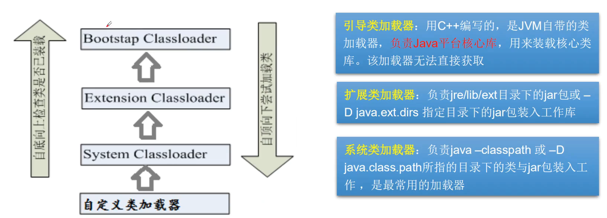

# 注解


## 什么是注解

+ Annotation是从JDK5.0开始引入的新技术

+ **Annotation的作用**：

  + 不是程序本身，可以对程序作出解释（这一点和注释（comment）没什么区别）
  + 可以被其他程序（比如：编译器等）读取

+ **Annotation的格式**:

  + 注解是以”@注释名“在代码中存在的，还可以添加一些参数值，

    例如：@Suppress Warning(Value="unchecked")

+ **Annotation在哪里使用？**

  + 可以附加在package.class.method,field等上面，相当于给他们添加了额外的辅助信息，

    我们可以通过反射机制编程实现对这些元数据的访问


实现代码：

+ 


## 内置注解

+ **@Override**:定义在java.lang.Override中，此注释只适用于修辞方法，表示一个方法声明打算重写超类中的另一个方法声明
+ **@Deprecated**:定义在java.lang.Deprecated中，此注释可以用于修辞方法，属性，类，表示不鼓励程序员使用这样的元素，通常是因为它很危险或者存在更好的选择
+ **@SuppressWarnings**:定义在java.lang.SuprpressWarnings中，用来抑制编译时的警告信息
  + 与前两个注释有所不同，你需要添加一个参数才能正确使用，这些参数都是已经定义好了的，我们选择性的使用就好了。
    + @SuppressWarning("all")
    + @SuppressWarning("unchecked")
    + @SuppressWarning(value={"unchecked","deprecation"})
    + 等等.....


+ 代码
+ @Deprecated


+ @SuppressWarnings("xxx")


## 元注解

+ 元注解的作用就是负责注解其他注解，java定义了4个标准的meta-annotation类型，它们被用来提供对其它annotation类型说明
+ 这些类型和它们所支持的类在java.lang.annotation包中可以找到.(**@Target,@Retention,@Document,@Inheriited**)
  + **@Target**:用来描述注解的使用范围（即：被描述的注解可以用在什么地方）
  
    + 范围：
  
    ```
    @Target(ElementType.TYPE)——接口、类、枚举、注解
    @Target(ElementType.FIELD)——字段、枚举的常量
    @Target(ElementType.METHOD)——方法
    @Target(ElementType.PARAMETER)——方法参数
    @Target(ElementType.CONSTRUCTOR) ——构造函数
    @Target(ElementType.LOCAL_VARIABLE)——局部变量
    @Target(ElementType.ANNOTATION_TYPE)——注解
    @Target(ElementType.PACKAGE)——包
    ```
  
  + **@Retention**:表示需要在什么级别保存该注释信息，用于描述注解的生命周期
  
    + （SOURCE<CLASS<RUNTIME）
  
    ```
    RetentionPolicy.SOURCE：注解只保留在源文件，当Java文件编译成class文件的时候，注解被遗弃；
    RetentionPolicy.CLASS：注解被保留到class文件，但jvm加载class文件时候被遗弃，这是默认的生命周期；
    RetentionPolicy.RUNTIME：注解不仅被保存到class文件中，jvm加载class文件之后，仍然存在；
    ```
  
    
  
  + **@Document**：说明该注解被包含在javadoc中
  
  + **@Inherited**:说明子类可以继承父类中的该注解


+ 自定义元注解
  + 代码	

  


##  自定义注解

+ 使用**@interface**自定义注解时，自动继承了java.lang.annotation.Annotation接口


+ 分析：
  + @interface用来声明一个注解，格式:public @interface 注解名{定义内容}
  + 其中的每一个方法实际上时声明了一个配置参数
  + 方法的名臣就是参数的名臣
  + 返回值类型就是参数的类型（返回值只能时基本类型，Class,String,enum）
  + 可以通过default来声明参数的默认值
  + 如果只有一个参数成员,一般参数名为value
  + 注解元素必须要有之，我们定义注解元素时，经常使用空字符串，0作为默认值


+ 代码实现


# 反射机制


## 静态语言VS动态语言

### 动态语言

+ 是一类在运行时可以改变其结构的语言：例如新的函数、对象、甚至可以被引进，已有的函数可以被删除或是其他结构上的改变，通俗点说就是在运行时代码可以根据某些条件改变自身结构
+ 主要动态语言：Object-C、C#、JavaScript、PHP、Python等


静态语言

+ 与动态语言相对应的，运行时结构不可变的语言就是静态语言。如java、C、C++
+ Java不是动态语言，但java可以被称之为”准动态语言“。即Java有一定的动态性，我们可以利用反射机制获得类似动态语言的特性。java的动态性让编程的时候更加灵活。


## Java Reflection

### 概念

+ Reflection(反射)是Java被视为动态语言的关键，反射机制允许程序在执行期借助于Reflection API取得任何类的内部信息，并能直接操作任意对象的内部属性及方法。

```java
		Class c = Class.forName("类的全限定类名");
```


+ 加载完类后，在堆内存的方法区中就产生了一个Class类型的对象（一个类只有一个Class对象），这个对象就包含了完整的类的结构信息。我们可以通过这个对象看到类的结构这个对象就像一面镜子，透过这个镜子看到类的结构，所以，我们形象的称之为：反射

> **正常方式**：`引入需要的“包类”名称`-->`通过new实例化`-->`取得实例化对象`

> **反射方式**：`实例化对象`-->`getClass()方法`-->`得到完整的“包类”名称`


### Java反射优点与缺点

**优点**

+ 可以实现动态创建对象和编译，体现出很大的灵活性


**缺点**

+ 对性能有影响。使用反射基本上是一种解释操作，我们可以告诉JVM，我们希望做什么并且它满足我们的要求。这类操作总是慢于直接执行相同的操作


### 反射相关的主要API

+ java.lang.Class:代表一个类
+ java.lang.reflect.Method:代表类的方法
+ java.lang.reflect.Field:代表类的成员变量
+ java.lang.reflect.Constructor:代表类的构造器
+ .....


### 代码


### Class类

在Object类中定义了以下的方法，此方法将被所有子类继承

```java
			public final Class getClass()
```

以上的方法返回值的类型是一个Class类，此类是java反射的源头，实际上所谓反射从程序的运行结果来看也很好理解，即：可以通过对象反射求出类的名称（简单来说就是通过对象获得类）


## 得到类的几种方式

对象照镜子后可以得到的信息：某个类的属性、方法和构造器、某个类到底实现了哪些接口。对于每个类而言，JRE都为其保留一个不变的Class类型的对象。一个Class对象包含了特定某个结构的有关信息。

+ Class本身也是一个类
+ Class对象只能由系统建立对象
+ 一个加载的类在JVM中只会有一个Class实例
+ 一个Class对象对应的是一个加载到JVM中的一个.class文件
+ 每个类的实例都会记得自己是由哪个class实例所生成
+ 通过class可以完整地得到一个类中地所有被加载的结构
+ class类是Reflection的根源，针对任何你想动态加载、运行的类，唯有先获得相应的class对象


### Class类的常用方法

  


### 获取Class类的实例

+ 若已知具体的类，通过类的class属性获取，该方法最为安全可靠，程序性能最高。

```java
			Class clazz = Person.class;
```

+ 已知某个类的实例，调用该实例的getClass()方法获取Class对象

```java
			Class clazz = person.getClass();
```

+ 已知一个类的全类名，且该类在类路径下，可通过Class类的静态方法forName()获取，可能抛出ClassNotFoundException

```java
			Class clazz = Class.forName("demo01.student");
```

+ 内置基本数据类型可以直接用类名.Type
+ 还可以利用ClassLoader我们之后讲解


#### 代码：


## 所有类型的Class对象


## Java内存分析 

### Java内存


### **类的加载过程**


 

### 类的加载与ClassLoader的理解

+ 加载：将class文件字节码内容加载到内存中，并将这些静态数据转换成方法区的运行数据结构，然后生成一个代表这个类的java.lang.Class对象
+ 连接：将Java类的二进制代码合并到JVM的运行状态之中的过程
  + 验证：确保加载的类信息符合JVM规范，没有安全方面的问题
  + 准备：正式为类变量（static）分配内存并设置类变量默认初始值的阶段，这些内存都将在方法区中进行分配
  + 解析：虚拟机常量池内的符号引用（常量名）替换为直接引用（地址）的过程
+ 初始化：
  + 执行类构造器<clinit>()方法的过程。类构造器<client>()方法是由编译期自动收集类中所有类变量的赋值动作和静态代码块中的语句合并发生的。（类构造器是构造类信息的，不是构造该类对象的构造器）。
  + 当初始化一个类的时候，如果发现其父类还没有进行初始化，则需要先触发其父类的初始化。
  + 虚拟机会保证一个类的<clinit>()方法在多线程环境中被正确加锁或同步


测试


分析代码


### 什么时候会发生类初始化

+ **类的主动引用（一定会发生类的初始化）**
  + 当虚拟机启动，先初始化main方法所在的类
  + new一个类的对象
  + 调用类的静态对象（除了final常量）和静态方法
  + 调用java.lang.reflect包的方法对类进行反射调用
  + 当初始化一个类，如果其父类没有被初始化，则先会初始化它的父类

代码实现：


+ **类的被动引用（不会发生类的初始化）**
  + 当访问一个静态域时，只有真正声明这个域的类才会被初始化。如：当通过子类引用父类的静态变量，不会导致子类初始化
  + 通过数组定义类引用，不会触发此类的初始化
  + 引用常量不会触发此类的初始化（常量在链接阶段就存入调用类的常量池中）

代码实现


```
注意，按照上面一一对应
```


## 类加载器的作用

+ **类加载器的作用**：将class文件字节码内容加载到内存中，并将这些静态数据转换成方法区的运行时数据结构，然后在堆中生成一个代表这个类的java.lang.Class对象，作为方法区中类数据的访问入口
+ **类缓存**：标准的javaSE类加载器可以按要求查找类，但一旦某个类被加载到类加载器中，它被维持加载（缓存）一段时间，不过JVM垃圾回收机制可以回收这些Class对象


类加载器的作用是用来把类（class）装载进内存的。JVM规范定义了如下类型的类加载器




代码实现：


## 获取运行时类的完整结构

通过反射获取运行时类的完整结构

Field、Method、Constructor、Superclass、Interface、Annotation

+ 实现的全部接口
+ 所继承的父类
+ 全部的构造器
+ 全部的方法
+ 全部的Filed
+ 注解
+ ....

代码实现


**小结**

+ 在实际的操作中，取得类新的信息的操作代码，并不会经常开发
+ 一定要熟悉java.lang.reflect包的作用，反射机制
+ 如何取得属性、方法、构造器的名称，修饰符等


## 动态创建对象执行方法

+ 创建类的对象：调用Class对象的newInstance()方法
  + 类必须有一个无参数的构造器
  + 类的构造器的访问权限需要足够

**思考？**难道没有无参  的构造器就不能创建对象了吗？只要在操作的时候明确的调用类中的构造器，才可以实例化操作

+ 步骤如下：
  + 通过Class类的getDeclaredConstructor(Class ... parameterTypes)取得苯类的指定形参类型的构造器
  + 向构造器的形参中传递一个对象数组进去，里面包含了构造器中所需的各个参数
  + 通过Constructor实例化对象

代码测试：

+ 实体类


+ 测试类

 


**Object invoke(Object obj,Object.. args)**

+ Object对应原方法的返回值，若原方法无返回值，此时返回null
+ 若原方法若为静态方法，此时形参Object obj可为null
+ 若原方法形参列表为空，则Object[] args为null
+ 若原方法声明为private,则需要在调用此invoke()方法前，显式调用方法对象的setAccessible(true)方法，将客房访问private的方法。


**setAccessible**

+ Method和Field、Constructor对象都有setAccessible()方法。
+ setAccessible作用是启动和禁用访问安全检查的开关
+ 参数值为true则只是反射的对象在使用时应该取消java语言访问检查。
  + 提高反射的效率。如果代码中必须用反射，而该剧代码需要频繁的被调用，那么请设置为true
  + 使得原本无法访问的私有成员也可以访问
+ 参数值为false则指示反射的对象应该实施Java语言访问检查


## 性能对比分析

代码实现


## 反射操作泛型

+ Java采用泛型擦除的机制来引入泛型，Java中的泛型仅仅是给编译器javac使用的，确保数据的安全性和免去强制类型转换问题，但是，一旦编译完成，所有和泛型有关的类型全部擦除
+ 为了通过反射操作这些类型，Java新增了ParameterizedType,GenericArrayType,TypeVarivable和WildcardType几种类型来代表不能被归一到Class类中的类型但是又和原始类型齐名的类型
+ **ParameterizedType**：表示一种参数化类型，比如Collection<String>
+ **GenericArrayType**：表示一种元素类型是参数化类型或者类型变量的数组类型
+ **TypeVarivable**：是各种类型变量的公共父接口
+ **WildcardType**：代表一种通配符类型表达式

测试代码


## 反射操作注解

+ 了解什么是ORM?

  + Obejct relationship Mapping --> 对象关系映射

  

  + 类和表结构对应
  + 属性和字段对应
  + 对象和记录对应

+ 要求：利用注解和反射完成类和表结构的映射关系

代码实现


