# Mybatis学习笔记

## MyBatis的第一个程序

思路：搭建环境--->导入MyBatis--->编写代码--->测试

### 1.搭建环境

搭建数据库

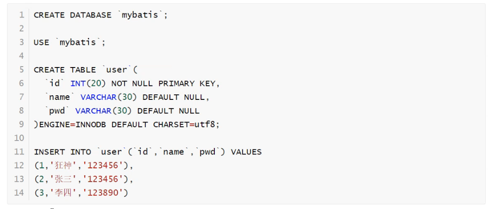

> 使用了数据库已经存在的数据库

### 2.创建项目

新建一个普通的maven项目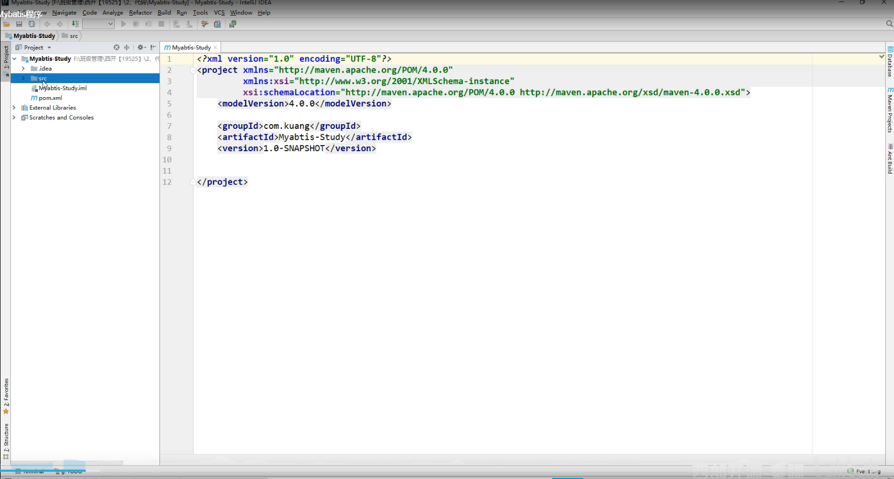

删掉 **src** 文件夹当作父工程

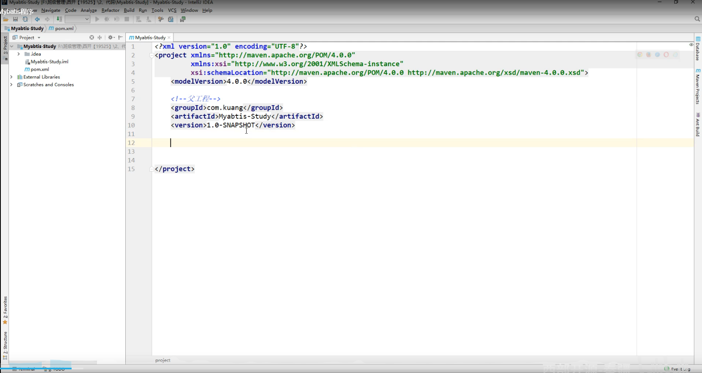

### 3.导入依赖

导入所有需要maven的依赖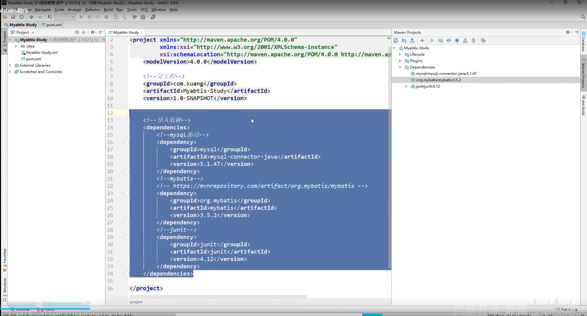

### 4.编写配置文件

从官方文档获取**mybaits-config.xml**文件内容

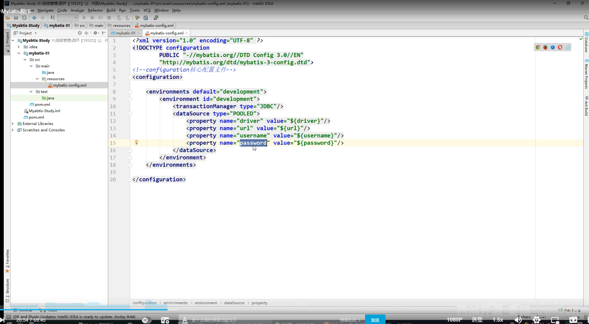

根据自己的配置的需求填写数据

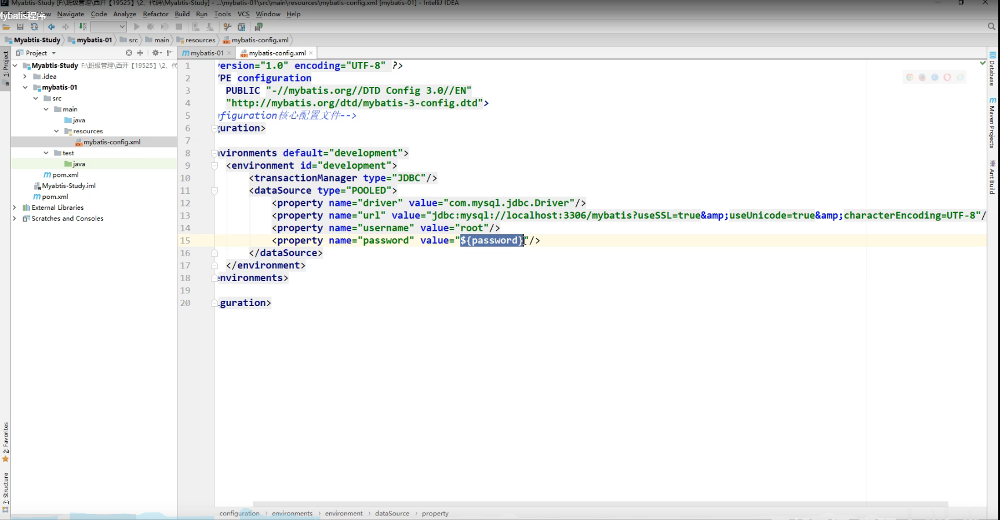

```url
&amp:代表&，为转义字符
useSSL=true:代表安全连接
useUnicode=true&ampcharaterEncoding=UTF-8：指定字符的编码·解码格式，避免乱码
存数据时：数据库在存放项目数据的时候会先用UTF-8格式将数据解码成字节码，然后再将解码后的字节码重新使用GBK编码存放到数据库中。
取数据时：在从数据库中取数据的时候，数据库会先将数据库中的数据按GBK格式解码成字节码，然后再将解码后的字节码重新按UTF-8格式编码数据，最后再将数据返回给客户端。
另还有时区的配置：serverTimezone=GMT%2B8：指定时区
例如：
在java代码里面插入的时间为：2018-06-24 17:29:56
但是在数据库里面显示的时间却为：2018-06-24 09:29:56
```

### 5.编写mybatis工具类

严格按照官方文档编写

**官方文档**

***

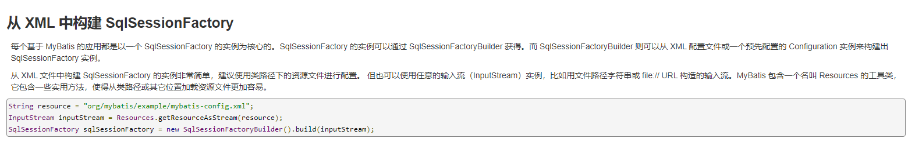

SqlSession相当于JDBC的preparestatement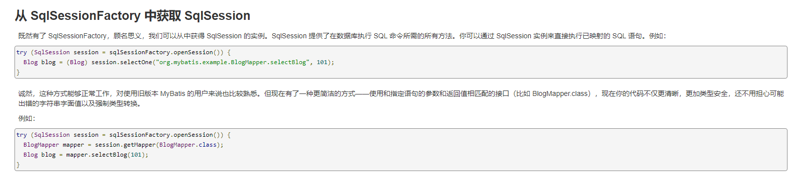

***

编写工具类

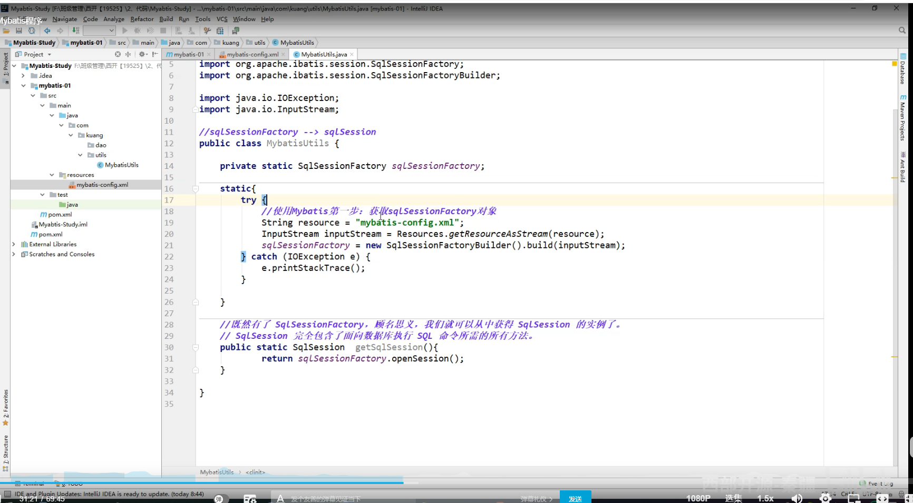

### 6.编写代码

+ 实体类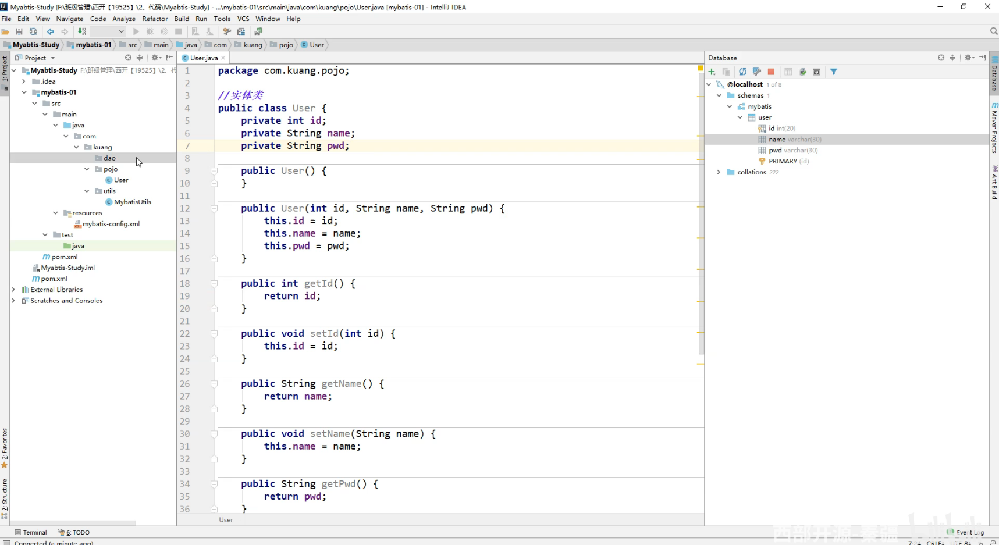

+ Dao接口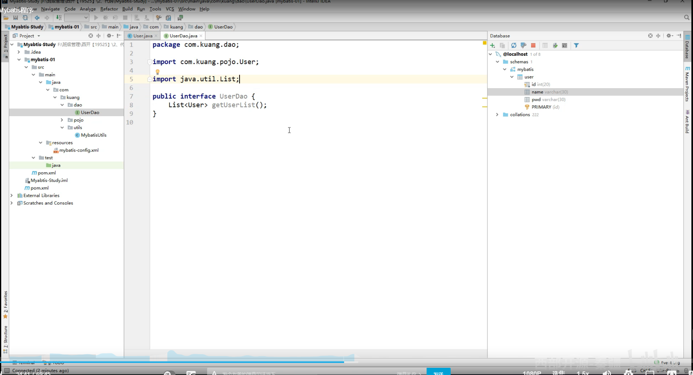

+ 接口实现类

  **不需要实现接口类，只需要编写配置文件**

  _**官方文档**_

  ***

  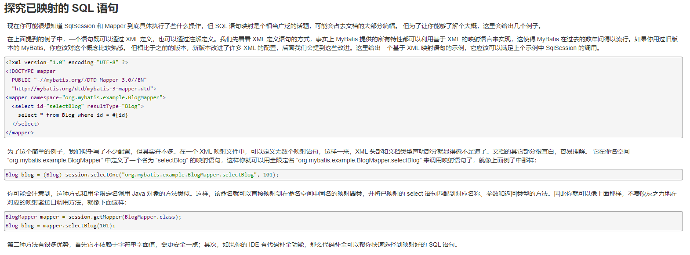

  ***

  实现代码：

  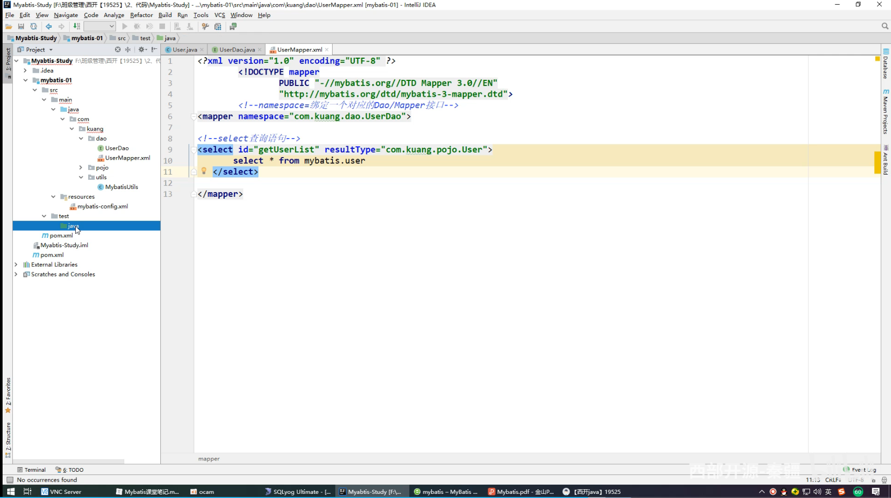

  ```id
  注意：id为dao接口的方法的名字
  ```


### 7.编写测试代码

```注意
注意：测试代码所在的包要与被测试的代码包位置相同
```


### 8.测试中遇到问题

``` 
配置文件没有注册 绑定接口错误 方法名不对 返回类型不对 maven导出资源问题
```

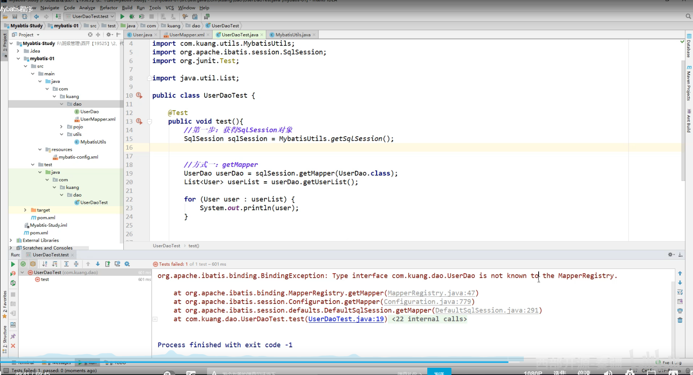

```tiki wiki
注意：mybatis-config没有注册mapper
```

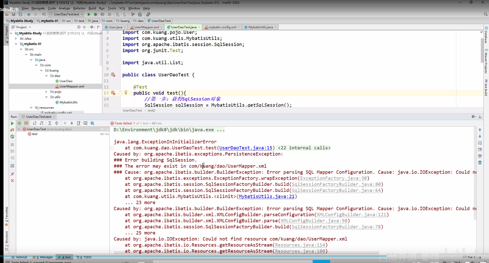

```
资源过滤问题：找不到userMapper.xml文件 
```

**注意：**

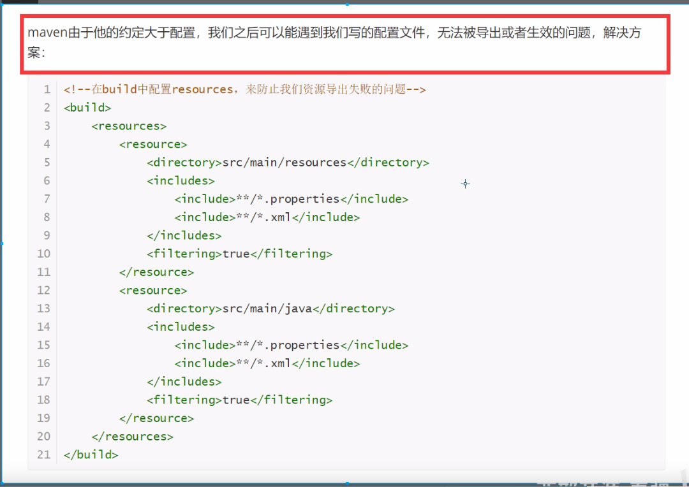

### 9.修改代码

修改pom文件，防止资源无法被找到（父工程和子工程都添加）

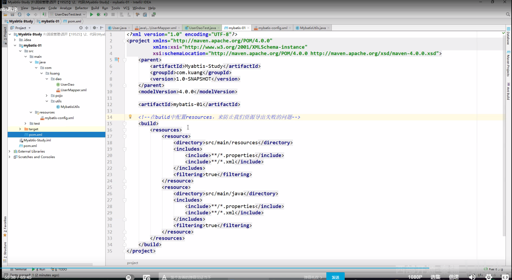

注册mapper.xml

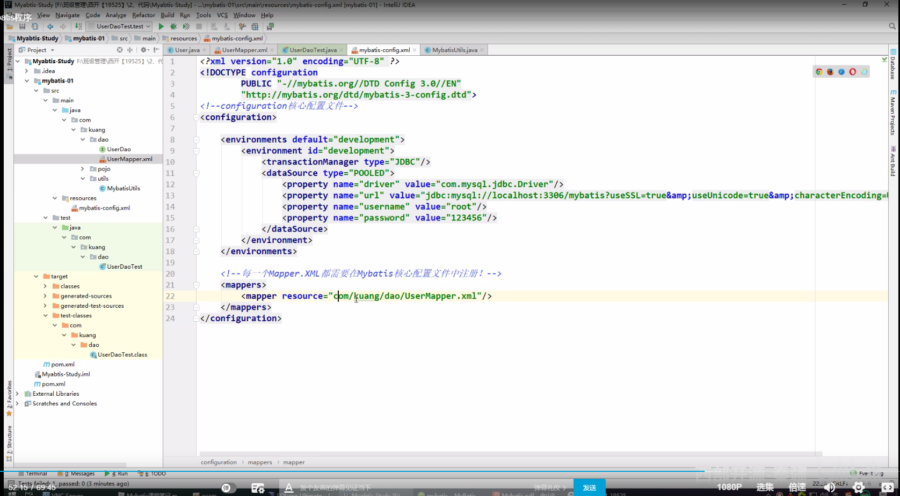

### 10.拓展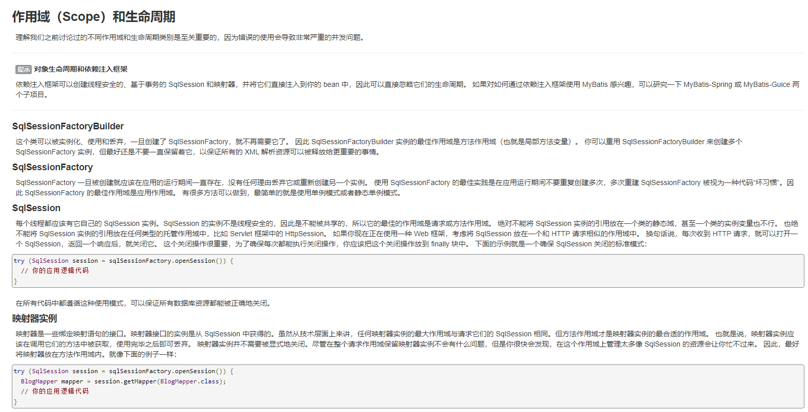


