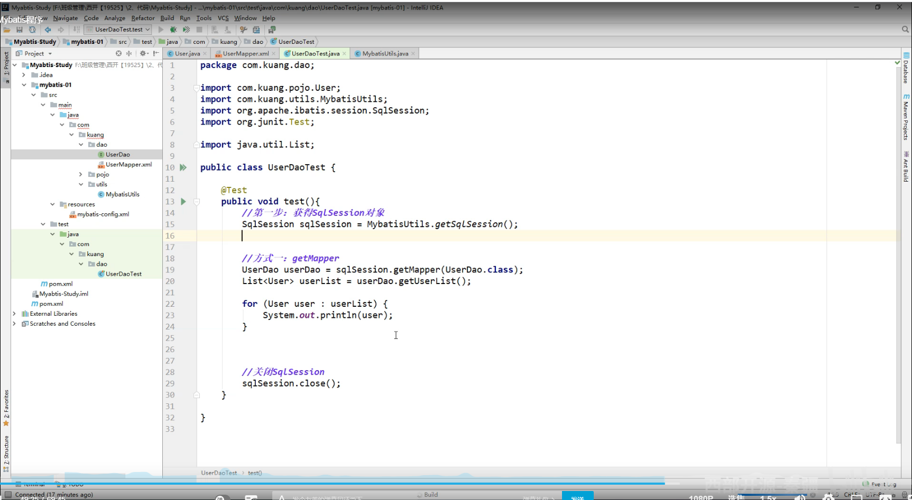
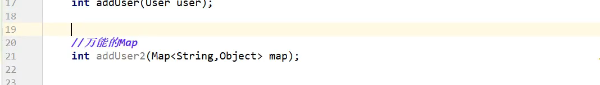
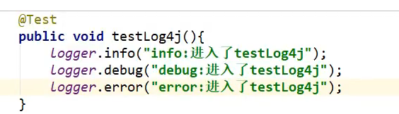
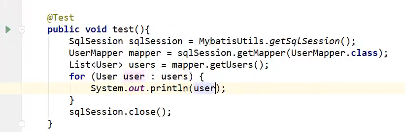
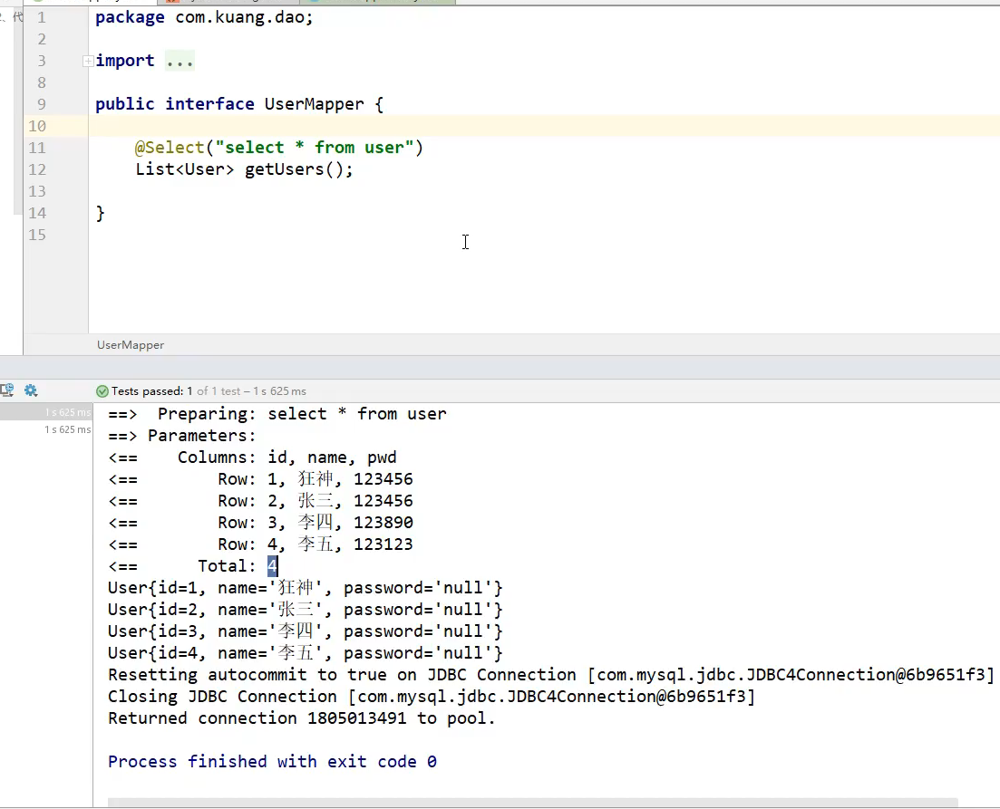
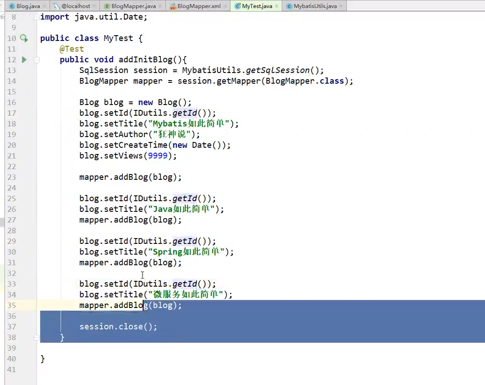
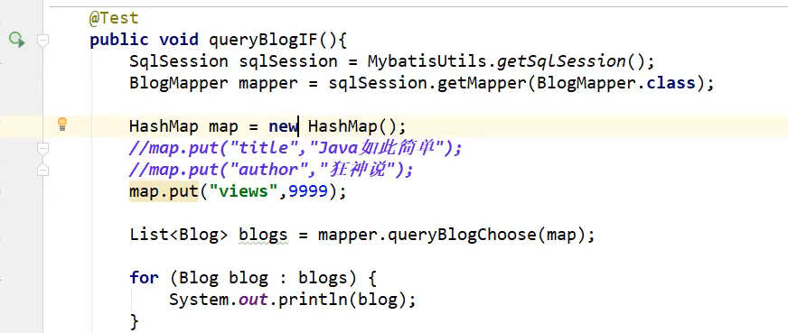

# Mybatis学习笔记

## MyBatis的第一个程序

思路：搭建环境--->导入MyBatis--->编写代码--->测试

### 1.搭建环境

搭建数据库


> 使用了数据库已经存在的数据库

### 2.创建项目

新建一个普通的maven项目

删掉 **src** 文件夹当作父工程


### 3.导入依赖

导入所有需要maven的依赖

### 4.编写配置文件

从官方文档获取**mybaits-config.xml**文件内容


根据自己的配置的需求填写数据


```url
&amp:代表&，为转义字符
useSSL=true:代表安全连接
useUnicode=true&ampcharaterEncoding=UTF-8：指定字符的编码·解码格式，避免乱码
存数据时：数据库在存放项目数据的时候会先用UTF-8格式将数据解码成字节码，然后再将解码后的字节码重新使用GBK编码存放到数据库中。
取数据时：在从数据库中取数据的时候，数据库会先将数据库中的数据按GBK格式解码成字节码，然后再将解码后的字节码重新按UTF-8格式编码数据，最后再将数据返回给客户端。
另还有时区的配置：serverTimezone=GMT%2B8：指定时区
例如：
在java代码里面插入的时间为：2018-06-24 17:29:56
但是在数据库里面显示的时间却为：2018-06-24 09:29:56
```

### 5.编写mybatis工具类

严格按照官方文档编写

**官方文档**

***


SqlSession相当于JDBC的preparestatement

***

编写工具类


### 6.编写代码

+ 实体类

+ Dao接口

+ 接口实现类

  **不需要实现接口类，只需要编写配置文件**

  _**官方文档**_

  ***

  

  ***

  实现代码：

  

  ```id
  注意：id为dao接口的方法的名字
  ```


### 7.编写测试代码

```注意
注意：测试代码所在的包要与被测试的代码包位置相同
```



### 8.测试中遇到问题

``` 
配置文件没有注册 绑定接口错误 方法名不对 返回类型不对 maven导出资源问题
```


```tiki wiki
注意：mybatis-config没有注册mapper
```


```
资源过滤问题：找不到userMapper.xml文件 
```

**注意：**


### 9.修改代码

修改pom文件，防止资源无法被找到（父工程和子工程都添加）


注册mapper.xml


```
本人遇到了问题：
java.security.cert.CertPathValidatorException: Path does not chain with any of the trust anchors
解决方案：把url中的useSSL=true改为false
```

### 10.拓展


## 增删改查实现（CRUD）

### 1.namespace

namespace中的报名要和Dao/Mapper接口的包名一致

### 2.select

选择，查询语句；

+ id：就是对应的namespace中的方法名；
+ resultType:Sql语句执行的返回值！
+ parameterType:参数类型！

#### 代码实现

​	dao层代码实现:


配置文件编写： 

测试代码：


### 3.insert

#### 代码实现

+ dao层代码实现


+ 配置文件编写

+ 测试代码编写


```
注意：增删改需要提交事务
```

### 4.update

#### 代码实现

+ dao层
+ 
+ 配置文件编写
+ 测试代码编写

### 5.delete

#### 代码实现

+ dao层

  

+ 配置文件编写


+ 测试代码编写


### 6.总结

编写接口--->编写配置文件--->编写测试代码

（注意：增删改需要提交事务：SqlSession.commit()）

###  7.分析错误

```
注意：读错要从下往上读
```

+  标签不要匹配错

+ resource绑定mapper,需要使用路径

+ 程序配置文件必须符合规范

+ NullPointerExceptiion,没有注册到资源

+ 输出的xml文件中存在中文乱码问题

+ ###### maven资源没有导出问题

### 8.万能Map

```
假设，我们的实体类，或者数据库中的表，字段或者参数过多，我们应当考虑使用Map!
```

#### 插入案例

+ dao层代码编写



+ 配置文件编写


+ 测试代码编写


#### 获取案例

+ dao层代码


+ 配置文件编写


+ 测试代码编写


```
Map传递参数，直接在sql中取出key即可！
对象传递参数，直接在sql中取都西昂的属性即可！
只有一个基本类型参数的情况下，可以直接在sql中取到
多个参数用Map,或者注解
```

### 9.模糊查询

```
关键词：like
```

+ dao层代码编写


+ 配置文件编写

  （1）第一个方案：执行代码的时候，传递通配符%%


​		（2）第二个方案：在sql拼接中使用通配符


+ 测试代码编写


## 配置解析

### 1.核心配置文件

+ mybatis-config.xml
+ MyBatis的配置文件包含了会深深影响MyBatis行为的设置和属性信息 


### 2.创建一个新的项目


### 3.环境设置（environments）

Mybatis可以配置成适应多种环境

**不过要记住：尽管可以配置多个环境，但每个 SqlSessionFactory 实例只能选择一种环境。**

```
注意，要选择另一个环境只需把<environments default="新的环境的id">(下图中原来的值为development)
```


### 4.属性（properties）

我们可以通过properties属性来实现引用配置文件

这些属性都是可外部配置且可动态替换的，既可以在典型的java属性文件中配置，亦可通过properties元素的子元素来传递。

编写一个配置文件


注意，一定要按照顺序配置properties


第一种方式：


第二种方式


+ 可以直接引入外部文件
+ 可以在其中增加一些属性配置
+ 如果两个文件有同一个字段，优先使用外部配置文件的！

### 5.类型别名（typeAliases ）

+ 类型别名可为 Java 类型设置一个缩写名字
+ 存在的意义仅在于用来减少冗余的全限定类名书写
+ 实例：


也可以指定一个包名，MyBatis会在包名下面搜索需要的javabean,比如：

扫描实体类的包，它的默认别名就为这个类的别名，首字母小写


在实体类比较少的时候，使用第一种方式

如果实体类十分多，建议使用第二种。

第一种可以DIY别名，第二种则不行，如果非要改，需要在实体类上增加注解


### 6.设置

这是 MyBatis 中极为重要的调整设置，它们会改变 MyBatis 的运行时行为


### 7.映射器（Mappers）

MapperRegistry:注册绑定我们的Mapper文件;

 

```
注意点：
使用class:
1:接口和他的Mapper配置文件必须同名 
2:接口和他的Mapper配置文件必须在同一个包下

使用扫描包进行注入绑定
1:接口和他的Mapper配置文件必须同名 
2:接口和他的Mapper配置文件必须在同一个包下
```

### 8.生命周期和作用域

理解我们之前讨论过的不同作用域和生命周期类别是至关重要的，因为错误的使用会导致非常严重的**并发问题**

流程：


```
这里的每一个Mapper,就代表一个具体的业务
```

**SqlSessionFactoryBuilder**

+ 一旦创建了，就不再需要它
+ 局部变量

**SqlSessionFactory**

+ 可以想象为：数据库连接池
+ 一旦被创建就应该在应用的运行期间一直存在，没有任何理由丢弃它或重新创建另一个实例
+ SqlSessionFactory 的最佳作用域是应用作用域
+ 使用单例模式或者静态单例模式

**SqlSession**

+ 连接到连接池的一个请求！
+ SqlSession 的实例不是线程安全的，因此是不能被共享的
+ 用完之后需要赶紧关闭，否则占用资源


## 解决属性名和字段名不一致的问题（ResultMap）

实体类种修改属性测试

**解决方法**

+ 起别名

```
在sql语句中，利用 数据库属性名 as 实体类属性名   
```


+ **resultMap**

  结果集映射代码实现

  

   

+ `resultMap` 元素是 MyBatis 中最重要最强大的元素

+ ResultMap 的设计思想是，对简单的语句做到零配置，对于复杂一点的语句，只需要描述语句之间的关系就行了

+ `ResultMap`最优秀的地方在于，虽然你已经对它相当的了解了，但是根本就不需要显式地用到他们（就是什么不一样转什么）

  

  

## 日志

### 1.日志工厂

如果一个数据库操作出现异常，我们需要排错。日志就是最好的助手

曾经：sout，debug

现在：日志工厂


在MyBatis中具体使用哪个日志实现，在设置中设定

#### **STDOUT_LOGGING**


```
注意：在核心配置文件配置日志工厂，并且name和value的值不能改变
```

#### **Log4j**

什么是Log4j?

+ Log4j是[Apache](https://baike.baidu.com/item/Apache/8512995)的一个开源项目，通过使用Log4j，我们可以控制日志信息输送的目的地是[控制台](https://baike.baidu.com/item/控制台/2438626)、文件、[GUI](https://baike.baidu.com/item/GUI)组件
+ 我们也可以控制每一条日志的输出格式；
+ 通过定义每一条日志信息的级别，我们能够更加细致地控制日志的生成过程

**1.导入log4j包**

**2.log4j.properties配置文件编写**


**3.配置log4j为日志的实现**


**4.Log4j的使用，直接测试运行查询**


**简单实用**

测试

1. 在要使用Log4j的类中，导入包import org.apache.log4j.Logger

2. 日志对象，参数为当前类的class

   ```java
   static Logger logger = Logger.getLogger(当前类的类名.class);
   ```

3. 测试代码编写




## 分页

**思考：为什么要分页？**

+ 减少数据的处理量


### **1.使用Limit分页**

```sql
语法：SELECT * FROM USER limit startIndex,pageSize
select * from user limit 3;[0.3]
```


使用MyBatis实现分页，核心SQL

1. 接口


2. Mapper.xml


3. 测试


### 2.RowBounds(了解为主)

+ dao层代码


+ 配置文件编写


+ 测试代码编写


### 3.分页插件 


了解以后，万一以后公司的架构师，说要使用，ni'xu'yao'zhi'dao'ta


## 使用注解开发

### 1.面向接口编程

使用面向接口编程的根本原因：**解耦**，**可拓展，提高复用，分层开发中，上层不用管具体的实现，大家都遵守共同的标准，使的开发变得容易，规范性更好**

在一个面向对象的系统中，系统的各种功能是由许许多多的不同对象协作完成。在这种情况下，各个对象内部是如何实现自己的，对系统设计人员来讲就不那么重要了；

而各个对象之间的协作关系成为系统设计的关键。小到不同类之间的通信，达到模块之间的交互，在系统设计之初都是要着重考虑的，这也是系统设计的主要内容。面向接口编程就是按照这种思想来编程。


关于接口的理解

接口从更深层次的理解，应是定义（规范，约束）与实现（名实分离的原则）的分离。

接口的本身反映了系统设计人员对系统的抽象理解

接口应有两类：

第一类是对一个个体的抽象，它可对应为一个抽象体（abstract class）；

第二类是对一个个体某一方面的抽象，即形成一个抽象面(iinterface);

一个体有可能由多个抽象面。抽象体与抽象面是有区别的


三个面向区别

面向对象是指，我们考虑问题时，以对象为单位，考虑它的属性及方法

面向过程是指，我们考虑问题时，以一个具体的流程（事务过程）为单位，考虑它的实现

接口设计与非接口设计是针对复用技术而言的，与面向对象（过程）不是同一个问题，更多的体现就是对系统整体的架构


### 2.使用注解开发

1. 新建一个moudle

```
里面的UserMapper.xml文件删了
核心配置文件配置注册mapper删了
重新创建UserMapper接口 
```

2. dao层编写


3. 核心配置文件编写


4. 测试代码编写



5. 测试结果



```
原因：因为数据库的字段名与实体类的不相同
```

6.探究注解运行本质

本质：反射机制实现

底层核心是使用动态代理


## MyBatis详细的执行流程 


Resources获取加载全局配置文件-->实例化SqlSessionFactoryBuilder构造器

-->解析配置文件流XMLConfigABuilder-->Configuration所有配置信息

-->SqlSessionFactory实例化-->transactional事务管理-->

创建executor执行器-->创建sqlSession-->实现CRUD-->

查看是否执行成功-->事务提交


## 注解CRUD（一对多，多对一不推荐使用）

```java
传递参数true可以自动提交事务
```


#### 具体代码的实现

+ 根据id查询user

  + dao层

  

+ 插入数据

  + dao层

    

+ 更新数据

  + dao层

  

+ 删除数据

  + dao层

****

**【注意：我们必须要将接口注册绑定到我们的核心配置文件中】**

****

 

#### **关于@Param()注解**

+ 基本类型的参数或者String类型，需要加上
+ 引用类型不需要加
+ 如果只有一个基本类型的话，可以忽略，但是建议大家加上！
+ 我们在SQL中引用的就是我们这里的@Param()中设定的属性名


#### ${} #{}的区别


## Lobok的使用


使用步骤

1. 在IDEA中安装Lombok插件


2. 在项目中导入Lombok的jar包


3. 注解


4. 实例：只用**@data**就产生了很多方法


5. 说明


6. 优缺点


## 多对一处理

#### 多对一


+ 多个学生，对应一个老师
+ 对于学生而言，关联...多个学生，关联一个老师【多对一】
+ 对于老师而言，集合，一个老师，有很多学生【一对多】

SQL:


**新建一个模块：**

+ dao层

先创建两个空的interface


+ 实体类


+ 配置文件编写


总结：

测试环境搭建

+ 导入lombok
+ 新建实体类student,teacher
+ 建立Mapper接口
+ 建立Mapper.xml文件
+ 在核心配置文件中绑定注册我们的Mapper接口或者文件！【方式很多】
+ 测试查询是否能够成功


#### 按照查询嵌套处理

+ 配置文件编写 


```
类似子查询
```


#### 按照结果嵌套处理

 

```
注意：teacher中result的column的值要按照sql语句命名的名字相同
```

#### 回顾MySql多对一查询方式：

+ 子查询
+ 联表查询


## 一对多处理

比如：一个老师拥有多个学生

对于老师而言，就是一对多关系 

#### 新建一个moudle测试

+ pojo层编写


+ dao层编写


+ 配置文件编写


###### 


#### 一对多代码编写

+ dao层代码编写


+ 配置文件编写（根据查询结果查询）


+ 测试代码编写


第二种（按照查询嵌套处理）

+ 配置文件编写


#### 总结

1. 关联-association[多对一]

2. 集合-collection[一对多]

3. javaType &  ofType

   javaType:用来指来指定实体类中属性的类型

   ofType 用来指定映射到List或者集合中的pojo类型，泛型中的约束类型

注意点：

+ 保证Sql的可读性，尽量保证通俗易懂
+ 注意一对多和多对一中，属性名和字段的问题
+ 如果问题不好排查错误，建议使用Log4j


## 动态SQL

什么是动态sql：**动态SQL就是根据不同的条件生成不同的SQL语句**

```
如果你之前用过 JSTL 或任何基于类 XML 语言的文本处理器，你对动态 SQL 元素可能会感觉似曾相识。在 MyBatis 之前的版本中，需要花时间了解大量的元素。借助功能强大的基于 OGNL 的表达式，MyBatis 3 替换了之前的大部分元素，大大精简了元素种类，现在要学习的元素种类比原来的一半还要少。

if
choose (when, otherwise)
trim (where, set)
foreach
```

###  搭建环境


### 创建一个基础工程

1. 导包
2. 编写配置文件
3. 编写实体类


4. 编写实体类对应的Mapper接口和Mapper.xml文件

 


5. 工具类


6. 测试代码编写




### if

+ dao层


+ 配置文件编写


+ 测试代码编写


 


### trim(where,set)

`where`标签会很智能的去掉and，如果什么都不传，where都会去掉

 

`set`标签元素会动态前置SET关键字，同时也会删掉无关的逗号（智能）

+ dao层


+ 配置文件编写


所谓的动态SQL，本质还是SQL语句，只是我们可以在SQL层面，去执行一个逻辑代码


### choose

+ dao层


+ 配置文件编写


+ 测试代码编写




### SQL片段

实例：


+ 使用`sql`标签抽取公共的部分
+ 在需要使用的地方使用include标签引用即可


注意事项

+ 最好基于单表来定义SQL片段

+ 不要存在where标签

  


### foreach


案例：

+ dao层：


+ 配置文件编写

 

+ 测试代码编写


### 总结

动态SQL就是在拼接SQL语句，我们只要保证SQL的正确性，按照SQL的格式，去排列组合就可以了

建议：

+ 先在Mysql中写出完整的SQL，再对应的去修改成为我们的动态SQL实现通用


## 缓存

### 简介

```
查询：连接数据库，耗资源！
一次查询的结果，给他暂存在一个嗯可以直接取到的地方法！--->内存 ： 缓存

我们再次查询相同数据的时候，直接走缓存，就不用走数据库了
```

1. 什么是缓存【Cache】？
   + 存在内存中的临时数据
   + 将用户经常查询的数据放在缓存（内存）中，用户取查询数据就不用从磁盘上（关系型数据库数据文件）查询，从缓存中查询，从而提高查询效率，解决了高并发系统的性能问题
2. 为什么使用缓存 ？
   + 减少和数据库的交互次数，减少系统开销，提高系统效率
3. 什么样的数据能使用缓存？
   + 经常查询并且不经常改变的数据


### Mybatis缓存

+ MyBatis包含一个非常强大的查询缓存特性，它可以非常方便地定制和配置缓存。缓存可以极大地提升查询效率。
+ MyBatis系统中默认定义了两级缓存：**一级缓存**和**二级缓存**
  + 默认情况下，只有一级缓存开启。（SqlSession级别的缓存，也称为本地缓存）
  + 二级缓存需要手动开启和配置，他是基于namespace级别的缓存
  + 为了提高拓展性，MyBatis定义了缓存接口Cache.我们可以通过实现Cache接口来自定义二级缓存


### 一级缓存

+ 一级缓存也叫本地缓存：SqlSession
  + 与数据库同一次会话期间查询到的数据会放在本地缓存中
  + 以后如果需要获取相同的数据，直接从缓存中拿，没必要再去查询数据库

测试步骤：

新建一个新的项目

+ 开启日志


+ 测试在一个Session中查询两次相同的记录


+ 查看日志的输出


缓存失效的情况

1. 增删改操作，可能会改变原来的数据，所以必定会刷新数据
2. 查询不同的东西
3. 查询不同的Mapper.xml
4. 手动清除缓存


小结：一级缓存默认是开启的，只在一次SqlSession中有效，也就是拿到连接到关闭连接这个区间段

一级缓存就是一个Map


### 二级缓存

+ 二级缓存也叫全局缓存，一级缓存作用域太低了，所以诞生了二级缓存
+ 基于namespace级别的缓存，一个名称空间，对应一个二级缓存
+ 工作机制
  + 一个会话查询一条数据，这个数据就会被放在当前会话的一级缓存中
  + 如果当前会话关闭了，这个会话对应的一级缓存就没了，但是我们想要的是，会话关闭了，一级缓存中的数据就会被保存到二级缓存中
  + 新的会话查询信息，就可以从二级缓存中获取内容
  + 不同的mapper查出的数据会放在自己对应的缓存（map）中;

步骤：

1. 开启全局缓存


2. 在Mapper.xml开启二级缓存

   一般只需要填<cache/>

   还有sql标签中的usecache的值

 

3. 测试代码

   在第一次sqlSession关闭的时候，一级缓存的数据存到了对应的Mapper二级缓存中


1. 问题

+ 我们需要将实体类序列化！否则就会报错！


### 小结

+ 只要开启了二级缓存，在同一个Mapper下就有效
+ 所有的数据都会先放在一级缓存中
+ 只有当会话提交，或者关闭的时候，才会提交到二级缓存中


## 缓存原理  

流程图


### 自定义缓存-ehcache

+ 导入依赖


+ 配置文件编写


+ 再导入ehcache.xml文件（上网找）


+ 自定义（超级难学）

